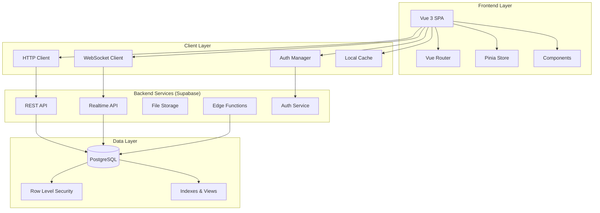
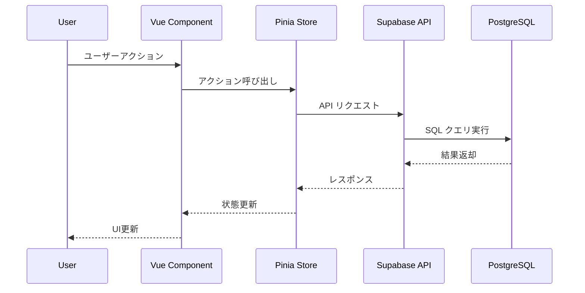
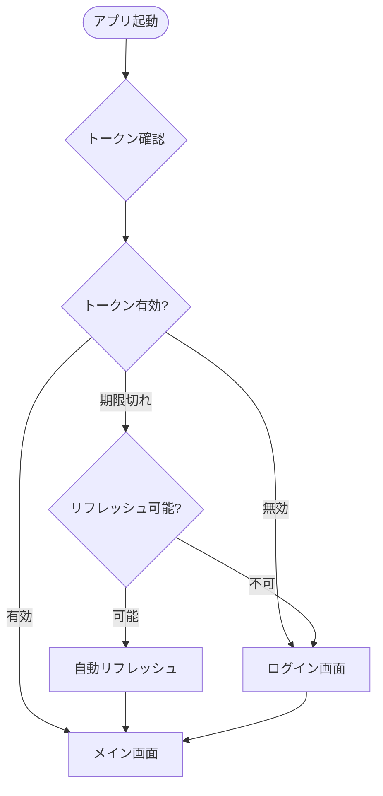

# アーキテクチャ設計書

## 1. 全体アーキテクチャ概要

### システム構成図


### 技術アーキテクチャ原則
1. **単一責任の原則**: 各コンポーネント・レイヤーは一つの責任を持つ
2. **依存性の逆転**: 具象ではなく抽象に依存する
3. **開放/閉鎖の原則**: 拡張に開き、変更に閉じる
4. **DRY原則**: コードの重複を避ける
5. **スケーラビリティ**: 段階的な拡張が可能

## 2. ディレクトリ構造

### プロジェクト全体構造
```
project-root/
├── .claude/                    # AI開発支援ドキュメント
│   ├── 00_project/            # プロジェクト概要
│   ├── 01_development_docs/   # 開発ドキュメント
│   ├── 02_design_system/      # デザインシステム
│   ├── 03_library_docs/       # ライブラリドキュメント
│   └── commands/              # カスタムコマンド
├── .cckiro/                   # 仕様書・進捗管理
│   └── specs/                 # プロジェクト仕様書
├── public/                    # 静的ファイル
│   ├── favicon.ico
│   └── manifest.json
├── src/                       # ソースコード（詳細は下記）
├── tests/                     # テストコード
│   ├── unit/                  # 単体テスト
│   ├── integration/           # 統合テスト
│   └── e2e/                   # E2Eテスト
├── docs/                      # プロジェクトドキュメント
├── .env.example               # 環境変数テンプレート
├── .gitignore
├── README.md
├── package.json
├── vite.config.js
└── tailwind.config.js
```

### src/ ディレクトリ詳細
```
src/
├── components/                # Vueコンポーネント
│   ├── common/               # 共通コンポーネント
│   │   ├── AppHeader.vue
│   │   ├── AppSidebar.vue
│   │   ├── LoadingSpinner.vue
│   │   └── ErrorBoundary.vue
│   ├── forms/                # フォーム関連
│   │   ├── BaseInput.vue
│   │   ├── BaseSelect.vue
│   │   └── FormValidator.vue
│   └── features/             # 機能別コンポーネント
│       ├── auth/
│       │   ├── LoginForm.vue
│       │   └── SignupForm.vue
│       └── dashboard/
│           ├── DashboardCard.vue
│           └── MetricsChart.vue
├── composables/              # Composition API ロジック
│   ├── useAuth.js           # 認証関連
│   ├── useApi.js            # API通信
│   ├── useLocalStorage.js   # ローカルストレージ
│   └── useNotification.js   # 通知
├── stores/                   # Pinia ストア
│   ├── auth.js              # 認証状態管理
│   ├── user.js              # ユーザー情報
│   ├── ui.js                # UI状態（ローディング、エラー等）
│   └── index.js             # ストア統合
├── views/                    # ページコンポーネント
│   ├── auth/
│   │   ├── LoginView.vue
│   │   └── SignupView.vue
│   ├── dashboard/
│   │   └── DashboardView.vue
│   └── profile/
│       └── ProfileView.vue
├── router/                   # Vue Router設定
│   ├── index.js             # ルーター設定
│   ├── guards.js            # ナビゲーションガード
│   └── routes.js            # ルート定義
├── lib/                      # ライブラリ・ユーティリティ
│   ├── supabase/
│   │   ├── client.js        # Supabaseクライアント
│   │   ├── auth.js          # 認証API
│   │   ├── database.js      # DB操作
│   │   └── storage.js       # ファイル操作
│   ├── utils/
│   │   ├── formatting.js    # フォーマット関数
│   │   ├── validation.js    # バリデーション
│   │   └── constants.js     # 定数定義
│   └── plugins/
│       ├── toast.js         # トースト通知
│       └── analytics.js     # アナリティクス
├── types/                    # TypeScript型定義（JSDoc用）
│   ├── api.js               # API型定義
│   ├── user.js              # ユーザー型定義
│   └── common.js            # 共通型定義
├── styles/                   # スタイルファイル
│   ├── main.css             # エントリーポイント
│   ├── components.css       # コンポーネント固有スタイル
│   └── utilities.css        # ユーティリティクラス
├── App.vue                   # ルートコンポーネント
└── main.js                   # エントリーポイント
```

## 3. レイヤー分離とモジュール設計

### 3.1 プレゼンテーションレイヤー
```vue
<!-- views/UserProfileView.vue -->
<template>
  <div class="container mx-auto p-6">
    <ProfileHeader :user="user" />
    <ProfileForm 
      :user="user" 
      :loading="loading"
      @update="handleUpdate" 
    />
  </div>
</template>

<script setup>
import { useUserStore } from '@/stores/user'
import { useNotification } from '@/composables/useNotification'
import ProfileHeader from '@/components/features/profile/ProfileHeader.vue'
import ProfileForm from '@/components/features/profile/ProfileForm.vue'

const userStore = useUserStore()
const { showSuccess, showError } = useNotification()

// リアクティブな状態
const user = computed(() => userStore.currentUser)
const loading = computed(() => userStore.loading)

// イベントハンドラー
const handleUpdate = async (userData) => {
  try {
    await userStore.updateProfile(userData)
    showSuccess('プロフィールを更新しました')
  } catch (error) {
    showError('更新に失敗しました')
  }
}

// 初期データロード
onMounted(() => {
  userStore.loadCurrentUser()
})
</script>
```

### 3.2 ビジネスロジックレイヤー
```javascript
// stores/user.js
import { defineStore } from 'pinia'
import { userApi } from '@/lib/supabase/user'

export const useUserStore = defineStore('user', () => {
  // 状態
  const currentUser = ref(null)
  const loading = ref(false)
  const error = ref(null)
  
  // ゲッター
  const isProfileComplete = computed(() => {
    return currentUser.value?.name && currentUser.value?.email
  })
  
  // アクション
  const loadCurrentUser = async () => {
    loading.value = true
    error.value = null
    
    try {
      const user = await userApi.getCurrentUser()
      currentUser.value = user
    } catch (err) {
      error.value = err.message
      throw err
    } finally {
      loading.value = false
    }
  }
  
  const updateProfile = async (userData) => {
    loading.value = true
    error.value = null
    
    try {
      const updatedUser = await userApi.updateUser(userData)
      currentUser.value = updatedUser
      return updatedUser
    } catch (err) {
      error.value = err.message
      throw err
    } finally {
      loading.value = false
    }
  }
  
  return {
    // 状態
    currentUser,
    loading,
    error,
    // ゲッター
    isProfileComplete,
    // アクション
    loadCurrentUser,
    updateProfile
  }
})
```

### 3.3 データアクセスレイヤー
```javascript
// lib/supabase/user.js
import { supabase } from './client'

/**
 * ユーザーAPI
 */
export const userApi = {
  /**
   * 現在のユーザー情報を取得
   * @returns {Promise<Object>} ユーザー情報
   */
  async getCurrentUser() {
    const { data: { user }, error: authError } = await supabase.auth.getUser()
    if (authError) throw authError
    if (!user) throw new Error('認証が必要です')
    
    const { data, error } = await supabase
      .from('users')
      .select(`
        id,
        email,
        name,
        avatar_url,
        created_at,
        updated_at
      `)
      .eq('id', user.id)
      .single()
    
    if (error) throw error
    return data
  },
  
  /**
   * ユーザー情報を更新
   * @param {Object} userData - 更新するユーザーデータ
   * @returns {Promise<Object>} 更新後のユーザー情報
   */
  async updateUser(userData) {
    const { data: { user }, error: authError } = await supabase.auth.getUser()
    if (authError) throw authError
    if (!user) throw new Error('認証が必要です')
    
    const { data, error } = await supabase
      .from('users')
      .update({
        name: userData.name,
        avatar_url: userData.avatar_url,
        updated_at: new Date().toISOString()
      })
      .eq('id', user.id)
      .select()
      .single()
    
    if (error) throw error
    return data
  }
}
```

## 4. データフローとコンポーネント間通信

### 4.1 データフロー図


### 4.2 コンポーネント間通信パターン

#### 親子間通信（Props & Emit）
```vue
<!-- 親コンポーネント -->
<template>
  <UserForm 
    :user="user"
    :loading="loading"
    @save="handleSave"
    @cancel="handleCancel"
  />
</template>

<script setup>
// Props は子コンポーネントで定義
const handleSave = (userData) => {
  // 保存処理
}

const handleCancel = () => {
  // キャンセル処理
}
</script>
```

```vue
<!-- 子コンポーネント -->
<template>
  <form @submit.prevent="onSubmit">
    <input v-model="formData.name" :disabled="loading" />
    <button type="submit" :disabled="loading">
      {{ loading ? '保存中...' : '保存' }}
    </button>
    <button type="button" @click="$emit('cancel')">
      キャンセル
    </button>
  </form>
</template>

<script setup>
// Props定義
const props = defineProps({
  user: {
    type: Object,
    default: () => ({})
  },
  loading: {
    type: Boolean,
    default: false
  }
})

// Emit定義
const emit = defineEmits(['save', 'cancel'])

// フォームデータ
const formData = reactive({
  name: props.user.name || ''
})

// フォーム送信
const onSubmit = () => {
  emit('save', formData)
}
</script>
```

#### グローバル状態管理（Pinia）
```javascript
// composables/useUser.js
import { useUserStore } from '@/stores/user'

export function useUser() {
  const userStore = useUserStore()
  
  return {
    // 状態
    user: computed(() => userStore.currentUser),
    loading: computed(() => userStore.loading),
    error: computed(() => userStore.error),
    
    // メソッド
    loadUser: userStore.loadCurrentUser,
    updateUser: userStore.updateProfile,
    
    // 派生状態
    isLoggedIn: computed(() => !!userStore.currentUser),
    displayName: computed(() => 
      userStore.currentUser?.name || userStore.currentUser?.email
    )
  }
}
```

#### イベントバス（mitt）
```javascript
// lib/eventBus.js
import mitt from 'mitt'

export const eventBus = mitt()

// イベント定数
export const EVENTS = {
  USER_UPDATED: 'user:updated',
  NOTIFICATION_SHOW: 'notification:show',
  MODAL_OPEN: 'modal:open',
  MODAL_CLOSE: 'modal:close'
}
```

```vue
<!-- コンポーネントでの使用 -->
<script setup>
import { eventBus, EVENTS } from '@/lib/eventBus'

// イベント発火
const showNotification = (message) => {
  eventBus.emit(EVENTS.NOTIFICATION_SHOW, {
    type: 'success',
    message
  })
}

// イベント監視
onMounted(() => {
  eventBus.on(EVENTS.USER_UPDATED, (user) => {
    console.log('ユーザー情報が更新されました:', user)
  })
})

// クリーンアップ
onUnmounted(() => {
  eventBus.off(EVENTS.USER_UPDATED)
})
</script>
```

## 5. セキュリティアーキテクチャ

### 5.1 認証・認可フロー


### 5.2 Supabase RLS ポリシー設計
```sql
-- users テーブル
-- ユーザーは自分の情報のみアクセス可能
CREATE POLICY "Users can view own profile" ON users
  FOR SELECT USING (auth.uid() = id);

CREATE POLICY "Users can update own profile" ON users
  FOR UPDATE USING (auth.uid() = id);

-- posts テーブル  
-- 認証ユーザーは全投稿を閲覧可能
CREATE POLICY "Authenticated users can view posts" ON posts
  FOR SELECT TO authenticated USING (true);

-- 投稿者は自分の投稿を編集・削除可能
CREATE POLICY "Users can manage own posts" ON posts
  FOR ALL USING (auth.uid() = user_id);

-- comments テーブル
-- 認証ユーザーはコメント作成可能
CREATE POLICY "Authenticated users can create comments" ON comments
  FOR INSERT TO authenticated WITH CHECK (auth.uid() = user_id);
```

### 5.3 フロントエンドセキュリティ対策
```javascript
// lib/security.js

/**
 * XSS対策：HTMLエスケープ
 */
export function escapeHtml(text) {
  const div = document.createElement('div')
  div.textContent = text
  return div.innerHTML
}

/**
 * CSRF対策：リクエストヘッダー追加
 */
export function addCSRFHeaders(headers = {}) {
  return {
    ...headers,
    'X-Requested-With': 'XMLHttpRequest'
  }
}

/**
 * 機密情報のログ出力防止
 */
export function safeLog(data) {
  const sensitive = ['password', 'token', 'secret', 'key']
  const cleanData = { ...data }
  
  sensitive.forEach(key => {
    if (cleanData[key]) {
      cleanData[key] = '***'
    }
  })
  
  console.log(cleanData)
}
```

## 6. パフォーマンス最適化アーキテクチャ

### 6.1 コード分割戦略
```javascript
// router/index.js
import { createRouter, createWebHistory } from 'vue-router'

const routes = [
  {
    path: '/',
    name: 'Home',
    component: () => import('@/views/HomeView.vue')
  },
  {
    path: '/dashboard',
    name: 'Dashboard',
    component: () => import('@/views/DashboardView.vue'),
    meta: { requiresAuth: true }
  },
  {
    path: '/profile',
    name: 'Profile',
    component: () => import('@/views/ProfileView.vue'),
    meta: { requiresAuth: true }
  }
]
```

### 6.2 キャッシュ戦略
```javascript
// composables/useCache.js
import { ref, computed } from 'vue'

const cache = ref(new Map())

export function useCache() {
  const set = (key, value, ttl = 5 * 60 * 1000) => {
    const expiry = Date.now() + ttl
    cache.value.set(key, { value, expiry })
  }
  
  const get = (key) => {
    const item = cache.value.get(key)
    if (!item) return null
    
    if (Date.now() > item.expiry) {
      cache.value.delete(key)
      return null
    }
    
    return item.value
  }
  
  const has = (key) => {
    const item = cache.value.get(key)
    if (!item) return false
    
    if (Date.now() > item.expiry) {
      cache.value.delete(key)
      return false
    }
    
    return true
  }
  
  const clear = () => {
    cache.value.clear()
  }
  
  return { set, get, has, clear }
}
```

## 7. エラーハンドリングアーキテクチャ

### 7.1 エラー分類と処理戦略
```javascript
// lib/errors.js

export class AppError extends Error {
  constructor(message, code, statusCode = 500) {
    super(message)
    this.name = 'AppError'
    this.code = code
    this.statusCode = statusCode
  }
}

export class ValidationError extends AppError {
  constructor(message, field) {
    super(message, 'VALIDATION_ERROR', 400)
    this.field = field
  }
}

export class AuthError extends AppError {
  constructor(message) {
    super(message, 'AUTH_ERROR', 401)
  }
}

export class NetworkError extends AppError {
  constructor(message) {
    super(message, 'NETWORK_ERROR', 503)
  }
}
```

### 7.2 グローバルエラーハンドラー
```javascript
// lib/errorHandler.js
import { AppError } from './errors'
import { useNotificationStore } from '@/stores/notification'

export function setupErrorHandler(app) {
  // Vue エラーハンドラー
  app.config.errorHandler = (error, instance, info) => {
    console.error('Vue Error:', error, info)
    handleError(error)
  }
  
  // 未処理のPromise拒否
  window.addEventListener('unhandledrejection', (event) => {
    console.error('Unhandled Promise Rejection:', event.reason)
    handleError(event.reason)
  })
}

function handleError(error) {
  const notificationStore = useNotificationStore()
  
  if (error instanceof AppError) {
    notificationStore.showError(error.message)
  } else {
    notificationStore.showError('予期しないエラーが発生しました')
  }
  
  // エラーログの送信（本番環境のみ）
  if (import.meta.env.PROD) {
    sendErrorLog(error)
  }
}
```

## 8. 拡張性・保守性の考慮

### 8.1 プラグインアーキテクチャ
```javascript
// lib/plugins/index.js
const plugins = []

export function registerPlugin(plugin) {
  plugins.push(plugin)
}

export function initializePlugins(app) {
  plugins.forEach(plugin => {
    if (typeof plugin.install === 'function') {
      plugin.install(app)
    }
  })
}

// プラグインの例
export const toastPlugin = {
  install(app) {
    app.config.globalProperties.$toast = {
      success: (message) => console.log('Success:', message),
      error: (message) => console.error('Error:', message)
    }
  }
}
```

### 8.2 設定管理
```javascript
// lib/config.js
const config = {
  api: {
    baseURL: import.meta.env.VITE_API_BASE_URL,
    timeout: 10000
  },
  features: {
    enableAnalytics: import.meta.env.VITE_ENABLE_ANALYTICS === 'true',
    enableDebug: import.meta.env.DEV
  },
  ui: {
    theme: 'light',
    language: 'ja'
  }
}

export default config
```

## 9. まとめ

このアーキテクチャ設計は以下の特徴を持ちます：

1. **モジュラー設計**: 各層が明確に分離され、独立してテスト・変更可能
2. **スケーラビリティ**: 段階的な機能拡張に対応
3. **保守性**: 一貫したコーディング規約とドキュメント化
4. **セキュリティ**: 多層防御によるセキュリティ対策
5. **パフォーマンス**: 効率的なデータフローとキャッシュ戦略

### 関連ドキュメント
- [データベース設計](./02_database_design.md)
- [API設計](./03_api_design.md)
- [コンポーネント設計](./04_component_design.md)
- [状態管理設計](./05_state_management_design.md)