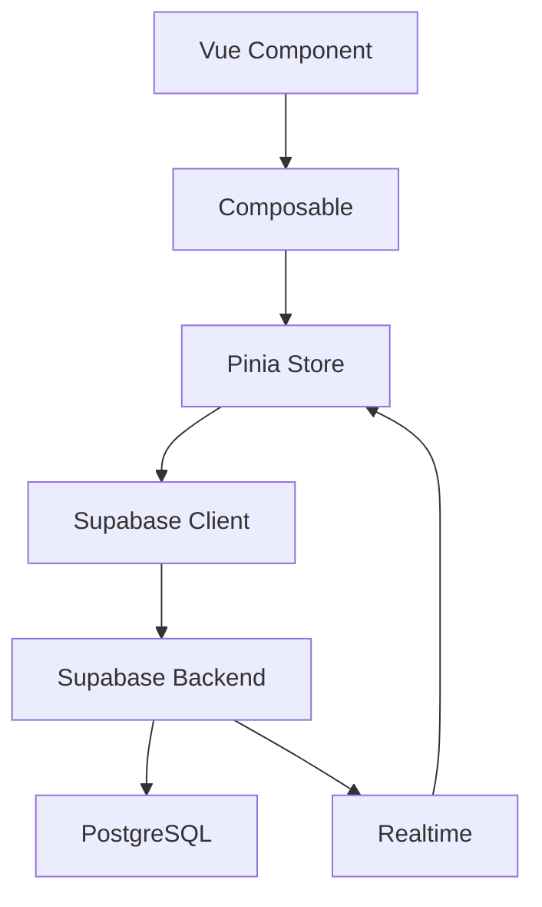

# Design Command - Vue.js + Supabase 技術設計

## 概要
要件定義から技術設計を生成し、Vue.js + Supabase アーキテクチャに最適化された設計書を作成します。

## 使用方法
```
/design
```

## プロセス

### 1. 要件確認
- requirements.md の内容を読み込み
- 不明点があれば質問
- 設計範囲の確認

### 2. アーキテクチャ設計

#### 2.1 全体構成
```
Frontend (Vue 3 + Vite)
├── Composition API (<script setup>)
├── Pinia Store (状態管理)
├── Vue Router (ルーティング)
└── DaisyUI + Tailwind CSS

Backend (Supabase)
├── PostgreSQL (データベース)
├── Row Level Security (認証・認可)
├── Realtime (リアルタイム同期)
└── Edge Functions (サーバーレス処理)
```

#### 2.2 ディレクトリ構造
```
src/
├── components/       # UIコンポーネント
│   ├── common/      # 共通コンポーネント
│   └── features/    # 機能別コンポーネント
├── composables/     # Composition API ロジック
├── stores/          # Pinia ストア
├── views/           # ページコンポーネント
├── lib/            # ユーティリティ
│   └── supabase/   # Supabase クライアント
└── types/          # TypeScript 型定義
```

### 3. 技術選定理由

#### Vue.js Composition API
- ロジックの再利用性向上
- TypeScript との親和性
- リアクティブな状態管理

#### Pinia
- Vue 3 公式推奨
- TypeScript サポート
- DevTools 統合

#### Supabase
- PostgreSQL の柔軟性
- リアルタイム機能
- 認証・認可の統合

#### DaisyUI
- Tailwind CSS ベース
- コンポーネント駆動開発
- テーマシステム

### 4. 設計パターン

#### 4.1 コンポーザブルパターン
```typescript
// composables/useUser.ts
export const useUser = () => {
  const user = ref<User | null>(null)
  const loading = ref(false)
  
  const fetchUser = async (id: string) => {
    loading.value = true
    try {
      const { data } = await supabase
        .from('users')
        .select('*')
        .eq('id', id)
        .single()
      user.value = data
    } finally {
      loading.value = false
    }
  }
  
  return { user, loading, fetchUser }
}
```

#### 4.2 ストアパターン
```typescript
// stores/auth.ts
export const useAuthStore = defineStore('auth', () => {
  const user = ref<User | null>(null)
  const session = ref<Session | null>(null)
  
  const signIn = async (email: string, password: string) => {
    const { data, error } = await supabase.auth.signInWithPassword({
      email,
      password
    })
    if (data) {
      user.value = data.user
      session.value = data.session
    }
    return { data, error }
  }
  
  return { user, session, signIn }
})
```

#### 4.3 Supabase RLS ポリシー
```sql
-- ユーザーは自分のデータのみアクセス可能
CREATE POLICY "Users can view own data" ON users
  FOR SELECT USING (auth.uid() = id);

-- 認証済みユーザーのみ作成可能
CREATE POLICY "Authenticated users can insert" ON posts
  FOR INSERT TO authenticated
  WITH CHECK (auth.uid() = user_id);
```

### 5. データフロー設計



### 6. エラーハンドリング戦略

#### 6.1 グローバルエラーハンドラー
```typescript
// plugins/error-handler.ts
export default {
  install(app: App) {
    app.config.errorHandler = (error, instance, info) => {
      console.error('Global error:', error)
      // エラー通知の表示
      useToast().error(error.message)
    }
  }
}
```

#### 6.2 Supabase エラー処理
```typescript
// lib/supabase/error-handler.ts
export const handleSupabaseError = (error: PostgrestError) => {
  switch (error.code) {
    case '23505':
      return '既に存在するデータです'
    case '23503':
      return '参照先のデータが見つかりません'
    default:
      return 'エラーが発生しました'
  }
}
```

### 7. パフォーマンス最適化

#### 7.1 コンポーネント最適化
- `defineAsyncComponent` による遅延読み込み
- `v-memo` による再レンダリング制御
- `shallowRef` による大規模データの最適化

#### 7.2 Supabase 最適化
- 必要なカラムのみ select
- インデックスの適切な設定
- リアルタイム購読の最小化

### 8. セキュリティ設計

#### 8.1 フロントエンド
- 環境変数による機密情報管理
- XSS 対策（v-html の制限）
- CSRF トークンの実装

#### 8.2 Supabase
- Row Level Security の徹底
- API キーの適切な管理
- Edge Functions でのバリデーション

### 9. テスト戦略

#### 9.1 単体テスト
- Vitest によるコンポーネントテスト
- Pinia ストアのモックテスト
- コンポーザブルのテスト

#### 9.2 統合テスト
- Supabase ローカル環境でのテスト
- E2E テスト（Playwright）

### 10. デプロイメント設計

#### 10.1 フロントエンド
- Vercel / Netlify デプロイ
- 環境別ビルド設定
- CDN 最適化

#### 10.2 Supabase
- 環境別プロジェクト
- マイグレーション管理
- バックアップ戦略

## 出力形式

設計完了後、以下のファイルを生成：

1. `.cckiro/specs/[機能名]/design.md` - 技術設計書
2. `.cckiro/specs/[機能名]/architecture.md` - アーキテクチャ図
3. `.cckiro/specs/[機能名]/data-flow.md` - データフロー設計

## TodoWrite 連携

設計フェーズの主要タスクを自動的に TodoWrite に登録：
- [ ] アーキテクチャ設計
- [ ] データモデル設計
- [ ] API 設計
- [ ] セキュリティ設計
- [ ] パフォーマンス設計

## 次のステップ

設計承認後、`/tasks` コマンドで詳細タスク分割へ進む。