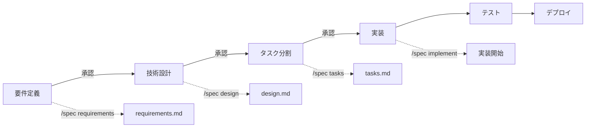

# Spec Command - 統合仕様駆動開発

## 概要
要件定義から実装まで、Vue.js + Supabase プロジェクトの全工程を段階的に進行する統合コマンドです。

## 使用方法
```
/spec [フェーズ名]
```

### フェーズ一覧
- `init` - プロジェクト初期化（マルチAI協調）
- `requirements` - 要件定義
- `design` - 技術設計
- `tasks` - タスク分割
- `implement` - 実装開始
- `status` - 現在の状態確認
- `multiAI` - マルチAI協調管理

## マルチAI連携統合フロー

各フェーズで最適なAIチームメンバーと連携し、専門性を活かした開発を実現します。

### 拡張フェーズ構成
```mermaid
graph TB
    subgraph "Phase 1: 分析・戦略 (Gemini CLI)"
        A1[/research - 市場・ユーザー調査]
        A2[/content-strategy - ブランド・UX戦略]
        A3[/product-plan - 要件・ロードマップ]
    end
    
    subgraph "Phase 2: 設計・実装 (Claude Code)"
        B1[/requirements - 要件定義]
        B2[/design - 技術設計]
        B3[/tasks - タスク分割]
        B4[Implementation - 実装]
    end
    
    subgraph "Phase 3: インフラ・運用 (o3 MCP)"
        C1[/architecture - システム設計]
        C2[/devops - CI/CD・運用]
        C3[/security - セキュリティ]
    end
    
    A1 --> A2
    A2 --> A3
    A3 --> B1
    B1 --> B2
    B2 --> C1
    C1 --> B3
    B3 --> B4
    B4 --> C2
    C2 --> C3
```

## プロセス全体図



## フェーズ詳細

### 1. 初期化フェーズ（/spec init）

```bash
# 実行内容
1. プロジェクトディレクトリ構造の作成
2. 基本設定ファイルの生成
3. Git リポジトリの初期化
4. requirements.md テンプレートの作成
```

#### 生成される構造
```
project/
├── .claude/
│   ├── commands/       # カスタムコマンド
│   └── CLAUDE.md      # AI 向けドキュメント
├── .cckiro/
│   └── specs/         # 仕様書保存場所
├── src/               # ソースコード
├── docs/              # ドキュメント
└── requirements.md    # 要件定義
```

### 2. 要件定義フェーズ（/spec requirements）

#### 2.1 情報収集
```yaml
収集項目:
  - プロジェクト概要
  - 主要機能一覧
  - ユーザーストーリー
  - 非機能要件
  - 制約事項
```

#### 2.2 要件整理
```markdown
## 機能要件
- [ ] ユーザー認証（サインアップ/サインイン/サインアウト）
- [ ] プロフィール管理
- [ ] データCRUD操作
- [ ] リアルタイム同期

## 非機能要件
- パフォーマンス: 初期表示3秒以内
- セキュリティ: Supabase RLS による保護
- 可用性: 99.9% アップタイム
```

#### 2.3 成果物
- `.cckiro/specs/[プロジェクト名]/requirements.md`
- `.cckiro/specs/[プロジェクト名]/user-stories.md`

### 3. 技術設計フェーズ（/spec design）

#### 3.1 アーキテクチャ決定
```javascript
// 技術スタック定義
const techStack = {
  frontend: {
    framework: "Vue 3.4+",
    buildTool: "Vite 5",
    language: "JavaScript (ES2022+) + JSDoc",
    styling: "Tailwind CSS + DaisyUI",
    stateManagement: "Pinia",
    router: "Vue Router 4"
  },
  backend: {
    platform: "Supabase",
    database: "PostgreSQL",
    auth: "Supabase Auth",
    storage: "Supabase Storage",
    realtime: "Supabase Realtime"
  },
  deployment: {
    frontend: "Vercel/Netlify",
    backend: "Supabase Cloud"
  }
}
```

#### 3.2 設計パターン定義
- Composition API パターン
- Pinia ストアパターン
- Supabase クライアントパターン
- エラーハンドリングパターン

#### 3.3 成果物
- `.cckiro/specs/[プロジェクト名]/architecture.md`
- `.cckiro/specs/[プロジェクト名]/design-patterns.md`
- `.cckiro/specs/[プロジェクト名]/data-model.md`

### 4. タスク分割フェーズ（/spec tasks）

#### 4.1 自動タスク生成
```javascript
// タスク生成ロジック
function generateTasks(requirements, design) {
  const tasks = []
  
  // 環境構築タスク
  tasks.push(...generateSetupTasks())
  
  // 機能別タスク
  requirements.features.forEach(feature => {
    tasks.push(...generateFeatureTasks(feature))
  })
  
  // テストタスク
  tasks.push(...generateTestTasks())
  
  return tasks
}
```

#### 4.2 タスク優先順位付け
```yaml
優先度基準:
  Critical: 基盤機能、認証、セキュリティ
  High: 主要機能、データモデル
  Medium: UI/UX、補助機能
  Low: 最適化、リファクタリング
```

#### 4.3 成果物
- `.cckiro/specs/[プロジェクト名]/tasks.json`
- `.cckiro/specs/[プロジェクト名]/gantt-chart.md`
- TodoWrite への自動登録

### 5. 実装フェーズ（/spec implement）

#### 5.1 実装開始チェック
```bash
# チェック項目
✓ 全ての設計ドキュメントが承認済み
✓ タスクリストが TodoWrite に登録済み
✓ 開発環境が構築済み
✓ Git リポジトリが初期化済み
```

#### 5.2 実装ガイドライン
```markdown
## コーディング規約
- Vue 3 Composition API (<script setup>) を使用
- JSDoc型チェックを有効化
- ESLint + Prettier による自動整形
- コンポーネント単位でのテスト必須

## コミット規約
- feat: 新機能
- fix: バグ修正
- docs: ドキュメント
- style: フォーマット
- refactor: リファクタリング
- test: テスト
- chore: ビルド/補助ツール
```

#### 5.3 進捗管理
```javascript
// 自動進捗レポート
async function generateProgressReport() {
  const todos = await getTodos()
  const completed = todos.filter(t => t.status === 'completed')
  const inProgress = todos.filter(t => t.status === 'in_progress')
  const pending = todos.filter(t => t.status === 'pending')
  
  return {
    completionRate: (completed.length / todos.length) * 100,
    velocity: calculateVelocity(completed),
    estimatedCompletion: estimateCompletion(pending, velocity),
    blockers: identifyBlockers(inProgress)
  }
}
```

### 6. ステータス確認（/spec status）

#### 6.1 プロジェクト状態
```yaml
現在のフェーズ: 実装
完了フェーズ:
  - ✓ 要件定義
  - ✓ 技術設計
  - ✓ タスク分割
進行中:
  - 実装（45% 完了）
    - 完了: 23/51 タスク
    - 進行中: 3 タスク
    - 残り: 25 タスク
```

#### 6.2 健全性チェック
```typescript
// プロジェクト健全性チェック
const healthCheck = {
  documentation: checkDocumentationCompleteness(),
  codeQuality: await runLintAndTypeCheck(),
  testCoverage: await getTestCoverage(),
  dependencies: await checkDependencies(),
  security: await runSecurityAudit()
}
```

## 統合機能

### 1. CLAUDE.md 自動更新
```typescript
// CLAUDE.md を自動的に最新状態に保つ
function updateClaudeMd() {
  const sections = [
    generateProjectOverview(),
    generateCurrentTasks(),
    generateTechStack(),
    generateConventions(),
    generateCommonPatterns()
  ]
  
  writeFile('.claude/CLAUDE.md', sections.join('\n\n'))
}
```

### 2. 文書間の整合性チェック
```typescript
// 要件・設計・実装の整合性を検証
function validateConsistency() {
  const requirements = parseRequirements()
  const design = parseDesign()
  const implementation = analyzeCode()
  
  return {
    unmatchedRequirements: findUnimplemented(requirements, implementation),
    designDeviations: findDeviations(design, implementation),
    suggestions: generateSuggestions()
  }
}
```

### 3. AI エージェント制御
```yaml
AI 行動ルール:
  - 各フェーズ完了時に必ず承認を求める
  - 勝手に次のフェーズに進まない
  - 設計から逸脱した実装を行わない
  - 不明点は必ず質問する
  - 過剰な最適化を避ける
```

## ベストプラクティス

### 1. 段階的詳細化
```
概要 → 要件 → 設計 → 詳細設計 → 実装
各段階で適切な抽象度を保つ
```

### 2. ドキュメント駆動
```
コードを書く前に設計を文書化
実装は設計に従う
変更は設計から反映
```

### 3. 継続的検証
```
日次: コード品質チェック
週次: 進捗確認と計画調整
フェーズ終了時: 総合レビュー
```

## トラブルシューティング

### よくある問題と対処法

#### 1. 要件の曖昧さ
```markdown
症状: 実装時に仕様の解釈で迷う
対処: 要件定義フェーズに戻って明確化
予防: ユーザーストーリーを詳細に記述
```

#### 2. 過剰な機能追加
```markdown
症状: スコープが肥大化
対処: 要件定義に立ち返る
予防: フェーズ承認を厳格に運用
```

#### 3. 技術的負債
```markdown
症状: コードの複雑化
対処: リファクタリングタスクを追加
予防: 設計パターンの遵守
```

## 出力サマリー

`/spec` コマンド実行により生成される成果物：

```
.cckiro/specs/[プロジェクト名]/
├── overview.md           # プロジェクト概要
├── requirements.md       # 要件定義
├── user-stories.md       # ユーザーストーリー
├── architecture.md       # アーキテクチャ設計
├── design-patterns.md    # 設計パターン
├── data-model.md        # データモデル
├── tasks.json           # タスクリスト
├── gantt-chart.md       # ガントチャート
├── progress/            # 進捗レポート
│   └── YYYY-MM-DD.md   # 日次レポート
└── reviews/             # レビュー記録
    └── phase-X.md       # フェーズレビュー
```

## 次のアクション

1. `/spec init` でプロジェクトを初期化
2. 要件を整理して `/spec requirements` を実行
3. 各フェーズを順次進行
4. `/spec status` で定期的に状態確認