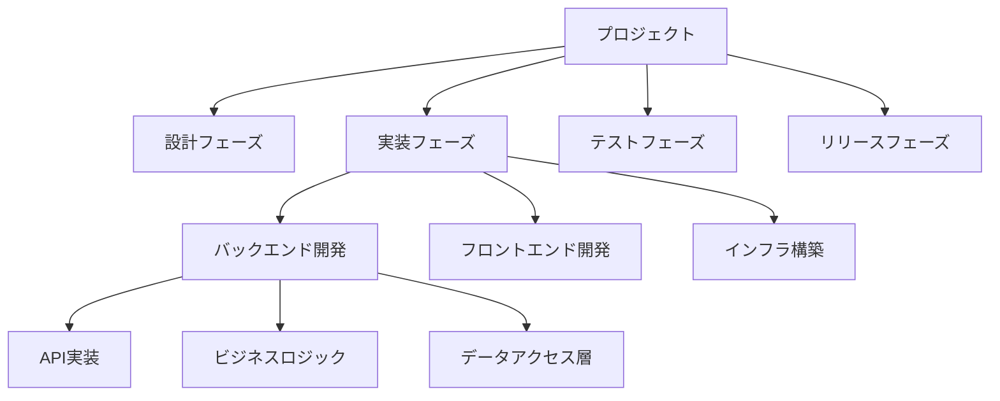

# /tasks - タスク分割・実装計画コマンド

## 概要
技術設計書を基にタスクを分割し、実装計画を作成するコマンドです。人事部が主導してチーム編成を行い、CTOが全体のリソース配分を調整します。

## 使用方法
```
/tasks [オプション]
```

### オプション
- `breakdown` - タスク分割のみ実行
- `estimate` - 工数見積もりを含む
- `assign` - チーム割り当てを含む
- `timeline` - タイムライン作成
- `all` - 全機能実行（デフォルト）

## 実行プロセス

### 1. タスク分析フェーズ
設計書から実装タスクを抽出します。

#### 分析項目
- 機能単位での分割
- 技術的依存関係の特定
- 並列実行可能タスクの識別
- クリティカルパスの特定

### 2. 工数見積もりフェーズ
各タスクの工数を見積もります。

#### 見積もり手法
- **3点見積もり**: 楽観値、最頻値、悲観値
- **ストーリーポイント**: 相対的な複雑度
- **人日換算**: 実工数への変換

### 3. チーム編成フェーズ
人事部が最適なチームを編成します。

#### チーム編成基準
- 必要スキルセット
- メンバーの稼働状況
- 経験レベル
- チームバランス

## タスク計画書テンプレート

```markdown
# タスク実装計画書 - [プロジェクト名]

## 1. プロジェクト概要
### 1.1 目標
- 完了予定日：YYYY-MM-DD
- 総工数見積もり：XXX人日
- チーム規模：XX名

### 1.2 マイルストーン
| マイルストーン | 期日 | 成果物 | ステータス |
|---------------|------|--------|-----------|
| M1: 基本機能実装 | | | |
| M2: 統合テスト完了 | | | |
| M3: リリース準備 | | | |

## 2. WBS（作業分解構成）
### 2.1 フェーズ別タスク構成


### 2.2 詳細タスクリスト
| タスクID | タスク名 | 説明 | 前提タスク | 見積もり | 優先度 |
|---------|---------|------|-----------|---------|--------|
| T001 | データベース設計 | テーブル設計とER図作成 | - | 2人日 | 高 |
| T002 | API基盤構築 | RESTful API基盤の構築 | T001 | 3人日 | 高 |
| T003 | 認証機能実装 | JWT認証の実装 | T002 | 5人日 | 高 |
| T004 | ユーザー管理API | CRUD操作の実装 | T002 | 3人日 | 中 |

## 3. 工数見積もり
### 3.1 フェーズ別工数
| フェーズ | 楽観値 | 最頻値 | 悲観値 | 期待値 |
|---------|--------|--------|--------|--------|
| 設計 | 10人日 | 15人日 | 25人日 | 16人日 |
| 実装 | 30人日 | 40人日 | 60人日 | 42人日 |
| テスト | 15人日 | 20人日 | 30人日 | 21人日 |
| リリース | 3人日 | 5人日 | 10人日 | 5.5人日 |
| **合計** | **58人日** | **80人日** | **125人日** | **84.5人日** |

### 3.2 バッファ管理
- プロジェクトバッファ：20%（17人日）
- フィーディングバッファ：各クリティカルパスに5%

## 4. チーム編成
### 4.1 チーム構成
| 役割 | 氏名 | スキル | 稼働率 | 担当タスク |
|------|------|--------|--------|-----------|
| テックリード | 山田太郎 | フルスタック | 100% | 全体統括、T001-T003 |
| バックエンド開発者 | 田中さくら | Python, FastAPI | 100% | T002-T004 |
| バックエンド開発者 | 鈴木大輔 | Python, SQLAlchemy | 80% | T001, T004 |
| フロントエンド開発者 | 佐藤花子 | Vue.js, TypeScript | 100% | T005-T008 |
| QAエンジニア | 小林真理 | 自動テスト | 60% | T009-T011 |

### 4.2 スキルマトリックス
| メンバー | Python | JavaScript | SQL | Docker | AWS | テスト |
|---------|--------|------------|-----|--------|-----|--------|
| 山田太郎 | ◎ | ○ | ◎ | ○ | ○ | ○ |
| 田中さくら | ◎ | △ | ○ | ○ | △ | ○ |
| 鈴木大輔 | ◎ | - | ◎ | △ | - | ○ |
| 佐藤花子 | △ | ◎ | ○ | ○ | △ | ○ |
| 小林真理 | ○ | ○ | ○ | △ | - | ◎ |

凡例: ◎エキスパート ○習熟 △基礎 -未経験

## 5. スケジュール
### 5.1 ガントチャート
```
タスク         |1週|2週|3週|4週|5週|6週|7週|8週|
--------------|---|---|---|---|---|---|---|---|
T001:DB設計    |███|   |   |   |   |   |   |   |
T002:API基盤   |   |███|██ |   |   |   |   |   |
T003:認証機能  |   |   |███|███|   |   |   |   |
T004:ユーザAPI |   |   |   |███|██ |   |   |   |
T005:UI設計    |   |███|███|   |   |   |   |   |
T006:画面実装  |   |   |   |███|███|███|   |   |
T007:統合テスト|   |   |   |   |   |███|███|   |
T008:リリース  |   |   |   |   |   |   |   |███|
```

### 5.2 クリティカルパス
T001 → T002 → T003 → T007 → T008

## 6. リスク管理
### 6.1 技術リスク
| リスク | 影響 | 確率 | 対策 | 責任者 |
|--------|------|------|------|--------|
| API性能問題 | 高 | 中 | 早期性能テスト実施 | 山田 |
| 外部API連携遅延 | 中 | 低 | モックAPI準備 | 田中 |

### 6.2 リソースリスク
| リスク | 影響 | 確率 | 対策 | 責任者 |
|--------|------|------|------|--------|
| キーパーソン離脱 | 高 | 低 | ナレッジ共有強化 | CTO |
| スキル不足 | 中 | 中 | 教育・ペアプロ実施 | 人事部 |

## 7. コミュニケーション計画
### 7.1 定例会議
| 会議名 | 頻度 | 参加者 | 目的 |
|--------|------|--------|------|
| デイリースクラム | 毎日 | 開発チーム | 進捗共有 |
| 週次レビュー | 週1回 | 全員 | 成果確認 |
| ステアリング会議 | 隔週 | CTO、PM | 意思決定 |

### 7.2 情報共有
- 共有タスクボード：`.ActivityReport/tasks/shared_tasks.md`
- 日報：`.ActivityReport/daily_report/`
- 成果物：`.claude/docs/tasks/`

## 8. 品質管理
### 8.1 完了条件
- コードレビュー実施済み
- 単体テスト作成済み（カバレッジ80%以上）
- 統合テスト合格
- ドキュメント更新済み

### 8.2 メトリクス
| メトリクス | 目標値 | 測定方法 |
|-----------|--------|----------|
| 進捗率 | 計画±10% | タスク完了率 |
| 品質 | バグ密度<5件/KLOC | 静的解析 |
| 生産性 | 50LOC/人日 | コード行数 |

## 9. 承認
| 役割 | 氏名 | 承認日 | 署名 |
|------|------|--------|------|
| CTO | | | |
| 人事部長 | | | |
| プロジェクトマネージャー | | | |

---
作成日: YYYY-MM-DD
作成者: 人事部・CTO
バージョン: 1.0
```

## 出力先
- `.claude/docs/tasks/TASK_YYYYMMDD_プロジェクト名.md`
- 進行中タスクは `.ActivityReport/tasks/shared_tasks.md` で管理

## エージェント役割分担

| エージェント | 責任範囲 |
|-------------|---------|
| 人事部 | チーム編成、スキル評価、リソース配分 |
| CTO | 全体統括、優先度決定、リスク管理 |
| システム開発部 | 技術的見積もり、実装方針 |
| 品質保証部 | 品質基準設定、テスト計画 |
| 経営企画部 | マイルストーン承認、ビジネス優先度 |

## 実行例

### 全機能実行
```bash
/tasks
# または
/tasks all
```

### 部分実行
```bash
/tasks breakdown  # タスク分割のみ
/tasks estimate   # 見積もり含む
/tasks assign     # チーム割り当て含む
/tasks timeline   # スケジュール作成
```

## 関連コマンド
- `/spec` - 統合開発フロー
- `/requirements` - 要件定義書の参照
- `/design` - 技術設計書の参照
- `/implement` - タスク実装の開始

## 注意事項
- タスクの依存関係を必ず確認してください
- バッファは適切に設定してください
- リソースの競合を避けるよう調整してください
- 定期的に進捗を更新してください

---

*このコマンドは人事部が主導し、CTOと連携してタスク分割とチーム編成を行います。*