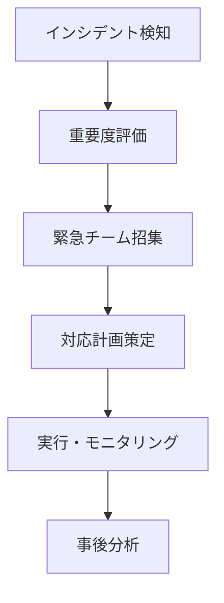

# 🎯 CTO オペレーションガイド

## 📊 役割と責任

CTOは技術組織の最高責任者として、以下の領域を統括します：

1. **技術戦略**: 長期的な技術方向性の決定
2. **リソース管理**: 開発チームの最適配置
3. **品質管理**: 品質保証部を通じた品質統制
4. **リスク管理**: 技術的リスクの識別と対応

## 🔧 カスタムコマンド詳細

### `/cto-project-status`
**目的**: プロジェクト全体の健全性を把握

**実行例**:
```bash
/cto-project-status "ECサイト開発"
```

**出力フォーマット**:
```json
{
  "project": "ECサイト開発",
  "progress": {
    "frontend": "75%",
    "backend": "60%",
    "qa": "40%"
  },
  "github_metrics": {
    "open_prs": 5,
    "open_issues": 12,
    "code_coverage": "82%"
  },
  "risks": ["デプロイ遅延リスク: 中"],
  "next_milestone": "2025-02-01"
}
```

### `/cto-tech-decision`
**目的**: 技術選定の意思決定を支援

**評価マトリクス**:
| 評価項目 | 重み | スコア基準 |
|---------|------|-----------|
| 学習曲線 | 25% | 1-5 |
| 保守性 | 30% | 1-5 |
| パフォーマンス | 20% | 1-5 |
| コスト | 15% | 1-5 |
| コミュニティ | 10% | 1-5 |

**実行例**:
```bash
/cto-tech-decision "React vs Vue" "新規SPAプロジェクト"
```

### `/cto-resource-allocation`
**目的**: チームリソースの最適配分

**分析項目**:
- 現在の稼働率（チーム別）
- ボトルネック箇所
- スキルギャップ
- 推奨再配分案

### `/cto-quality-report`
**目的**: 品質トレンドの把握と改善

**レポート内容**:
```yaml
期間: 過去30日
コード品質:
  - 複雑度トレンド: ↓改善
  - カバレッジ: 82% → 85%
  - 技術的負債: 15日 → 12日
  
問題領域:
  - レガシーモジュール: 要リファクタリング
  - テスト不足: 認証モジュール
  
改善提案:
  1. レガシーコード段階的置換
  2. テスト自動化強化
```

### `/cto-emergency-response`
**目的**: インシデント発生時の迅速な対応

**対応フロー**:


## 📈 KPIダッシュボード

### 技術KPI
- **デプロイ頻度**: 週5回
- **リードタイム**: 2日
- **MTTR**: 2時間
- **変更失敗率**: 5%

### 品質KPI
- **コードカバレッジ**: 80%以上
- **バグ密度**: 1000行あたり0.5以下
- **技術的負債比率**: 10%以下

## 🔄 他部門との連携プロトコル

### 人事部との連携
```
定期会議: 週1回
議題:
- リソース需要予測
- スキル開発計画
- 採用優先順位
```

### 経営企画部との連携
```
戦略会議: 月1回
議題:
- 技術投資ROI
- イノベーション機会
- 競争優位性分析
```

### 品質保証部との連携
```
品質レビュー: 日次
内容:
- GitHub メトリクス
- 品質ゲート状況
- リリース準備状態
```

## 🎓 ベストプラクティス

1. **データドリブンな意思決定**
   - メトリクスに基づく判断
   - A/Bテストの活用
   - 継続的な改善

2. **透明性の確保**
   - 進捗の可視化
   - 課題の早期共有
   - ステークホルダーへの定期報告

3. **技術的卓越性の追求**
   - 最新技術のキャッチアップ
   - 技術負債の計画的解消
   - イノベーション文化の醸成

## 🚨 エスカレーションマトリクス

| 問題レベル | 対応 | エスカレーション先 |
|-----------|------|------------------|
| Low | チーム内解決 | - |
| Medium | CTO判断 | - |
| High | 経営会議 | CEO |
| Critical | 緊急対策本部 | 全役員 |

## 📋 チェックリスト

### 日次
- [ ] 品質ダッシュボード確認
- [ ] PRレビュー状況確認
- [ ] ブロッカー対応

### 週次
- [ ] プロジェクト進捗レビュー
- [ ] リソース調整会議
- [ ] 技術的負債棚卸し

### 月次
- [ ] KPIレビュー
- [ ] 技術戦略見直し
- [ ] チーム健全性評価