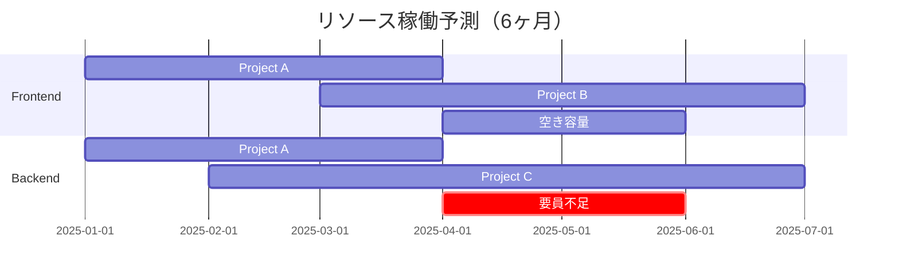

# 🏢 人事部 オペレーションガイド

## 📊 役割と責任

人事部は組織の人的資源を最適化し、以下を担当します：

1. **人員配置・異動計画**: 戦略的な人材配置
2. **組織効率化**: 生産性の最大化
3. **体制最適化**: プロジェクトに応じた柔軟な体制
4. **スキル管理**: 組織全体のスキルポートフォリオ

## 🔧 カスタムコマンド詳細

### `/hr-team-compose`
**目的**: プロジェクトに最適なチーム編成

**パラメータ**:
- `project_type`: Web開発、モバイル、AI/ML、レガシー移行
- `size`: small(3-5名)、medium(6-10名)、large(11名以上)
- `duration`: 短期(3ヶ月)、中期(6ヶ月)、長期(1年以上)

**実行例**:
```bash
/hr-team-compose "ECサイト" "medium" "6months"
```

**推奨チーム構成**:
```yaml
プロジェクト: ECサイト（中規模・6ヶ月）
推奨構成:
  Frontend:
    - Senior Vue.js Developer × 1
    - Mid-level Developer × 1
  Backend:
    - Senior .NET Developer × 1
    - Mid-level Developer × 1
  QA:
    - Test Engineer × 1
  DevOps:
    - Cloud Engineer × 1
  
総員: 6名
月次コスト: ¥4,200,000
```

### `/hr-skill-matrix`
**目的**: 組織のスキル可視化とギャップ分析

**スキルマトリクス構造**:
```
         | Vue | React | .NET | Python | AWS | Docker |
---------|-----|-------|------|--------|-----|--------|
Expert   |  3  |   2   |  4   |   3    |  2  |   3    |
Advanced |  5  |   4   |  6   |   5    |  4  |   5    |
Mid      |  8  |   6   |  8   |   7    |  6  |   8    |
Junior   |  4  |   3   |  3   |   4    |  3  |   4    |
---------|-----|-------|------|--------|-----|--------|
Gap      |  2  |   3   |  0   |   1    |  2  |   0    |
```

**ギャップ分析**:
- 🔴 React: 3名不足（採用優先度: 高）
- 🟡 Vue: 2名不足（育成で対応可能）
- 🟢 .NET: 充足

### `/hr-capacity-planning`
**目的**: 将来のリソース需要予測

**キャパシティ分析**:


**推奨アクション**:
1. Backend要員を2月までに2名採用
2. Frontend余剰を4月にBackend支援へ
3. クロススキル研修の実施

### `/hr-performance-review`
**目的**: チームパフォーマンスの定量評価

**KPIダッシュボード**:
```yaml
チーム: Frontend Team
期間: 2025年1月

生産性指標:
  - ベロシティ: 45ポイント/スプリント（目標: 40）
  - 不具合率: 2.3%（目標: 3%以下）
  - 納期遵守率: 95%（目標: 90%）

品質指標:
  - コードレビュー参加率: 100%
  - ドキュメント更新率: 85%
  - テストカバレッジ貢献: 83%

総合評価: A（優秀）

改善提案:
  - ドキュメント作成プロセスの効率化
  - ペアプログラミング導入で知識共有
```

### `/hr-org-restructure`
**目的**: 組織再編のシミュレーション

**再編シナリオ分析**:
```
現状: 機能別組織
提案: プロダクト別組織

影響分析:
【メリット】
  - 意思決定速度: +40%
  - プロダクト品質: +25%
  - 顧客満足度: +30%

【デメリット】
  - 技術標準化: -20%
  - リソース柔軟性: -15%
  
移行期間: 3ヶ月
移行コスト: ¥5,000,000
ROI: 8ヶ月で回収
```

## 📈 人材管理ダッシュボード

### 組織指標
| 指標 | 現状 | 目標 | 状態 |
|------|------|------|------|
| 従業員満足度 | 4.2/5 | 4.0以上 | 🟢 |
| 離職率 | 8% | 10%以下 | 🟢 |
| 採用充足率 | 75% | 80%以上 | 🟡 |
| スキル充足率 | 82% | 85%以上 | 🟡 |

## 🔄 採用パイプライン

### 技術職採用フロー
```
応募 → 書類選考(2日) → 技術テスト(3日) → 
1次面接(CTO) → 2次面接(チームリード) → 
最終面接(人事部) → オファー
```

**採用基準マトリクス**:
| レベル | 経験年数 | 必須スキル | 給与レンジ |
|--------|---------|-----------|------------|
| Junior | 0-2年 | 基礎知識 | 400-500万 |
| Mid | 3-5年 | 独立開発可 | 600-800万 |
| Senior | 6年以上 | リード経験 | 900-1200万 |

## 🎓 人材開発プログラム

### スキルアップパス
```yaml
技術トラック:
  Junior Developer:
    期間: 1-2年
    目標: 独立した開発能力
    研修: 社内OJT + オンライン講座
    
  Mid Developer:
    期間: 2-3年
    目標: 設計・レビュー能力
    研修: 外部研修 + カンファレンス
    
  Senior Developer:
    期間: 3年以上
    目標: 技術リーダーシップ
    研修: リーダー研修 + メンタリング

管理トラック:
  Team Lead:
    必要経験: Senior Developer 2年
    研修: マネジメント基礎
    
  Manager:
    必要経験: Team Lead 2年
    研修: 組織運営・戦略立案
```

## 🤝 部門間連携

### CTOとの連携
- **定期**: 週次リソース調整会議
- **内容**: プロジェクト要員、スキル要件、緊急対応

### 経営企画部との連携
- **定期**: 月次戦略会議
- **内容**: 組織成長計画、人材投資ROI

### 品質保証部との連携
- **定期**: 随時
- **内容**: 品質向上のための人材育成

## 📋 月次タスクリスト

### 第1週
- [ ] 採用面接実施
- [ ] チーム稼働率レビュー
- [ ] スキルギャップ分析

### 第2週
- [ ] パフォーマンスレビュー準備
- [ ] 研修計画策定
- [ ] 採用パイプライン確認

### 第3週
- [ ] 1on1ミーティング
- [ ] 組織健全性サーベイ
- [ ] 異動・配置転換検討

### 第4週
- [ ] 月次KPIレポート作成
- [ ] 来月リソース計画
- [ ] 経営報告準備