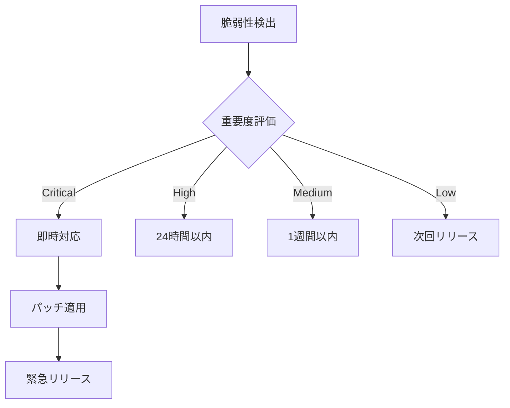

# 🛡️ 品質保証部 オペレーションガイド

## 📊 役割と責任

品質保証部はCTO直属部門として、以下を統括します：

1. **GitHub操作管理**: すべてのGit操作の一元管理
2. **コード品質保証**: 品質基準の設定と監視
3. **リリース管理**: 安全で確実なリリースプロセス
4. **セキュリティ監視**: 脆弱性の検出と対応

## 🔧 カスタムコマンド詳細

### `/qa-github-health`
**目的**: リポジトリの健全性を包括的にチェック

**実行コマンド**:
```bash
gh api /repos/{owner}/{repo} --jq '.{name,open_issues_count,language,default_branch}'
gh pr list --state all --limit 10
gh issue list --state all --limit 10
gh run list --limit 5
```

**健全性レポート**:
```yaml
リポジトリ状態:
  オープンPR: 5件
  オープンIssue: 12件
  最新ワークフロー: ✅ 成功
  
注意事項:
  - 3日以上更新なしPR: 2件
  - 高優先度Issue: 3件
  - 失敗したワークフロー: 過去24時間で1件
  
推奨アクション:
  1. 停滞PRのレビュー促進
  2. 高優先度Issueの割り当て
  3. ワークフロー失敗原因の調査
```

### `/qa-pr-create`
**目的**: 品質基準を満たしたPR作成

**品質チェックリスト**:
```markdown
## PR作成前チェック
- [ ] コードフォーマット確認
- [ ] Lintエラーなし
- [ ] テスト全パス
- [ ] カバレッジ80%以上
- [ ] ドキュメント更新
- [ ] CHANGELOG更新
```

**実行フロー**:
```bash
# 1. 品質チェック
npm run lint
npm run test
npm run coverage

# 2. PR作成
gh pr create \
  --title "[機能追加] ユーザー認証機能" \
  --body "$(cat pr_template.md)" \
  --label "enhancement,needs-review" \
  --reviewer "review-lead" \
  --assignee "@me"

# 3. 品質レポート添付
gh pr comment $PR_NUMBER --body "$(cat quality_report.md)"
```

### `/qa-release-prepare`
**目的**: 本番リリースの準備と実行

**リリースチェックリスト**:
```yaml
事前確認:
  ✅ 全テストパス
  ✅ セキュリティスキャンクリア
  ✅ パフォーマンステスト合格
  ✅ ステージング環境検証完了
  ✅ リリースノート作成
  ✅ ロールバック計画策定

リリース実行:
  1. タグ作成
  2. リリースブランチ作成
  3. 本番デプロイ
  4. スモークテスト
  5. モニタリング開始
```

**実行コマンド**:
```bash
# リリース作成
gh release create v1.2.0 \
  --title "Release v1.2.0" \
  --notes-file RELEASE_NOTES.md \
  --target main \
  --latest

# デプロイトリガー
gh workflow run deploy.yml \
  --ref v1.2.0 \
  -f environment=production
```

### `/qa-code-metrics`
**目的**: コード品質の定量評価

**メトリクス収集項目**:
```javascript
{
  "complexity": {
    "cyclomatic": 8.5,  // 目標: <10
    "cognitive": 12.3,   // 目標: <15
    "halstead": 145      // 難易度指標
  },
  "coverage": {
    "lines": 85.2,       // 目標: >80%
    "branches": 78.5,    // 目標: >75%
    "functions": 92.1    // 目標: >90%
  },
  "duplication": {
    "rate": 3.2,         // 目標: <5%
    "blocks": 12         // 重複ブロック数
  },
  "technical_debt": {
    "days": 8.5,         // 解消必要日数
    "issues": 45,        // 改善項目数
    "critical": 3        // 緊急対応項目
  }
}
```

### `/qa-security-scan`
**目的**: セキュリティ脆弱性の検出と対応

**スキャン実行**:
```bash
# Dependabot アラート確認
gh api /repos/{owner}/{repo}/dependabot/alerts \
  --jq '.[] | {severity,package:.dependency.package.name,advisory:.security_advisory.summary}'

# Code scanning アラート
gh api /repos/{owner}/{repo}/code-scanning/alerts \
  --jq '.[] | {severity:.rule.severity,rule:.rule.description,path:.most_recent_instance.location.path}'

# Secret scanning
gh api /repos/{owner}/{repo}/secret-scanning/alerts \
  --jq '.[] | {secret_type,state,locations:.locations[0].path}'
```

**脆弱性対応フロー**:


### `/qa-branch-protection`
**目的**: ブランチ保護ルールの設定

**保護ルール設定**:
```bash
gh api -X PUT /repos/{owner}/{repo}/branches/main/protection \
  --input - << EOF
{
  "required_status_checks": {
    "strict": true,
    "contexts": ["continuous-integration", "test-coverage"]
  },
  "enforce_admins": true,
  "required_pull_request_reviews": {
    "dismissal_restrictions": {},
    "dismiss_stale_reviews": true,
    "require_code_owner_reviews": true,
    "required_approving_review_count": 2
  },
  "restrictions": null,
  "allow_force_pushes": false,
  "allow_deletions": false
}
EOF
```

### `/qa-pr-auto-merge`
**目的**: 品質基準クリア後の自動マージ

**自動マージ条件**:
```yaml
必須条件:
  - CI/CD: すべて成功
  - レビュー: 2名以上の承認
  - テスト: カバレッジ80%以上
  - セキュリティ: 脆弱性なし
  - コンフリクト: なし
```

**実行コマンド**:
```bash
# 自動マージ有効化
gh pr merge $PR_NUMBER \
  --auto \
  --squash \
  --delete-branch \
  --subject "feat: $PR_TITLE" \
  --body "Auto-merged by QA Department after all checks passed"
```

## 📈 品質ダッシュボード

### リアルタイムメトリクス
| 指標 | 現在値 | 目標 | 状態 |
|------|--------|------|------|
| ビルド成功率 | 95% | >90% | 🟢 |
| 平均PR待機時間 | 18h | <24h | 🟢 |
| コードカバレッジ | 82% | >80% | 🟢 |
| 脆弱性件数 | 2 | 0 | 🟡 |
| 技術的負債 | 12日 | <10日 | 🟡 |

## 🔄 品質保証プロセス

### デイリーワークフロー
```
09:00 - 品質メトリクス確認
09:30 - PR/Issueトリアージ
10:00 - コードレビュー調整
14:00 - セキュリティスキャン
16:00 - CI/CD状態確認
17:00 - 日次レポート作成
```

### 週次タスク
- 月曜: 週次品質レポート作成
- 火曜: セキュリティアップデート
- 水曜: パフォーマンステスト
- 木曜: 技術的負債棚卸し
- 金曜: リリース準備・実施

## 🚨 インシデント対応

### 重要度別対応フロー
```yaml
Critical (本番停止):
  対応時間: 即時
  エスカレーション: CTO直通
  対応: ホットフィックス即時デプロイ
  
High (機能障害):
  対応時間: 2時間以内
  エスカレーション: チームリード
  対応: 緊急パッチ準備
  
Medium (部分的影響):
  対応時間: 24時間以内
  エスカレーション: 担当者
  対応: 次回定期リリース
  
Low (軽微な問題):
  対応時間: 1週間以内
  エスカレーション: なし
  対応: バックログ追加
```

## 🛠️ ツールチェーン

### 品質管理ツール
```yaml
静的解析:
  - ESLint (JavaScript/TypeScript)
  - Pylint (Python)
  - StyleCop (.NET)
  
テスト:
  - Jest (Unit Test)
  - Cypress (E2E)
  - K6 (Performance)
  
CI/CD:
  - GitHub Actions
  - Jenkins
  - ArgoCD
  
モニタリング:
  - Datadog
  - New Relic
  - Sentry
```

## 📋 月次品質レポートテンプレート

```markdown
# 月次品質レポート - 2025年1月

## エグゼクティブサマリー
- 品質スコア: 85/100
- 主要成果: CI/CD時間50%短縮
- 課題: レガシーコードの技術的負債

## 詳細メトリクス
### コード品質
- カバレッジ: 82% (+3%)
- 複雑度: 8.5 (-0.5)
- 重複率: 3.2% (-0.8%)

### リリース品質
- デプロイ成功率: 98%
- ロールバック: 1件
- 本番障害: 0件

## 改善提案
1. テスト自動化の拡充
2. コードレビュープロセス改善
3. セキュリティスキャン強化

## 次月アクションプラン
- [ ] E2Eテストカバレッジ向上
- [ ] パフォーマンステスト自動化
- [ ] 技術的負債の計画的解消
```