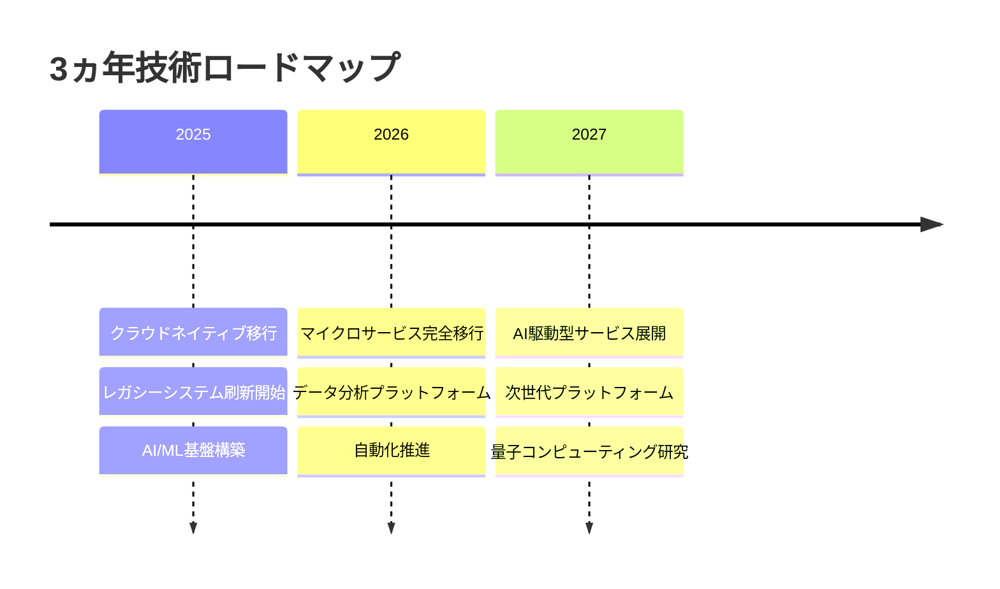

# 💡 経営企画部 オペレーションガイド

## 📊 役割と責任

経営企画部は組織の戦略的方向性を定め、以下を統括します：

1. **戦略立案**: 中長期ビジネス戦略の策定
2. **イノベーション推進**: 新技術・新市場の開拓
3. **ビジネス・技術連携**: 事業目標と技術投資の整合
4. **組織変革**: デジタルトランスフォーメーション推進

## 🔧 カスタムコマンド詳細

### `/strategy-tech-roadmap`
**目的**: 技術投資の長期計画策定

**ロードマップ構成**:


**投資配分計画**:
```yaml
2025年度:
  クラウド基盤: 40% (¥120M)
  レガシー刷新: 35% (¥105M)
  AI/ML: 25% (¥75M)

2026年度:
  プラットフォーム: 45% (¥150M)
  データ分析: 30% (¥100M)
  自動化: 25% (¥83M)

2027年度:
  AI サービス: 50% (¥200M)
  次世代技術: 30% (¥120M)
  R&D: 20% (¥80M)
```

### `/strategy-innovation-scan`
**目的**: 破壊的イノベーション機会の特定

**イノベーションマトリクス**:
```
影響度/実現可能性 | 高 | 中 | 低 |
-----------------|-----|-----|-----|
高 | 生成AI活用 | IoT統合 | ブロックチェーン |
中 | AR/VR | エッジコンピューティング | 5G活用 |
低 | 量子コンピューティング | 脳インターフェース | 宇宙技術 |
```

**推奨POCプロジェクト**:
1. **生成AI顧客サポート**
   - 投資: ¥20M
   - 期間: 3ヶ月
   - 期待ROI: 200%

2. **IoTによる予知保全**
   - 投資: ¥15M
   - 期間: 6ヶ月
   - 期待ROI: 150%

### `/strategy-risk-assessment`
**目的**: 戦略的リスクの評価と対策

**リスクマップ**:
```yaml
技術リスク:
  - サイバーセキュリティ脅威
    影響: 極大
    発生確率: 中
    対策: ゼロトラスト導入
    
  - 技術的負債の蓄積
    影響: 大
    発生確率: 高
    対策: 継続的リファクタリング

市場リスク:
  - 競合の破壊的イノベーション
    影響: 極大
    発生確率: 中
    対策: 継続的市場監視
    
  - 規制変更
    影響: 大
    発生確率: 中
    対策: コンプライアンス体制強化

組織リスク:
  - 人材流出
    影響: 大
    発生確率: 中
    対策: リテンション施策
    
  - スキルギャップ
    影響: 中
    発生確率: 高
    対策: 継続的教育投資
```

### `/strategy-digital-transform`
**目的**: DX推進による競争優位確立

**DX成熟度評価**:
```
現在レベル: 2.5 / 5.0

領域別評価:
┌─────────────────┬───────┬────────┐
│ 領域            │ 現在  │ 目標   │
├─────────────────┼───────┼────────┤
│ 顧客体験        │ 2.0   │ 4.0    │
│ 業務プロセス    │ 3.0   │ 4.5    │
│ ビジネスモデル  │ 2.0   │ 4.0    │
│ 組織文化        │ 2.5   │ 4.0    │
│ データ活用      │ 3.0   │ 5.0    │
└─────────────────┴───────┴────────┘
```

**変革ロードマップ**:
```
Phase 1 (0-6ヶ月): デジタル基盤整備
  - クラウド移行
  - データ統合
  - API化推進

Phase 2 (6-12ヶ月): プロセス最適化
  - 業務自動化
  - ワークフロー改善
  - KPI可視化

Phase 3 (12-24ヶ月): ビジネス変革
  - 新サービス展開
  - エコシステム構築
  - データ駆動経営
```

### `/strategy-market-analysis`
**目的**: 市場機会の特定と参入戦略

**市場分析フレームワーク**:
```yaml
ターゲット市場: AIソリューション

市場規模:
  - 現在: ¥2.5兆
  - 2027年予測: ¥8.2兆
  - CAGR: 35%

競合分析:
  主要プレイヤー:
    - A社: シェア25%、強み: ブランド
    - B社: シェア20%、強み: 技術力
    - C社: シェア15%、強み: 価格
  
  当社ポジション:
    - 現在シェア: 5%
    - 差別化要因: 業界特化型AI
    - 目標シェア: 15%（3年後）

参入戦略:
  1. ニッチ市場から開始
  2. パートナーシップ構築
  3. 段階的機能拡張
  4. M&A検討
```

## 📈 戦略KPIダッシュボード

### 事業成長指標
| KPI | 現状 | 目標(年間) | 進捗 |
|-----|------|-----------|------|
| 売上成長率 | 15% | 20% | 🟡 |
| 新規事業比率 | 10% | 25% | 🔴 |
| デジタル売上比 | 35% | 50% | 🟡 |
| 顧客満足度 | 4.1 | 4.5 | 🟢 |

### イノベーション指標
| KPI | 現状 | 目標 | 進捗 |
|-----|------|------|------|
| R&D投資比率 | 8% | 12% | 🟡 |
| 新技術導入数 | 3 | 5 | 🟡 |
| POC成功率 | 60% | 70% | 🟢 |
| 特許出願数 | 12 | 20 | 🔴 |

## 🔄 戦略的パートナーシップ

### 技術パートナー
```yaml
Microsoft:
  領域: クラウド、AI
  契約: Strategic Partner
  投資: ¥50M/年

AWS:
  領域: インフラ、サーバーレス
  契約: Advanced Partner
  投資: ¥80M/年

Google:
  領域: AI/ML、データ分析
  契約: Technology Partner
  投資: ¥30M/年
```

### 事業パートナー
- **コンサルティング**: McKinsey (戦略)、Accenture (実装)
- **スタートアップ**: AI領域3社、IoT領域2社
- **大学・研究機関**: 東京大学AI研究室、理研

## 🎯 戦略プロジェクト管理

### 重点プロジェクト（2025年）
```
1. デジタルプラットフォーム構築
   予算: ¥500M
   期間: 18ヶ月
   期待効果: 売上+30%

2. AI活用新サービス
   予算: ¥200M
   期間: 12ヶ月
   期待効果: 新規顧客1000社

3. グローバル展開
   予算: ¥300M
   期間: 24ヶ月
   期待効果: 海外売上比率20%
```

## 📊 意思決定フレームワーク

### 投資判断基準
```python
def evaluate_investment(project):
    score = 0
    
    # 戦略適合性 (40%)
    if project.aligns_with_strategy:
        score += 40
    
    # ROI (30%)
    if project.roi > 150:
        score += 30
    elif project.roi > 100:
        score += 20
    
    # リスク (20%)
    if project.risk == "low":
        score += 20
    elif project.risk == "medium":
        score += 10
    
    # イノベーション性 (10%)
    if project.innovation_level == "high":
        score += 10
    
    return "承認" if score >= 70 else "再検討"
```

## 📋 四半期レビューアジェンダ

### Q1レビュー項目
- [ ] 戦略KPI進捗確認
- [ ] 市場環境変化分析
- [ ] 競合動向アップデート
- [ ] 投資ポートフォリオ見直し
- [ ] リスク評価更新
- [ ] 次期アクション策定