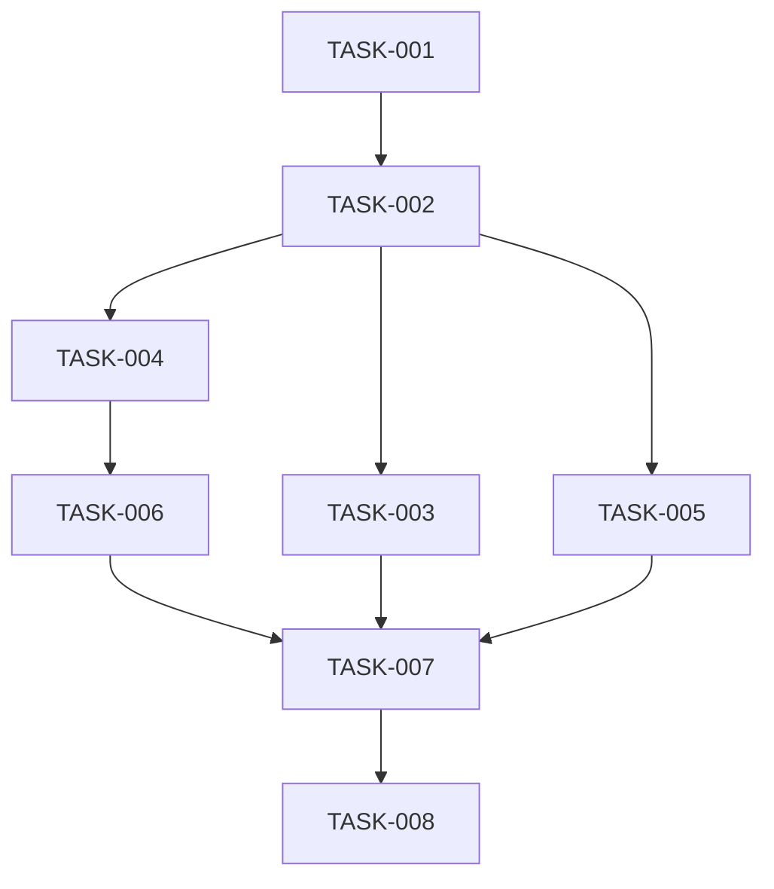

# タスク分解書 - Hello World Python System

## 🎯 CTO・人事部によるタスク管理

### 1. タスク一覧

| タスクID | タスク名 | 担当者 | 優先度 | 見積時間 | 状態 |
|----------|---------|--------|--------|----------|------|
| TASK-001 | プロジェクトディレクトリ作成 | 伊藤浩（バックエンド） | 高 | 5分 | 未着手 |
| TASK-002 | Python仮想環境（venv）作成 | 伊藤浩（バックエンド） | 高 | 5分 | 未着手 |
| TASK-003 | requirements.txt作成 | 小林誠（バックエンド） | 中 | 5分 | 未着手 |
| TASK-004 | main.py実装 | 田中太郎（バックエンド） | 高 | 10分 | 未着手 |
| TASK-005 | README.md作成 | 高橋真理（フロントエンド） | 中 | 10分 | 未着手 |
| TASK-006 | 単体テスト実行 | 佐藤優子（QA） | 高 | 10分 | 未着手 |
| TASK-007 | 統合テスト実行 | 鈴木翔（QA） | 高 | 10分 | 未着手 |
| TASK-008 | 最終動作確認 | 全員 | 高 | 5分 | 未着手 |

### 2. 詳細タスク定義

#### TASK-001: プロジェクトディレクトリ作成
**担当**: 伊藤浩
```bash
mkdir hello_world_python
cd hello_world_python
```
**完了条件**: ディレクトリが作成され、移動できること

#### TASK-002: Python仮想環境（venv）作成
**担当**: 伊藤浩
```bash
python -m venv venv
# Windows: venv\Scripts\activate
# Linux/Mac: source venv/bin/activate
```
**完了条件**: venv環境が有効化されること

#### TASK-003: requirements.txt作成
**担当**: 小林誠
```txt
# 依存パッケージなし（標準ライブラリのみ使用）
```
**完了条件**: ファイルが作成されること

#### TASK-004: main.py実装
**担当**: 田中太郎
```python
#!/usr/bin/env python3
# -*- coding: utf-8 -*-
"""
Hello World Python System
階層型エージェントシステムによる実装
"""

def main():
    """メイン関数"""
    print("Hello world")

if __name__ == "__main__":
    main()
```
**完了条件**: スクリプトが作成され、構文エラーがないこと

#### TASK-005: README.md作成
**担当**: 高橋真理
```markdown
# Hello World Python System

## 概要
階層型エージェントシステムによって開発されたHello Worldアプリケーション

## セットアップ
1. Python仮想環境を有効化
   - Windows: `venv\Scripts\activate`
   - Linux/Mac: `source venv/bin/activate`

2. 実行
   ```bash
   python main.py
   ```

## 出力
```
Hello world
```
```
**完了条件**: ドキュメントが完成すること

#### TASK-006: 単体テスト実行
**担当**: 佐藤優子
- main.py の構文チェック
- 関数の動作確認
- エンコーディング確認
**完了条件**: エラーなく実行できること

#### TASK-007: 統合テスト実行
**担当**: 鈴木翔
- venv環境での実行確認
- 出力内容の確認
- 終了コードの確認
**完了条件**: 要件通りの動作を確認

#### TASK-008: 最終動作確認
**担当**: 全員
- ユーザー視点での動作確認
- ドキュメントの最終チェック
**完了条件**: リリース可能状態

### 3. タスク依存関係



### 4. スケジュール

| 時間 | 実施内容 | 担当 |
|------|---------|------|
| 0:00-0:05 | 環境準備（TASK-001, 002） | 伊藤浩 |
| 0:05-0:10 | ファイル作成（TASK-003, 004） | 小林誠、田中太郎 |
| 0:10-0:15 | ドキュメント作成（TASK-005） | 高橋真理 |
| 0:15-0:25 | テスト実行（TASK-006, 007） | 佐藤優子、鈴木翔 |
| 0:25-0:30 | 最終確認（TASK-008） | 全員 |

**総所要時間**: 約30分

### 5. リスク管理

| リスク | 対策 | 責任者 |
|--------|------|--------|
| Python未インストール | 事前確認 | 伊藤浩 |
| venv作成失敗 | 代替手段準備 | 伊藤浩 |
| テスト失敗 | デバッグ体制 | 佐藤優子 |

### 6. 成果物

1. **ソースコード**
   - main.py
   - requirements.txt

2. **ドキュメント**
   - README.md
   - 仕様書一式（specs/new/hello_world_project/）

3. **環境**
   - venv仮想環境

### 7. 承認

- **タスク承認者**: CTO
- **リソース承認**: 人事部
- **品質承認**: 品質保証部

---
*作成者: CTO・人事部 - 階層型エージェントシステム v8.7*
*担当調整: プロジェクトコーディネーター*