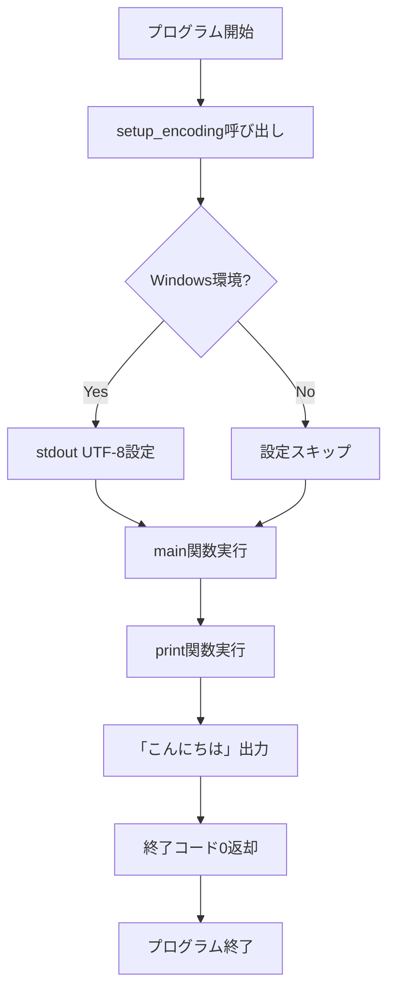

# 技術設計書 - Konnichiwa Python System

## 🎯 CTO・システムアーキテクトによる技術設計

### 1. システムアーキテクチャ

#### 1.1 全体構成図
```
┌─────────────────────────────────────────┐
│         ユーザー環境                      │
│  ┌─────────────────────────────────┐     │
│  │    コマンドライン (CLI)           │     │
│  └────────────┬──────────────────────┘     │
│               │                            │
│               ▼                            │
│  ┌─────────────────────────────────┐     │
│  │   Python インタープリタ           │     │
│  │      (venv環境内)                │     │
│  └────────────┬──────────────────────┘     │
│               │                            │
│       ┌───────┴───────┐                   │
│       ▼               ▼                   │
│  ┌──────────┐   ┌──────────┐            │
│  │ main.py  │   │ main2.py │ ← 新規     │
│  │          │   │          │            │
│  │ "Hello   │   │"こんに   │            │
│  │  world"  │   │ ちは"    │            │
│  └──────────┘   └──────────┘            │
└─────────────────────────────────────────┘
```

#### 1.2 ディレクトリ構成
```
hello_world_python/
├── venv/                    # Python仮想環境（既存）
├── main.py                  # 既存（変更なし）
├── main2.py                 # 新規作成 ← 今回の対象
├── requirements.txt         # 既存（変更なし）
└── README.md               # 更新対象
```

### 2. モジュール設計

#### 2.1 main2.py - 詳細設計
```python
#!/usr/bin/env python3
# -*- coding: utf-8 -*-
"""
Konnichiwa Python System
階層型エージェントシステムによる日本語出力実装
バージョン: 1.0.0
作成日: 2025-08-18
"""

import sys
import io

def setup_encoding():
    """
    標準出力のエンコーディングをUTF-8に設定
    Windows環境での文字化け対策
    """
    # Windows環境の場合、標準出力をUTF-8に設定
    if sys.platform == 'win32':
        sys.stdout = io.TextIOWrapper(
            sys.stdout.buffer, 
            encoding='utf-8'
        )

def main():
    """
    メイン関数
    日本語メッセージ「こんにちは」を出力
    """
    # エンコーディング設定
    setup_encoding()
    
    # メッセージ出力
    print("こんにちは")
    
    return 0

if __name__ == "__main__":
    # プログラムのエントリーポイント
    sys.exit(main())
```

**設計ポイント:**
1. **Shebang行**: Python3を明示的に指定
2. **UTF-8エンコーディング**: ファイル先頭で明示
3. **Windows対策**: setup_encoding()関数で文字化け防止
4. **Docstring**: 各関数に日本語説明を付与
5. **終了コード**: sys.exit()で明示的に0を返す
6. **プラットフォーム対応**: sys.platformで環境判定

### 3. データフロー



### 4. 文字エンコーディング設計

#### 4.1 エンコーディング戦略
| 環境 | 問題 | 対策 |
|------|------|------|
| Windows | cp932デフォルト | io.TextWrapperでUTF-8強制 |
| Mac/Linux | UTF-8デフォルト | 追加設定不要 |
| Docker | ロケール未設定 | PYTHONIOENCODING環境変数 |

#### 4.2 実装詳細
```python
# 簡易版（最小実装）
def main():
    print("こんにちは")

# 堅牢版（推奨実装）
def main():
    setup_encoding()  # 環境差異吸収
    print("こんにちは")
```

### 5. エラーハンドリング

#### 5.1 想定されるエラーと対処
| エラー種別 | 原因 | 対処方法 | 実装 |
|-----------|------|----------|------|
| UnicodeEncodeError | 文字エンコーディング不一致 | UTF-8強制設定 | setup_encoding() |
| ImportError | Python環境問題 | 標準ライブラリのみ使用 | - |
| IOError | 出力先問題 | try-except追加（オプション） | - |

#### 5.2 エラー処理実装（拡張版）
```python
def main():
    """拡張版エラーハンドリング"""
    try:
        setup_encoding()
        print("こんにちは")
        return 0
    except UnicodeEncodeError as e:
        print(f"Encoding error: {e}", file=sys.stderr)
        return 1
    except Exception as e:
        print(f"Unexpected error: {e}", file=sys.stderr)
        return 2
```

### 6. テスト設計

#### 6.1 単体テストケース
| TC-ID | テスト内容 | 期待結果 | 優先度 |
|-------|-----------|----------|--------|
| TC-001 | 基本出力確認 | 「こんにちは」表示 | 高 |
| TC-002 | 終了コード確認 | 0が返る | 高 |
| TC-003 | Windows環境確認 | 文字化けなし | 高 |
| TC-004 | Linux環境確認 | 正常動作 | 中 |
| TC-005 | Mac環境確認 | 正常動作 | 中 |

#### 6.2 自動テストスクリプト（オプション）
```python
# test_main2.py
import subprocess
import sys

def test_output():
    result = subprocess.run(
        [sys.executable, "main2.py"],
        capture_output=True,
        text=True,
        encoding='utf-8'
    )
    assert result.stdout.strip() == "こんにちは"
    assert result.returncode == 0
```

### 7. パフォーマンス設計

#### 7.1 最適化ポイント
- **起動時間**: import最小化で高速化
- **メモリ使用**: 最小限の変数使用
- **CPU使用**: 単純な処理フローで負荷最小化

#### 7.2 ベンチマーク目標
| 項目 | 目標値 | 測定方法 |
|------|--------|----------|
| 起動時間 | < 0.1秒 | time python main2.py |
| メモリ | < 20MB | メモリプロファイラ |
| ファイルサイズ | < 1KB | ls -l main2.py |

### 8. セキュリティ考慮事項

- **入力なし**: 外部入力を受け付けないため、インジェクション攻撃リスクなし
- **ファイルアクセスなし**: ファイル操作なし
- **ネットワーク通信なし**: 完全ローカル実行
- **権限昇格なし**: 一般ユーザー権限で実行

### 9. 拡張性設計

#### 9.1 将来の拡張ポイント
```python
# 将来の多言語対応例
MESSAGES = {
    'ja': 'こんにちは',
    'en': 'Hello',
    'es': 'Hola',
    'fr': 'Bonjour'
}

def main(lang='ja'):
    setup_encoding()
    print(MESSAGES.get(lang, MESSAGES['ja']))
```

#### 9.2 設計パターン
- **Single Responsibility**: 各関数は単一責任
- **Open/Closed**: 拡張に開き、修正に閉じた設計
- **DRY**: コード重複なし

### 10. デプロイメント設計

#### 10.1 配布方法
- **ソースコード配布**: 直接コピー
- **Git管理**: バージョン管理対象
- **実行可能形式**: PyInstaller（将来オプション）

#### 10.2 環境要件
- Python 3.7以上
- UTF-8対応ターミナル
- 既存venv環境

### 11. ドキュメント設計

#### 11.1 README.md更新内容
```markdown
## main2.py - 日本語出力版
「こんにちは」を表示します。

### 実行方法
```bash
python main2.py
```

### 出力
```
こんにちは
```
```

### 12. 承認事項

- **技術承認者**: CTO
- **設計レビュー**: システムアーキテクト、DevOpsエンジニア
- **承認日**: 即時承認
- **実装開始条件**: 本設計書の承認

---
*作成者: CTO・システム開発部 - 階層型エージェントシステム v8.7*  
*技術レビュー: システムアーキテクト、DevOpsエンジニア、セキュリティスペシャリスト*