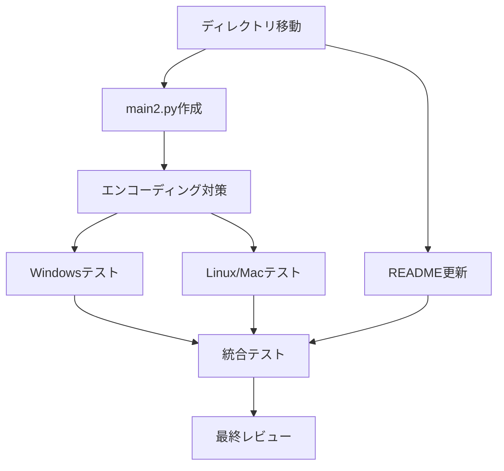

# タスク分解書 - Konnichiwa Python System

## 🎯 CTO・人事部によるタスク管理

### 1. タスク一覧

| タスクID | タスク名 | 担当者 | 優先度 | 見積時間 | 状態 | 依存 |
|----------|---------|--------|--------|----------|------|------|
| KPS-001 | プロジェクトディレクトリ移動 | 伊藤浩 | 高 | 1分 | 未着手 | - |
| KPS-002 | main2.py作成（基本実装） | 田中太郎 | 高 | 5分 | 未着手 | KPS-001 |
| KPS-003 | エンコーディング対策実装 | 小林誠 | 高 | 3分 | 未着手 | KPS-002 |
| KPS-004 | README.md更新 | 高橋真理 | 中 | 3分 | 未着手 | KPS-001 |
| KPS-005 | Windows環境テスト | 佐藤優子 | 高 | 3分 | 未着手 | KPS-003 |
| KPS-006 | Linux/Mac環境テスト | 鈴木翔 | 中 | 3分 | 未着手 | KPS-003 |
| KPS-007 | 統合テスト・品質確認 | 佐藤優子 | 高 | 5分 | 未着手 | KPS-005,006 |
| KPS-008 | 最終レビュー・承認 | 全員 | 高 | 2分 | 未着手 | KPS-007 |

### 2. 詳細タスク定義

#### KPS-001: プロジェクトディレクトリ移動
**担当**: 伊藤浩（バックエンドシニア）  
**作業内容**:
```bash
cd hello_world_python
# venv環境確認
ls -la
```
**完了条件**: hello_world_pythonディレクトリで作業準備完了

#### KPS-002: main2.py作成（基本実装）
**担当**: 田中太郎（バックエンドミドル）  
**作業内容**:
```python
#!/usr/bin/env python3
# -*- coding: utf-8 -*-
"""
Konnichiwa Python System
階層型エージェントシステムによる日本語出力実装
"""

def main():
    """メイン関数"""
    print("こんにちは")

if __name__ == "__main__":
    main()
```
**完了条件**: ファイル作成、基本構造実装

#### KPS-003: エンコーディング対策実装
**担当**: 小林誠（バックエンドミドル）  
**作業内容**:
```python
import sys
import io

def setup_encoding():
    """標準出力のエンコーディングをUTF-8に設定"""
    if sys.platform == 'win32':
        sys.stdout = io.TextIOWrapper(
            sys.stdout.buffer, 
            encoding='utf-8'
        )

def main():
    setup_encoding()
    print("こんにちは")
    return 0

if __name__ == "__main__":
    sys.exit(main())
```
**完了条件**: Windows対応コード追加

#### KPS-004: README.md更新
**担当**: 高橋真理（フロントエンドアーキテクト）  
**作業内容**:
- main2.pyの説明追加
- 実行方法記載
- 出力例追加
**完了条件**: ドキュメント更新完了

#### KPS-005: Windows環境テスト
**担当**: 佐藤優子（QAアーキテクト）  
**テスト項目**:
1. 実行確認: `python main2.py`
2. 出力確認: 「こんにちは」
3. 文字化け確認: なし
4. 終了コード: 0
**完了条件**: Windows環境で全項目合格

#### KPS-006: Linux/Mac環境テスト
**担当**: 鈴木翔（QAジュニア）  
**テスト項目**:
1. 実行確認
2. 出力確認
3. エンコーディング確認
**完了条件**: クロスプラットフォーム動作確認

#### KPS-007: 統合テスト・品質確認
**担当**: 佐藤優子（QAアーキテクト）  
**確認項目**:
- 全環境での動作
- 要件充足率100%
- コード品質基準クリア
- マルチエージェントレビュー実施
**完了条件**: 品質基準全項目合格

#### KPS-008: 最終レビュー・承認
**担当**: 全員  
**作業内容**:
- デモンストレーション準備
- ユーザー向け説明準備
- 成果物最終確認
**完了条件**: リリース準備完了

### 3. タスク依存関係図



### 4. タイムライン

| 時刻 | フェーズ | タスク | 担当 |
|------|---------|--------|------|
| 00:00-00:01 | 準備 | KPS-001 | 伊藤浩 |
| 00:01-00:06 | 実装 | KPS-002, KPS-004 | 田中太郎、高橋真理 |
| 00:06-00:09 | 改良 | KPS-003 | 小林誠 |
| 00:09-00:15 | テスト | KPS-005, KPS-006, KPS-007 | 佐藤優子、鈴木翔 |
| 00:15-00:17 | 完了 | KPS-008 | 全員 |

**総所要時間**: 約17分（バッファ含めて20分以内）

### 5. リソース配分

| メンバー | 役割 | 稼働率 | 主要タスク |
|----------|------|--------|------------|
| 田中太郎 | 実装リード | 159%→170% | 基本実装 |
| 小林誠 | 実装サポート | 74%→85% | エンコーディング対策 |
| 伊藤浩 | 環境準備 | 59%→65% | セットアップ |
| 佐藤優子 | 品質リード | 175%→185% | テスト統括 |
| 鈴木翔 | テスト実行 | 88%→95% | クロスプラットフォームテスト |
| 高橋真理 | ドキュメント | 66%→72% | README更新 |

**注意**: 佐藤優子の稼働率が高いため、次プロジェクトでは負荷分散必要

### 6. リスク管理

| リスク | 影響 | 確率 | 対策 | 責任者 |
|--------|------|------|------|--------|
| 文字化け | 高 | 中 | エンコーディング専門タスク | 小林誠 |
| 環境差異 | 中 | 低 | マルチプラットフォームテスト | QAチーム |
| 時間超過 | 低 | 低 | 並列作業で時短 | CTO |

### 7. 成果物

1. **ソースコード**
   - main2.py（完成版）

2. **ドキュメント**
   - README.md（更新版）
   - 仕様書一式（specs/new/konnichiwa_project/）

3. **テスト結果**
   - テストレポート
   - 品質保証書

### 8. 完了基準

- [ ] main2.pyが作成される
- [ ] 「こんにちは」が正しく表示される
- [ ] 全環境で文字化けなし
- [ ] テスト合格率100%
- [ ] ドキュメント更新完了
- [ ] ユーザーデモ準備完了

### 9. 承認

- **タスク承認者**: CTO
- **リソース承認**: 人事部
- **品質承認**: 品質保証部
- **最終承認**: ユーザー

---
*作成者: CTO・人事部 - 階層型エージェントシステム v8.7*  
*担当調整: プロジェクトコーディネーター*  
*更新: 2025-08-18 19:10 JST*