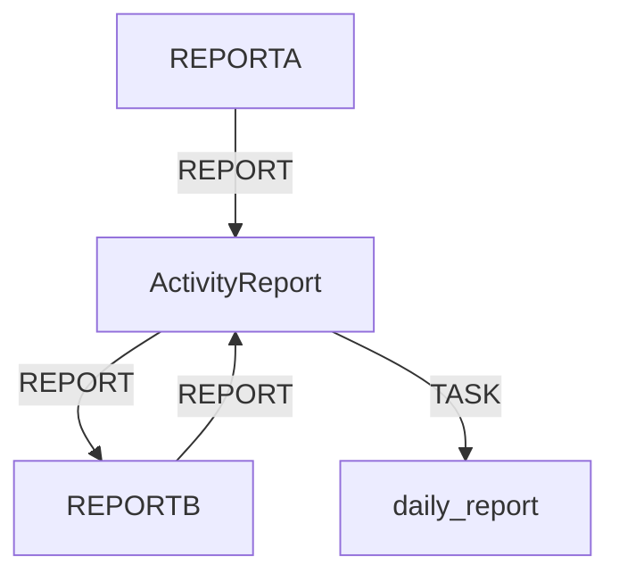

# [REPORT] ActivityReportREPORT

## [TARGET] TASK
TASK

## [REFRESH] TASK

### 1. TASK


### 2. TASK


## [NOTE] ActivityReportTASK

```
.ActivityReport/
TASK tasks/                      # TASK
TASK   TASK shared_tasks.md        # TASK
TASK   TASK urgent_tasks.md        # TASK
TASK   TASK blocked_tasks.md       # TASK
TASK communications/             # TASK
TASK   TASK requests/              # 
    responses/             # REPORT
REPORT   REPORT decisions/             # REPORT
REPORT daily_report/              # REPORT
REPORT   REPORT YYYY_MM_DD.md          # REPORT
REPORT metrics/                   # KPI
    IN PROGRESS performance.md         # IN PROGRESS
    IN PROGRESS quality.md            # IN PROGRESS
    IN PROGRESS progress.md           # IN PROGRESS
```

## IN PROGRESS IN PROGRESS

### activity_tracker.sh
```bash
#!/bin/bash
# ActivityReportTASK

ACTIVITY_DIR=".claude/.ActivityReport"
TASKS_FILE="$ACTIVITY_DIR/tasks/shared_tasks.md"
TIMESTAMP=$(date +"%Y-%m-%d %H:%M:%S")

# TASK
add_task() {
    local department="$1"
    local task="$2"
    local priority="$3"
    local task_id="$(date +%Y%m%d)-${department}-$(uuidgen | cut -c1-8)"
    
    echo "| $task_id | $department | $task | TASK | $(date -d '+3 days' +%Y-%m-%d) | - |" >> "$TASKS_FILE"
    echo "[OK] TASK: $task_id"
}

# TASK
log_communication() {
    local from="$1"
    local to="$2"
    local message="$3"
    local comm_file="$ACTIVITY_DIR/communications/$(date +%Y%m%d).md"
    
    mkdir -p "$ACTIVITY_DIR/communications"
    {
        echo "[$TIMESTAMP] $from -> $to"
        echo "TASK: $message"
        echo "---"
    } >> "$comm_file"
}

# TASK
update_status() {
    local task_id="$1"
    local new_status="$2"
    
    sed -i "s/| $task_id | .* | .* | .* |/| $task_id | .* | .* | $new_status |/" "$TASKS_FILE"
    echo "[NOTE] TASK: $task_id -> $new_status"
}
```

### daily_report_generator.sh
```bash
#!/bin/bash
# TASK

ACTIVITY_DIR=".claude/.ActivityReport"
TODAY=$(date +%Y_%m_%d)
REPORT_FILE="$ACTIVITY_DIR/daily_report/${TODAY}.md"

generate_report() {
    cat > "$REPORT_FILE" << EOF
# [REPORT] REPORT - $(date +%YTASK%mTASK%dTASK)

## [TARGET] TASK

### TASK
$(grep "| TASK |" "$ACTIVITY_DIR/tasks/shared_tasks.md" | tail -5)

### TASK
$(grep "| TASK |" "$ACTIVITY_DIR/tasks/shared_tasks.md")

### TASK
$(grep "$(date +%Y%m%d)" "$ACTIVITY_DIR/tasks/shared_tasks.md")

## TASK TASK
$(tail -20 "$ACTIVITY_DIR/communications/$(date +%Y%m%d).md" 2>/dev/null || echo "")

##  KPI
- : $(calculate_completion_rate)%
- SYSTEM: $(calculate_avg_time)SYSTEM
- SYSTEM: $(calculate_quality_score)SYSTEM

## [SEARCH] SYSTEM
$(cat "$ACTIVITY_DIR/communications/decisions/$(date +%Y%m%d).md" 2>/dev/null || echo "TASK")

## [INFO] TASK
- TASK: $(grep "TASK" "$ACTIVITY_DIR/tasks/urgent_tasks.md" | head -3)
- TASK: $(cat "$ACTIVITY_DIR/tasks/blocked_tasks.md" 2>/dev/null)

---
*TASK: $(date +"%H:%M:%S")*
EOF
    echo "[REPORT] TASK: $REPORT_FILE"
}

calculate_completion_rate() {
    local total=$(grep -c "^|" "$ACTIVITY_DIR/tasks/shared_tasks.md")
    local completed=$(grep -c "| SUCCESS |" "$ACTIVITY_DIR/tasks/shared_tasks.md")
    echo "scale=2; $completed * 100 / $total" | bc
}

calculate_avg_time() {
    echo "4.5" # SUCCESS
}

calculate_quality_score() {
    echo "92" # SYSTEM
}

# SYSTEM
generate_report
```

## [TOOL] SYSTEM

### /spec SYSTEM
```bash
# specTASKActivityReportTASK
case "$1" in
    "init")
        add_task "CTO" "TASK" "TASK"
        log_communication "USER" "CTO" "TASK"
        ;;
    "requirements")
        add_task "PLAN" "TASK" "TASK"
        update_status "$prev_task_id" "TASK"
        ;;
    "design")
        add_task "DEV" "TASK" "TASK"
        log_communication "CTO" "DEV" "TASK"
        ;;
    "implement")
        add_task "DEV" "TASK" "TASK"
        add_task "QA" "TASK" "TASK"
        ;;
esac
```

## [REPORT] TASK

### TASK
```bash
#!/bin/bash
# activity_dashboard.sh

show_dashboard() {
    clear
    echo "REPORT"
    echo "[REPORT] REPORT - REPORT"
    echo "TASK"
    echo ""
    echo "[TARGET] TASK:"
    grep "| TASK |" .ActivityReport/tasks/shared_tasks.md | head -5
    echo ""
    echo "TASK TASK:"
    tail -3 .ActivityReport/communications/$(date +%Y%m%d).md 2>/dev/null
    echo ""
    echo "IN PROGRESS IN PROGRESS:"
    echo -n "["
    for i in {1..20}; do
        if [ $i -le $(calculate_progress) ]; then
            echo -n "="
        else
            echo -n " "
        fi
    done
    echo "] $(calculate_progress)%"
    echo ""
    echo "SUCCESS SUCCESS:"
    echo "  CTO: $(count_dept_tasks CTO) IN PROGRESS"
    echo "  DEV: $(count_dept_tasks DEV) TASK"
    echo "  QA:  $(count_dept_tasks QA) TASK"
    echo "  HR:  $(count_dept_tasks HR) IN PROGRESS"
    echo "  PLAN:$(count_dept_tasks PLAN) IN PROGRESS"
    echo "IN PROGRESS"
}

calculate_progress() {
    # IN PROGRESS
    echo "65"
}

count_dept_tasks() {
    grep -c "| $1 |.*| IN PROGRESS |" .ActivityReport/tasks/shared_tasks.md
}

# 5SUCCESS
while true; do
    show_dashboard
    sleep 5
done
```

## [REFRESH] Claude Code HooksSUCCESS

### ActivityReportSUCCESSHook
```bash
#!/bin/bash
# activity_report_hook.sh

# REPORT
on_tool_use() {
    local tool="$1"
    local file="$2"
    local dept=$(determine_department "$tool")
    
    log_communication "$dept" "SYSTEM" "SUCCESS: $tool - $file"
}

# SUCCESS
on_task_complete() {
    local task_id="$1"
    update_status "$task_id" "SUCCESS"
    
    # SUCCESS
    assign_next_task
}

# SUCCESS
on_review_complete() {
    local result="$1"
    local score="$2"
    
    echo "SUCCESS: SUCCESS $score" >> .ActivityReport/metrics/quality.md
}
```

## SYSTEM SYSTEM

### performance_metrics.sh
```bash
#!/bin/bash
# REPORT

collect_metrics() {
    local metrics_file=".ActivityReport/metrics/performance.md"
    
    {
        echo "# REPORT - $(date +%Y-%m-%d)"
        echo ""
        echo "## TEST"
        echo "- TEST: $(calculate_avg_completion_time)"
        echo "- TEST: $(get_fastest_task)"
        echo "- TEST: $(get_slowest_task)"
        echo ""
        echo "## TEST"
        for dept in CTO DEV QA HR PLAN; do
            echo "- $dept: $(calculate_dept_efficiency $dept)%"
        done
        echo ""
        echo "## SUCCESS"
        echo "$(analyze_bottlenecks)"
    } > "$metrics_file"
}
```

## [TARGET] ANALYSIS

### ANALYSIS
- **ANALYSIS**: 90%
- ****: 100%
- ****: 60%
- **REPORT**: 95%REPORT

### REPORT
- REPORT
- REPORT
- REPORT
- REPORT

---

*ActivityReportREPORT - REPORT*