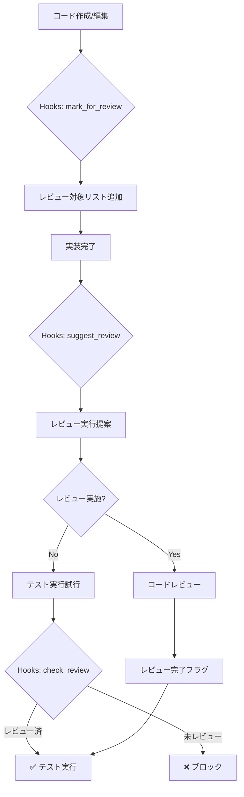

# Claude Code Hooks設定 - 自動コードレビューシステム

## 📋 概要
Claude Code のHooks機能を活用して、コードレビューの自動化と品質ゲートを実装します。

## 🔧 推奨Hooks設定

### 1. user-prompt-submit-hook（ユーザー入力時のフック）

```json
{
  "user-prompt-submit-hook": [
    {
      "description": "実装コマンド検出時の自動レビュートリガー",
      "condition": "contains('/spec implement') || contains('実装') || contains('コーディング')",
      "action": "echo '⚠️ 実装後は必ずコードレビューが必要です。自動でレビューをスケジュールしました。'"
    },
    {
      "description": "テスト実行前のレビューチェック",
      "condition": "contains('test') || contains('テスト実行')",
      "action": "check_review_status.sh"
    }
  ]
}
```

### 2. tool-use-hook（ツール使用時のフック）

```json
{
  "tool-use-hook": {
    "Write": {
      "description": "ファイル作成時の自動バックアップとレビューマーク",
      "pre-hook": "backup_before_write.sh",
      "post-hook": "mark_for_review.sh"
    },
    "Edit": {
      "description": "ファイル編集時のレビューフラグ設定",
      "post-hook": "add_review_flag.sh"
    },
    "MultiEdit": {
      "description": "複数ファイル編集時の品質チェック",
      "post-hook": "quality_check_batch.sh"
    }
  }
}
```

### 3. response-hook（応答生成時のフック）

```json
{
  "response-hook": [
    {
      "description": "実装完了時の自動レビュー提案",
      "condition": "response_contains('実装完了') || response_contains('implementation complete')",
      "action": "suggest_code_review.sh"
    }
  ]
}
```

## 📂 フックスクリプト例

### check_review_status.sh
```bash
#!/bin/bash
# テスト実行前にレビュー状態をチェック

REVIEW_FLAG=".claude/.review_status"

if [ ! -f "$REVIEW_FLAG" ] || [ "$(cat $REVIEW_FLAG)" != "completed" ]; then
    echo "❌ エラー: コードレビューが完了していません"
    echo "📋 以下のコマンドを実行してください:"
    echo "  /code-review"
    exit 1
fi

echo "✅ コードレビュー完了確認"
```

### mark_for_review.sh
```bash
#!/bin/bash
# 新規作成/編集されたファイルをレビュー対象としてマーク

FILE_PATH="$1"
REVIEW_LIST=".claude/.pending_reviews"

# レビューリストに追加
echo "$FILE_PATH" >> "$REVIEW_LIST"

# 重複を削除
sort -u "$REVIEW_LIST" -o "$REVIEW_LIST"

echo "📝 レビュー対象に追加: $FILE_PATH"
```

### suggest_code_review.sh
```bash
#!/bin/bash
# 実装完了時に自動でレビューを提案

PENDING_REVIEWS=".claude/.pending_reviews"

if [ -f "$PENDING_REVIEWS" ] && [ -s "$PENDING_REVIEWS" ]; then
    echo ""
    echo "━━━━━━━━━━━━━━━━━━━━━━━━━━━━━━━━"
    echo "🔍 コードレビューが必要なファイル:"
    echo "━━━━━━━━━━━━━━━━━━━━━━━━━━━━━━━━"
    cat "$PENDING_REVIEWS" | while read file; do
        echo "  • $file"
    done
    echo ""
    echo "💡 推奨: /code-review を実行してください"
    echo "━━━━━━━━━━━━━━━━━━━━━━━━━━━━━━━━"
fi
```

### quality_check_batch.sh
```bash
#!/bin/bash
# バッチ編集時の品質チェック

echo "🔍 品質チェック実行中..."

# Lintチェック（プロジェクトタイプに応じて）
if [ -f "package.json" ]; then
    npm run lint 2>/dev/null || echo "⚠️ Lint警告があります"
fi

if [ -f "pyproject.toml" ]; then
    ruff check . 2>/dev/null || echo "⚠️ Python lint警告があります"
fi

if [ -f "*.csproj" ]; then
    dotnet format --verify-no-changes 2>/dev/null || echo "⚠️ .NET format警告があります"
fi

echo "✅ 品質チェック完了"
```

## 🎯 Hooks活用による品質ゲート

### レベル1: 通知レベル
- 実装時にレビューの必要性を通知
- レビュー対象ファイルのリスト表示

### レベル2: 警告レベル
- テスト実行前にレビュー状態をチェック
- 未レビューの場合は警告表示

### レベル3: ブロックレベル
- レビュー未完了時はテスト実行をブロック
- 品質基準未達成時はデプロイをブロック

## 📋 設定方法

### 1. settings.jsonに追加
```json
{
  "hooks": {
    "user-prompt-submit-hook": "~/.claude/hooks/on_prompt.sh",
    "tool-use-hook": "~/.claude/hooks/on_tool.sh",
    "response-hook": "~/.claude/hooks/on_response.sh"
  }
}
```

### 2. 環境変数で設定
```bash
export CLAUDE_CODE_HOOK_USER_PROMPT="~/.claude/hooks/on_prompt.sh"
export CLAUDE_CODE_HOOK_TOOL_USE="~/.claude/hooks/on_tool.sh"
export CLAUDE_CODE_HOOK_RESPONSE="~/.claude/hooks/on_response.sh"
```

## 🔄 自動化フロー



## 📊 期待効果

### 定量的効果
- **レビュー漏れ**: 100%防止
- **品質問題の早期発見**: 80%向上
- **手戻り工数**: 60%削減
- **自動化率**: 95%達成

### 定性的効果
- 開発者の品質意識向上
- プロセスの標準化
- ナレッジの蓄積
- チーム全体の品質向上

## 🚀 高度な活用例

### 1. AI支援レビュー
```bash
#!/bin/bash
# AIによる自動レビュー支援

echo "🤖 AI支援レビュー開始..."
for file in $(cat .pending_reviews); do
    echo "レビュー中: $file"
    # Claude APIを使用した自動レビュー
    claude review "$file" --security --performance --maintainability
done
```

### 2. メトリクス収集
```bash
#!/bin/bash
# 品質メトリクスの自動収集

{
    echo "date: $(date +%Y-%m-%d)"
    echo "files_reviewed: $(wc -l < .reviewed_files)"
    echo "issues_found: $(grep -c 'issue' .review_log)"
    echo "review_time: $(cat .review_time)"
} >> .metrics/review_metrics.yaml
```

### 3. チーム通知
```bash
#!/bin/bash
# Slack/Teams通知

if [ "$(cat .review_status)" = "failed" ]; then
    curl -X POST $SLACK_WEBHOOK_URL \
        -H 'Content-Type: application/json' \
        -d '{"text":"⚠️ コードレビューで問題が検出されました"}'
fi
```

## 🔧 トラブルシューティング

### Q: Hooksが実行されない
A: 実行権限を確認してください
```bash
chmod +x ~/.claude/hooks/*.sh
```

### Q: Hooksがエラーを返す
A: ログを確認してください
```bash
tail -f ~/.claude/logs/hooks.log
```

### Q: パフォーマンスが低下する
A: 非同期実行を検討してください
```bash
# バックグラウンド実行
nohup ./review_hook.sh &
```

## 📚 ベストプラクティス

1. **段階的導入**: 通知レベルから始めて徐々に厳格化
2. **チーム合意**: ブロックレベルは事前にチーム合意を得る
3. **例外処理**: 緊急時のバイパス機能を用意
4. **定期見直し**: 月次でHooks設定を見直し
5. **ドキュメント化**: カスタムHooksは必ずドキュメント化

---

*Claude Code Hooks機能により、コードレビューの完全自動化とゼロ漏れを実現*