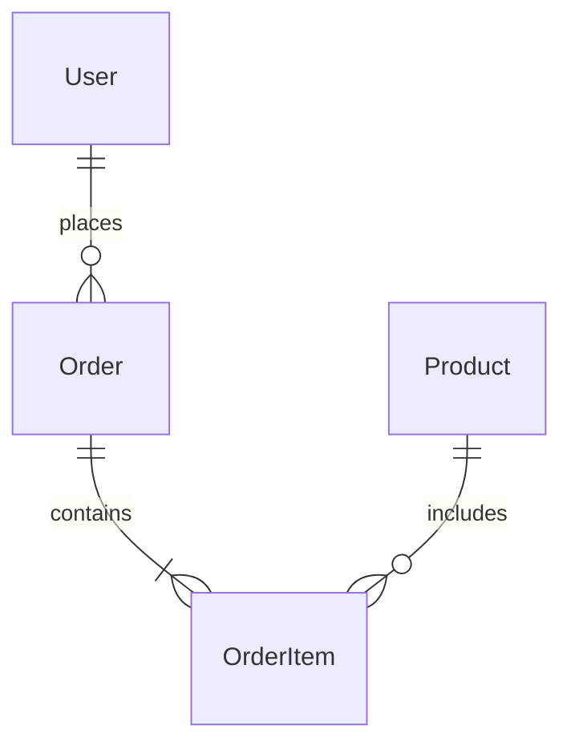

# /design - 

## 


## 
```
/design []
```

### 
- `architecture` - 
- `database` - 
- `api` - API
- `security` - 
- `all` - 

## 

### 1. 


#### 
- 
- 
- 
- 

### 2. 


#### 
- ****: 
- ****: 
- ****: 
- ****: 
- ****: 

### 3. 
3

#### 
- 
- SOLIDDRYKISS
- DDD

## 

```markdown
#  - []

## 1. 
### 1.1 
```mermaid
graph TB
    subgraph ""
        UI[]
    end
    
    subgraph ""
        API[API]
        BL[]
    end
    
    subgraph ""
        DB[()]
        Cache[()]
    end
    
    UI --> API
    API --> BL
    BL --> DB
    BL --> Cache
```

### 1.2 
|  |  |  |  |
|---------|------|------------|---------|
|  | | | |
|  | | | |
|  | | | |
|  | | | |

## 2. 
### 2.1 
- 
- 
- 

### 2.2 SYSTEM
```
project/
SYSTEM src/
SYSTEM   SYSTEM api/          # APISYSTEM
SYSTEM   SYSTEM domain/       # SYSTEM
SYSTEM   SYSTEM application/  # TEST
TEST   TEST infrastructure/ # TEST
TEST   TEST presentation/ # TEST
TEST tests/            # TEST
TEST docs/             # TEST
```

### 2.3 TEST
| TEST | TEST |  |
|---------------|------|----------|
| | | |

## 3. 
### 3.1 ER


### 3.2 
#### users 
|  |  |  |  |
|---------|-----|------|------|
| id | BIGINT | PK, AUTO_INCREMENT | ID |
| email | VARCHAR(255) | UNIQUE, NOT NULL |  |
| created_at | TIMESTAMP | NOT NULL |  |

### 3.3 
|  |  |  |  |
|---------|---------------|--------|------|
| | | | |

## 4. API
### 4.1 
|  |  |  |  |
|---------|------|------|------|
| GET | /api/v1/users |  |  |
| POST | /api/v1/users |  |  |

### 4.2 /
#### POST /api/v1/users
**SUCCESS**
```json
{
  "email": "user@example.com",
  "name": "John Doe",
  "password": "encrypted_password"
}
```

**SUCCESS**
```json
{
  "id": 1,
  "email": "user@example.com",
  "name": "John Doe",
  "created_at": "2025-01-01T00:00:00Z"
}
```

### 4.3 ERROR
| ERROR | ERROR | ERROR |
|-------------|------|-------------|
| 400 | Bad Request | {"error": "Invalid input"} |
| 401 | Unauthorized | {"error": "Authentication required"} |

## 5. ERROR
### 5.1 ERROR
- ERRORJWT
- ERRORRBACERROR
- 24

### 5.2 
- AES-256
- bcrypt
- HTTPS

### 5.3 
|  |  |
|------|------|
| SQL |  |
| XSS |  |
| CSRF | CSRF |

## 6. 
### 6.1 
- Redis
- 
- TTL124

### 6.2 
- 
- N+1
- 

## 7. 
### 7.1 
- /
- 
- Git

### 7.2 
|  |  |  |
|-----------|---------------|--------|
|  | 80% | |
|  | 60% | |
| E2E |  | |

## 8. 
### 8.1 
- //
- CI/CDGitHub Actions / GitLab CI
- Docker

### 8.2 
- APMApplication Performance Monitoring
- 
- 

## 9. 
### 9.1 
- 
- 
- 

## 10. 
|  |  |  |
|--------|--------|------|
| | | |

## 
|  |  |  |  |
|------|------|--------|------|
|  | | | |
|  | | | |
| CTO | | | |

---
: YYYY-MM-DD
: 
: 
REPORT: 1.0
```

## TASK
- `.claude/docs/design/DES_YYYYMMDD_TASK.md`
- TASK `.ActivityReport/tasks/` TASK

## TASK

### TASK
- [ ] TASK
- [ ] TASK
- [ ] TASK
- [ ] TASK
- [ ] 
- [ ] 

## 

|  |  |
|-------------|---------|
|  |  |
|  |  |
| CTO |  |
|  |  |

## 

### 
```bash
/design
# 
/design all
```

### 
```bash
/design architecture
/design database
/design api
/design security
```

## TASK
- `/spec` - TASK
- `/requirements` - TASK
- `/tasks` - TASK
- `/implement` - TASK

## TASK
- TASK
- TASK
- TASK

---

*TASK*