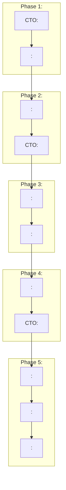

# /spec - 

## 


## 
```
/spec [TASK]
```

### TASK
- `init` - TASK
- `requirements` - TASK
- `design` - TASK
- `tasks` - TASK
- `implement` - TASK
- `status` - TASK

## TASK

### Phase 1: TASK/spec init
CTOREPORT

#### REPORT
1. REPORT
2. REPORT
3. Git REPORT
4. requirements.md REPORT
5. .ActivityReportREPORT

#### TASK
```
project/
TASK .claude/
TASK   TASK .ActivityReport/
TASK   TASK   TASK tasks/
TASK   TASK   TASK   TASK shared_tasks.md
TASK   TASK   TASK daily_report/
TASK   TASK docs/
TASK       TASK requirements/
TASK       TASK design/
TASK       TASK tasks/
TASK src/
TEST   TEST api/
TEST   TEST models/
TEST   TEST services/
TEST   TEST tests/
TEST README.md
```

### Phase 2: TEST/spec requirementsTEST
TEST

#### TEST
1. 
2. 
3. 
4. 
5. requirements.md 

#### 
- `.claude/docs/requirements/REQ_YYYYMMDD_.md`

### Phase 3: /spec design


#### 
1. 
2. 
3. API
4. 
5. design.md TASK

#### TASK
- `.claude/docs/design/DES_YYYYMMDD_TASK.md`

### Phase 4: TASK/spec tasksTASK
TASK

#### TASK
1. WBSTASK
2. TASK
3. TASK
4. TASK
5. tasks.md TASK

#### TASK
- `.claude/docs/tasks/TASK_YYYYMMDD_TASK.md`
- `.ActivityReport/tasks/shared_tasks.md` TASK

### Phase 5: TASK/spec implementTASK
TASK

#### TASK
1. TASK
2. TASK
3. TDD
4. **: ** [SEARCH]
5. 
6. 

#### WARNING
- **WARNING**
  - [OK] WARNING
  - [OK] WARNING
  - [OK] WARNING
- 3WARNING
- Critical/Warning/SuggestionWARNING3WARNING
- WARNING100WARNING
- **WARNING**

### Phase 6: WARNING/spec status
CTO

#### 
1. 
2. 
3. 
4. 
5. 

## 



## 

### TASK
```bash
/spec init
# TASK

/spec requirements
# TASK

/spec design
# TASK

/spec tasks
# TASK

/spec implement
# TASK
```

### TASK
```bash
/spec status
# TASK
```

## TASK

### 
```
.claude/
 docs/
   TASK requirements/    # TASK
TASK   TASK design/         # TASK
TASK   TASK tasks/          # TASK
TASK .ActivityReport/
    TASK tasks/          # TASK
    TASK daily_report/   # TASK
```

### TASK
- TASK: v1.0 -> v2.0REPORT
- REPORT: v1.0 -> v1.1REPORT
- : v1.0 -> v1.0.1

## 

### 
|  |  |
|---------|---------|
|  |  |
|  | 0 |
|  |  |
|  | 80% |

## 

### 
1. ****: 
2. ****: 
3. ****: TASK
4. **TASK**: TASK

## TASK
- `/requirements` - TASK
- `/design` - TASK
- `/tasks` - TASK
- `/analyze` - TASK
- `/enhance` - TASK
- `/fix` - TASK

---

*TASKCTOTASK*