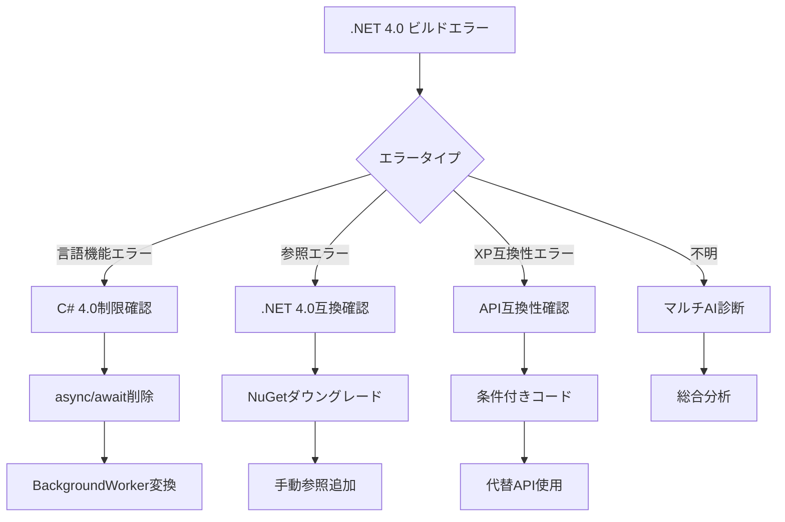

# 🔧 .NET Framework 4.0 ビルドトラブルシューティングガイド

**Windows XP/2003対応・レガシー環境特化・マルチAI協調支援**

## 📋 目次

1. [.NET Framework 4.0 特有の制約](#net-framework-40-特有の制約)
2. [ビルド前の確認事項](#ビルド前の確認事項)
3. [ビルド方法と手順](#ビルド方法と手順)
4. [レガシー環境特有のビルドエラー](#レガシー環境特有のビルドエラー)
5. [マルチAI協調サポート](#マルチai協調サポート)
6. [Windows XP/2003でのトラブルシューティング](#windows-xp2003でのトラブルシューティング)

## .NET Framework 4.0 特有の制約

### ⚠️ 使用不可能な機能
```csharp
// ❌ async/await (4.5で導入)
public async Task<string> GetDataAsync() // コンパイルエラー

// ✅ 代替: BackgroundWorker
private BackgroundWorker worker = new BackgroundWorker();

// ❌ HttpClient (4.5で導入)
using (var client = new HttpClient()) // 型が存在しない

// ✅ 代替: WebClient
using (var client = new WebClient())

// ❌ CallerMemberName (4.5で導入)
void Log([CallerMemberName] string caller = "") // エラー

// ✅ 代替: 手動指定
void Log(string caller)
```

## ビルド前の確認事項

### 🔍 必須チェックリスト

```markdown
□ Visual Studio 2010以降がインストールされている
□ .NET Framework 4.0がインストールされている（Client ProfileではなくFull）
□ Windows SDK 7.1がインストールされている（Windows XP対応に必要）
□ プロジェクトのターゲットフレームワークが正しく設定されている
□ 参照アセンブリがすべて.NET 4.0互換である
□ NuGetパッケージが.NET 4.0対応バージョンである
□ プラットフォームターゲットが適切（x86/x64/Any CPU）
```

## ビルド方法と手順

### 1. Visual Studio でのビルド（推奨）

```powershell
# プロジェクト設定の確認
1. プロジェクトのプロパティを開く
2. アプリケーション → ターゲットフレームワーク: .NET Framework 4
3. ビルド → プラットフォームターゲット: 適切に設定
4. ビルド → 詳細設定 → 言語バージョン: C# 4.0
```

### 2. MSBuild コマンドライン（.NET 4.0）

```cmd
# .NET Framework 4.0 MSBuildパス
C:\Windows\Microsoft.NET\Framework\v4.0.30319\MSBuild.exe

# 基本ビルド
"C:\Windows\Microsoft.NET\Framework\v4.0.30319\MSBuild.exe" YourSolution.sln /p:Configuration=Release /p:TargetFrameworkVersion=v4.0

# 詳細ログ付き
"C:\Windows\Microsoft.NET\Framework\v4.0.30319\MSBuild.exe" YourSolution.sln /v:detailed /fl /flp:logfile=build_net40.log

# Windows XP互換ビルド
"C:\Windows\Microsoft.NET\Framework\v4.0.30319\MSBuild.exe" YourSolution.sln /p:Configuration=Release /p:TargetFrameworkVersion=v4.0 /p:PlatformToolset=v100
```

## レガシー環境特有のビルドエラー

### 🚨 エラーパターン1: C# 言語バージョンエラー

#### エラーメッセージ
```
CS1644: 機能 'async 関数' は ISO-2 C# 言語仕様の一部ではありません
```

#### 解決方法

```xml
<!-- .csprojファイルに追加 -->
<PropertyGroup>
  <LangVersion>4</LangVersion>
</PropertyGroup>
```

**コード修正例:**
```csharp
// ❌ async/await使用
public async Task<string> GetDataAsync()
{
    return await Task.Run(() => "data");
}

// ✅ BackgroundWorker使用
private void GetDataBackground()
{
    var worker = new BackgroundWorker();
    worker.DoWork += (sender, e) => 
    {
        e.Result = "data";
    };
    worker.RunWorkerCompleted += (sender, e) => 
    {
        string result = (string)e.Result;
    };
    worker.RunWorkerAsync();
}
```

### 🚨 エラーパターン2: アセンブリバージョン不一致

#### エラーメッセージ
```
Could not load file or assembly 'System.Net.Http, Version=4.0.0.0'
```

#### 解決方法

1. **app.config でバインディングリダイレクト**
```xml
<configuration>
  <runtime>
    <assemblyBinding xmlns="urn:schemas-microsoft-com:asm.v1">
      <dependentAssembly>
        <assemblyIdentity name="System.Net.Http" publicKeyToken="b03f5f7f11d50a3a" />
        <bindingRedirect oldVersion="0.0.0.0-4.0.0.0" newVersion="2.0.0.0" />
      </dependentAssembly>
    </assemblyBinding>
  </runtime>
</configuration>
```

2. **NuGetパッケージのダウングレード**
```powershell
# Package Manager Console
Uninstall-Package System.Net.Http
Install-Package Microsoft.Net.Http -Version 2.2.29
```

### 🚨 エラーパターン3: Windows XP非互換API

#### エラーメッセージ
```
System.EntryPointNotFoundException: 指定されたプロシージャが見つかりません
```

#### 解決方法

```csharp
// Windows XP互換性チェック
public static class OSCompatibility
{
    public static bool IsWindowsXP()
    {
        OperatingSystem os = Environment.OSVersion;
        return os.Platform == PlatformID.Win32NT && 
               os.Version.Major == 5 && os.Version.Minor == 1;
    }
    
    // 条件付きAPI使用
    public static void UseCompatibleAPI()
    {
        if (IsWindowsXP())
        {
            // Windows XP互換コード
            UseWebClient();
        }
        else
        {
            // 新しいAPIを使用
            UseModernAPI();
        }
    }
}
```

### 🚨 エラーパターン4: NuGetパッケージ互換性

#### エラーメッセージ
```
パッケージ 'XXX' は、プロジェクトのターゲット フレームワーク '.NETFramework,Version=v4.0' と互換性がありません
```

#### 解決方法

```xml
<!-- packages.config で明示的にバージョン指定 -->
<?xml version="1.0" encoding="utf-8"?>
<packages>
  <!-- .NET 4.0対応バージョンを指定 -->
  <package id="Newtonsoft.Json" version="9.0.1" targetFramework="net40" />
  <package id="log4net" version="2.0.8" targetFramework="net40" />
</packages>
```

## Windows XP/2003でのトラブルシューティング

### 🖥️ Windows XP SP3 固有の問題

1. **.NET Framework 4.0 インストール確認**
```cmd
# レジストリ確認
reg query "HKLM\SOFTWARE\Microsoft\NET Framework Setup\NDP\v4\Full" /v Version

# 手動インストール
dotNetFx40_Full_x86_x64.exe
```

2. **Visual C++ 再頒布可能パッケージ**
```cmd
# 必須: VC++ 2010 再頒布可能パッケージ
vcredist_x86.exe
```

3. **Windows Installer 3.1**
```cmd
# Windows XP SP2以前の場合
WindowsInstaller-KB893803-v2-x86.exe
```

### 📦 デプロイメント時の注意

```xml
<!-- app.config でサポートされるランタイム指定 -->
<configuration>
  <startup>
    <supportedRuntime version="v4.0" sku=".NETFramework,Version=v4.0"/>
  </startup>
  <!-- Windows XP互換性 -->
  <compatibility xmlns="urn:schemas-microsoft-com:compatibility.v1">
    <application>
      <supportedOS Id="{e2011457-1546-43c5-a5fe-008deee3d3f0}" />
    </application>
  </compatibility>
</configuration>
```

## マルチAI協調サポート

### 🤖 AI別専門支援領域

#### Claude Code（コード修正）
```bash
# .NET 4.0互換コード変換
/convert-to-net40 --file="ModernCode.cs"

# 非同期コードの書き換え
/refactor-async-to-backgroundworker --auto
```

#### Gemini CLI（互換性分析）
```bash
# API互換性チェック
/analyze-net40-compatibility --deep-scan

# NuGetパッケージ互換性分析
/check-package-compatibility --target=net40
```

#### o3 MCP（環境診断）
```bash
# Windows XP環境診断
/diagnose-winxp-environment --full

# レガシーシステム統合チェック
/verify-legacy-integration --com-plus
```

### 🔧 統合ビルドサポートコマンド

```bash
# .NET 4.0ビルド総合診断
/net40-build-diagnose --project="YourSolution.sln" --ai=all

# エラー自動修正
/fix-net40-build-errors --auto-convert --verify

# Windows XP デプロイメント準備
/prepare-xp-deployment --check-dependencies
```

## 📊 ビルドエラー解決フローチャート



## 🆘 緊急対応手順

1. **ビルドログ完全取得**
```cmd
msbuild /v:diagnostic /fl /flp:logfile=detailed_build.log
```

2. **AI緊急支援**
```bash
/net40-emergency-build-support --collect-all-logs
```

3. **最終手段**
- Visual Studio 2010での再ビルド
- .NET Framework 4.0 の修復インストール
- プロジェクトファイルの手動編集

---

**💡 重要**: .NET Framework 4.0 では多くの最新機能が使用できません。ビルドエラーの多くは、使用不可能な言語機能やAPIに起因します。まず `/net40-build-diagnose` で互換性チェックを実行してください。