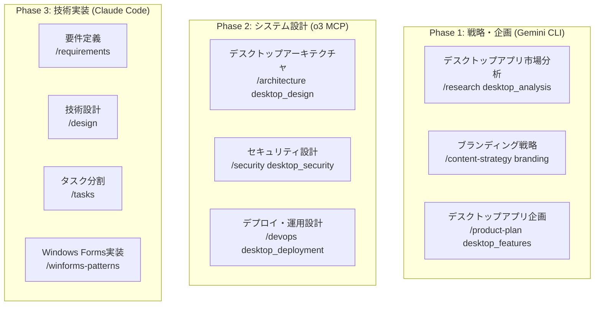

# 🖥️ .NET Framework 4.0 デスクトップアプリケーション - マルチAI統合開発システム

**レガシーシステム対応・Windows XP/2003 サポート・企業環境特化**

## 🎯 プロジェクト概要

このプロジェクトは、.NET Framework 4.0を使用したWindows Formsデスクトップアプリケーション開発に特化したマルチAI統合開発システムです。Windows XP SP3、Windows Server 2003 R2以降をサポートし、レガシーシステムとの統合、企業環境での安定稼働を重視した設計となっています。

### 🔑 主要特徴

- **レガシーシステム完全対応**: Windows XP SP3 / Windows Server 2003 R2 サポート
- **.NET Framework 4.0 最適化**: C# 4.0言語機能、限定的TPL、WebClient ベース通信
- **企業環境特化**: セキュリティポリシー対応、ドメイン認証、レガシーDB統合
- **マルチAI協調開発**: 3階層AI専門分化による高品質実装
- **Clean Architecture**: 依存性注入、テスト駆動開発、保守性重視

## 🏗️ 技術スタック

### .NET Framework 4.0 技術構成
```
フレームワーク: .NET Framework 4.0 (C# 4.0)
UI: Windows Forms 
アーキテクチャ: MVP (Model-View-Presenter) Pattern
依存性注入: Unity Container 2.1
データアクセス: ADO.NET / Entity Framework 4.0
通信: WebClient / HttpWebRequest (HttpClientは使用不可)
並行処理: BackgroundWorker / ThreadPool (async/awaitは使用不可)
テスト: NUnit 2.6 / MSTest
```

### .NET Framework 4.0 制限事項と対応策
```
❌ async/await (4.5で導入) → ✅ BackgroundWorker / ThreadPool
❌ CallerMemberName属性 (4.5で導入) → ✅ 手動パラメータ指定
❌ HttpClient (4.5で導入) → ✅ WebClient / HttpWebRequest
❌ Task.Run (4.5で導入) → ✅ ThreadPool.QueueUserWorkItem
❌ 自動NuGetパッケージ復元 → ✅ packages.config手動管理
❌ 高度なC#言語機能 → ✅ C# 4.0準拠コード
```

### Windows XP/2003対応の利点
```
✅ Windows XP SP3サポート (企業レガシー環境)
✅ Windows Server 2003 R2サポート (既存サーバー環境)
✅ 小さなランタイムフットプリント (約48MB)
✅ レガシーシステムとの高い互換性
✅ 古い企業環境での簡単デプロイ
✅ COM+、Windows Serviceとの統合
```

## 🤖 マルチAI協調システム

### 3階層AI専門分化


## 📋 カスタムコマンド一覧 (18コマンド)

### 🧠 Claude Code - 技術実装・品質保証系 (12コマンド)
1. `/spec` - 統合開発フロー管理
2. `/requirements` - 要件定義書の生成
3. `/design` - 技術設計書の作成
4. `/tasks` - タスク分割とTodo管理
5. `/analyze` - プロジェクト分析とボトルネック検出
6. `/enhance` - 新機能の追加・既存機能の改善
7. `/fix` - バグ修正と問題解決
8. `/refactor` - コードリファクタリング
9. `/document` - 自動ドキュメント生成
10. `/standardize` - コード標準化とベストプラクティス適用
11. `/winforms-patterns` - Windows Forms設計パターン適用
12. `/legacy-integration` - レガシーシステム統合支援

### 📊 Gemini CLI - データ分析・戦略系 (3コマンド)
13. `/research` - デスクトップアプリ市場分析・ユーザー行動分析
14. `/content-strategy` - ブランディング・ペルソナ設計・UX戦略
15. `/product-plan` - ロードマップ策定・機能仕様・優先度付け

### 🏗️ OpenAI o3 MCP - インフラ・運用系 (3コマンド)
16. `/architecture` - デスクトップアプリアーキテクチャ・レガシー統合設計
17. `/devops` - CI/CD・デプロイ自動化・ClickOnce配布
18. `/security` - セキュリティ設計・脅威分析・監査

## 📁 プロジェクト構造

```
.claude_dotnetFramework4.0/
├── CLAUDE.md                          # このファイル
├── commands/                          # カスタムコマンド (18個)
├── 00_project/                        # プロジェクト概要
├── 01_development_docs/               # 開発ドキュメント
├── 02_design_system/                  # デザインシステム
├── 03_library_docs/                   # ライブラリドキュメント
├── .tmp/                              # マルチAI協調作業領域
├── src/                               # ソースコード
│   ├── BusinessManagementApp.sln      # Visual Studioソリューション
│   ├── BusinessManagementApp/         # メインアプリケーション
│   │   ├── BusinessManagementApp.csproj
│   │   ├── Program.cs
│   │   ├── Forms/                     # Windows Forms
│   │   ├── Models/                    # ビジネスモデル
│   │   ├── Presenters/                # MVP Presenter層
│   │   ├── Services/                  # ビジネスサービス
│   │   ├── Data/                      # データアクセス層
│   │   ├── Infrastructure/            # インフラストラクチャ
│   │   └── Common/                    # 共通ユーティリティ
│   ├── BusinessManagementApp.Core/    # ビジネスロジック
│   ├── BusinessManagementApp.Data/    # データアクセス
│   └── BusinessManagementApp.Tests/   # テストプロジェクト
├── tests/                             # テストデータ・シナリオ
├── docs/                              # プロジェクトドキュメント
└── deployment/                        # デプロイメント設定
    ├── clickonce/                     # ClickOnce配布設定
    ├── msi/                          # MSIインストーラー設定
    └── legacy/                       # Windows XP/2003デプロイガイド
```

## 🚀 クイックスタート

### ⚠️ 重要: ビルド必須ルール
**ソースコードを修正した際は、必ず以下の手順を実行してください：**

1. **即座にビルドを実行**
   ```cmd
   # Visual Studio の場合
   Ctrl+Shift+B または ビルド → ソリューションのビルド
   
   # MSBuild コマンドラインの場合
   msbuild BusinessManagementApp.sln /p:Configuration=Debug /p:TargetFrameworkVersion=v4.0
   ```

2. **エラーチェック**
   - 構文エラー
   - 変数定義の誤り
   - 型の不一致
   - 参照エラー
   - 名前空間の欠落

3. **エラーが発生した場合は即座に修正**
   - エラー一覧ウィンドウで全エラーを確認
   - エラーをダブルクリックして該当箇所へジャンプ
   - 修正後、再度ビルドを実行

4. **.NET Framework 4.0 特有の注意点**
   - `async`/`await` は使用不可（構文エラーになります）
   - `HttpClient` は使用不可（型が存在しません）
   - C# 4.0の機能制限を確認

### 1. 開発環境セットアップ
```cmd
# Visual Studio 2010以降をインストール
# .NET Framework 4.0 Developer Packをインストール

# プロジェクトディレクトリへ移動
cd C:\path\to\.claude_dotnetFramework4.0

# Claude Codeで開始
claude .
```

### 2. マルチAI開発フローの開始
```bash
# Windows Formsマルチプロジェクト開発フローを開始
/spec multiAI

# または専門AI別の個別フェーズから開始
/research desktop_analysis         # Gemini CLI: デスクトップアプリ分析
/requirements "業務管理デスクトップアプリ" # Claude Code: 要件定義  
/architecture desktop_design      # o3 MCP: デスクトップアーキテクチャ設計
/winforms-patterns mvp            # Windows Forms MVPパターン適用
```

### 3. プロジェクトビルド・実行
```cmd
# Visual Studioでソリューションを開く
devenv src\BusinessManagementApp.sln

# またはコマンドラインビルド
msbuild src\BusinessManagementApp.sln /p:Configuration=Release
```

## 💻 .NET Framework 4.0 開発パターン

### MVP (Model-View-Presenter) パターン
```csharp
// .NET Framework 4.0 準拠のMVPパターン実装
public interface IMainView
{
    event EventHandler<string> SearchRequested;
    void DisplayResults(List<Customer> customers);
    void ShowMessage(string message);
}

public class MainPresenter
{
    private readonly IMainView _view;
    private readonly ICustomerService _customerService;
    
    public MainPresenter(IMainView view, ICustomerService customerService)
    {
        _view = view;
        _customerService = customerService;
        _view.SearchRequested += OnSearchRequested;
    }
    
    private void OnSearchRequested(object sender, string searchTerm)
    {
        // .NET Framework 4.0: BackgroundWorkerを使用 (async/await不可)
        var worker = new BackgroundWorker();
        worker.DoWork += (s, e) =>
        {
            e.Result = _customerService.SearchCustomers((string)e.Argument);
        };
        worker.RunWorkerCompleted += (s, e) =>
        {
            if (e.Error != null)
            {
                _view.ShowMessage("エラー: " + e.Error.Message);
            }
            else
            {
                _view.DisplayResults((List<Customer>)e.Result);
            }
        };
        worker.RunWorkerAsync(searchTerm);
    }
}
```

### Unity Container による依存性注入
```csharp
// .NET Framework 4.0 準拠のDI設定
public class ContainerConfig
{
    public static IUnityContainer Configure()
    {
        var container = new UnityContainer();
        
        // サービス登録
        container.RegisterType<ICustomerService, CustomerService>();
        container.RegisterType<IDataRepository, SqlServerRepository>();
        
        // 設定値の注入
        container.RegisterInstance<string>("connectionString", 
            ConfigurationManager.ConnectionStrings["DefaultConnection"].ConnectionString);
        
        return container;
    }
}
```

### WebClient による HTTP通信
```csharp
// .NET Framework 4.0: HttpClient不可、WebClientを使用
public class ApiClient
{
    private readonly string _baseUrl;
    
    public ApiClient(string baseUrl)
    {
        _baseUrl = baseUrl;
    }
    
    public void GetDataAsync(string endpoint, Action<string> onComplete, Action<Exception> onError)
    {
        var client = new WebClient();
        client.Headers.Add("Content-Type", "application/json");
        
        client.DownloadStringCompleted += (sender, e) =>
        {
            if (e.Error != null)
            {
                onError(e.Error);
            }
            else
            {
                onComplete(e.Result);
            }
        };
        
        client.DownloadStringAsync(new Uri(_baseUrl + endpoint));
    }
}
```

## 🔧 デプロイメント戦略

### Windows XP/2003 対応デプロイ
1. **ClickOnce配布** (.NET Framework 4.0対応)
2. **MSIインストーラー** (Windows Installer 3.1以降)
3. **XCopyデプロイ** (依存関係を含む)
4. **COM+統合** (既存システム統合)

### レガシーシステム統合パターン
- **データベース統合**: SQL Server 2000/2005、Oracle 10g/11g
- **COM統合**: 既存COMコンポーネントとの相互運用
- **Windows Service**: バックグラウンドサービスとの連携
- **ActiveDirectory**: ドメイン認証・グループポリシー対応

## 📊 品質保証・テスト戦略

### テスト手法
- **単体テスト**: NUnit 2.6 / MSTest
- **統合テスト**: データベース・外部API連携テスト
- **UI自動テスト**: White Framework (Windows Forms UI自動化)
- **パフォーマンステスト**: メモリ使用量・応答時間計測

### CI/CD パイプライン
```yaml
# .NET Framework 4.0 対応 CI/CD
Build:
  - MSBuild (Visual Studio 2010以降)
  - NUnit 2.6テスト実行
  - コードカバレッジ計測
  
Deploy:
  - ClickOnce自動配布
  - MSIパッケージ作成
  - Windows XP/2003検証環境
```

## 🛡️ セキュリティ・コンプライアンス

### セキュリティ対策
- **認証・認可**: Windows認証・カスタム認証
- **データ暗号化**: AES 256bit暗号化
- **通信暗号化**: HTTPS/TLS 1.0以降
- **監査ログ**: 操作履歴・エラーログ

### 企業コンプライアンス
- **グループポリシー対応**: 企業セキュリティポリシー準拠
- **ActiveDirectory統合**: ドメインユーザー・グループ管理
- **ソフトウェア配布**: WSUS・SCCM対応
- **ライセンス管理**: 企業ライセンス追跡

## 🎯 適用可能プロジェクト

### エンタープライズアプリケーション
- **業務管理システム**: 売上管理・在庫管理・顧客管理
- **データ処理ツール**: レポート生成・データ変換・バッチ処理
- **システム管理ツール**: 監視・設定管理・ログ解析

### レガシーシステム統合
- **既存システム連携**: メインフレーム・AS/400・UNIX系システム
- **データ移行ツール**: システム間データ転送・変換
- **ブリッジアプリケーション**: 新旧システム間インターフェース

## 👥 サポート・コミュニティ

- **技術サポート**: マルチAI統合技術サポート
- **ドキュメント**: 包括的開発ガイド・ベストプラクティス
- **コミュニティ**: エンタープライズ.NET開発者コミュニティ

---

**🚀 Next Step**: `/spec multiAI` でマルチAI協調開発フローを開始し、Windows XP/2003対応のエンタープライズデスクトップアプリケーション開発を体験してください。