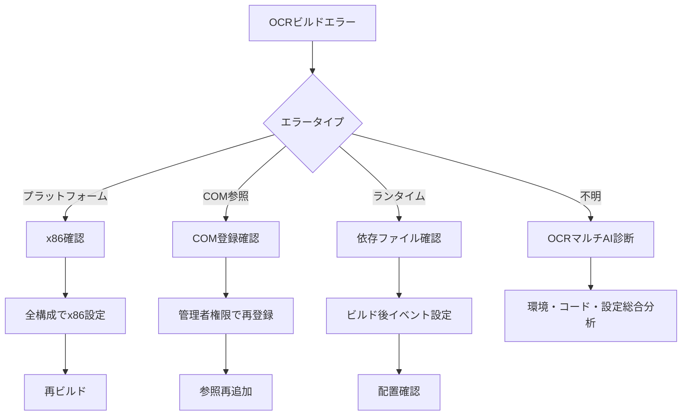

# 🔧 .NET Framework 4.0 ISP-673 OCR ビルドトラブルシューティングガイド

**x86プラットフォーム必須・COM DLL統合・OCR特化マルチAI支援**

## 📋 目次

1. [ISP-673 OCR特有のビルド要件](#isp-673-ocr特有のビルド要件)
2. [ビルド前の必須確認事項](#ビルド前の必須確認事項)
3. [x86プラットフォーム設定](#x86プラットフォーム設定)
4. [COM参照関連のビルドエラー](#com参照関連のビルドエラー)
5. [OCR固有のビルドエラー](#ocr固有のビルドエラー)
6. [マルチAI協調OCRビルドサポート](#マルチai協調ocrビルドサポート)

## ISP-673 OCR特有のビルド要件

### ⚠️ 絶対的な制約事項

```xml
<!-- 必須設定 -->
<PropertyGroup>
  <!-- x86プラットフォーム必須（AnyCPU不可） -->
  <PlatformTarget>x86</PlatformTarget>
  <Prefer32Bit>true</Prefer32Bit>
  
  <!-- .NET Framework 4.0 -->
  <TargetFrameworkVersion>v4.0</TargetFrameworkVersion>
  
  <!-- デバッグ情報 -->
  <DebugType>full</DebugType>
  <DebugSymbols>true</DebugSymbols>
</PropertyGroup>
```

### 🚨 よくある設定ミス

```xml
<!-- ❌ 間違い: AnyCPUは使用不可 -->
<PlatformTarget>AnyCPU</PlatformTarget>

<!-- ❌ 間違い: x64は使用不可 -->
<PlatformTarget>x64</PlatformTarget>

<!-- ✅ 正解: x86のみ -->
<PlatformTarget>x86</PlatformTarget>
```

## ビルド前の必須確認事項

### 🔍 ISP-673 OCR環境チェックリスト

```markdown
□ ISP-673 帳票OCRソフトウェアがインストールされている
□ GloryOcrMain4.dll が正しい場所に存在する
  └ 通常: C:\Program Files (x86)\Glory\ISP-673\
□ COM DLLが正しく登録されている
  └ regsvr32 "C:\Program Files (x86)\Glory\ISP-673\GloryOcrMain4.dll"
□ Visual Studio が管理者権限で実行されている（COM参照に必要）
□ プロジェクトがx86プラットフォームに設定されている
□ .NET Framework 4.0 (Full) がインストールされている
□ Windows SDK 7.1 がインストールされている
□ VC++ 2010 再頒布可能パッケージ (x86) がインストールされている
```

### COM DLL登録確認コマンド

```cmd
# 管理者権限のコマンドプロンプトで実行
# COM DLL登録確認
reg query "HKCR\CLSID\{ISP673のCLSID}" /s

# 再登録が必要な場合
regsvr32 /u "C:\Program Files (x86)\Glory\ISP-673\GloryOcrMain4.dll"
regsvr32 "C:\Program Files (x86)\Glory\ISP-673\GloryOcrMain4.dll"
```

## x86プラットフォーム設定

### 1. Visual Studio でのプラットフォーム設定

```
1. ソリューションエクスプローラーでプロジェクトを右クリック
2. プロパティ → ビルド
3. プラットフォームターゲット: x86 を選択
4. 32ビットを優先: チェック
5. 構成マネージャーでも確認
   - アクティブソリューションプラットフォーム: x86
   - プロジェクトプラットフォーム: x86
```

### 2. MSBuild コマンドライン

```cmd
# x86プラットフォーム指定ビルド
"C:\Windows\Microsoft.NET\Framework\v4.0.30319\MSBuild.exe" ISP673_OCRApp.sln /p:Configuration=Release /p:Platform=x86 /p:TargetFrameworkVersion=v4.0

# プラットフォーム確認付きビルド
"C:\Windows\Microsoft.NET\Framework\v4.0.30319\MSBuild.exe" ISP673_OCRApp.sln /p:Platform=x86 /v:detailed /fl /flp:logfile=ocr_build.log
```

## COM参照関連のビルドエラー

### 🚨 エラーパターン1: COM参照が見つからない

#### エラーメッセージ
```
エラー MSB3290: プロジェクトから参照された COM コンポーネント 'GloryOcr4Lib' が見つかりませんでした
```

#### 解決方法

1. **COM参照の再追加**
```xml
<!-- .csprojファイルのCOM参照セクション -->
<ItemGroup>
  <COMReference Include="GloryOcr4Lib">
    <Guid>{12345678-1234-1234-1234-123456789012}</Guid>
    <VersionMajor>4</VersionMajor>
    <VersionMinor>0</VersionMinor>
    <Lcid>0</Lcid>
    <WrapperTool>tlbimp</WrapperTool>
    <Isolated>False</Isolated>
    <EmbedInteropTypes>True</EmbedInteropTypes>
  </COMReference>
</ItemGroup>
```

2. **Interopアセンブリの手動生成**
```cmd
# 管理者権限で実行
tlbimp "C:\Program Files (x86)\Glory\ISP-673\GloryOcrMain4.dll" /out:Interop.GloryOcr4Lib.dll /namespace:GloryOcr4Lib
```

### 🚨 エラーパターン2: プラットフォーム不一致

#### エラーメッセージ
```
BadImageFormatException: 間違ったフォーマットのプログラムを読み込もうとしました (HRESULT: 0x8007000B)
```

#### 解決方法

```xml
<!-- すべての構成でx86を強制 -->
<PropertyGroup Condition="'$(Configuration)|$(Platform)'=='Debug|x86'">
  <PlatformTarget>x86</PlatformTarget>
  <Prefer32Bit>true</Prefer32Bit>
</PropertyGroup>
<PropertyGroup Condition="'$(Configuration)|$(Platform)'=='Release|x86'">
  <PlatformTarget>x86</PlatformTarget>
  <Prefer32Bit>true</Prefer32Bit>
</PropertyGroup>
```

### 🚨 エラーパターン3: COM相互運用アセンブリ埋め込みエラー

#### エラーメッセージ
```
エラー CS1748: 相互運用型 'IGlyOcr' を埋め込むことができません
```

#### 解決方法

```xml
<!-- 埋め込みを無効化 -->
<COMReference Include="GloryOcr4Lib">
  <EmbedInteropTypes>False</EmbedInteropTypes>
  <Private>True</Private>
</COMReference>
```

## OCR固有のビルドエラー

### 🚨 エラーパターン4: メモリ管理関連

#### エラーメッセージ
```
CS0103: 名前 'GlobalFree' は現在のコンテキストに存在しません
```

#### 解決方法

```csharp
// P/Invoke宣言を追加
using System.Runtime.InteropServices;

public static class NativeMethods
{
    [DllImport("kernel32.dll")]
    public static extern IntPtr GlobalFree(IntPtr hMem);
    
    [DllImport("kernel32.dll")]
    public static extern IntPtr GlobalAlloc(uint uFlags, UIntPtr dwBytes);
}
```

### 🚨 エラーパターン5: OCRランタイム依存

#### エラーメッセージ
```
FileNotFoundException: ファイルまたはアセンブリ 'ISP673Runtime.dll' が見つかりませんでした
```

#### 解決方法

1. **ビルド後イベントで依存ファイルコピー**
```xml
<PropertyGroup>
  <PostBuildEvent>
xcopy /Y /D "C:\Program Files (x86)\Glory\ISP-673\*.dll" "$(TargetDir)"
xcopy /Y /D "C:\Program Files (x86)\Glory\ISP-673\*.ini" "$(TargetDir)"
  </PostBuildEvent>
</PropertyGroup>
```

2. **app.config で探索パス追加**
```xml
<configuration>
  <runtime>
    <assemblyBinding xmlns="urn:schemas-microsoft-com:asm.v1">
      <probing privatePath="ISP673;bin"/>
    </assemblyBinding>
  </runtime>
</configuration>
```

## マルチAI協調OCRビルドサポート

### 🤖 OCR特化AI支援

#### Claude Code（OCRコード実装）
```bash
# COM参照エラー修正
/fix-ocr-com-reference --auto-repair

# x86プラットフォーム強制
/enforce-x86-platform --all-configs

# OCRメモリ管理実装
/implement-ocr-memory-management
```

#### Gemini CLI（OCR環境分析）
```bash
# OCR環境総合診断
/analyze-ocr-environment --deep-scan

# 依存関係分析
/check-ocr-dependencies --include-runtime

# パフォーマンス分析
/profile-ocr-build --optimize
```

#### o3 MCP（OCRインフラ）
```bash
# COM登録状態確認
/verify-com-registration --fix-issues

# OCRランタイム配置
/deploy-ocr-runtime --target=bin

# セキュリティ設定
/configure-ocr-security --com-permissions
```

### 🔧 OCR統合ビルドコマンド

```bash
# OCRビルド総合診断
/ocr-build-diagnose --full-analysis

# 自動修復モード
/fix-ocr-build --auto-resolve --verify

# ビルド前環境準備
/prepare-ocr-build-env --register-com --copy-runtime
```

## 📊 OCRビルドエラー解決フロー



## 🆘 OCR緊急ビルド対応

### レベル1: 基本対応
```cmd
# クリーンビルド
msbuild /t:Clean
msbuild /t:Build /p:Platform=x86

# COM再登録
regsvr32 /u GloryOcrMain4.dll
regsvr32 GloryOcrMain4.dll
```

### レベル2: AI支援
```bash
# OCR環境リセット
/reset-ocr-environment --full

# 総合診断と自動修復
/ocr-emergency-fix --collect-logs --auto-repair
```

### レベル3: 手動対応
1. ISP-673 OCRソフトウェアの再インストール
2. Visual Studio の管理者権限での再起動
3. プロジェクトの新規作成とコード移行

## 📝 OCRビルド成功のチェックリスト

### ビルド後の確認項目
```markdown
□ 出力フォルダにexeが生成されている（x86フォルダ）
□ Interop.GloryOcr4Lib.dll が出力されている
□ OCRランタイムDLLがコピーされている
□ 設定ファイル（.ini）がコピーされている
□ x86プロセスとして実行される
□ OCR初期化が成功する
```

---

**💡 重要**: ISP-673 OCRビルドは必ずx86プラットフォームで行う必要があります。ビルドエラーの90%以上はプラットフォーム設定とCOM参照に起因します。まず `/ocr-build-diagnose` で環境診断を実行してください。