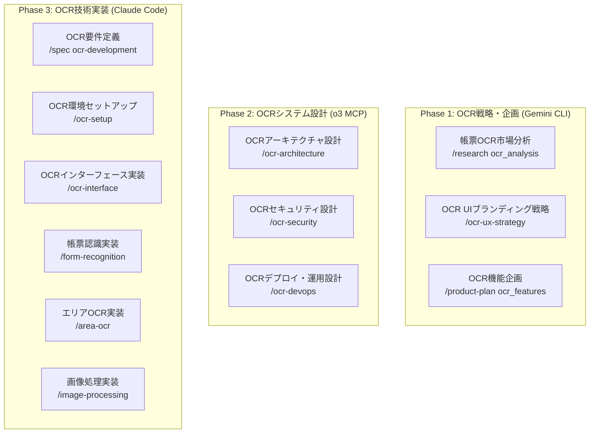

# 🖥️ ISP-673 帳票OCRソフトウェア .NET Framework 4.0 統合開発システム

**レガシーシステム対応・Windows XP/2003 サポート・ISP-673 OCR完全統合**

## 🎯 プロジェクト概要

このプロジェクトは、ISP-673帳票OCRソフトウェアを核とした.NET Framework 4.0 Windows Formsアプリケーション開発に特化したマルチAI統合開発システムです。Windows XP SP3、Windows Server 2003 R2以降をサポートし、GloryOcrMain4.dll COM DLLとの完全統合を実現します。

### 🔑 主要特徴

- **ISP-673 OCR完全統合**: GloryOcrMain4.dll COM DLLによる帳票認識・エリアOCR・画像処理
- **x86プラットフォーム最適化**: COM相互運用のための厳格なx86ターゲット設定
- **3つのOCRインターフェース**: IGlyOcr（標準）、IGlyOcrEx（エリアOCR）、IGlyOcrC（C言語用）
- **レガシーシステム完全対応**: Windows XP SP3 / Windows Server 2003 R2 サポート
- **.NET Framework 4.0 最適化**: C# 4.0言語機能、限定的TPL、WebClient ベース通信
- **マルチAI協調開発**: ISP-673 OCR特化型3階層AI専門分化による高品質実装

## 🏗️ ISP-673 OCR技術スタック

### ISP-673 OCR統合技術構成
```
フレームワーク: .NET Framework 4.0 (C# 4.0)
UI: Windows Forms 
OCR COM DLL: GloryOcrMain4.dll (ISP-673)
プラットフォーム: x86 (必須設定)
アーキテクチャ: MVP (Model-View-Presenter) Pattern
依存性注入: Unity Container 2.1
データアクセス: ADO.NET / Entity Framework 4.0
通信: WebClient / HttpWebRequest (HttpClientは使用不可)
並行処理: BackgroundWorker / ThreadPool (async/awaitは使用不可)
メモリ管理: GlobalFree (OCRイメージ処理後必須)
テスト: NUnit 2.6 / MSTest
```

### ISP-673 OCRインターフェース仕様
```
IGlyOcr (標準帳票OCR)
├── init() - ライブラリ初期化
├── SetGroup() - グループ設定
├── RecogDocumentFn() - ファイル入力認識
├── RecogDocumentMem() - メモリ入力認識
└── exit() - ライブラリ終了

IGlyOcrEx (エリアOCR・画像処理)
├── LoadCharDic() - 文字認識辞書展開
├── LoadRpfFile() - RPFファイル展開
├── RecogField() - エリアOCR実行
├── RecogFieldEx() - 拡張エリアOCR実行
├── GetBinaryImage() - 2値化処理
├── GetDocumentImageEx() - 帳票切り出し・傾き補正
└── UnLoadRpfFile() - リソース開放

IGlyOcrC (C言語特化)
└── C#では使用不可 (Visual BasicおよびVisual C#では使用不可)
```

### .NET Framework 4.0 + ISP-673制約事項と対応策
```
❌ async/await (4.5で導入) → ✅ BackgroundWorker / ThreadPool (OCR処理)
❌ CallerMemberName属性 (4.5で導入) → ✅ 手動パラメータ指定
❌ HttpClient (4.5で導入) → ✅ WebClient / HttpWebRequest
❌ Task.Run (4.5で導入) → ✅ ThreadPool.QueueUserWorkItem
❌ 自動NuGetパッケージ復元 → ✅ packages.config手動管理
❌ AnyCPU プラットフォーム → ✅ x86プラットフォーム（COM DLL要件）
❌ 並行OCR処理 → ✅ シングルスレッドOCR処理
❌ 自動メモリ管理 → ✅ GlobalFree手動メモリ開放
```

### Windows XP/2003 + ISP-673対応の利点
```
✅ Windows XP SP3サポート (企業レガシー環境でのOCR稼働)
✅ Windows Server 2003 R2サポート (既存OCRサーバー環境)
✅ 小さなランタイムフットプリント (約48MB + ISP-673ランタイム)
✅ レガシーシステムとの高い互換性
✅ 古い企業環境での簡単デプロイ
✅ COM+、Windows ServiceとのOCR統合
✅ 既存帳票システムとのシームレス統合
```

## 🤖 ISP-673 OCR特化マルチAI協調システム

### 3階層AI専門分化（OCR特化）


## 📋 ISP-673 OCR専用カスタムコマンド一覧 (36コマンド)

### 🧠 Claude Code - OCR技術実装・品質保証系 (30コマンド)
1. `/spec` - 統合OCR開発フロー管理
2. `/ocr-setup` - ISP-673 OCR環境セットアップ
3. `/ocr-interface` - OCRインターフェース実装支援
4. `/form-recognition` - 帳票認識機能実装
5. `/area-ocr` - エリアOCR機能実装
6. `/image-processing` - 画像処理機能実装
7. `/barcode-recognition` - バーコード認識実装
8. `/com-integration` - COM DLL統合サポート
9. `/x86-build` - x86プラットフォーム最適化
10. `/ocr-testing` - OCR機能テスト支援
11. `/legacy-integration` - レガシーシステム統合
12. `/performance-tuning` - OCR性能最適化
13. `/error-handling` - OCRエラーハンドリング
14. `/memory-management` - OCRメモリ管理
15. `/deployment-ocr` - OCR環境デプロイメント
16. `/analyze-ocr-image` - OCR対象画像を分析して最適な前処理方法を提案（マルチAI連携）
17. `/implement-custom-preprocessing` - プロジェクト固有の前処理パターンを実装（マルチAI設計）
18. `/test-preprocessing-quality` - 前処理結果の品質をマルチAIで評価
19. `/optimize-preprocessing-params` - 前処理パラメータをマルチAIで最適化
20. `/create-preprocessing-preset` - 文書タイプ別の前処理プリセットを作成
21. `/benchmark-preprocessing` - 前処理性能をベンチマーク（処理速度・品質）
22. `/implement-gpu-acceleration` - GPU加速による前処理の高速化実装
23. `/analyze-ocr-results` - OCR結果を分析して前処理の改善点を特定
24. `/create-preprocessing-pipeline` - 複数の前処理を組み合わせたパイプラインを構築
25. `/train-ml-preprocessor` - 機械学習ベースの前処理パラメータ予測モデルを訓練
26. `/integrate-preprocessing-ui` - 前処理UIコンポーネントをアプリケーションに統合
27. `/export-preprocessing-config` - 前処理設定をエクスポート/インポート可能な形式に変換
28. `/debug-preprocessing` - 前処理のデバッグとトラブルシューティング
29. `/compare-preprocessing-methods` - 複数の前処理手法を比較評価
30. `/generate-preprocessing-docs` - プロジェクト固有の前処理ドキュメントを生成

### 📊 Gemini CLI - OCRデータ分析・戦略系 (3コマンド)
31. `/research` - OCR市場分析・ユーザー行動分析
32. `/ocr-ux-strategy` - OCR UI/UXブランディング・ペルソナ設計
33. `/product-plan` - OCRロードマップ策定・機能仕様・優先度付け

### 🏗️ OpenAI o3 MCP - OCRインフラ・運用系 (3コマンド)
34. `/ocr-architecture` - OCRシステムアーキテクチャ・レガシー統合設計
35. `/ocr-security` - OCRセキュリティ設計・脅威分析・監査
36. `/ocr-devops` - OCR CI/CD・デプロイ自動化・ClickOnce配布

## 📁 ISP-673 OCRプロジェクト構造

```
.claude_dotnetFramework4.0_ISP673_OCR/
├── CLAUDE.md                              # このファイル
├── commands/                              # OCR専用カスタムコマンド (21個)
├── 00_project/                            # ISP-673 OCRプロジェクト概要
├── 01_development_docs/                   # OCR開発ドキュメント
├── 02_design_system/                      # OCR UIデザインシステム
├── 03_library_docs/                       # ISP-673ライブラリドキュメント
├── .tmp/                                  # マルチAI協調作業領域
├── samples/                               # ISP-673サンプルコード統合
├── src/                                   # ソースコード
│   ├── ISP673_OCRApp.sln                  # Visual Studioソリューション
│   ├── ISP673_OCRApp/                     # メインOCRアプリケーション
│   │   ├── ISP673_OCRApp.csproj
│   │   ├── Program.cs
│   │   ├── Forms/                         # OCR Windows Forms
│   │   ├── Models/                        # OCR ビジネスモデル
│   │   ├── Presenters/                    # OCR MVP Presenter層
│   │   ├── Services/                      # OCR ビジネスサービス
│   │   ├── Data/                          # OCR データアクセス層
│   │   ├── Infrastructure/                # OCR インフラストラクチャ
│   │   └── Common/                        # OCR 共通ユーティリティ
│   ├── ISP673_OCRApp.Core/                # OCR ビジネスロジック
│   ├── ISP673_OCRApp.Data/                # OCR データアクセス
│   └── ISP673_OCRApp.Tests/               # OCR テストプロジェクト
├── tests/                                 # OCRテストデータ・シナリオ
├── docs/                                  # ISP-673 OCRドキュメント
└── deployment/                            # OCRデプロイメント設定
    ├── clickonce/                         # ClickOnce配布設定
    ├── msi/                              # MSIインストーラー設定（DLL同梱）
    └── legacy/                           # Windows XP/2003デプロイガイド
```

## 🚀 ISP-673 OCR開発クイックスタート

### 1. ISP-673 OCR開発環境セットアップ
```cmd
# Visual Studio 2010以降をインストール
# .NET Framework 4.0 Developer Packをインストール
# ISP-673 帳票OCRソフトウェアをインストール（GloryOcrMain4.dll）

# プロジェクトディレクトリへ移動
cd C:\path\to\.claude_dotnetFramework4.0_ISP673_OCR

# Claude Codeで開始
claude .
```

### 2. ISP-673 OCR統合開発フロー
```cmd
# ISP-673 OCR開発フロー開始
/spec ocr-development

# OCR環境セットアップ
/ocr-setup

# OCRインターフェース実装
/ocr-interface

# 帳票認識機能実装
/form-recognition

# エリアOCR実装
/area-ocr

# 画像処理実装
/image-processing
```

### 3. x86プラットフォーム設定確認
```xml
<PropertyGroup>
  <PlatformTarget>x86</PlatformTarget>
  <Prefer32Bit>true</Prefer32Bit>
</PropertyGroup>
```

### 4. COM参照設定確認
```xml
<COMReference Include="GloryOcr4Lib">
  <Guid>{12345678-1234-1234-1234-123456789012}</Guid>
  <VersionMajor>4</VersionMajor>
  <VersionMinor>0</VersionMinor>
  <WrapperTool>tlbimp</WrapperTool>
  <EmbedInteropTypes>True</EmbedInteropTypes>
</COMReference>
```

## 💻 ISP-673 OCR開発ワークフロー

### フェーズ1: OCR戦略策定 (Gemini CLI)
1. `/research ocr_market_analysis` - OCR市場分析
2. `/ocr-ux-strategy branding` - OCR UI/UXブランディング
3. `/product-plan ocr_roadmap` - OCRロードマップ策定

### フェーズ2: OCRシステム設計 (o3 MCP)
1. `/ocr-architecture system_design` - OCRアーキテクチャ設計
2. `/ocr-security threat_analysis` - OCRセキュリティ設計
3. `/ocr-devops deployment_strategy` - OCRデプロイ戦略

### フェーズ3: OCR技術実装 (Claude Code)
1. `/spec ocr-development` - OCR開発仕様策定
2. `/ocr-setup` - ISP-673環境セットアップ
3. `/ocr-interface` - OCRインターフェース実装
4. `/form-recognition` - 帳票認識実装
5. `/area-ocr` - エリアOCR実装
6. `/image-processing` - 画像処理実装
7. `/ocr-testing` - OCR機能テスト

## 🔧 ISP-673 OCR開発環境要件

### 必須環境
- **OS**: Windows XP SP3 以降 / Windows Server 2003 R2 以降
- **.NET**: .NET Framework 4.0
- **IDE**: Visual Studio 2010 以降
- **OCR**: ISP-673 帳票OCRソフトウェア (GloryOcrMain4.dll)
- **プラットフォーム**: x86 (必須設定)

### OCR特有の制約
- x86プラットフォーム必須（COM DLL要件）
- シングルスレッドOCR処理
- 手動メモリ管理（GlobalFree）
- Version 4.x COM参照（3.x使用禁止）

## 📊 ISP-673 OCR性能目標

- **OCR処理時間**: 1秒/ページ以内 (A4帳票)
- **認識精度**: 99%以上 (標準帳票)
- **メモリ使用量**: 150MB以下 (OCR処理時)
- **起動時間**: 3秒以内 (Windows XP環境)
- **応答時間**: 200ms以内 (UI操作)

---

**🚀 Next Step**: `/spec ocr-development` コマンドでISP-673 OCR統合開発を開始