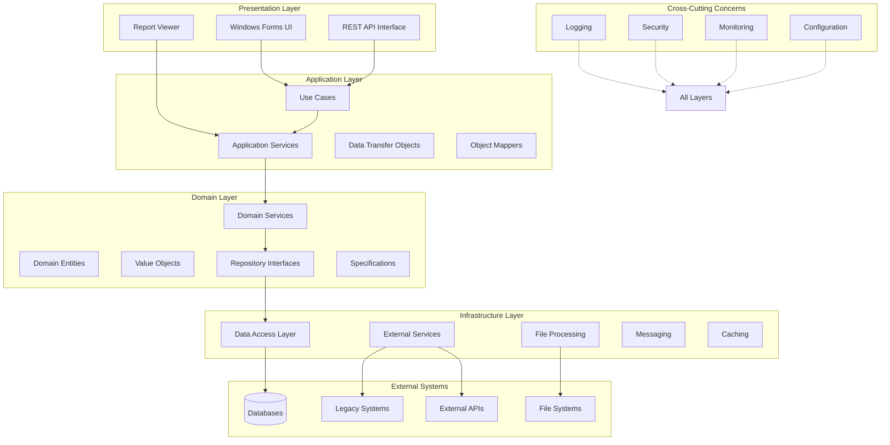

# アーキテクチャ設計書 - エンタープライズ統合管理システム

## 1. 全体アーキテクチャ概要

### システム構成図


### アーキテクチャ原則

#### Clean Architecture
```csharp
// 依存性の方向: 外側から内側へ
// Domain層は他の層に依存しない

namespace Domain.Entities
{
    public class Customer
    {
        public int Id { get; private set; }
        public string Name { get; private set; }
        public Email Email { get; private set; }
        
        // ビジネスルールをドメインに集約
        public void ChangeEmail(string newEmail)
        {
            if (!Email.IsValid(newEmail))
                throw new DomainException("Invalid email format");
            
            Email = new Email(newEmail);
        }
    }
}

namespace Application.UseCases
{
    public class UpdateCustomerEmailUseCase
    {
        private readonly ICustomerRepository _repository;
        private readonly IUnitOfWork _unitOfWork;
        
        public async Task<Result> ExecuteAsync(int customerId, string newEmail)
        {
            var customer = await _repository.GetByIdAsync(customerId);
            if (customer == null)
                return Result.NotFound();
            
            try
            {
                customer.ChangeEmail(newEmail);
                await _unitOfWork.CommitAsync();
                return Result.Success();
            }
            catch (DomainException ex)
            {
                return Result.ValidationError(ex.Message);
            }
        }
    }
}
```

## 2. レイヤー設計

### Presentation Layer（プレゼンテーション層）

#### 責務
- ユーザーインターフェースの提供
- ユーザー入力の受付と検証
- アプリケーション層の呼び出し
- 結果の表示

#### 実装方針
```csharp
// MVP (Model-View-Presenter) パターンの適用
public interface ICustomerView
{
    string CustomerName { get; set; }
    string Email { get; set; }
    event EventHandler SaveClicked;
    void ShowError(string message);
    void ShowSuccess(string message);
}

public class CustomerPresenter
{
    private readonly ICustomerView _view;
    private readonly ICustomerService _service;
    
    public CustomerPresenter(ICustomerView view, ICustomerService service)
    {
        _view = view;
        _service = service;
        _view.SaveClicked += OnSaveClicked;
    }
    
    private async void OnSaveClicked(object sender, EventArgs e)
    {
        try
        {
            var result = await _service.UpdateCustomerAsync(
                _view.CustomerName, 
                _view.Email);
            
            if (result.IsSuccess)
                _view.ShowSuccess("保存しました");
            else
                _view.ShowError(result.ErrorMessage);
        }
        catch (Exception ex)
        {
            _view.ShowError("システムエラーが発生しました");
            _logger.LogError(ex, "Customer update failed");
        }
    }
}
```

### Application Layer（アプリケーション層）

#### 責務
- ユースケースの実装
- トランザクション境界の管理
- ドメイン層のオーケストレーション
- DTOの変換

#### 実装例
```csharp
public class CustomerApplicationService : ICustomerApplicationService
{
    private readonly ICustomerRepository _customerRepository;
    private readonly ICustomerDomainService _domainService;
    private readonly IUnitOfWork _unitOfWork;
    private readonly IMapper _mapper;
    
    public async Task<CustomerDto> GetCustomerAsync(int id)
    {
        var customer = await _customerRepository.GetByIdAsync(id);
        return _mapper.Map<CustomerDto>(customer);
    }
    
    public async Task<Result> CreateCustomerAsync(CreateCustomerDto dto)
    {
        using (var transaction = await _unitOfWork.BeginTransactionAsync())
        {
            try
            {
                // ドメインサービスでビジネスルールチェック
                var canCreate = await _domainService.CanCreateCustomerAsync(dto.Email);
                if (!canCreate)
                    return Result.ValidationError("このメールアドレスは既に使用されています");
                
                // エンティティ作成
                var customer = Customer.Create(dto.Name, dto.Email, dto.CreditLimit);
                
                // 永続化
                await _customerRepository.AddAsync(customer);
                await _unitOfWork.CommitAsync();
                
                await transaction.CommitAsync();
                return Result.Success(customer.Id);
            }
            catch (Exception)
            {
                await transaction.RollbackAsync();
                throw;
            }
        }
    }
}
```

### Domain Layer（ドメイン層）

#### 責務
- ビジネスルールの実装
- エンティティとバリューオブジェクト
- ドメインサービス
- ドメインイベント

#### エンティティ設計
```csharp
public class Order : AggregateRoot
{
    private readonly List<OrderLine> _orderLines = new List<OrderLine>();
    
    public OrderId Id { get; private set; }
    public CustomerId CustomerId { get; private set; }
    public OrderStatus Status { get; private set; }
    public Money TotalAmount { get; private set; }
    public DateTime OrderDate { get; private set; }
    
    public IReadOnlyList<OrderLine> OrderLines => _orderLines.AsReadOnly();
    
    private Order() { } // EF用
    
    public static Order Create(CustomerId customerId)
    {
        var order = new Order
        {
            Id = OrderId.New(),
            CustomerId = customerId,
            Status = OrderStatus.Draft,
            OrderDate = DateTime.UtcNow,
            TotalAmount = Money.Zero
        };
        
        order.AddDomainEvent(new OrderCreatedEvent(order.Id, customerId));
        return order;
    }
    
    public void AddItem(ProductId productId, int quantity, Money unitPrice)
    {
        if (Status != OrderStatus.Draft)
            throw new DomainException("確定済みの注文は変更できません");
        
        var orderLine = OrderLine.Create(productId, quantity, unitPrice);
        _orderLines.Add(orderLine);
        
        RecalculateTotal();
    }
    
    public void Confirm()
    {
        if (Status != OrderStatus.Draft)
            throw new DomainException("下書き状態の注文のみ確定できます");
        
        if (!_orderLines.Any())
            throw new DomainException("商品が追加されていません");
        
        Status = OrderStatus.Confirmed;
        AddDomainEvent(new OrderConfirmedEvent(Id, TotalAmount));
    }
    
    private void RecalculateTotal()
    {
        TotalAmount = _orderLines
            .Select(line => line.LineTotal)
            .Aggregate(Money.Zero, (total, lineTotal) => total + lineTotal);
    }
}
```

#### バリューオブジェクト
```csharp
public class Money : ValueObject
{
    public decimal Amount { get; }
    public string Currency { get; }
    
    public Money(decimal amount, string currency = "JPY")
    {
        if (amount < 0)
            throw new ArgumentException("金額は0以上である必要があります");
        
        Amount = amount;
        Currency = currency;
    }
    
    public static Money Zero => new Money(0);
    
    public static Money operator +(Money left, Money right)
    {
        if (left.Currency != right.Currency)
            throw new InvalidOperationException("通貨が異なる金額は加算できません");
        
        return new Money(left.Amount + right.Amount, left.Currency);
    }
    
    protected override IEnumerable<object> GetEqualityComponents()
    {
        yield return Amount;
        yield return Currency;
    }
}
```

### Infrastructure Layer（インフラストラクチャ層）

#### 責務
- 外部システムとの連携
- データ永続化の実装
- 技術的な関心事の実装

#### リポジトリ実装
```csharp
public class CustomerRepository : ICustomerRepository
{
    private readonly AppDbContext _context;
    private readonly IMemoryCache _cache;
    
    public CustomerRepository(AppDbContext context, IMemoryCache cache)
    {
        _context = context;
        _cache = cache;
    }
    
    public async Task<Customer> GetByIdAsync(int id)
    {
        var cacheKey = $"customer_{id}";
        
        if (_cache.TryGetValue(cacheKey, out Customer cached))
            return cached;
        
        var customer = await _context.Customers
            .Include(c => c.Addresses)
            .Include(c => c.ContactPersons)
            .FirstOrDefaultAsync(c => c.Id == id);
        
        if (customer != null)
        {
            _cache.Set(cacheKey, customer, TimeSpan.FromMinutes(5));
        }
        
        return customer;
    }
    
    public async Task<IEnumerable<Customer>> FindAsync(ISpecification<Customer> spec)
    {
        return await _context.Customers
            .Where(spec.ToExpression())
            .ToListAsync();
    }
    
    public async Task AddAsync(Customer customer)
    {
        await _context.Customers.AddAsync(customer);
    }
}
```

#### 外部システム連携
```csharp
public class LegacySystemAdapter : ILegacySystemAdapter
{
    private readonly HttpClient _httpClient;
    private readonly IDbConnection _legacyDb;
    private readonly ILogger<LegacySystemAdapter> _logger;
    
    public async Task<LegacyCustomerData> GetCustomerFromLegacyAsync(string customerId)
    {
        try
        {
            // まずREST APIを試行
            var response = await _httpClient.GetAsync($"api/customers/{customerId}");
            if (response.IsSuccessStatusCode)
            {
                return await response.Content.ReadAsAsync<LegacyCustomerData>();
            }
        }
        catch (HttpRequestException ex)
        {
            _logger.LogWarning(ex, "Legacy API call failed, falling back to direct DB");
        }
        
        // APIが失敗したら直接DB接続
        using (var connection = new OracleConnection(_legacyDb.ConnectionString))
        {
            var sql = @"
                SELECT CUST_ID, CUST_NAME, CUST_EMAIL 
                FROM LEGACY_CUSTOMERS 
                WHERE CUST_ID = :customerId";
            
            var data = await connection.QueryFirstOrDefaultAsync<dynamic>(sql, new { customerId });
            
            return new LegacyCustomerData
            {
                Id = data.CUST_ID,
                Name = data.CUST_NAME,
                Email = data.CUST_EMAIL
            };
        }
    }
}
```

## 3. 既存システム統合アーキテクチャ

### 統合パターン

#### アダプターパターン
```csharp
public interface IExternalSystem
{
    Task<CustomerData> GetCustomerAsync(string id);
    Task<bool> UpdateCustomerAsync(CustomerData data);
}

public class SAPAdapter : IExternalSystem
{
    private readonly ISAPConnector _sapConnector;
    
    public async Task<CustomerData> GetCustomerAsync(string id)
    {
        var sapData = await _sapConnector.ExecuteRFC("Z_GET_CUSTOMER", new { KUNNR = id });
        
        // SAPデータを内部形式に変換
        return new CustomerData
        {
            Id = sapData.GetString("KUNNR"),
            Name = sapData.GetString("NAME1"),
            CreditLimit = sapData.GetDecimal("KLIMK")
        };
    }
}

public class AS400Adapter : IExternalSystem
{
    private readonly IAS400Connection _connection;
    
    public async Task<CustomerData> GetCustomerAsync(string id)
    {
        var query = "SELECT * FROM CUSTLIB.CUSTMAST WHERE CUSTNO = @id";
        var as400Data = await _connection.QueryAsync(query, new { id });
        
        // AS/400データを内部形式に変換
        return MapToCustomerData(as400Data);
    }
}
```

#### 統合ファサード
```csharp
public class ExternalSystemFacade : IExternalSystemFacade
{
    private readonly Dictionary<string, IExternalSystem> _systems;
    private readonly ISystemRoutingService _routing;
    
    public ExternalSystemFacade(
        IEnumerable<IExternalSystem> systems,
        ISystemRoutingService routing)
    {
        _systems = systems.ToDictionary(s => s.GetType().Name);
        _routing = routing;
    }
    
    public async Task<CustomerData> GetCustomerAsync(string id)
    {
        // IDから適切なシステムを判定
        var systemName = _routing.DetermineSystem(id);
        
        if (_systems.TryGetValue(systemName, out var system))
        {
            return await system.GetCustomerAsync(id);
        }
        
        throw new SystemNotFoundException($"System {systemName} not found");
    }
}
```

## 4. 非機能要件の実装

### パフォーマンス
```csharp
public class PerformanceOptimizedRepository : ICustomerRepository
{
    private readonly IDbConnection _connection;
    private readonly IMemoryCache _cache;
    
    public async Task<IEnumerable<Customer>> GetCustomersAsync(int page, int pageSize)
    {
        var sql = @"
            WITH CustomerCTE AS (
                SELECT 
                    c.*,
                    ROW_NUMBER() OVER (ORDER BY c.Id) AS RowNum
                FROM Customers c
                WHERE c.IsActive = 1
            )
            SELECT * FROM CustomerCTE
            WHERE RowNum BETWEEN @StartRow AND @EndRow";
        
        var startRow = (page - 1) * pageSize + 1;
        var endRow = page * pageSize;
        
        return await _connection.QueryAsync<Customer>(sql, new { StartRow = startRow, EndRow = endRow });
    }
}
```

### セキュリティ
```csharp
public class SecureService : ISecureService
{
    private readonly IAuthorizationService _authService;
    private readonly IAuditLogger _auditLogger;
    
    [Authorize(Roles = "Admin,Manager")]
    public async Task<Result> DeleteCustomerAsync(int customerId)
    {
        var user = Thread.CurrentPrincipal;
        
        // 権限チェック
        if (!await _authService.CanDeleteCustomerAsync(user, customerId))
        {
            await _auditLogger.LogUnauthorizedAccessAsync(user, "DeleteCustomer", customerId);
            return Result.Forbidden();
        }
        
        // 処理実行
        var result = await PerformDeletionAsync(customerId);
        
        // 監査ログ
        await _auditLogger.LogActionAsync(user, "DeleteCustomer", customerId, result);
        
        return result;
    }
}
```

### スケーラビリティ
```csharp
public class ScalableMessageProcessor
{
    private readonly IMessageQueue _queue;
    private readonly SemaphoreSlim _semaphore;
    
    public ScalableMessageProcessor(int maxConcurrency = 10)
    {
        _semaphore = new SemaphoreSlim(maxConcurrency);
    }
    
    public async Task ProcessMessagesAsync(CancellationToken cancellationToken)
    {
        var tasks = new List<Task>();
        
        while (!cancellationToken.IsCancellationRequested)
        {
            await _semaphore.WaitAsync();
            
            var task = Task.Run(async () =>
            {
                try
                {
                    var message = await _queue.DequeueAsync();
                    if (message != null)
                    {
                        await ProcessMessageAsync(message);
                    }
                }
                finally
                {
                    _semaphore.Release();
                }
            });
            
            tasks.Add(task);
            
            // 完了したタスクをクリーンアップ
            tasks.RemoveAll(t => t.IsCompleted);
        }
        
        await Task.WhenAll(tasks);
    }
}
```

## 5. 開発ガイドライン

### コーディング規約
- C# Coding Conventions に準拠
- 可読性を重視（KISS原則）
- 単一責任の原則を遵守
- 適切な例外処理

### テスト方針
- ユニットテスト: ビジネスロジックを中心に80%以上のカバレッジ
- 統合テスト: 外部システム連携部分を重点的に
- E2Eテスト: 主要業務フローをカバー

### ドキュメント
- XMLドキュメントコメントの記載
- アーキテクチャ決定記録（ADR）の作成
- API仕様書の自動生成

このアーキテクチャ設計により、保守性が高く、拡張可能で、既存システムとの統合も容易なエンタープライズシステムの構築が可能となります。