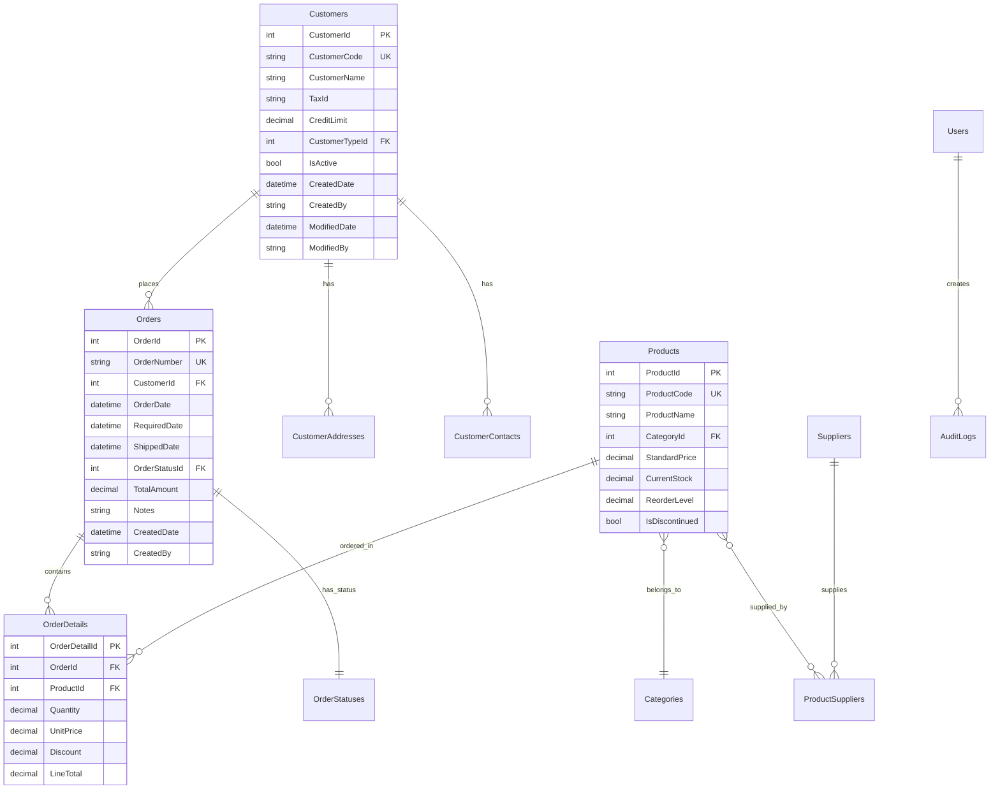

# データベース設計書 - エンタープライズ統合管理システム

## 1. データベース設計方針

### 基本方針
- **正規化**: 第3正規形を基本とし、パフォーマンス要件に応じて非正規化
- **拡張性**: 将来の要件変更に対応できる柔軟な設計
- **既存システム統合**: レガシーDBとの連携を考慮したデータモデル
- **監査対応**: 全テーブルに監査項目を標準装備
- **マルチテナント対応**: 将来的な拡張を見据えた設計

### 命名規則
```sql
-- テーブル名: PascalCase、複数形
CREATE TABLE Customers (...)

-- カラム名: PascalCase
CustomerId, CustomerName, CreatedDate

-- 主キー: テーブル名の単数形 + Id
CustomerId, OrderId, ProductId

-- 外部キー: 参照テーブル名の単数形 + Id
CustomerId, ProductId, CategoryId

-- インデックス: IX_テーブル名_カラム名
CREATE INDEX IX_Orders_CustomerId ON Orders(CustomerId)

-- 制約: CK_テーブル名_制約内容
ALTER TABLE Orders ADD CONSTRAINT CK_Orders_Quantity CHECK (Quantity > 0)
```

## 2. 論理データモデル

### エンティティ関連図（ERD）


## 3. 物理データベース設計

### マスターテーブル

#### Customers（顧客マスタ）
```sql
CREATE TABLE Customers (
    CustomerId          INT IDENTITY(1,1) NOT NULL,
    CustomerCode        NVARCHAR(20) NOT NULL,
    CustomerName        NVARCHAR(200) NOT NULL,
    CustomerNameKana    NVARCHAR(200) NULL,
    TaxId              NVARCHAR(20) NULL,
    CreditLimit        DECIMAL(18,2) NOT NULL DEFAULT 0,
    CustomerTypeId     INT NOT NULL,
    PaymentTermsId     INT NOT NULL,
    IsActive           BIT NOT NULL DEFAULT 1,
    
    -- 既存システム連携
    LegacyCustomerId   NVARCHAR(50) NULL,
    LegacySystemCode   NVARCHAR(10) NULL,
    LastSyncDate       DATETIME2 NULL,
    
    -- 監査項目
    CreatedDate        DATETIME2 NOT NULL DEFAULT SYSDATETIME(),
    CreatedBy          NVARCHAR(100) NOT NULL,
    ModifiedDate       DATETIME2 NOT NULL DEFAULT SYSDATETIME(),
    ModifiedBy         NVARCHAR(100) NOT NULL,
    RowVersion         ROWVERSION NOT NULL,
    
    CONSTRAINT PK_Customers PRIMARY KEY CLUSTERED (CustomerId),
    CONSTRAINT UK_Customers_CustomerCode UNIQUE (CustomerCode),
    CONSTRAINT FK_Customers_CustomerType FOREIGN KEY (CustomerTypeId) 
        REFERENCES CustomerTypes(CustomerTypeId),
    CONSTRAINT FK_Customers_PaymentTerms FOREIGN KEY (PaymentTermsId) 
        REFERENCES PaymentTerms(PaymentTermsId),
    CONSTRAINT CK_Customers_CreditLimit CHECK (CreditLimit >= 0)
);

-- インデックス
CREATE NONCLUSTERED INDEX IX_Customers_CustomerName 
    ON Customers(CustomerName) INCLUDE (CustomerCode, IsActive);
CREATE NONCLUSTERED INDEX IX_Customers_LegacyCustomerId 
    ON Customers(LegacyCustomerId) WHERE LegacyCustomerId IS NOT NULL;
CREATE NONCLUSTERED INDEX IX_Customers_IsActive 
    ON Customers(IsActive) INCLUDE (CustomerId, CustomerCode, CustomerName);
```

#### Products（商品マスタ）
```sql
CREATE TABLE Products (
    ProductId           INT IDENTITY(1,1) NOT NULL,
    ProductCode         NVARCHAR(30) NOT NULL,
    ProductName         NVARCHAR(200) NOT NULL,
    ProductNameKana     NVARCHAR(200) NULL,
    CategoryId          INT NOT NULL,
    UnitOfMeasureId     INT NOT NULL,
    StandardPrice       DECIMAL(18,2) NOT NULL,
    TaxRate             DECIMAL(5,2) NOT NULL DEFAULT 10.0,
    
    -- 在庫管理
    CurrentStock        DECIMAL(18,3) NOT NULL DEFAULT 0,
    ReservedStock       DECIMAL(18,3) NOT NULL DEFAULT 0,
    AvailableStock      AS (CurrentStock - ReservedStock) PERSISTED,
    ReorderLevel        DECIMAL(18,3) NOT NULL DEFAULT 0,
    ReorderQuantity     DECIMAL(18,3) NOT NULL DEFAULT 0,
    
    -- ステータス
    IsActive            BIT NOT NULL DEFAULT 1,
    IsDiscontinued      BIT NOT NULL DEFAULT 0,
    DiscontinuedDate    DATE NULL,
    
    -- 既存システム連携
    LegacyProductCode   NVARCHAR(50) NULL,
    LegacySystemCode    NVARCHAR(10) NULL,
    
    -- 監査項目
    CreatedDate         DATETIME2 NOT NULL DEFAULT SYSDATETIME(),
    CreatedBy           NVARCHAR(100) NOT NULL,
    ModifiedDate        DATETIME2 NOT NULL DEFAULT SYSDATETIME(),
    ModifiedBy          NVARCHAR(100) NOT NULL,
    RowVersion          ROWVERSION NOT NULL,
    
    CONSTRAINT PK_Products PRIMARY KEY CLUSTERED (ProductId),
    CONSTRAINT UK_Products_ProductCode UNIQUE (ProductCode),
    CONSTRAINT FK_Products_Category FOREIGN KEY (CategoryId) 
        REFERENCES Categories(CategoryId),
    CONSTRAINT FK_Products_UnitOfMeasure FOREIGN KEY (UnitOfMeasureId) 
        REFERENCES UnitsOfMeasure(UnitOfMeasureId),
    CONSTRAINT CK_Products_StandardPrice CHECK (StandardPrice >= 0),
    CONSTRAINT CK_Products_Stock CHECK (CurrentStock >= 0 AND ReservedStock >= 0)
);
```

### トランザクションテーブル

#### Orders（受注ヘッダ）
```sql
CREATE TABLE Orders (
    OrderId             INT IDENTITY(1,1) NOT NULL,
    OrderNumber         NVARCHAR(20) NOT NULL,
    OrderDate           DATE NOT NULL,
    CustomerId          INT NOT NULL,
    CustomerPONumber    NVARCHAR(50) NULL,
    
    -- 配送情報
    ShipToAddressId     INT NULL,
    RequiredDate        DATE NULL,
    ShippedDate         DATE NULL,
    
    -- 金額情報
    SubTotal            DECIMAL(18,2) NOT NULL DEFAULT 0,
    TaxAmount           DECIMAL(18,2) NOT NULL DEFAULT 0,
    DiscountAmount      DECIMAL(18,2) NOT NULL DEFAULT 0,
    TotalAmount         AS (SubTotal + TaxAmount - DiscountAmount) PERSISTED,
    
    -- ステータス
    OrderStatusId       INT NOT NULL,
    ApprovalStatusId    INT NOT NULL DEFAULT 1,
    ApprovedBy          NVARCHAR(100) NULL,
    ApprovedDate        DATETIME2 NULL,
    
    -- その他
    Notes               NVARCHAR(MAX) NULL,
    InternalNotes       NVARCHAR(MAX) NULL,
    
    -- 既存システム連携
    LegacyOrderNumber   NVARCHAR(50) NULL,
    LegacySystemCode    NVARCHAR(10) NULL,
    ExternalReference   NVARCHAR(100) NULL,
    
    -- 監査項目
    CreatedDate         DATETIME2 NOT NULL DEFAULT SYSDATETIME(),
    CreatedBy           NVARCHAR(100) NOT NULL,
    ModifiedDate        DATETIME2 NOT NULL DEFAULT SYSDATETIME(),
    ModifiedBy          NVARCHAR(100) NOT NULL,
    RowVersion          ROWVERSION NOT NULL,
    
    CONSTRAINT PK_Orders PRIMARY KEY CLUSTERED (OrderId),
    CONSTRAINT UK_Orders_OrderNumber UNIQUE (OrderNumber),
    CONSTRAINT FK_Orders_Customer FOREIGN KEY (CustomerId) 
        REFERENCES Customers(CustomerId),
    CONSTRAINT FK_Orders_ShipToAddress FOREIGN KEY (ShipToAddressId) 
        REFERENCES CustomerAddresses(AddressId),
    CONSTRAINT FK_Orders_OrderStatus FOREIGN KEY (OrderStatusId) 
        REFERENCES OrderStatuses(OrderStatusId),
    CONSTRAINT FK_Orders_ApprovalStatus FOREIGN KEY (ApprovalStatusId) 
        REFERENCES ApprovalStatuses(ApprovalStatusId),
    CONSTRAINT CK_Orders_Amounts CHECK (SubTotal >= 0 AND TaxAmount >= 0 AND DiscountAmount >= 0)
);

-- インデックス
CREATE NONCLUSTERED INDEX IX_Orders_CustomerId 
    ON Orders(CustomerId) INCLUDE (OrderDate, TotalAmount, OrderStatusId);
CREATE NONCLUSTERED INDEX IX_Orders_OrderDate 
    ON Orders(OrderDate DESC) INCLUDE (CustomerId, TotalAmount);
CREATE NONCLUSTERED INDEX IX_Orders_OrderStatus 
    ON Orders(OrderStatusId) INCLUDE (OrderDate, CustomerId);
```

#### OrderDetails（受注明細）
```sql
CREATE TABLE OrderDetails (
    OrderDetailId       INT IDENTITY(1,1) NOT NULL,
    OrderId             INT NOT NULL,
    LineNumber          INT NOT NULL,
    ProductId           INT NOT NULL,
    
    -- 数量・単価
    Quantity            DECIMAL(18,3) NOT NULL,
    UnitPrice           DECIMAL(18,2) NOT NULL,
    DiscountPercent     DECIMAL(5,2) NOT NULL DEFAULT 0,
    DiscountAmount      AS (Quantity * UnitPrice * DiscountPercent / 100) PERSISTED,
    LineTotal           AS (Quantity * UnitPrice * (1 - DiscountPercent / 100)) PERSISTED,
    
    -- 納期管理
    RequiredDate        DATE NULL,
    PromisedDate        DATE NULL,
    ShippedQuantity     DECIMAL(18,3) NOT NULL DEFAULT 0,
    
    -- ステータス
    LineStatusId        INT NOT NULL DEFAULT 1,
    Notes               NVARCHAR(500) NULL,
    
    CONSTRAINT PK_OrderDetails PRIMARY KEY CLUSTERED (OrderDetailId),
    CONSTRAINT UK_OrderDetails_Order_Line UNIQUE (OrderId, LineNumber),
    CONSTRAINT FK_OrderDetails_Order FOREIGN KEY (OrderId) 
        REFERENCES Orders(OrderId) ON DELETE CASCADE,
    CONSTRAINT FK_OrderDetails_Product FOREIGN KEY (ProductId) 
        REFERENCES Products(ProductId),
    CONSTRAINT FK_OrderDetails_LineStatus FOREIGN KEY (LineStatusId) 
        REFERENCES LineStatuses(LineStatusId),
    CONSTRAINT CK_OrderDetails_Quantity CHECK (Quantity > 0),
    CONSTRAINT CK_OrderDetails_UnitPrice CHECK (UnitPrice >= 0),
    CONSTRAINT CK_OrderDetails_Discount CHECK (DiscountPercent >= 0 AND DiscountPercent <= 100)
);
```

### システムテーブル

#### AuditLogs（監査ログ）
```sql
CREATE TABLE AuditLogs (
    AuditLogId          BIGINT IDENTITY(1,1) NOT NULL,
    TableName           NVARCHAR(128) NOT NULL,
    RecordId            NVARCHAR(128) NOT NULL,
    Action              NVARCHAR(10) NOT NULL, -- INSERT, UPDATE, DELETE
    
    -- 変更内容
    OldValues           NVARCHAR(MAX) NULL, -- JSON形式
    NewValues           NVARCHAR(MAX) NULL, -- JSON形式
    ChangedColumns      NVARCHAR(MAX) NULL, -- カンマ区切り
    
    -- 実行情報
    UserId              NVARCHAR(100) NOT NULL,
    UserName            NVARCHAR(200) NOT NULL,
    IpAddress           NVARCHAR(50) NULL,
    UserAgent           NVARCHAR(500) NULL,
    
    -- タイムスタンプ
    ExecutedDate        DATETIME2 NOT NULL DEFAULT SYSDATETIME(),
    
    CONSTRAINT PK_AuditLogs PRIMARY KEY CLUSTERED (AuditLogId)
);

-- パーティション関数（月単位）
CREATE PARTITION FUNCTION PF_AuditLogs_Monthly (DATETIME2)
AS RANGE RIGHT FOR VALUES (
    '2024-01-01', '2024-02-01', '2024-03-01', '2024-04-01',
    '2024-05-01', '2024-06-01', '2024-07-01', '2024-08-01',
    '2024-09-01', '2024-10-01', '2024-11-01', '2024-12-01'
);

-- パーティションスキーム
CREATE PARTITION SCHEME PS_AuditLogs_Monthly
AS PARTITION PF_AuditLogs_Monthly
ALL TO ([PRIMARY]);

-- パーティションインデックス
CREATE CLUSTERED INDEX IX_AuditLogs_ExecutedDate 
    ON AuditLogs(ExecutedDate) 
    ON PS_AuditLogs_Monthly(ExecutedDate);
```

#### SystemConfigurations（システム設定）
```sql
CREATE TABLE SystemConfigurations (
    ConfigurationId     INT IDENTITY(1,1) NOT NULL,
    Category            NVARCHAR(100) NOT NULL,
    ConfigKey           NVARCHAR(100) NOT NULL,
    ConfigValue         NVARCHAR(MAX) NOT NULL,
    DataType            NVARCHAR(20) NOT NULL, -- String, Integer, Decimal, Boolean, DateTime
    Description         NVARCHAR(500) NULL,
    IsEncrypted         BIT NOT NULL DEFAULT 0,
    IsUserEditable      BIT NOT NULL DEFAULT 1,
    
    -- 監査項目
    CreatedDate         DATETIME2 NOT NULL DEFAULT SYSDATETIME(),
    CreatedBy           NVARCHAR(100) NOT NULL,
    ModifiedDate        DATETIME2 NOT NULL DEFAULT SYSDATETIME(),
    ModifiedBy          NVARCHAR(100) NOT NULL,
    
    CONSTRAINT PK_SystemConfigurations PRIMARY KEY CLUSTERED (ConfigurationId),
    CONSTRAINT UK_SystemConfigurations_Key UNIQUE (Category, ConfigKey)
);
```

## 4. 既存システム連携設計

### 連携マッピングテーブル
```sql
CREATE TABLE SystemMappings (
    MappingId           INT IDENTITY(1,1) NOT NULL,
    SourceSystem        NVARCHAR(20) NOT NULL,
    TargetSystem        NVARCHAR(20) NOT NULL,
    EntityType          NVARCHAR(50) NOT NULL, -- Customer, Product, Order等
    
    -- マッピング定義
    SourceField         NVARCHAR(100) NOT NULL,
    TargetField         NVARCHAR(100) NOT NULL,
    TransformationType  NVARCHAR(50) NULL, -- Direct, Lookup, Calculate等
    TransformationRule  NVARCHAR(MAX) NULL, -- 変換ルール（SQL式等）
    
    IsActive            BIT NOT NULL DEFAULT 1,
    
    CONSTRAINT PK_SystemMappings PRIMARY KEY CLUSTERED (MappingId)
);

-- データ同期履歴
CREATE TABLE DataSyncHistory (
    SyncHistoryId       BIGINT IDENTITY(1,1) NOT NULL,
    SyncType            NVARCHAR(20) NOT NULL, -- Full, Incremental, Delta
    EntityType          NVARCHAR(50) NOT NULL,
    SourceSystem        NVARCHAR(20) NOT NULL,
    
    -- 同期結果
    StartTime           DATETIME2 NOT NULL,
    EndTime             DATETIME2 NULL,
    Status              NVARCHAR(20) NOT NULL, -- Running, Success, Failed, PartialSuccess
    TotalRecords        INT NULL,
    SuccessRecords      INT NULL,
    FailedRecords       INT NULL,
    
    -- エラー情報
    ErrorMessage        NVARCHAR(MAX) NULL,
    DetailLog           NVARCHAR(MAX) NULL,
    
    CONSTRAINT PK_DataSyncHistory PRIMARY KEY CLUSTERED (SyncHistoryId)
);
```

## 5. ビューとストアドプロシージャ

### 統合ビュー
```sql
-- 顧客情報統合ビュー
CREATE VIEW vw_CustomerMaster
AS
SELECT 
    c.CustomerId,
    c.CustomerCode,
    c.CustomerName,
    ct.CustomerTypeName,
    c.CreditLimit,
    
    -- 住所情報（主要住所）
    ca.AddressLine1,
    ca.AddressLine2,
    ca.City,
    ca.PostalCode,
    
    -- 連絡先情報（主要連絡先）
    cc.ContactName,
    cc.PhoneNumber,
    cc.Email,
    
    -- 取引情報
    COALESCE(o.LastOrderDate, '1900-01-01') AS LastOrderDate,
    COALESCE(o.TotalOrderAmount, 0) AS TotalOrderAmount,
    COALESCE(o.OrderCount, 0) AS OrderCount,
    
    -- ステータス
    c.IsActive,
    c.ModifiedDate
FROM 
    Customers c
    INNER JOIN CustomerTypes ct ON c.CustomerTypeId = ct.CustomerTypeId
    LEFT JOIN CustomerAddresses ca ON c.CustomerId = ca.CustomerId AND ca.IsPrimary = 1
    LEFT JOIN CustomerContacts cc ON c.CustomerId = cc.CustomerId AND cc.IsPrimary = 1
    LEFT JOIN (
        SELECT 
            CustomerId,
            MAX(OrderDate) AS LastOrderDate,
            SUM(TotalAmount) AS TotalOrderAmount,
            COUNT(*) AS OrderCount
        FROM Orders
        WHERE OrderStatusId NOT IN (99) -- キャンセル以外
        GROUP BY CustomerId
    ) o ON c.CustomerId = o.CustomerId;
```

### 主要ストアドプロシージャ
```sql
-- 受注作成プロシージャ
CREATE PROCEDURE sp_CreateOrder
    @CustomerId INT,
    @OrderDetails OrderDetailTableType READONLY,
    @CreatedBy NVARCHAR(100),
    @OrderId INT OUTPUT
AS
BEGIN
    SET NOCOUNT ON;
    SET XACT_ABORT ON;
    
    BEGIN TRY
        BEGIN TRANSACTION;
        
        -- 顧客チェック
        IF NOT EXISTS (SELECT 1 FROM Customers WHERE CustomerId = @CustomerId AND IsActive = 1)
        BEGIN
            RAISERROR('Invalid or inactive customer', 16, 1);
            RETURN;
        END
        
        -- 受注番号生成
        DECLARE @OrderNumber NVARCHAR(20);
        EXEC sp_GenerateOrderNumber @OrderNumber OUTPUT;
        
        -- 受注ヘッダ作成
        INSERT INTO Orders (
            OrderNumber, OrderDate, CustomerId, 
            OrderStatusId, CreatedBy, ModifiedBy
        )
        VALUES (
            @OrderNumber, CAST(GETDATE() AS DATE), @CustomerId,
            1, @CreatedBy, @CreatedBy
        );
        
        SET @OrderId = SCOPE_IDENTITY();
        
        -- 受注明細作成
        INSERT INTO OrderDetails (
            OrderId, LineNumber, ProductId, 
            Quantity, UnitPrice, LineStatusId
        )
        SELECT 
            @OrderId, 
            ROW_NUMBER() OVER (ORDER BY ProductId),
            ProductId,
            Quantity,
            UnitPrice,
            1
        FROM @OrderDetails;
        
        -- 合計金額更新
        UPDATE Orders
        SET SubTotal = (
            SELECT SUM(LineTotal) 
            FROM OrderDetails 
            WHERE OrderId = @OrderId
        )
        WHERE OrderId = @OrderId;
        
        -- 在庫引当
        UPDATE p
        SET ReservedStock = ReservedStock + od.Quantity
        FROM Products p
        INNER JOIN OrderDetails od ON p.ProductId = od.ProductId
        WHERE od.OrderId = @OrderId;
        
        COMMIT TRANSACTION;
    END TRY
    BEGIN CATCH
        IF @@TRANCOUNT > 0
            ROLLBACK TRANSACTION;
        
        THROW;
    END CATCH
END;
```

## 6. インデックス戦略

### インデックス設計方針
```sql
-- カバリングインデックス（頻繁な検索クエリ用）
CREATE NONCLUSTERED INDEX IX_Orders_Search
ON Orders(CustomerId, OrderDate DESC)
INCLUDE (OrderNumber, TotalAmount, OrderStatusId)
WHERE OrderStatusId NOT IN (99); -- アクティブな注文のみ

-- フィルタードインデックス（特定条件の高速化）
CREATE NONCLUSTERED INDEX IX_Products_Active
ON Products(ProductCode)
INCLUDE (ProductName, StandardPrice, AvailableStock)
WHERE IsActive = 1 AND IsDiscontinued = 0;

-- 統計情報の手動更新
UPDATE STATISTICS Orders WITH FULLSCAN;
UPDATE STATISTICS Products WITH FULLSCAN;
```

## 7. パフォーマンスチューニング

### クエリ最適化例
```sql
-- 悪い例：N+1問題
SELECT * FROM Orders WHERE CustomerId = @CustomerId;
-- その後、各OrderIdに対してループで明細取得

-- 良い例：一括取得
SELECT 
    o.*,
    od.*
FROM Orders o
INNER JOIN OrderDetails od ON o.OrderId = od.OrderId
WHERE o.CustomerId = @CustomerId
ORDER BY o.OrderId, od.LineNumber;

-- パフォーマンス監視クエリ
SELECT 
    OBJECT_NAME(s.object_id) AS TableName,
    i.name AS IndexName,
    s.user_seeks,
    s.user_scans,
    s.user_lookups,
    s.user_updates,
    s.last_user_seek,
    s.last_user_scan
FROM sys.dm_db_index_usage_stats s
INNER JOIN sys.indexes i ON s.object_id = i.object_id 
    AND s.index_id = i.index_id
WHERE s.database_id = DB_ID()
ORDER BY s.user_seeks + s.user_scans + s.user_lookups DESC;
```

## 8. バックアップとリカバリ戦略

### バックアップ計画
```sql
-- フルバックアップ（週次）
BACKUP DATABASE [EnterpriseDB] 
TO DISK = N'E:\Backup\EnterpriseDB_Full_20240101.bak'
WITH COMPRESSION, CHECKSUM, STATS = 10;

-- 差分バックアップ（日次）
BACKUP DATABASE [EnterpriseDB] 
TO DISK = N'E:\Backup\EnterpriseDB_Diff_20240102.bak'
WITH DIFFERENTIAL, COMPRESSION, CHECKSUM, STATS = 10;

-- トランザクションログバックアップ（時間毎）
BACKUP LOG [EnterpriseDB] 
TO DISK = N'E:\Backup\EnterpriseDB_Log_202401021200.trn'
WITH COMPRESSION, CHECKSUM, STATS = 10;
```

このデータベース設計により、高パフォーマンスで拡張性があり、既存システムとの統合も容易なエンタープライズシステムの基盤が構築されます。