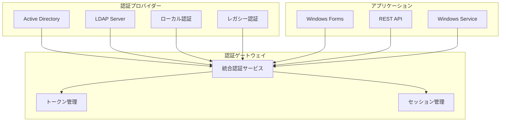
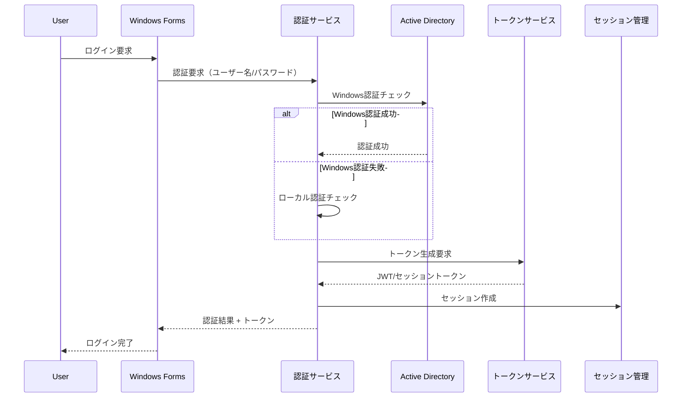

# 認証・認可設計書 - エンタープライズ統合管理システム

## 1. 認証アーキテクチャ概要

### 認証方式の統合


### 認証フロー


## 2. 認証実装

### 統合認証サービス
```csharp
public interface IAuthenticationService
{
    Task<AuthenticationResult> AuthenticateAsync(AuthenticationRequest request);
    Task<bool> ValidateTokenAsync(string token);
    Task LogoutAsync(string token);
    Task<User> GetCurrentUserAsync(string token);
}

public class UnifiedAuthenticationService : IAuthenticationService
{
    private readonly IWindowsAuthProvider _windowsAuth;
    private readonly ILdapAuthProvider _ldapAuth;
    private readonly ILocalAuthProvider _localAuth;
    private readonly ILegacyAuthAdapter _legacyAuth;
    private readonly ITokenService _tokenService;
    private readonly ISessionManager _sessionManager;
    private readonly ILogger<UnifiedAuthenticationService> _logger;
    
    public async Task<AuthenticationResult> AuthenticateAsync(AuthenticationRequest request)
    {
        try
        {
            // 1. Windows認証を試行
            if (request.AuthType == AuthenticationType.Windows || request.AuthType == AuthenticationType.Auto)
            {
                var windowsResult = await TryWindowsAuthenticationAsync(request);
                if (windowsResult.IsSuccess)
                    return await CreateAuthenticationResultAsync(windowsResult.User, AuthenticationType.Windows);
            }
            
            // 2. LDAP認証を試行
            if (request.AuthType == AuthenticationType.LDAP || request.AuthType == AuthenticationType.Auto)
            {
                var ldapResult = await TryLdapAuthenticationAsync(request);
                if (ldapResult.IsSuccess)
                    return await CreateAuthenticationResultAsync(ldapResult.User, AuthenticationType.LDAP);
            }
            
            // 3. ローカル認証を試行
            if (request.AuthType == AuthenticationType.Local || request.AuthType == AuthenticationType.Auto)
            {
                var localResult = await TryLocalAuthenticationAsync(request);
                if (localResult.IsSuccess)
                    return await CreateAuthenticationResultAsync(localResult.User, AuthenticationType.Local);
            }
            
            // 4. レガシーシステム認証を試行
            if (request.AuthType == AuthenticationType.Legacy)
            {
                var legacyResult = await TryLegacyAuthenticationAsync(request);
                if (legacyResult.IsSuccess)
                    return await CreateAuthenticationResultAsync(legacyResult.User, AuthenticationType.Legacy);
            }
            
            // 認証失敗
            await _logger.LogFailedAuthenticationAsync(request.Username, request.ClientInfo);
            return AuthenticationResult.Failed("認証に失敗しました。ユーザー名またはパスワードが正しくありません。");
        }
        catch (Exception ex)
        {
            _logger.LogError(ex, "Authentication error for user {Username}", request.Username);
            return AuthenticationResult.Failed("認証処理中にエラーが発生しました。");
        }
    }
    
    private async Task<AuthenticationResult> CreateAuthenticationResultAsync(User user, AuthenticationType authType)
    {
        // トークン生成
        var token = await _tokenService.GenerateTokenAsync(user, authType);
        
        // セッション作成
        var session = await _sessionManager.CreateSessionAsync(user, token);
        
        // 監査ログ
        await _logger.LogSuccessfulAuthenticationAsync(user.Username, authType);
        
        return AuthenticationResult.Success(new AuthenticationInfo
        {
            User = user,
            Token = token,
            SessionId = session.Id,
            ExpiresAt = session.ExpiresAt,
            AuthenticationType = authType
        });
    }
}
```

### Windows認証プロバイダー
```csharp
public class WindowsAuthenticationProvider : IWindowsAuthProvider
{
    private readonly IActiveDirectoryService _adService;
    private readonly IUserRepository _userRepository;
    
    public async Task<AuthResult> TryWindowsAuthenticationAsync(AuthenticationRequest request)
    {
        try
        {
            // Windows統合認証
            var windowsIdentity = WindowsIdentity.GetCurrent();
            if (windowsIdentity.IsAuthenticated)
            {
                // Active Directoryから詳細情報取得
                var adUser = await _adService.GetUserAsync(windowsIdentity.Name);
                if (adUser != null)
                {
                    // ローカルユーザー情報と同期
                    var user = await SyncUserWithLocalDatabaseAsync(adUser);
                    return AuthResult.Success(user);
                }
            }
            
            // 明示的なWindows認証（ユーザー名/パスワード）
            if (!string.IsNullOrEmpty(request.Username) && !string.IsNullOrEmpty(request.Password))
            {
                var isValid = await ValidateWindowsCredentialsAsync(request.Username, request.Password);
                if (isValid)
                {
                    var adUser = await _adService.GetUserAsync(request.Username);
                    var user = await SyncUserWithLocalDatabaseAsync(adUser);
                    return AuthResult.Success(user);
                }
            }
            
            return AuthResult.Failed();
        }
        catch (Exception ex)
        {
            _logger.LogError(ex, "Windows authentication failed");
            return AuthResult.Failed();
        }
    }
    
    private async Task<bool> ValidateWindowsCredentialsAsync(string username, string password)
    {
        using (var context = new PrincipalContext(ContextType.Domain))
        {
            return context.ValidateCredentials(username, password);
        }
    }
    
    private async Task<User> SyncUserWithLocalDatabaseAsync(ActiveDirectoryUser adUser)
    {
        var user = await _userRepository.GetByUsernameAsync(adUser.SamAccountName);
        
        if (user == null)
        {
            // 新規ユーザー作成
            user = new User
            {
                Username = adUser.SamAccountName,
                Email = adUser.Email,
                DisplayName = adUser.DisplayName,
                AuthenticationType = AuthenticationType.Windows,
                IsActive = true
            };
            
            await _userRepository.CreateAsync(user);
        }
        else
        {
            // 既存ユーザー情報更新
            user.Email = adUser.Email;
            user.DisplayName = adUser.DisplayName;
            user.LastLoginDate = DateTime.UtcNow;
            
            await _userRepository.UpdateAsync(user);
        }
        
        // ADグループから権限情報を同期
        await SyncUserRolesFromADGroupsAsync(user, adUser.Groups);
        
        return user;
    }
}
```

### JWT トークンサービス
```csharp
public class JwtTokenService : ITokenService
{
    private readonly JwtSettings _jwtSettings;
    private readonly IEncryptionService _encryptionService;
    
    public async Task<string> GenerateTokenAsync(User user, AuthenticationType authType)
    {
        var tokenHandler = new JwtSecurityTokenHandler();
        var key = Encoding.ASCII.GetBytes(_jwtSettings.Secret);
        
        var claims = new List<Claim>
        {
            new Claim(ClaimTypes.NameIdentifier, user.Id.ToString()),
            new Claim(ClaimTypes.Name, user.Username),
            new Claim(ClaimTypes.Email, user.Email ?? ""),
            new Claim("DisplayName", user.DisplayName),
            new Claim("AuthType", authType.ToString()),
            new Claim(JwtRegisteredClaimNames.Jti, Guid.NewGuid().ToString())
        };
        
        // ロール情報追加
        foreach (var role in user.Roles)
        {
            claims.Add(new Claim(ClaimTypes.Role, role.RoleName));
        }
        
        // 権限情報追加
        foreach (var permission in user.GetEffectivePermissions())
        {
            claims.Add(new Claim("Permission", permission));
        }
        
        var tokenDescriptor = new SecurityTokenDescriptor
        {
            Subject = new ClaimsIdentity(claims),
            Expires = DateTime.UtcNow.AddMinutes(_jwtSettings.ExpirationMinutes),
            Issuer = _jwtSettings.Issuer,
            Audience = _jwtSettings.Audience,
            SigningCredentials = new SigningCredentials(
                new SymmetricSecurityKey(key), 
                SecurityAlgorithms.HmacSha256Signature)
        };
        
        var token = tokenHandler.CreateToken(tokenDescriptor);
        var tokenString = tokenHandler.WriteToken(token);
        
        // トークンの暗号化（オプション）
        if (_jwtSettings.EncryptToken)
        {
            tokenString = await _encryptionService.EncryptAsync(tokenString);
        }
        
        return tokenString;
    }
    
    public async Task<ClaimsPrincipal> ValidateTokenAsync(string token)
    {
        try
        {
            // 暗号化されている場合は復号
            if (_jwtSettings.EncryptToken)
            {
                token = await _encryptionService.DecryptAsync(token);
            }
            
            var tokenHandler = new JwtSecurityTokenHandler();
            var key = Encoding.ASCII.GetBytes(_jwtSettings.Secret);
            
            var validationParameters = new TokenValidationParameters
            {
                ValidateIssuerSigningKey = true,
                IssuerSigningKey = new SymmetricSecurityKey(key),
                ValidateIssuer = true,
                ValidIssuer = _jwtSettings.Issuer,
                ValidateAudience = true,
                ValidAudience = _jwtSettings.Audience,
                ValidateLifetime = true,
                ClockSkew = TimeSpan.Zero
            };
            
            var principal = tokenHandler.ValidateToken(token, validationParameters, out var validatedToken);
            
            // JTIチェック（トークンの一意性）
            var jti = principal.FindFirst(JwtRegisteredClaimNames.Jti)?.Value;
            if (await IsTokenRevokedAsync(jti))
            {
                throw new SecurityTokenValidationException("Token has been revoked");
            }
            
            return principal;
        }
        catch (Exception ex)
        {
            _logger.LogWarning(ex, "Token validation failed");
            return null;
        }
    }
}
```

## 3. 認可実装

### ロールベースアクセス制御（RBAC）
```csharp
public class AuthorizationService : IAuthorizationService
{
    private readonly IUserRepository _userRepository;
    private readonly IRoleRepository _roleRepository;
    private readonly IPermissionRepository _permissionRepository;
    
    public async Task<bool> AuthorizeAsync(ClaimsPrincipal principal, string resource, string action)
    {
        var userId = principal.FindFirst(ClaimTypes.NameIdentifier)?.Value;
        if (string.IsNullOrEmpty(userId))
            return false;
        
        // キャッシュからユーザー権限を取得
        var permissions = await GetUserPermissionsAsync(int.Parse(userId));
        
        // 権限チェック
        var requiredPermission = $"{resource}:{action}";
        return permissions.Contains(requiredPermission) || permissions.Contains($"{resource}:*");
    }
    
    public async Task<bool> HasRoleAsync(ClaimsPrincipal principal, string roleName)
    {
        return principal.IsInRole(roleName);
    }
    
    public async Task<bool> HasPermissionAsync(ClaimsPrincipal principal, string permission)
    {
        return principal.HasClaim("Permission", permission);
    }
}

// 属性ベースの認可
[AttributeUsage(AttributeTargets.Class | AttributeTargets.Method)]
public class RequirePermissionAttribute : Attribute
{
    public string Resource { get; set; }
    public string Action { get; set; }
    
    public RequirePermissionAttribute(string resource, string action)
    {
        Resource = resource;
        Action = action;
    }
}

// 使用例
public class CustomerService
{
    [RequirePermission("Customer", "Read")]
    public async Task<Customer> GetCustomerAsync(int id)
    {
        // 実装
    }
    
    [RequirePermission("Customer", "Create")]
    public async Task<Customer> CreateCustomerAsync(CreateCustomerDto dto)
    {
        // 実装
    }
    
    [RequirePermission("Customer", "Delete")]
    [RequireRole("Admin")]
    public async Task DeleteCustomerAsync(int id)
    {
        // 実装
    }
}
```

### 階層的権限システム
```csharp
public class HierarchicalPermissionSystem
{
    private readonly Dictionary<string, List<string>> _permissionHierarchy;
    
    public HierarchicalPermissionSystem()
    {
        _permissionHierarchy = new Dictionary<string, List<string>>
        {
            ["Admin"] = new List<string> { "*:*" }, // 全権限
            ["Manager"] = new List<string> 
            { 
                "Customer:*", 
                "Order:*", 
                "Report:Read",
                "Report:Export"
            },
            ["Operator"] = new List<string> 
            { 
                "Customer:Read",
                "Customer:Update",
                "Order:Read",
                "Order:Create",
                "Order:Update"
            },
            ["Viewer"] = new List<string> 
            { 
                "Customer:Read",
                "Order:Read",
                "Report:Read"
            }
        };
    }
    
    public List<string> GetEffectivePermissions(IEnumerable<string> roles)
    {
        var permissions = new HashSet<string>();
        
        foreach (var role in roles)
        {
            if (_permissionHierarchy.ContainsKey(role))
            {
                foreach (var permission in _permissionHierarchy[role])
                {
                    permissions.Add(permission);
                    
                    // ワイルドカード展開
                    if (permission.EndsWith(":*"))
                    {
                        var resource = permission.Substring(0, permission.Length - 2);
                        permissions.UnionWith(GetAllActionsForResource(resource));
                    }
                }
            }
        }
        
        return permissions.ToList();
    }
}
```

## 4. セッション管理

### セッションマネージャー
```csharp
public class SessionManager : ISessionManager
{
    private readonly IMemoryCache _cache;
    private readonly ISessionRepository _sessionRepository;
    private readonly SessionSettings _settings;
    
    public async Task<UserSession> CreateSessionAsync(User user, string token)
    {
        var session = new UserSession
        {
            Id = Guid.NewGuid().ToString(),
            UserId = user.Id,
            Username = user.Username,
            Token = token,
            CreatedAt = DateTime.UtcNow,
            ExpiresAt = DateTime.UtcNow.AddMinutes(_settings.SessionTimeoutMinutes),
            IpAddress = GetClientIpAddress(),
            UserAgent = GetUserAgent()
        };
        
        // データベースに保存
        await _sessionRepository.CreateAsync(session);
        
        // キャッシュに保存
        var cacheOptions = new MemoryCacheEntryOptions
        {
            AbsoluteExpiration = session.ExpiresAt,
            SlidingExpiration = TimeSpan.FromMinutes(_settings.SlidingExpirationMinutes)
        };
        
        _cache.Set($"session_{session.Id}", session, cacheOptions);
        _cache.Set($"user_session_{user.Id}", session.Id, cacheOptions);
        
        return session;
    }
    
    public async Task<bool> ValidateSessionAsync(string sessionId)
    {
        // キャッシュから取得
        if (_cache.TryGetValue($"session_{sessionId}", out UserSession cachedSession))
        {
            if (cachedSession.ExpiresAt > DateTime.UtcNow)
            {
                // スライディング有効期限の更新
                await ExtendSessionAsync(sessionId);
                return true;
            }
        }
        
        // データベースから取得
        var session = await _sessionRepository.GetByIdAsync(sessionId);
        if (session != null && session.ExpiresAt > DateTime.UtcNow && !session.IsRevoked)
        {
            // キャッシュに再登録
            _cache.Set($"session_{sessionId}", session);
            return true;
        }
        
        return false;
    }
    
    public async Task RevokeSessionAsync(string sessionId)
    {
        // キャッシュから削除
        _cache.Remove($"session_{sessionId}");
        
        // データベースで無効化
        await _sessionRepository.RevokeAsync(sessionId);
    }
    
    public async Task RevokeAllUserSessionsAsync(int userId)
    {
        var sessions = await _sessionRepository.GetActiveSessionsByUserIdAsync(userId);
        
        foreach (var session in sessions)
        {
            await RevokeSessionAsync(session.Id);
        }
    }
}
```

## 5. 多要素認証（MFA）

### TOTP実装
```csharp
public class TotpService : ITotpService
{
    private readonly IUserRepository _userRepository;
    private readonly IEncryptionService _encryptionService;
    
    public async Task<TotpSetupInfo> GenerateTotpSecretAsync(int userId)
    {
        var user = await _userRepository.GetByIdAsync(userId);
        
        // シークレット生成
        var secret = GenerateSecret();
        var encryptedSecret = await _encryptionService.EncryptAsync(secret);
        
        // QRコード用URI生成
        var uri = GenerateTotpUri(user.Email, secret);
        var qrCode = GenerateQrCode(uri);
        
        return new TotpSetupInfo
        {
            Secret = secret,
            QrCodeBase64 = qrCode,
            ManualEntryKey = FormatSecretForManualEntry(secret)
        };
    }
    
    public async Task<bool> ValidateTotpCodeAsync(int userId, string code)
    {
        var user = await _userRepository.GetByIdAsync(userId);
        if (string.IsNullOrEmpty(user.TotpSecret))
            return false;
        
        var secret = await _encryptionService.DecryptAsync(user.TotpSecret);
        
        // 時間窓を考慮した検証
        var totp = new Totp(Base32Encoding.ToBytes(secret));
        
        // 現在、前後30秒の時間窓で検証
        for (int i = -1; i <= 1; i++)
        {
            var computedCode = totp.ComputeTotp(DateTime.UtcNow.AddSeconds(i * 30));
            if (computedCode == code)
            {
                // リプレイ攻撃防止
                if (await IsCodeAlreadyUsedAsync(userId, code))
                    return false;
                
                await MarkCodeAsUsedAsync(userId, code);
                return true;
            }
        }
        
        return false;
    }
}
```

## 6. 監査とコンプライアンス

### 認証監査ログ
```csharp
public class AuthenticationAuditLogger : IAuthenticationAuditLogger
{
    private readonly IAuditRepository _auditRepository;
    
    public async Task LogAuthenticationEventAsync(AuthenticationAuditEvent auditEvent)
    {
        var log = new AuthenticationAuditLog
        {
            EventType = auditEvent.EventType,
            Username = auditEvent.Username,
            AuthenticationType = auditEvent.AuthenticationType,
            Success = auditEvent.Success,
            FailureReason = auditEvent.FailureReason,
            IpAddress = auditEvent.IpAddress,
            UserAgent = auditEvent.UserAgent,
            Timestamp = DateTime.UtcNow,
            AdditionalData = JsonSerializer.Serialize(auditEvent.AdditionalData)
        };
        
        await _auditRepository.CreateAsync(log);
        
        // 異常検知
        if (!auditEvent.Success)
        {
            await CheckForBruteForceAttackAsync(auditEvent.Username, auditEvent.IpAddress);
        }
    }
    
    private async Task CheckForBruteForceAttackAsync(string username, string ipAddress)
    {
        var recentFailures = await _auditRepository.GetRecentFailedAttemptsAsync(
            username, 
            ipAddress, 
            TimeSpan.FromMinutes(15));
        
        if (recentFailures.Count >= 5)
        {
            // アカウントロックまたはIPブロック
            await _securityService.HandlePotentialBruteForceAsync(username, ipAddress);
        }
    }
}
```

## 7. シングルサインオン（SSO）統合

### SAML 2.0実装
```csharp
public class Saml2Service : ISsoService
{
    private readonly Saml2Configuration _configuration;
    
    public async Task<string> CreateSamlRequestAsync(string returnUrl)
    {
        var request = new AuthnRequest
        {
            ID = "_" + Guid.NewGuid().ToString(),
            Version = "2.0",
            IssueInstant = DateTime.UtcNow,
            Destination = _configuration.IdpSsoServiceUrl,
            Issuer = new Issuer(_configuration.SpEntityId),
            NameIDPolicy = new NameIDPolicy
            {
                Format = NameIDFormats.EmailAddress,
                AllowCreate = true
            }
        };
        
        var serializedRequest = SerializeSamlRequest(request);
        var encodedRequest = Convert.ToBase64String(Encoding.UTF8.GetBytes(serializedRequest));
        
        return $"{_configuration.IdpSsoServiceUrl}?SAMLRequest={Uri.EscapeDataString(encodedRequest)}&RelayState={Uri.EscapeDataString(returnUrl)}";
    }
    
    public async Task<SamlResponse> ProcessSamlResponseAsync(string samlResponse)
    {
        var decodedResponse = Convert.FromBase64String(samlResponse);
        var responseXml = Encoding.UTF8.GetString(decodedResponse);
        
        // 署名検証
        if (!VerifySamlSignature(responseXml))
        {
            throw new SecurityException("Invalid SAML signature");
        }
        
        // レスポンス解析
        var response = DeserializeSamlResponse(responseXml);
        
        // アサーション検証
        ValidateAssertion(response);
        
        return response;
    }
}
```

## 8. セキュリティベストプラクティス

### パスワードポリシー
```csharp
public class PasswordPolicy : IPasswordPolicy
{
    private readonly PasswordPolicySettings _settings;
    
    public ValidationResult ValidatePassword(string password, User user)
    {
        var errors = new List<string>();
        
        // 長さチェック
        if (password.Length < _settings.MinimumLength)
            errors.Add($"パスワードは{_settings.MinimumLength}文字以上必要です");
        
        // 複雑性チェック
        if (_settings.RequireUppercase && !password.Any(char.IsUpper))
            errors.Add("大文字を含む必要があります");
        
        if (_settings.RequireLowercase && !password.Any(char.IsLower))
            errors.Add("小文字を含む必要があります");
        
        if (_settings.RequireDigit && !password.Any(char.IsDigit))
            errors.Add("数字を含む必要があります");
        
        if (_settings.RequireSpecialCharacter && !Regex.IsMatch(password, @"[!@#$%^&*(),.?""':{}|<>]"))
            errors.Add("特殊文字を含む必要があります");
        
        // 一般的なパスワードチェック
        if (IsCommonPassword(password))
            errors.Add("一般的すぎるパスワードは使用できません");
        
        // ユーザー情報との類似性チェック
        if (ContainsUserInfo(password, user))
            errors.Add("ユーザー名やメールアドレスを含むパスワードは使用できません");
        
        return errors.Any() 
            ? ValidationResult.Failed(errors) 
            : ValidationResult.Success();
    }
}
```

このエンタープライズ向け認証・認可システムにより、セキュアで柔軟な認証基盤が構築され、既存システムとの統合も容易になります。