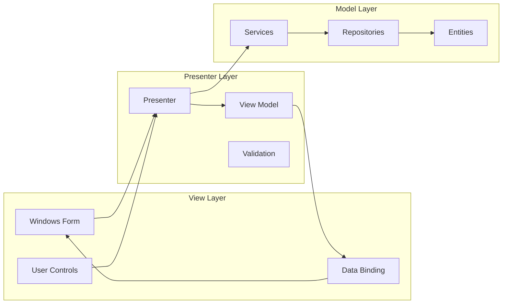

# UI設計パターン - Windows Forms エンタープライズアプリケーション

## 1. UIアーキテクチャ概要

### MVP (Model-View-Presenter) パターン


### 基本実装パターン
```csharp
// View Interface
public interface ICustomerListView
{
    // Properties
    string SearchText { get; set; }
    CustomerViewModel SelectedCustomer { get; set; }
    IList<CustomerViewModel> Customers { get; set; }
    
    // Events
    event EventHandler SearchRequested;
    event EventHandler<CustomerEventArgs> CustomerSelected;
    event EventHandler RefreshRequested;
    
    // Methods
    void ShowLoading(bool isLoading);
    void ShowError(string message);
    void ShowSuccess(string message);
}

// Presenter
public class CustomerListPresenter
{
    private readonly ICustomerListView _view;
    private readonly ICustomerService _customerService;
    private readonly IMapper _mapper;
    
    public CustomerListPresenter(
        ICustomerListView view, 
        ICustomerService customerService,
        IMapper mapper)
    {
        _view = view;
        _customerService = customerService;
        _mapper = mapper;
        
        // イベントハンドラの登録
        _view.SearchRequested += OnSearchRequested;
        _view.CustomerSelected += OnCustomerSelected;
        _view.RefreshRequested += OnRefreshRequested;
    }
    
    public async Task InitializeAsync()
    {
        await LoadCustomersAsync();
    }
    
    private async void OnSearchRequested(object sender, EventArgs e)
    {
        try
        {
            _view.ShowLoading(true);
            
            var customers = await _customerService.SearchAsync(_view.SearchText);
            _view.Customers = _mapper.Map<List<CustomerViewModel>>(customers);
        }
        catch (Exception ex)
        {
            _view.ShowError($"検索中にエラーが発生しました: {ex.Message}");
        }
        finally
        {
            _view.ShowLoading(false);
        }
    }
}

// View Implementation
public partial class CustomerListForm : Form, ICustomerListView
{
    private readonly CustomerListPresenter _presenter;
    private BindingSource _bindingSource;
    
    public CustomerListForm()
    {
        InitializeComponent();
        InitializeDataBinding();
        
        // Presenterの作成（DIコンテナから取得するのが理想）
        _presenter = new CustomerListPresenter(
            this,
            ServiceLocator.GetService<ICustomerService>(),
            ServiceLocator.GetService<IMapper>());
    }
    
    private void InitializeDataBinding()
    {
        _bindingSource = new BindingSource();
        dataGridView.DataSource = _bindingSource;
        
        // カラム設定
        ConfigureGridColumns();
    }
    
    // ICustomerListView実装
    public string SearchText 
    { 
        get => txtSearch.Text;
        set => txtSearch.Text = value;
    }
    
    public IList<CustomerViewModel> Customers
    {
        get => _bindingSource.DataSource as IList<CustomerViewModel>;
        set => _bindingSource.DataSource = value;
    }
    
    public void ShowLoading(bool isLoading)
    {
        this.InvokeIfRequired(() =>
        {
            progressBar.Visible = isLoading;
            dataGridView.Enabled = !isLoading;
        });
    }
}
```

## 2. 共通UIコンポーネント

### ベースフォームクラス
```csharp
public abstract class BaseForm : Form
{
    protected readonly ILogger Logger;
    protected readonly IMessageService MessageService;
    
    protected BaseForm()
    {
        Logger = LogManager.GetCurrentClassLogger();
        MessageService = ServiceLocator.GetService<IMessageService>();
        
        InitializeBaseComponents();
    }
    
    private void InitializeBaseComponents()
    {
        // 共通設定
        this.Font = SystemFonts.MessageBoxFont;
        this.AutoScaleMode = AutoScaleMode.Dpi;
        
        // エラーハンドリング
        this.Load += BaseForm_Load;
        this.FormClosing += BaseForm_FormClosing;
    }
    
    protected virtual void BaseForm_Load(object sender, EventArgs e)
    {
        try
        {
            OnLoad();
        }
        catch (Exception ex)
        {
            HandleException(ex);
        }
    }
    
    protected virtual void OnLoad() { }
    
    protected void HandleException(Exception ex)
    {
        Logger.Error(ex, "Unhandled exception in form");
        MessageService.ShowError(this, "予期しないエラーが発生しました。", "エラー");
    }
    
    // 非同期操作のヘルパー
    protected async Task ExecuteAsync(Func<Task> action, string loadingMessage = "処理中...")
    {
        using (var loadingForm = new LoadingForm(loadingMessage))
        {
            try
            {
                loadingForm.Show(this);
                await action();
            }
            catch (Exception ex)
            {
                HandleException(ex);
            }
            finally
            {
                loadingForm.Close();
            }
        }
    }
}

// MDI親フォーム
public class MainMdiForm : BaseForm
{
    private readonly Dictionary<Type, Form> _openForms = new Dictionary<Type, Form>();
    
    protected override void OnLoad()
    {
        base.OnLoad();
        
        // MDI設定
        this.IsMdiContainer = true;
        this.WindowState = FormWindowState.Maximized;
        
        // メニューとツールバーの初期化
        InitializeMenu();
        InitializeToolBar();
        InitializeStatusBar();
    }
    
    public void ShowChildForm<T>() where T : Form, new()
    {
        if (_openForms.TryGetValue(typeof(T), out var existingForm))
        {
            existingForm.Activate();
            return;
        }
        
        var form = ServiceLocator.GetService<T>() ?? new T();
        form.MdiParent = this;
        form.FormClosed += (s, e) => _openForms.Remove(typeof(T));
        
        _openForms[typeof(T)] = form;
        form.Show();
    }
}
```

### カスタムコントロール

#### 検索可能コンボボックス
```csharp
public class SearchableComboBox : ComboBox
{
    private TextBox _searchBox;
    private ListBox _resultList;
    private Form _dropDownForm;
    private Timer _searchTimer;
    
    public int MinSearchLength { get; set; } = 2;
    public int SearchDelay { get; set; } = 300;
    
    public SearchableComboBox()
    {
        InitializeComponents();
    }
    
    private void InitializeComponents()
    {
        // 検索用テキストボックス
        _searchBox = new TextBox
        {
            Dock = DockStyle.Fill
        };
        
        // 結果表示用リストボックス
        _resultList = new ListBox
        {
            Dock = DockStyle.Fill,
            Height = 200
        };
        
        // ドロップダウンフォーム
        _dropDownForm = new Form
        {
            FormBorderStyle = FormBorderStyle.None,
            ShowInTaskbar = false,
            StartPosition = FormStartPosition.Manual
        };
        
        _dropDownForm.Controls.Add(_resultList);
        
        // イベント設定
        _searchBox.TextChanged += OnSearchTextChanged;
        _resultList.SelectedIndexChanged += OnResultSelected;
        
        // タイマー設定
        _searchTimer = new Timer { Interval = SearchDelay };
        _searchTimer.Tick += OnSearchTimerTick;
    }
    
    protected override void OnDropDown(EventArgs e)
    {
        // 標準のドロップダウンを無効化
        this.DroppedDown = false;
        
        // カスタムドロップダウンを表示
        ShowDropDown();
    }
    
    private async void OnSearchTimerTick(object sender, EventArgs e)
    {
        _searchTimer.Stop();
        
        if (_searchBox.Text.Length >= MinSearchLength)
        {
            var results = await SearchAsync(_searchBox.Text);
            UpdateResults(results);
        }
    }
    
    protected virtual async Task<IEnumerable<object>> SearchAsync(string searchText)
    {
        // オーバーライドして検索ロジックを実装
        return await Task.FromResult(new List<object>());
    }
}
```

#### 高機能データグリッド
```csharp
public class EnhancedDataGridView : DataGridView
{
    private ContextMenuStrip _columnMenu;
    private ToolStripMenuItem _autoSizeMenuItem;
    private ToolStripMenuItem _exportMenuItem;
    
    public bool EnableExcelExport { get; set; } = true;
    public bool EnableColumnCustomization { get; set; } = true;
    public bool EnableAdvancedFiltering { get; set; } = true;
    
    public EnhancedDataGridView()
    {
        InitializeEnhancements();
    }
    
    private void InitializeEnhancements()
    {
        // 基本設定
        this.AllowUserToAddRows = false;
        this.AllowUserToDeleteRows = false;
        this.SelectionMode = DataGridViewSelectionMode.FullRowSelect;
        this.MultiSelect = true;
        this.ReadOnly = true;
        
        // ダブルバッファリング有効化
        typeof(DataGridView).InvokeMember(
            "DoubleBuffered",
            BindingFlags.NonPublic | BindingFlags.Instance | BindingFlags.SetProperty,
            null,
            this,
            new object[] { true });
        
        // コンテキストメニュー設定
        InitializeContextMenu();
        
        // イベント設定
        this.CellFormatting += OnCellFormatting;
        this.ColumnHeaderMouseClick += OnColumnHeaderMouseClick;
    }
    
    private void OnCellFormatting(object sender, DataGridViewCellFormattingEventArgs e)
    {
        // 数値のフォーマット
        if (e.Value is decimal || e.Value is double || e.Value is float)
        {
            e.Value = string.Format("{0:N2}", e.Value);
            e.FormattingApplied = true;
        }
        
        // 日付のフォーマット
        if (e.Value is DateTime dateTime)
        {
            e.Value = dateTime.ToString("yyyy/MM/dd HH:mm");
            e.FormattingApplied = true;
        }
        
        // NULL値の表示
        if (e.Value == null || e.Value == DBNull.Value)
        {
            e.Value = "-";
            e.CellStyle.ForeColor = Color.Gray;
            e.FormattingApplied = true;
        }
    }
    
    public void ExportToExcel()
    {
        using (var package = new ExcelPackage())
        {
            var worksheet = package.Workbook.Worksheets.Add("Data");
            
            // ヘッダー
            for (int i = 0; i < this.Columns.Count; i++)
            {
                worksheet.Cells[1, i + 1].Value = this.Columns[i].HeaderText;
            }
            
            // データ
            for (int row = 0; row < this.Rows.Count; row++)
            {
                for (int col = 0; col < this.Columns.Count; col++)
                {
                    worksheet.Cells[row + 2, col + 1].Value = this.Rows[row].Cells[col].Value;
                }
            }
            
            // スタイル設定
            worksheet.Cells[1, 1, 1, this.Columns.Count].Style.Font.Bold = true;
            worksheet.Cells.AutoFitColumns();
            
            // 保存
            var saveDialog = new SaveFileDialog
            {
                Filter = "Excel Files|*.xlsx",
                FileName = $"Export_{DateTime.Now:yyyyMMdd_HHmmss}.xlsx"
            };
            
            if (saveDialog.ShowDialog() == DialogResult.OK)
            {
                package.SaveAs(new FileInfo(saveDialog.FileName));
            }
        }
    }
}
```

## 3. レイアウトパターン

### レスポンシブレイアウト
```csharp
public class ResponsivePanel : Panel
{
    private TableLayoutPanel _layoutPanel;
    private readonly List<ResponsiveControl> _controls = new List<ResponsiveControl>();
    
    public ResponsivePanel()
    {
        InitializeLayout();
        this.Resize += OnPanelResize;
    }
    
    private void InitializeLayout()
    {
        _layoutPanel = new TableLayoutPanel
        {
            Dock = DockStyle.Fill,
            AutoSize = true,
            AutoSizeMode = AutoSizeMode.GrowAndShrink
        };
        
        this.Controls.Add(_layoutPanel);
    }
    
    public void AddControl(Control control, ResponsiveSettings settings)
    {
        _controls.Add(new ResponsiveControl
        {
            Control = control,
            Settings = settings
        });
        
        UpdateLayout();
    }
    
    private void OnPanelResize(object sender, EventArgs e)
    {
        UpdateLayout();
    }
    
    private void UpdateLayout()
    {
        _layoutPanel.SuspendLayout();
        _layoutPanel.Controls.Clear();
        _layoutPanel.RowStyles.Clear();
        _layoutPanel.ColumnStyles.Clear();
        
        var width = this.ClientSize.Width;
        
        // ブレークポイントに基づいてレイアウトを決定
        if (width < 768) // Mobile
        {
            ApplyMobileLayout();
        }
        else if (width < 1024) // Tablet
        {
            ApplyTabletLayout();
        }
        else // Desktop
        {
            ApplyDesktopLayout();
        }
        
        _layoutPanel.ResumeLayout();
    }
    
    private void ApplyDesktopLayout()
    {
        _layoutPanel.ColumnCount = 12; // 12カラムグリッド
        
        foreach (var item in _controls)
        {
            var colSpan = item.Settings.DesktopColumns;
            var col = GetNextAvailableColumn(colSpan);
            
            _layoutPanel.Controls.Add(item.Control, col, GetCurrentRow());
            _layoutPanel.SetColumnSpan(item.Control, colSpan);
        }
    }
}

public class ResponsiveSettings
{
    public int MobileColumns { get; set; } = 12;
    public int TabletColumns { get; set; } = 6;
    public int DesktopColumns { get; set; } = 4;
    public int Order { get; set; } = 0;
}
```

### ウィザード形式のUI
```csharp
public abstract class WizardForm : BaseForm
{
    private Panel _navigationPanel;
    private Panel _contentPanel;
    private Button _previousButton;
    private Button _nextButton;
    private Button _finishButton;
    
    private readonly List<WizardPage> _pages = new List<WizardPage>();
    private int _currentPageIndex = 0;
    
    protected override void OnLoad()
    {
        base.OnLoad();
        InitializeWizardUI();
        LoadPages();
        ShowPage(0);
    }
    
    private void InitializeWizardUI()
    {
        // ナビゲーションパネル
        _navigationPanel = new Panel
        {
            Dock = DockStyle.Bottom,
            Height = 60
        };
        
        _previousButton = new Button
        {
            Text = "戻る",
            Location = new Point(12, 15),
            Enabled = false
        };
        
        _nextButton = new Button
        {
            Text = "次へ",
            Location = new Point(100, 15)
        };
        
        _finishButton = new Button
        {
            Text = "完了",
            Location = new Point(188, 15),
            Visible = false
        };
        
        _navigationPanel.Controls.AddRange(new Control[]
        {
            _previousButton, _nextButton, _finishButton
        });
        
        // コンテンツパネル
        _contentPanel = new Panel
        {
            Dock = DockStyle.Fill
        };
        
        this.Controls.Add(_contentPanel);
        this.Controls.Add(_navigationPanel);
        
        // イベント設定
        _previousButton.Click += OnPreviousClick;
        _nextButton.Click += OnNextClick;
        _finishButton.Click += OnFinishClick;
    }
    
    protected abstract void LoadPages();
    
    protected void AddPage(WizardPage page)
    {
        page.Dock = DockStyle.Fill;
        _pages.Add(page);
    }
    
    private void ShowPage(int index)
    {
        if (index < 0 || index >= _pages.Count) return;
        
        // 現在のページを検証
        if (_currentPageIndex != index && !ValidateCurrentPage())
            return;
        
        // ページ切り替え
        _contentPanel.Controls.Clear();
        _contentPanel.Controls.Add(_pages[index]);
        
        _currentPageIndex = index;
        
        // ボタン状態更新
        UpdateNavigationButtons();
        
        // ページイベント発火
        _pages[index].OnPageShown();
    }
    
    private void UpdateNavigationButtons()
    {
        _previousButton.Enabled = _currentPageIndex > 0;
        _nextButton.Visible = _currentPageIndex < _pages.Count - 1;
        _finishButton.Visible = _currentPageIndex == _pages.Count - 1;
    }
    
    private bool ValidateCurrentPage()
    {
        var currentPage = _pages[_currentPageIndex];
        var validationResult = currentPage.Validate();
        
        if (!validationResult.IsValid)
        {
            MessageService.ShowWarning(this, validationResult.ErrorMessage);
            return false;
        }
        
        return true;
    }
}

public abstract class WizardPage : UserControl
{
    public abstract string Title { get; }
    public abstract string Description { get; }
    
    public virtual void OnPageShown() { }
    
    public virtual ValidationResult Validate()
    {
        return ValidationResult.Success();
    }
}
```

## 4. データバインディングパターン

### 双方向データバインディング
```csharp
public class DataBindingHelper
{
    public static void BindProperty<TControl, TSource>(
        TControl control,
        Expression<Func<TControl, object>> controlProperty,
        TSource source,
        Expression<Func<TSource, object>> sourceProperty,
        DataSourceUpdateMode updateMode = DataSourceUpdateMode.OnPropertyChanged)
        where TControl : Control
    {
        var controlPropertyName = GetPropertyName(controlProperty);
        var sourcePropertyName = GetPropertyName(sourceProperty);
        
        control.DataBindings.Add(
            controlPropertyName,
            source,
            sourcePropertyName,
            false,
            updateMode);
    }
    
    private static string GetPropertyName<T>(Expression<Func<T, object>> propertyExpression)
    {
        if (propertyExpression.Body is MemberExpression memberExpression)
            return memberExpression.Member.Name;
        
        if (propertyExpression.Body is UnaryExpression unaryExpression &&
            unaryExpression.Operand is MemberExpression operand)
            return operand.Member.Name;
        
        throw new ArgumentException("Invalid property expression");
    }
}

// 使用例
public class CustomerEditForm : BaseForm
{
    private CustomerViewModel _viewModel;
    
    protected override void OnLoad()
    {
        base.OnLoad();
        
        _viewModel = new CustomerViewModel();
        
        // 型安全なバインディング
        DataBindingHelper.BindProperty(
            txtCustomerName,
            c => c.Text,
            _viewModel,
            vm => vm.CustomerName);
        
        DataBindingHelper.BindProperty(
            numCreditLimit,
            c => c.Value,
            _viewModel,
            vm => vm.CreditLimit);
        
        // エラープロバイダーの設定
        SetupValidation();
    }
    
    private void SetupValidation()
    {
        var errorProvider = new ErrorProvider();
        
        _viewModel.PropertyChanged += (s, e) =>
        {
            var errors = _viewModel.GetErrors(e.PropertyName);
            var control = GetControlForProperty(e.PropertyName);
            
            if (control != null)
            {
                errorProvider.SetError(control, errors.FirstOrDefault()?.ErrorMessage ?? "");
            }
        };
    }
}
```

## 5. 非同期UIパターン

### プログレス表示
```csharp
public class ProgressForm : Form
{
    private ProgressBar _progressBar;
    private Label _statusLabel;
    private Button _cancelButton;
    private CancellationTokenSource _cancellationTokenSource;
    
    public ProgressForm()
    {
        InitializeComponents();
    }
    
    public async Task<T> ExecuteAsync<T>(
        Func<IProgress<ProgressInfo>, CancellationToken, Task<T>> operation,
        string title = "処理中")
    {
        this.Text = title;
        _cancellationTokenSource = new CancellationTokenSource();
        
        var progress = new Progress<ProgressInfo>(UpdateProgress);
        
        try
        {
            this.Show();
            
            var result = await operation(progress, _cancellationTokenSource.Token);
            
            this.Close();
            return result;
        }
        catch (OperationCanceledException)
        {
            MessageBox.Show("処理がキャンセルされました。", "キャンセル", 
                MessageBoxButtons.OK, MessageBoxIcon.Information);
            throw;
        }
        finally
        {
            this.Close();
        }
    }
    
    private void UpdateProgress(ProgressInfo info)
    {
        this.InvokeIfRequired(() =>
        {
            _progressBar.Value = info.PercentComplete;
            _statusLabel.Text = info.StatusMessage;
            
            if (info.IsIndeterminate)
            {
                _progressBar.Style = ProgressBarStyle.Marquee;
            }
            else
            {
                _progressBar.Style = ProgressBarStyle.Continuous;
            }
        });
    }
}

public class ProgressInfo
{
    public int PercentComplete { get; set; }
    public string StatusMessage { get; set; }
    public bool IsIndeterminate { get; set; }
}
```

## 6. UI状態管理

### 状態管理パターン
```csharp
public class UIStateManager
{
    private readonly Dictionary<string, UIState> _states = new Dictionary<string, UIState>();
    private readonly Form _form;
    
    public UIStateManager(Form form)
    {
        _form = form;
        InitializeStates();
    }
    
    private void InitializeStates()
    {
        // 初期状態
        RegisterState("Initial", new UIState
        {
            EnabledControls = new[] { "btnNew", "btnSearch" },
            DisabledControls = new[] { "btnSave", "btnDelete" },
            VisibleControls = new[] { "pnlSearch" },
            HiddenControls = new[] { "pnlEdit" }
        });
        
        // 編集状態
        RegisterState("Editing", new UIState
        {
            EnabledControls = new[] { "btnSave", "btnCancel" },
            DisabledControls = new[] { "btnNew", "btnSearch", "btnDelete" },
            VisibleControls = new[] { "pnlEdit" },
            HiddenControls = new[] { "pnlSearch" }
        });
    }
    
    public void RegisterState(string stateName, UIState state)
    {
        _states[stateName] = state;
    }
    
    public void TransitionTo(string stateName)
    {
        if (!_states.TryGetValue(stateName, out var state))
            throw new ArgumentException($"State '{stateName}' not found");
        
        _form.SuspendLayout();
        
        try
        {
            // コントロールの有効/無効
            foreach (var name in state.EnabledControls)
            {
                SetControlEnabled(name, true);
            }
            
            foreach (var name in state.DisabledControls)
            {
                SetControlEnabled(name, false);
            }
            
            // コントロールの表示/非表示
            foreach (var name in state.VisibleControls)
            {
                SetControlVisible(name, true);
            }
            
            foreach (var name in state.HiddenControls)
            {
                SetControlVisible(name, false);
            }
        }
        finally
        {
            _form.ResumeLayout();
        }
    }
    
    private void SetControlEnabled(string controlName, bool enabled)
    {
        var control = _form.Controls.Find(controlName, true).FirstOrDefault();
        if (control != null)
            control.Enabled = enabled;
    }
}
```

このUI設計パターンにより、保守性が高く、ユーザーフレンドリーなWindows Formsアプリケーションの構築が可能になります。