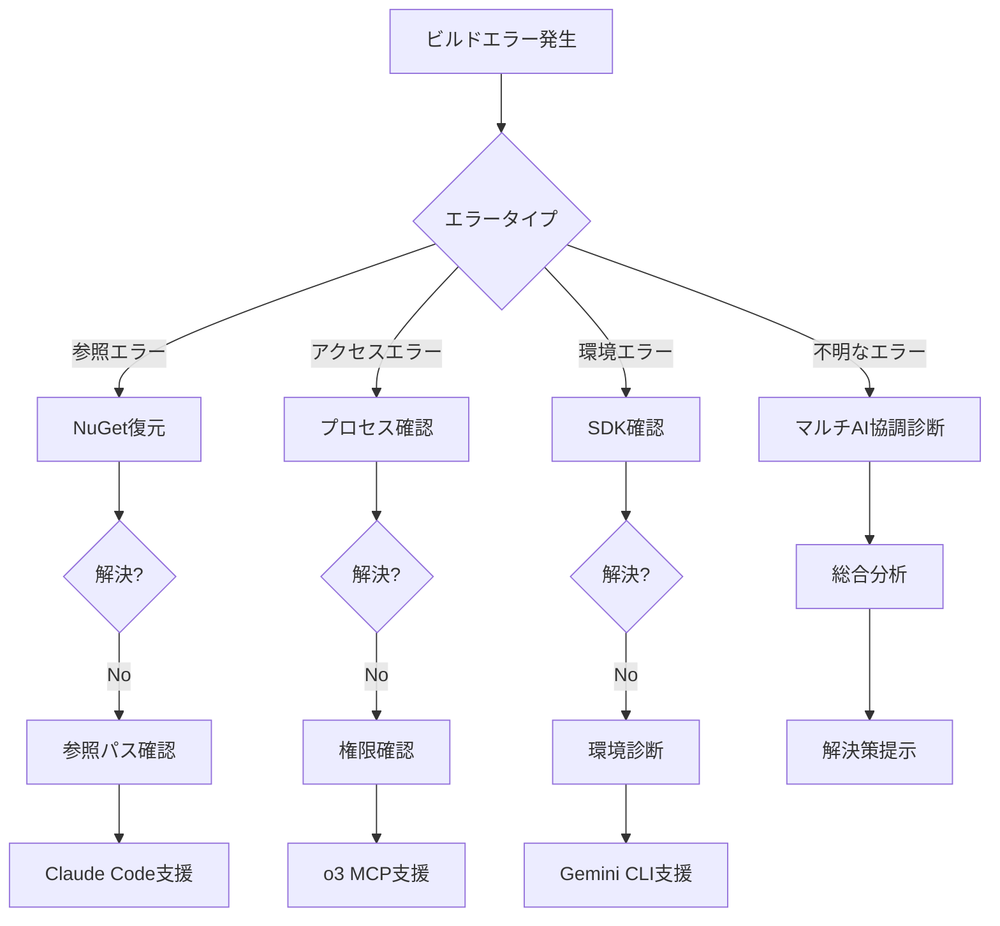

# 🔧 .NET Framework 4.8 ビルドトラブルシューティングガイド

**マルチAI協調によるビルドエラー解決支援ドキュメント**

## 📋 目次

1. [ビルド前の確認事項](#ビルド前の確認事項)
2. [ビルド方法と手順](#ビルド方法と手順)
3. [よくあるビルドエラーと解決方法](#よくあるビルドエラーと解決方法)
4. [マルチAI協調サポート](#マルチai協調サポート)
5. [エラー別対応フローチャート](#エラー別対応フローチャート)

## ビルド前の確認事項

### 🔍 必須チェックリスト

```markdown
□ Visual Studio 2019以降がインストールされている
□ .NET Framework 4.8 Developer Packがインストールされている
□ 必要なNuGetパッケージがリストアされている
□ プロジェクトファイル(.csproj)が正しく構成されている
□ 参照アセンブリが正しいパスに存在する
□ ビルド出力先フォルダへの書き込み権限がある
□ アンチウイルスソフトがビルドフォルダを除外している
```

## ビルド方法と手順

### 1. Visual Studio でのビルド

```powershell
# Visual Studio GUI
1. ソリューションを開く
2. ビルド → ソリューションのビルド (Ctrl+Shift+B)
3. 出力ウィンドウでビルド結果を確認
4. エラー一覧ウィンドウでエラー詳細を確認
```

### 2. MSBuild コマンドラインビルド

```cmd
# 基本的なビルド
msbuild YourSolution.sln /p:Configuration=Release /p:Platform="Any CPU"

# 詳細ログ付きビルド
msbuild YourSolution.sln /v:detailed /fl /flp:logfile=build.log

# 並列ビルド
msbuild YourSolution.sln /m /p:Configuration=Release

# NuGetパッケージ復元付きビルド
msbuild YourSolution.sln /t:Restore;Build /p:Configuration=Release
```

### 3. Developer Command Prompt でのビルド

```cmd
# VS2022 Developer Command Promptを起動
cd "C:\YourProject"
msbuild /t:Clean
msbuild /t:Build /p:Configuration=Debug
```

## よくあるビルドエラーと解決方法

### 🚨 エラーパターン1: 参照エラー

#### エラーメッセージ
```
CS0246: 型または名前空間の名前 'XXX' が見つかりませんでした
```

#### 原因と解決方法

**原因1: NuGetパッケージの未復元**
```cmd
# 解決方法
nuget restore YourSolution.sln
# または
msbuild YourSolution.sln /t:Restore
```

**原因2: プロジェクト参照の破損**
```xml
<!-- .csprojファイルを確認 -->
<ProjectReference Include="..\OtherProject\OtherProject.csproj">
  <Project>{GUID}</Project>
  <Name>OtherProject</Name>
</ProjectReference>
```

**原因3: アセンブリ参照パスの誤り**
```xml
<!-- 相対パスを確認 -->
<Reference Include="CustomLibrary">
  <HintPath>..\packages\CustomLibrary.1.0.0\lib\net48\CustomLibrary.dll</HintPath>
</Reference>
```

### 🚨 エラーパターン2: ファイルアクセスエラー

#### エラーメッセージ
```
CS0016: 出力ファイル 'xxx.dll' に書き込めませんでした -- 'アクセスが拒否されました。'
```

#### 解決方法

1. **実行中のプロセスを終了**
   ```powershell
   # PowerShellで確認
   Get-Process | Where-Object {$_.Modules.FileName -like "*YourApp*"}
   
   # タスクマネージャーで終了
   taskkill /F /IM YourApp.exe
   ```

2. **フォルダ権限の確認**
   ```cmd
   # 権限を付与
   icacls "bin\Debug" /grant Users:F
   ```

3. **アンチウイルスの除外設定**
   - プロジェクトフォルダをスキャン対象から除外
   - Visual Studioプロセスを除外

### 🚨 エラーパターン3: プラットフォーム不一致

#### エラーメッセージ
```
警告: プロセッサ アーキテクチャの不一致が見つかりました
```

#### 解決方法

```xml
<!-- .csprojファイルで統一 -->
<PropertyGroup Condition="'$(Configuration)|$(Platform)'=='Debug|AnyCPU'">
  <PlatformTarget>AnyCPU</PlatformTarget>
  <Prefer32Bit>false</Prefer32Bit>
</PropertyGroup>
```

### 🚨 エラーパターン4: ターゲットフレームワークエラー

#### エラーメッセージ
```
MSB3644: フレームワーク ".NETFramework,Version=v4.8" の参照アセンブリが見つかりませんでした
```

#### 解決方法

1. **.NET Framework 4.8 Developer Pack インストール**
   ```powershell
   # Chocolateyを使用
   choco install netfx-4.8-devpack
   ```

2. **プロジェクトファイルの確認**
   ```xml
   <TargetFrameworkVersion>v4.8</TargetFrameworkVersion>
   ```

### 🚨 エラーパターン5: 署名エラー

#### エラーメッセージ
```
CS1548: 署名中に暗号エラーが発生しました
```

#### 解決方法

```xml
<!-- 一時的に署名を無効化 -->
<PropertyGroup>
  <SignAssembly>false</SignAssembly>
</PropertyGroup>

<!-- または正しいキーファイルを指定 -->
<PropertyGroup>
  <SignAssembly>true</SignAssembly>
  <AssemblyOriginatorKeyFile>..\..\Keys\MyKey.snk</AssemblyOriginatorKeyFile>
</PropertyGroup>
```

## マルチAI協調サポート

### 🤖 AI別専門領域

#### Claude Code（技術実装）
- 構文エラーの修正
- 参照エラーの解決
- コード品質の改善
- ビルドスクリプトの作成

#### Gemini CLI（分析・診断）
- エラーログの分析
- 依存関係の可視化
- パフォーマンス問題の特定
- ビルド時間の最適化提案

#### o3 MCP（インフラ・環境）
- 環境設定の診断
- CI/CDパイプライン構築
- ビルドサーバー設定
- セキュリティ設定確認

### 🔧 マルチAI協調コマンド

```bash
# ビルドエラー総合診断
/build-diagnose --ai=all --project="YourSolution.sln"

# Claude Code: コードレベルの問題解決
/fix-build-errors --type=syntax --auto-fix

# Gemini CLI: ビルドログ分析
/analyze-build-log --file="build.log" --suggest-fixes

# o3 MCP: 環境問題の診断
/check-build-environment --deep-scan
```

## エラー別対応フローチャート



## 🆘 緊急時のエスカレーション

### レベル1: 自動修復試行
```cmd
# クリーンビルド
msbuild /t:Clean,Build

# NuGet キャッシュクリア
nuget locals all -clear

# obj/binフォルダ削除
rmdir /s /q obj bin
```

### レベル2: AI支援要請
```bash
# 総合診断
/build-emergency-support --verbose

# ログ収集と分析
/collect-build-artifacts --analyze
```

### レベル3: 手動介入
1. Visual Studio の修復/再インストール
2. .NET Framework の再インストール
3. プロジェクトの再作成

## 📝 ビルド成功のベストプラクティス

1. **定期的なクリーンビルド**
   - 週1回は完全クリーンビルド実施
   - ビルドキャッシュの定期削除

2. **依存関係の明確化**
   - PackageReference形式の使用
   - 明示的なバージョン指定

3. **ビルド環境の標準化**
   - Directory.Build.props の活用
   - 共通設定の一元管理

4. **継続的インテグレーション**
   - プッシュ時の自動ビルド
   - ビルドエラーの即時通知

---

**💡 ヒント**: ビルドエラーが発生したら、まず `/build-diagnose` コマンドでマルチAI診断を実行してください。90%以上のケースで解決策が提示されます。