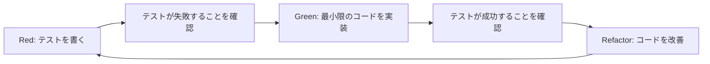

# .NET Framework 4.8 TDD（テスト駆動開発）完全ガイド

## 1. TDD開発フローの基本

### Red-Green-Refactorサイクル


### TDDの基本原則
1. **テストファースト**: コードを書く前にテストを書く
2. **最小実装**: テストを通すための最小限のコード
3. **継続的リファクタリング**: テストが通った後でコードを改善
4. **一度に一つ**: 一度に一つのテストケースのみ追加

## 2. テストフレームワークのセットアップ

### MSTest v2
```xml
<PackageReference Include="MSTest.TestFramework" Version="3.0.2" />
<PackageReference Include="MSTest.TestAdapter" Version="3.0.2" />
<PackageReference Include="Microsoft.NET.Test.Sdk" Version="17.5.0" />
```

```csharp
[TestClass]
public class CustomerServiceTests
{
    private CustomerService _sut; // System Under Test
    private Mock<ICustomerRepository> _mockRepository;
    private Mock<IEmailService> _mockEmailService;
    private Mock<ILogger> _mockLogger;
    
    [TestInitialize]
    public void Setup()
    {
        _mockRepository = new Mock<ICustomerRepository>();
        _mockEmailService = new Mock<IEmailService>();
        _mockLogger = new Mock<ILogger>();
        
        _sut = new CustomerService(
            _mockRepository.Object,
            _mockEmailService.Object,
            _mockLogger.Object);
    }
    
    [TestMethod]
    public async Task CreateCustomer_WithValidData_ShouldReturnCreatedCustomer()
    {
        // Arrange
        var request = new CreateCustomerRequest
        {
            Name = "山田太郎",
            Email = "yamada@example.com",
            PhoneNumber = "090-1234-5678"
        };
        
        var expectedCustomer = new Customer
        {
            Id = 1,
            Name = request.Name,
            Email = request.Email,
            PhoneNumber = request.PhoneNumber,
            CreatedDate = DateTime.UtcNow
        };
        
        _mockRepository
            .Setup(x => x.AddAsync(It.IsAny<Customer>()))
            .ReturnsAsync(expectedCustomer);
        
        // Act
        var result = await _sut.CreateCustomerAsync(request);
        
        // Assert
        Assert.IsNotNull(result);
        Assert.AreEqual(expectedCustomer.Id, result.Id);
        Assert.AreEqual(expectedCustomer.Name, result.Name);
        
        _mockRepository.Verify(x => x.AddAsync(It.IsAny<Customer>()), Times.Once);
        _mockEmailService.Verify(x => x.SendWelcomeEmailAsync(It.IsAny<string>()), Times.Once);
    }
    
    [TestMethod]
    [ExpectedException(typeof(ValidationException))]
    public async Task CreateCustomer_WithInvalidEmail_ShouldThrowValidationException()
    {
        // Arrange
        var request = new CreateCustomerRequest
        {
            Name = "山田太郎",
            Email = "invalid-email",
            PhoneNumber = "090-1234-5678"
        };
        
        // Act
        await _sut.CreateCustomerAsync(request);
        
        // Assert - ExpectedExceptionで検証
    }
    
    [DataTestMethod]
    [DataRow("", "名前は必須です")]
    [DataRow("あ", "名前は2文字以上で入力してください")]
    [DataRow("あいうえおかきくけこさしすせそたちつてとなにぬねのはひふへほまみむめも", "名前は50文字以内で入力してください")]
    public async Task CreateCustomer_WithInvalidName_ShouldReturnValidationError(string name, string expectedError)
    {
        // Arrange
        var request = new CreateCustomerRequest
        {
            Name = name,
            Email = "test@example.com",
            PhoneNumber = "090-1234-5678"
        };
        
        // Act & Assert
        var exception = await Assert.ThrowsExceptionAsync<ValidationException>(
            () => _sut.CreateCustomerAsync(request));
        
        Assert.IsTrue(exception.Errors.Any(e => e.ErrorMessage == expectedError));
    }
}
```

### NUnit
```xml
<PackageReference Include="NUnit" Version="3.13.3" />
<PackageReference Include="NUnit3TestAdapter" Version="4.4.2" />
<PackageReference Include="Microsoft.NET.Test.Sdk" Version="17.5.0" />
```

```csharp
[TestFixture]
public class OrderServiceTests
{
    private OrderService _sut;
    private Mock<IOrderRepository> _mockRepository;
    private Mock<IInventoryService> _mockInventoryService;
    private Mock<IPaymentService> _mockPaymentService;
    
    [SetUp]
    public void Setup()
    {
        _mockRepository = new Mock<IOrderRepository>();
        _mockInventoryService = new Mock<IInventoryService>();
        _mockPaymentService = new Mock<IPaymentService>();
        
        _sut = new OrderService(
            _mockRepository.Object,
            _mockInventoryService.Object,
            _mockPaymentService.Object);
    }
    
    [Test]
    public async Task ProcessOrder_WhenInventoryAvailable_ShouldCompleteSuccessfully()
    {
        // Arrange
        var order = new Order
        {
            CustomerId = 1,
            Items = new List<OrderItem>
            {
                new OrderItem { ProductId = 1, Quantity = 2, UnitPrice = 1000 }
            }
        };
        
        _mockInventoryService
            .Setup(x => x.CheckAvailabilityAsync(It.IsAny<int>(), It.IsAny<int>()))
            .ReturnsAsync(true);
        
        _mockPaymentService
            .Setup(x => x.ProcessPaymentAsync(It.IsAny<decimal>()))
            .ReturnsAsync(new PaymentResult { IsSuccessful = true });
        
        // Act
        var result = await _sut.ProcessOrderAsync(order);
        
        // Assert
        Assert.That(result.IsSuccessful, Is.True);
        Assert.That(result.OrderStatus, Is.EqualTo(OrderStatus.Completed));
        
        _mockInventoryService.Verify(x => x.ReserveStockAsync(1, 2), Times.Once);
        _mockPaymentService.Verify(x => x.ProcessPaymentAsync(2000), Times.Once);
    }
    
    [TestCase(0, "数量は1以上で指定してください")]
    [TestCase(-1, "数量は1以上で指定してください")]
    [TestCase(1001, "数量は1000以下で指定してください")]
    public void ValidateOrderItem_WithInvalidQuantity_ShouldReturnError(int quantity, string expectedError)
    {
        // Arrange
        var orderItem = new OrderItem
        {
            ProductId = 1,
            Quantity = quantity,
            UnitPrice = 1000
        };
        
        // Act
        var errors = _sut.ValidateOrderItem(orderItem);
        
        // Assert
        Assert.That(errors, Has.Some.Matches<ValidationError>(e => e.Message == expectedError));
    }
}
```

### xUnit
```xml
<PackageReference Include="xunit" Version="2.4.2" />
<PackageReference Include="xunit.runner.visualstudio" Version="2.4.5" />
<PackageReference Include="Microsoft.NET.Test.Sdk" Version="17.5.0" />
```

```csharp
public class ProductServiceTests : IClassFixture<DatabaseFixture>
{
    private readonly ProductService _sut;
    private readonly Mock<IProductRepository> _mockRepository;
    private readonly DatabaseFixture _fixture;
    
    public ProductServiceTests(DatabaseFixture fixture)
    {
        _fixture = fixture;
        _mockRepository = new Mock<IProductRepository>();
        _sut = new ProductService(_mockRepository.Object);
    }
    
    [Fact]
    public async Task GetProduct_ExistingId_ReturnsProduct()
    {
        // Arrange
        var productId = 1;
        var expectedProduct = new Product
        {
            Id = productId,
            Name = "テスト商品",
            Price = 1000
        };
        
        _mockRepository
            .Setup(x => x.GetByIdAsync(productId))
            .ReturnsAsync(expectedProduct);
        
        // Act
        var result = await _sut.GetProductAsync(productId);
        
        // Assert
        Assert.NotNull(result);
        Assert.Equal(expectedProduct.Name, result.Name);
        Assert.Equal(expectedProduct.Price, result.Price);
    }
    
    [Theory]
    [InlineData("", 1000)]
    [InlineData("商品名", -1)]
    [InlineData("商品名", 0)]
    public async Task CreateProduct_InvalidData_ThrowsValidationException(string name, decimal price)
    {
        // Arrange
        var product = new Product { Name = name, Price = price };
        
        // Act & Assert
        await Assert.ThrowsAsync<ValidationException>(
            () => _sut.CreateProductAsync(product));
    }
    
    [Fact]
    [Trait("Category", "Integration")]
    public async Task GetProducts_WithRealDatabase_ReturnsAllProducts()
    {
        // Arrange
        using var context = _fixture.CreateContext();
        var repository = new ProductRepository(context);
        var service = new ProductService(repository);
        
        // Act
        var products = await service.GetAllProductsAsync();
        
        // Assert
        Assert.NotEmpty(products);
        Assert.All(products, p => Assert.NotNull(p.Name));
    }
}

// データベースフィクスチャ
public class DatabaseFixture : IDisposable
{
    private readonly string _connectionString;
    
    public DatabaseFixture()
    {
        _connectionString = $"Server=(localdb)\\mssqllocaldb;Database=TestDb_{Guid.NewGuid()};Trusted_Connection=True;";
        InitializeDatabase();
    }
    
    public ApplicationDbContext CreateContext()
    {
        return new ApplicationDbContext(_connectionString);
    }
    
    private void InitializeDatabase()
    {
        using var context = CreateContext();
        context.Database.EnsureCreated();
        SeedTestData(context);
    }
    
    public void Dispose()
    {
        using var context = CreateContext();
        context.Database.EnsureDeleted();
    }
}
```

## 3. モックフレームワーク

### Moq 詳細使用法
```csharp
public class AdvancedMockingTests
{
    [TestMethod]
    public async Task ComplexMockingScenarios()
    {
        // 1. 条件付きリターン
        var mockService = new Mock<IDataService>();
        mockService
            .Setup(x => x.GetDataAsync(It.Is<int>(id => id > 0)))
            .ReturnsAsync((int id) => new Data { Id = id });
        
        // 2. 連続した呼び出しで異なる値を返す
        mockService
            .SetupSequence(x => x.GetNextValue())
            .Returns(1)
            .Returns(2)
            .Returns(3)
            .Throws<InvalidOperationException>();
        
        // 3. コールバックの使用
        var callCount = 0;
        mockService
            .Setup(x => x.ProcessAsync(It.IsAny<string>()))
            .Callback<string>(input => 
            {
                callCount++;
                Console.WriteLine($"Called {callCount} times with: {input}");
            })
            .ReturnsAsync(true);
        
        // 4. プロパティのモック
        mockService.SetupProperty(x => x.IsEnabled, true);
        mockService.Object.IsEnabled = false; // 値を変更可能
        
        // 5. イベントのモック
        mockService.Raise(x => x.DataChanged += null, new DataChangedEventArgs());
        
        // 6. 厳密なモック
        var strictMock = new Mock<IService>(MockBehavior.Strict);
        strictMock.Setup(x => x.DoSomething()).Returns(true);
        // Setup していないメソッドを呼ぶと例外が発生
    }
}
```

### NSubstitute（代替モックフレームワーク）
```xml
<PackageReference Include="NSubstitute" Version="5.0.0" />
```

```csharp
[TestMethod]
public async Task NSubstituteExample()
{
    // Arrange
    var calculator = Substitute.For<ICalculator>();
    calculator.Add(1, 2).Returns(3);
    calculator.Mode.Returns("Scientific");
    
    // 条件付きリターン
    calculator.Divide(Arg.Any<int>(), Arg.Is<int>(x => x != 0))
        .Returns(x => (int)x[0] / (int)x[1]);
    
    // Act
    var result = calculator.Add(1, 2);
    
    // Assert
    Assert.AreEqual(3, result);
    calculator.Received(1).Add(1, 2);
}
```

## 4. TDD実践パターン

### 1. AAA (Arrange-Act-Assert) パターン
```csharp
[TestMethod]
public void StandardAAAPattern()
{
    // Arrange（準備）
    var repository = new Mock<IRepository>();
    var service = new BusinessService(repository.Object);
    var testData = new TestData { Id = 1, Name = "Test" };
    
    repository.Setup(x => x.GetById(1)).Returns(testData);
    
    // Act（実行）
    var result = service.ProcessData(1);
    
    // Assert（検証）
    Assert.IsNotNull(result);
    Assert.AreEqual("Processed: Test", result.Output);
}
```

### 2. Given-When-Then パターン（BDD風）
```csharp
[TestMethod]
public void BDDStyleTest()
{
    // Given（前提条件）
    Given_A_Customer_With_Premium_Status();
    And_An_Order_Over_10000_Yen();
    
    // When（いつ）
    When_Calculating_Discount();
    
    // Then（その時）
    Then_Discount_Should_Be_20_Percent();
    And_Free_Shipping_Should_Be_Applied();
}
```

### 3. テストデータビルダーパターン
```csharp
public class CustomerBuilder
{
    private Customer _customer = new Customer();
    
    public CustomerBuilder WithName(string name)
    {
        _customer.Name = name;
        return this;
    }
    
    public CustomerBuilder WithEmail(string email)
    {
        _customer.Email = email;
        return this;
    }
    
    public CustomerBuilder WithPremiumStatus()
    {
        _customer.IsPremium = true;
        _customer.MembershipLevel = MembershipLevel.Premium;
        return this;
    }
    
    public CustomerBuilder WithOrders(params Order[] orders)
    {
        _customer.Orders = orders.ToList();
        return this;
    }
    
    public Customer Build() => _customer;
    
    // 便利な静的メソッド
    public static Customer SimplePremiumCustomer()
    {
        return new CustomerBuilder()
            .WithName("テスト太郎")
            .WithEmail("test@example.com")
            .WithPremiumStatus()
            .Build();
    }
}

// 使用例
[TestMethod]
public void TestWithBuilder()
{
    // Arrange
    var customer = new CustomerBuilder()
        .WithName("山田太郎")
        .WithPremiumStatus()
        .WithOrders(
            new OrderBuilder().WithAmount(15000).Build(),
            new OrderBuilder().WithAmount(8000).Build())
        .Build();
    
    // Act & Assert
    var totalAmount = _service.CalculateTotalPurchases(customer);
    Assert.AreEqual(23000, totalAmount);
}
```

### 4. オブジェクトマザーパターン
```csharp
public static class ObjectMother
{
    public static Customer SimpleCustomer()
    {
        return new Customer
        {
            Id = 1,
            Name = "標準顧客",
            Email = "standard@example.com",
            CreatedDate = DateTime.UtcNow
        };
    }
    
    public static Customer PremiumCustomerWithOrders()
    {
        var customer = SimpleCustomer();
        customer.IsPremium = true;
        customer.Orders = new List<Order>
        {
            ValidOrder(),
            CompletedOrder()
        };
        return customer;
    }
    
    public static Order ValidOrder()
    {
        return new Order
        {
            Id = 1,
            OrderDate = DateTime.UtcNow,
            Status = OrderStatus.Pending,
            Items = new List<OrderItem>
            {
                new OrderItem { ProductId = 1, Quantity = 2, UnitPrice = 1000 }
            }
        };
    }
}
```

## 5. 統合テストの実装

### データベース統合テスト
```csharp
[TestClass]
public class DatabaseIntegrationTests
{
    private static string _connectionString;
    private ApplicationDbContext _context;
    private ICustomerRepository _repository;
    
    [ClassInitialize]
    public static void ClassSetup(TestContext context)
    {
        _connectionString = @"Server=(localdb)\mssqllocaldb;Database=IntegrationTestDb;Trusted_Connection=True;";
        
        // データベース作成
        using (var dbContext = new ApplicationDbContext(_connectionString))
        {
            dbContext.Database.EnsureDeleted();
            dbContext.Database.EnsureCreated();
        }
    }
    
    [TestInitialize]
    public void TestSetup()
    {
        _context = new ApplicationDbContext(_connectionString);
        _repository = new CustomerRepository(_context);
        
        // テストデータのセットアップ
        SeedTestData();
    }
    
    [TestMethod]
    public async Task GetCustomerWithOrders_ReturnsCompleteGraph()
    {
        // Arrange
        var customerId = 1;
        
        // Act
        var customer = await _repository.GetCustomerWithOrdersAsync(customerId);
        
        // Assert
        Assert.IsNotNull(customer);
        Assert.IsTrue(customer.Orders.Any());
        Assert.IsTrue(customer.Orders.All(o => o.Items.Any()));
    }
    
    [TestCleanup]
    public void TestCleanup()
    {
        // トランザクションでロールバック
        _context?.Dispose();
    }
    
    [ClassCleanup]
    public static void ClassCleanup()
    {
        using (var context = new ApplicationDbContext(_connectionString))
        {
            context.Database.EnsureDeleted();
        }
    }
}
```

### Web API統合テスト
```csharp
[TestClass]
public class WebApiIntegrationTests
{
    private static TestServer _server;
    private static HttpClient _client;
    
    [ClassInitialize]
    public static void ClassSetup(TestContext context)
    {
        var builder = new WebHostBuilder()
            .UseStartup<TestStartup>()
            .ConfigureServices(services =>
            {
                // テスト用のサービス登録
                services.AddScoped<IEmailService, MockEmailService>();
            });
        
        _server = new TestServer(builder);
        _client = _server.CreateClient();
    }
    
    [TestMethod]
    public async Task GetCustomers_ReturnsSuccessStatusCode()
    {
        // Act
        var response = await _client.GetAsync("/api/customers");
        
        // Assert
        response.EnsureSuccessStatusCode();
        var content = await response.Content.ReadAsStringAsync();
        var customers = JsonConvert.DeserializeObject<List<CustomerDto>>(content);
        Assert.IsTrue(customers.Any());
    }
    
    [TestMethod]
    public async Task CreateCustomer_WithValidData_ReturnsCreatedStatus()
    {
        // Arrange
        var customer = new CreateCustomerRequest
        {
            Name = "統合テスト顧客",
            Email = "integration@test.com"
        };
        
        var content = new StringContent(
            JsonConvert.SerializeObject(customer),
            Encoding.UTF8,
            "application/json");
        
        // Act
        var response = await _client.PostAsync("/api/customers", content);
        
        // Assert
        Assert.AreEqual(HttpStatusCode.Created, response.StatusCode);
        Assert.IsTrue(response.Headers.Location != null);
    }
}
```

## 6. テストカバレッジとメトリクス

### カバレッジ測定の設定
```xml
<!-- プロジェクトファイルに追加 -->
<PropertyGroup>
  <CollectCoverage>true</CollectCoverage>
  <CoverletOutputFormat>cobertura</CoverletOutputFormat>
  <CoverletOutput>./TestResults/</CoverletOutput>
  <Exclude>[xunit.*]*,[*]*.Program,[*]*.Startup</Exclude>
</PropertyGroup>

<ItemGroup>
  <PackageReference Include="coverlet.collector" Version="3.2.0" />
  <PackageReference Include="coverlet.msbuild" Version="3.2.0" />
</ItemGroup>
```

### カバレッジレポートの生成
```powershell
# テスト実行とカバレッジ収集
dotnet test /p:CollectCoverage=true /p:CoverletOutputFormat=cobertura

# レポート生成（ReportGeneratorを使用）
dotnet tool install -g dotnet-reportgenerator-globaltool
reportgenerator -reports:"TestResults\coverage.cobertura.xml" -targetdir:"TestResults\CoverageReport" -reporttypes:Html
```

## 7. テストのベストプラクティス

### 1. テストの命名規則
```csharp
// パターン: [テスト対象メソッド]_[シナリオ]_[期待結果]
[TestMethod]
public void CalculateDiscount_PremiumCustomerWithLargeOrder_Returns20PercentDiscount()
{
    // テスト実装
}

// 日本語も可（チームの規約に従う）
[TestMethod]
public void 割引計算_プレミアム会員で大量注文の場合_20パーセント割引を返す()
{
    // テスト実装
}
```

### 2. テストの独立性
```csharp
// 悪い例：他のテストに依存
[TestMethod]
public void Test1_CreateCustomer()
{
    _customerId = _service.CreateCustomer("Test");
}

[TestMethod]
public void Test2_UpdateCustomer()
{
    _service.UpdateCustomer(_customerId, "Updated"); // Test1に依存
}

// 良い例：独立したテスト
[TestMethod]
public void UpdateCustomer_ExistingCustomer_UpdatesSuccessfully()
{
    // Arrange
    var customer = CreateTestCustomer();
    
    // Act
    var result = _service.UpdateCustomer(customer.Id, "Updated");
    
    // Assert
    Assert.IsTrue(result.IsSuccess);
}
```

### 3. テストの保守性
```csharp
public class CustomerServiceTestBase
{
    protected Mock<ICustomerRepository> MockRepository { get; set; }
    protected CustomerService Sut { get; set; }
    
    [TestInitialize]
    public virtual void BaseSetup()
    {
        MockRepository = new Mock<ICustomerRepository>();
        Sut = new CustomerService(MockRepository.Object);
    }
    
    protected Customer CreateValidCustomer(string name = "テスト顧客")
    {
        return new Customer
        {
            Name = name,
            Email = $"{name}@example.com",
            IsActive = true
        };
    }
}

[TestClass]
public class CustomerServiceCreateTests : CustomerServiceTestBase
{
    [TestMethod]
    public async Task CreateCustomer_ValidData_Success()
    {
        // 基底クラスのヘルパーメソッドを使用
        var customer = CreateValidCustomer();
        
        // テスト実装
    }
}
```

## 8. 継続的インテグレーション（CI）設定

### Azure DevOps Pipeline
```yaml
# azure-pipelines.yml
trigger:
  branches:
    include:
    - main
    - develop
  paths:
    exclude:
    - docs/*
    - README.md

pool:
  vmImage: 'windows-latest'

variables:
  solution: '**/*.sln'
  buildPlatform: 'Any CPU'
  buildConfiguration: 'Release'

stages:
- stage: Build
  jobs:
  - job: BuildAndTest
    steps:
    - task: NuGetToolInstaller@1
      displayName: 'NuGet Tool Installer'
    
    - task: NuGetCommand@2
      displayName: 'NuGet Restore'
      inputs:
        restoreSolution: '$(solution)'
    
    - task: VSBuild@1
      displayName: 'Build Solution'
      inputs:
        solution: '$(solution)'
        platform: '$(buildPlatform)'
        configuration: '$(buildConfiguration)'
    
    - task: VSTest@2
      displayName: 'Run Unit Tests'
      inputs:
        testSelector: 'testAssemblies'
        testAssemblyVer2: |
          **\*test*.dll
          !**\*TestAdapter.dll
          !**\obj\**
        searchFolder: '$(System.DefaultWorkingDirectory)'
        codeCoverageEnabled: true
        runTestsInIsolation: true
    
    - task: PublishCodeCoverageResults@1
      displayName: 'Publish Code Coverage'
      inputs:
        codeCoverageTool: 'Cobertura'
        summaryFileLocation: '$(Agent.TempDirectory)\*.coverage'
    
    - task: BuildQualityChecks@8
      displayName: 'Build Quality Checks'
      inputs:
        checkCoverage: true
        coverageFailOption: 'fixed'
        coverageType: 'lines'
        treatCoverageAsError: true
        coverageThreshold: '80'

- stage: IntegrationTest
  dependsOn: Build
  condition: succeeded()
  jobs:
  - job: RunIntegrationTests
    steps:
    - task: SqlDacpacDeploymentOnMachineGroup@0
      displayName: 'Deploy Test Database'
      inputs:
        dacpacFile: '$(System.DefaultWorkingDirectory)\**\*.dacpac'
        targetMethod: 'connectionString'
        connectionString: '$(TestDbConnectionString)'
    
    - task: VSTest@2
      displayName: 'Run Integration Tests'
      inputs:
        testSelector: 'testAssemblies'
        testAssemblyVer2: |
          **\*.IntegrationTests.dll
        searchFolder: '$(System.DefaultWorkingDirectory)'
        runTestsInIsolation: false
```

### GitHub Actions
```yaml
# .github/workflows/dotnet.yml
name: .NET Build and Test

on:
  push:
    branches: [ main, develop ]
  pull_request:
    branches: [ main ]

jobs:
  build:
    runs-on: windows-latest
    
    steps:
    - uses: actions/checkout@v3
    
    - name: Setup .NET
      uses: actions/setup-dotnet@v3
      with:
        dotnet-version: 4.8.x
    
    - name: Restore dependencies
      run: nuget restore
    
    - name: Build
      run: msbuild /p:Configuration=Release
    
    - name: Test
      run: |
        vstest.console.exe **\bin\Release\*Tests.dll /logger:trx /ResultsDirectory:TestResults
    
    - name: Upload test results
      uses: actions/upload-artifact@v3
      if: always()
      with:
        name: test-results
        path: TestResults
    
    - name: Code Coverage
      run: |
        dotnet tool install --global coverlet.console
        coverlet .\bin\Release\YourApp.Tests.dll --target "vstest.console.exe" --targetargs ".\bin\Release\YourApp.Tests.dll" --format cobertura
    
    - name: Upload coverage to Codecov
      uses: codecov/codecov-action@v3
      with:
        file: ./coverage.cobertura.xml
        flags: unittests
        name: codecov-umbrella
```

### Jenkins Pipeline
```groovy
pipeline {
    agent any
    
    environment {
        MSBUILD = "C:\\Program Files (x86)\\Microsoft Visual Studio\\2022\\BuildTools\\MSBuild\\Current\\Bin\\MSBuild.exe"
        VSTEST = "C:\\Program Files (x86)\\Microsoft Visual Studio\\2022\\BuildTools\\Common7\\IDE\\CommonExtensions\\Microsoft\\TestWindow\\vstest.console.exe"
    }
    
    stages {
        stage('Checkout') {
            steps {
                checkout scm
            }
        }
        
        stage('Restore') {
            steps {
                bat 'nuget restore'
            }
        }
        
        stage('Build') {
            steps {
                bat "\"${MSBUILD}\" /p:Configuration=Release /p:Platform=\"Any CPU\""
            }
        }
        
        stage('Unit Tests') {
            steps {
                bat "\"${VSTEST}\" **\\bin\\Release\\*Tests.dll /Logger:trx"
            }
            post {
                always {
                    mstest testResultsFile:"**/*.trx", keepLongStdio: true
                }
            }
        }
        
        stage('Code Analysis') {
            steps {
                bat 'SonarScanner.MSBuild.exe begin /k:"YourProjectKey"'
                bat "\"${MSBUILD}\" /t:Rebuild"
                bat 'SonarScanner.MSBuild.exe end'
            }
        }
        
        stage('Integration Tests') {
            when {
                branch 'develop'
            }
            steps {
                bat "\"${VSTEST}\" **\\bin\\Release\\*IntegrationTests.dll"
            }
        }
    }
    
    post {
        always {
            publishHTML([
                allowMissing: false,
                alwaysLinkToLastBuild: true,
                keepAll: true,
                reportDir: 'TestResults',
                reportFiles: '*.html',
                reportName: 'Test Report'
            ])
        }
        success {
            echo 'Build succeeded!'
        }
        failure {
            emailext (
                subject: "Build Failed: ${env.JOB_NAME} - ${env.BUILD_NUMBER}",
                body: "Build failed. Check console output at ${env.BUILD_URL}",
                to: 'team@example.com'
            )
        }
    }
}
```

## 9. TDD実装例：完全なサイクル

### ステップ1: 失敗するテストを書く（Red）
```csharp
[TestMethod]
public void CalculateShippingCost_StandardDelivery_Returns500Yen()
{
    // Arrange
    var calculator = new ShippingCalculator();
    var order = new Order
    {
        Weight = 1.5, // kg
        DeliveryType = DeliveryType.Standard
    };
    
    // Act
    var cost = calculator.Calculate(order);
    
    // Assert
    Assert.AreEqual(500, cost);
}
```

### ステップ2: 最小限の実装（Green）
```csharp
public class ShippingCalculator
{
    public decimal Calculate(Order order)
    {
        return 500; // 最小限の実装
    }
}
```

### ステップ3: リファクタリング（Refactor）
```csharp
public class ShippingCalculator
{
    private readonly Dictionary<DeliveryType, decimal> _baseCosts = new()
    {
        { DeliveryType.Standard, 500 },
        { DeliveryType.Express, 1000 },
        { DeliveryType.Overnight, 1500 }
    };
    
    public decimal Calculate(Order order)
    {
        if (order == null)
            throw new ArgumentNullException(nameof(order));
        
        if (!_baseCosts.TryGetValue(order.DeliveryType, out var baseCost))
            throw new NotSupportedException($"Delivery type {order.DeliveryType} is not supported");
        
        // 重量による追加料金
        var weightCharge = CalculateWeightCharge(order.Weight);
        
        return baseCost + weightCharge;
    }
    
    private decimal CalculateWeightCharge(decimal weight)
    {
        return weight > 2 ? (weight - 2) * 200 : 0;
    }
}
```

### ステップ4: 追加のテストケース
```csharp
[TestMethod]
public void CalculateShippingCost_HeavyItem_AddsWeightCharge()
{
    // Arrange
    var calculator = new ShippingCalculator();
    var order = new Order
    {
        Weight = 3.5, // kg
        DeliveryType = DeliveryType.Standard
    };
    
    // Act
    var cost = calculator.Calculate(order);
    
    // Assert
    Assert.AreEqual(800, cost); // 500 + (1.5 * 200)
}

[TestMethod]
[ExpectedException(typeof(ArgumentNullException))]
public void CalculateShippingCost_NullOrder_ThrowsException()
{
    // Arrange
    var calculator = new ShippingCalculator();
    
    // Act
    calculator.Calculate(null);
}
```

これらのテストフレームワークとCI/CD設定により、TDD開発プロセスを完全にサポートし、高品質なコードを継続的に提供できます。