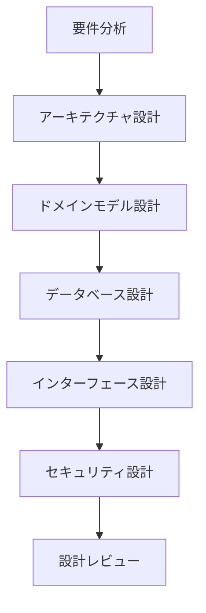
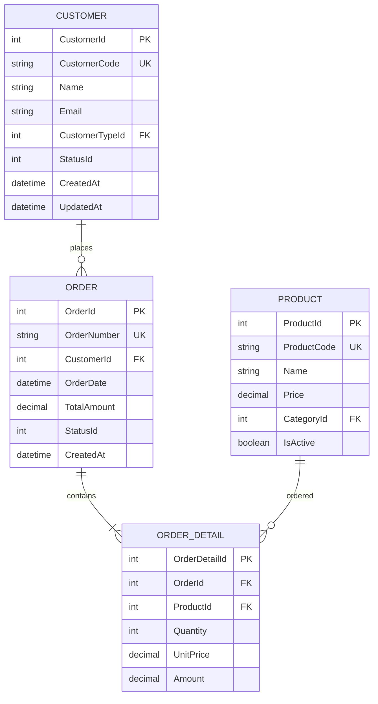

# Design Command - エンタープライズ技術設計

## 概要

要件定義を基に、.NET Framework 4.8 Windows Forms エンタープライズシステムの技術設計を行うコマンドです。Clean Architecture、デザインパターン、既存システム統合を考慮した包括的な設計を実現します。

## 使用方法

```
/design [オプション]
```

### オプション
- `--architecture` - システムアーキテクチャ設計
- `--database` - データベース設計
- `--class` - クラス設計・ドメインモデリング
- `--integration` - 統合インターフェース設計
- `--security` - セキュリティ設計
- `--all` - 全設計プロセス実行（デフォルト）

## 実行フロー

### 設計プロセス


## Clean Architecture 設計

### レイヤー構成
```
┌─────────────────────────────────────────────────┐
│              Presentation Layer                  │
│         (Windows Forms, ViewModels)              │
├─────────────────────────────────────────────────┤
│              Application Layer                   │
│      (Use Cases, Application Services)           │
├─────────────────────────────────────────────────┤
│                Domain Layer                      │
│      (Entities, Domain Services, Rules)          │
├─────────────────────────────────────────────────┤
│            Infrastructure Layer                  │
│   (Data Access, External Services, File I/O)    │
└─────────────────────────────────────────────────┘
```

### プロジェクト構造設計
```csharp
// ソリューション構造
Solution 'EnterpriseSystem'
├── Core/
│   ├── Domain/
│   │   ├── Entities/
│   │   │   ├── Customer.cs
│   │   │   ├── Order.cs
│   │   │   └── Product.cs
│   │   ├── ValueObjects/
│   │   │   ├── Money.cs
│   │   │   └── Address.cs
│   │   ├── Services/
│   │   │   └── PricingService.cs
│   │   └── Interfaces/
│   │       ├── ICustomerRepository.cs
│   │       └── IOrderRepository.cs
│   │
│   └── Application/
│       ├── UseCases/
│       │   ├── CreateOrderUseCase.cs
│       │   └── ProcessPaymentUseCase.cs
│       ├── DTOs/
│       │   ├── OrderDto.cs
│       │   └── CustomerDto.cs
│       └── Interfaces/
│           └── INotificationService.cs
│
├── Infrastructure/
│   ├── Data/
│   │   ├── Repositories/
│   │   │   ├── CustomerRepository.cs
│   │   │   └── OrderRepository.cs
│   │   ├── Mappings/
│   │   │   └── EntityMappings.cs
│   │   └── DatabaseContext.cs
│   │
│   ├── ExternalServices/
│   │   ├── LegacySystemAdapter.cs
│   │   └── EmailService.cs
│   │
│   └── FileProcessing/
│       ├── CsvProcessor.cs
│       └── FixedLengthFileProcessor.cs
│
└── Presentation/
    ├── Forms/
    │   ├── MainForm.cs
    │   ├── CustomerForm.cs
    │   └── OrderForm.cs
    ├── ViewModels/
    │   ├── CustomerViewModel.cs
    │   └── OrderViewModel.cs
    └── Controls/
        └── CustomDataGridView.cs
```

## ドメインモデル設計

### エンティティ設計
```csharp
// ドメインエンティティの例
namespace Core.Domain.Entities
{
    public class Customer : EntityBase
    {
        private readonly List<Order> _orders = new List<Order>();
        
        public CustomerId Id { get; private set; }
        public CustomerName Name { get; private set; }
        public Email Email { get; private set; }
        public CustomerType Type { get; private set; }
        public CustomerStatus Status { get; private set; }
        public IReadOnlyCollection<Order> Orders => _orders.AsReadOnly();
        
        // ビジネスルールを含むコンストラクタ
        public Customer(CustomerName name, Email email, CustomerType type)
        {
            Id = new CustomerId(Guid.NewGuid());
            Name = name ?? throw new ArgumentNullException(nameof(name));
            Email = email ?? throw new ArgumentNullException(nameof(email));
            Type = type;
            Status = CustomerStatus.Active;
            
            // ドメインイベントの発行
            AddDomainEvent(new CustomerCreatedEvent(Id, DateTime.Now));
        }
        
        // ビジネスロジック
        public void PlaceOrder(Order order)
        {
            if (Status != CustomerStatus.Active)
                throw new BusinessRuleException("非アクティブな顧客は注文できません");
                
            if (Type == CustomerType.Suspended && order.TotalAmount > 10000m)
                throw new BusinessRuleException("制限顧客の注文上限を超えています");
                
            _orders.Add(order);
            AddDomainEvent(new OrderPlacedEvent(Id, order.Id, DateTime.Now));
        }
    }
}
```

### 値オブジェクト設計
```csharp
// 値オブジェクトの例
namespace Core.Domain.ValueObjects
{
    public class Money : ValueObject
    {
        public decimal Amount { get; }
        public string Currency { get; }
        
        public Money(decimal amount, string currency)
        {
            if (amount < 0)
                throw new ArgumentException("金額は0以上である必要があります");
                
            if (string.IsNullOrWhiteSpace(currency))
                throw new ArgumentException("通貨コードは必須です");
                
            Amount = amount;
            Currency = currency.ToUpper();
        }
        
        public Money Add(Money other)
        {
            if (Currency != other.Currency)
                throw new InvalidOperationException("異なる通貨の加算はできません");
                
            return new Money(Amount + other.Amount, Currency);
        }
        
        protected override IEnumerable<object> GetEqualityComponents()
        {
            yield return Amount;
            yield return Currency;
        }
    }
}
```

## データベース設計

### ER図


### インデックス設計
```sql
-- パフォーマンスを考慮したインデックス設計
CREATE INDEX IX_Order_CustomerId_OrderDate 
ON Orders(CustomerId, OrderDate DESC)
INCLUDE (TotalAmount, StatusId);

CREATE INDEX IX_OrderDetail_OrderId_ProductId
ON OrderDetails(OrderId, ProductId)
INCLUDE (Quantity, Amount);

-- 既存システム連携用インデックス
CREATE INDEX IX_Customer_LegacyCode
ON Customers(LegacySystemCode)
WHERE LegacySystemCode IS NOT NULL;
```

## 統合インターフェース設計

### アダプターパターン実装
```csharp
// レガシーシステムアダプター
namespace Infrastructure.ExternalServices
{
    public interface ILegacySystemAdapter
    {
        Task<LegacyCustomerData> GetCustomerAsync(string customerCode);
        Task<bool> UpdateCustomerAsync(string customerCode, CustomerUpdateData data);
    }
    
    public class LegacySystemAdapter : ILegacySystemAdapter
    {
        private readonly ILegacyDbConnection _legacyDb;
        private readonly IFileTransferService _fileTransfer;
        private readonly IDataMapper _mapper;
        
        public async Task<LegacyCustomerData> GetCustomerAsync(string customerCode)
        {
            // 複数のレガシーシステムからデータを統合
            var mainframeData = await _legacyDb.QueryAsync(
                "SELECT * FROM CUSTOMER WHERE CUST_CD = :custCd", 
                new { custCd = customerCode });
                
            var fileData = await _fileTransfer.ReadCustomerFile(customerCode);
            
            // データマッピングと統合
            return _mapper.MapToLegacyCustomer(mainframeData, fileData);
        }
    }
}
```

### ファイル連携設計
```csharp
// 固定長ファイル処理
public class FixedLengthFileProcessor
{
    private readonly FileLayoutDefinition _layout;
    
    public async Task<IEnumerable<T>> ReadFileAsync<T>(string filePath)
    {
        var records = new List<T>();
        
        using (var reader = new StreamReader(filePath, Encoding.GetEncoding("Shift_JIS")))
        {
            string line;
            while ((line = await reader.ReadLineAsync()) != null)
            {
                var record = ParseLine<T>(line);
                records.Add(record);
            }
        }
        
        return records;
    }
    
    private T ParseLine<T>(string line) where T : new()
    {
        var record = new T();
        var properties = typeof(T).GetProperties();
        
        foreach (var field in _layout.Fields)
        {
            var value = line.Substring(field.Start, field.Length).Trim();
            var property = properties.FirstOrDefault(p => p.Name == field.Name);
            
            if (property != null)
            {
                var convertedValue = ConvertValue(value, property.PropertyType, field);
                property.SetValue(record, convertedValue);
            }
        }
        
        return record;
    }
}
```

## セキュリティ設計

### 認証・認可設計
```csharp
// Windows認証との統合
public class WindowsAuthenticationService : IAuthenticationService
{
    public async Task<AuthenticationResult> AuthenticateAsync()
    {
        var windowsIdentity = WindowsIdentity.GetCurrent();
        if (windowsIdentity == null || !windowsIdentity.IsAuthenticated)
        {
            return AuthenticationResult.Failure("Windows認証に失敗しました");
        }
        
        // Active Directoryからユーザー情報取得
        var user = await GetUserFromActiveDirectory(windowsIdentity.Name);
        
        // アプリケーション権限の取得
        var permissions = await GetUserPermissions(user.Id);
        
        return AuthenticationResult.Success(new UserPrincipal(user, permissions));
    }
}

// ロールベースアクセス制御
[AttributeUsage(AttributeTargets.Method | AttributeTargets.Class)]
public class RequirePermissionAttribute : Attribute
{
    public string Permission { get; }
    
    public RequirePermissionAttribute(string permission)
    {
        Permission = permission;
    }
}
```

### データ暗号化設計
```csharp
// 機密データの暗号化
public class EncryptionService : IEncryptionService
{
    private readonly byte[] _key;
    private readonly byte[] _iv;
    
    public string Encrypt(string plainText)
    {
        using (var aes = Aes.Create())
        {
            aes.Key = _key;
            aes.IV = _iv;
            
            var encryptor = aes.CreateEncryptor();
            using (var ms = new MemoryStream())
            using (var cs = new CryptoStream(ms, encryptor, CryptoStreamMode.Write))
            using (var sw = new StreamWriter(cs))
            {
                sw.Write(plainText);
                return Convert.ToBase64String(ms.ToArray());
            }
        }
    }
}
```

## 出力成果物

### 設計ドキュメント構成
```
design/
├── architecture.md              # アーキテクチャ設計書
├── domain_model.md             # ドメインモデル設計書
├── database_design.md          # データベース設計書
├── integration_design.md       # 統合設計書
├── security_design.md          # セキュリティ設計書
├── diagrams/                   # 設計図
│   ├── system_architecture.png
│   ├── er_diagram.png
│   ├── class_diagram.png
│   └── sequence_diagrams/
├── api_specifications/         # API仕様
│   ├── internal_api.md
│   └── external_api.md
└── data_models/               # データモデル定義
    ├── domain_models.cs
    └── dto_models.cs
```

## 実行例

### 完全な設計プロセス
```bash
/design --all

# 実行結果
✓ アーキテクチャ設計完了
✓ ドメインモデル設計完了
✓ データベース設計完了
✓ 統合インターフェース設計完了
✓ セキュリティ設計完了

生成された設計ドキュメント:
- design/architecture.md
- design/domain_model.md
- design/database_design.md
- design/integration_design.md
- design/security_design.md
```

## ベストプラクティス

### 1. SOLID原則の適用
- 単一責任の原則（SRP）
- オープン・クローズドの原則（OCP）
- リスコフの置換原則（LSP）
- インターフェース分離の原則（ISP）
- 依存性逆転の原則（DIP）

### 2. デザインパターンの活用
- Repository Pattern
- Unit of Work Pattern
- Factory Pattern
- Adapter Pattern
- Strategy Pattern

### 3. テスタビリティの確保
- 依存性注入の活用
- インターフェースの適切な定義
- モックオブジェクトの作成可能性

## まとめ

このコマンドにより、エンタープライズシステムの技術設計を体系的に行い、保守性・拡張性・テスタビリティを備えた高品質な設計を実現できます。既存システムとの統合を考慮しながら、最新のアーキテクチャパターンを適用します。