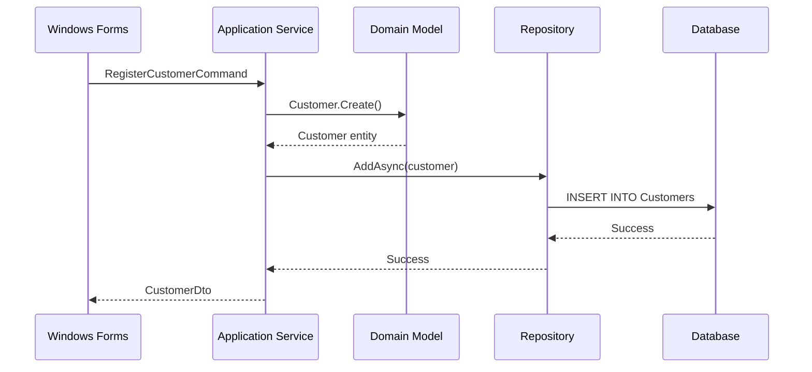

# Document Command - ドキュメント生成・更新

## 概要

エンタープライズ.NET Framework 4.8プロジェクトの包括的なドキュメントを自動生成・更新します。コードから技術文書、APIリファレンス、ユーザーマニュアルまで、多様なドキュメントニーズに対応します。

## 使用方法

```
/document <ドキュメントタイプ> [オプション]
```

### ドキュメントタイプ
- `api` - APIリファレンスドキュメント
- `architecture` - アーキテクチャ設計書
- `user` - ユーザーマニュアル
- `developer` - 開発者ガイド
- `deployment` - デプロイメント手順書
- `database` - データベース設計書
- `integration` - 既存システム統合ガイド

### オプション
- `--format <md|html|pdf|docx>` - 出力形式
- `--language <ja|en>` - ドキュメント言語
- `--include-samples` - コードサンプルを含む
- `--update` - 既存ドキュメントの更新

## 実行例

### 1. APIリファレンスドキュメント生成

```bash
/document api --format html --include-samples

# 実行結果
APIドキュメント生成
==================

## 生成内容
- エンドポイント一覧: 45個
- データモデル: 28個
- 認証方式: Windows認証 / JWT
- サンプルコード: C#, JavaScript, PowerShell

## 出力ファイル
- /docs/api/index.html
- /docs/api/endpoints/*.html
- /docs/api/models/*.html
```

#### 生成されるAPIドキュメントの例

```markdown
# Customer Management API

## Overview
顧客情報を管理するためのREST APIエンドポイント群です。

## Authentication
Windows統合認証またはJWTトークンによる認証が必要です。

```http
Authorization: Bearer {token}
```

## Endpoints

### Get Customer
指定されたIDの顧客情報を取得します。

**Request**
```http
GET /api/customers/{id}
Accept: application/json
```

**Parameters**
| Name | Type | Required | Description |
|------|------|----------|-------------|
| id | integer | Yes | 顧客ID |

**Response**
```json
{
  "id": 1234,
  "name": "株式会社Example",
  "email": "contact@example.com",
  "creditLimit": 1000000,
  "status": "Active",
  "createdAt": "2024-01-15T10:30:00Z"
}
```

**Error Responses**
| Status Code | Description |
|-------------|-------------|
| 404 | 顧客が見つかりません |
| 401 | 認証が必要です |
| 403 | アクセス権限がありません |

**Sample Code**

C#:
```csharp
using var client = new HttpClient();
client.DefaultRequestHeaders.Authorization = 
    new AuthenticationHeaderValue("Bearer", token);

var response = await client.GetAsync($"{baseUrl}/api/customers/{customerId}");
if (response.IsSuccessStatusCode)
{
    var customer = await response.Content.ReadAsAsync<Customer>();
    Console.WriteLine($"Customer: {customer.Name}");
}
```

PowerShell:
```powershell
$headers = @{
    "Authorization" = "Bearer $token"
    "Accept" = "application/json"
}

$response = Invoke-RestMethod `
    -Uri "$baseUrl/api/customers/$customerId" `
    -Headers $headers `
    -Method Get

Write-Host "Customer: $($response.name)"
```
```

### 2. アーキテクチャ設計書生成

```bash
/document architecture --format md --language ja

# 実行結果
アーキテクチャドキュメント生成
==============================

## 生成セクション
1. システム概要
2. アーキテクチャ原則
3. レイヤー構成
4. コンポーネント図
5. データフロー
6. 技術スタック
7. 非機能要件
```

#### アーキテクチャドキュメント生成コード

```csharp
public class ArchitectureDocumentGenerator
{
    private readonly ISolutionAnalyzer _solutionAnalyzer;
    private readonly IDiagramGenerator _diagramGenerator;
    
    public async Task GenerateArchitectureDocumentAsync(
        string solutionPath, 
        DocumentOptions options)
    {
        var solution = await _solutionAnalyzer.AnalyzeSolutionAsync(solutionPath);
        var document = new ArchitectureDocument();
        
        // 1. システム概要
        document.AddSection(GenerateOverviewSection(solution));
        
        // 2. レイヤー構成
        document.AddSection(GenerateLayerArchitectureSection(solution));
        
        // 3. コンポーネント図（PlantUMLで生成）
        var componentDiagram = await GenerateComponentDiagramAsync(solution);
        document.AddDiagram("コンポーネント構成", componentDiagram);
        
        // 4. データフロー
        document.AddSection(GenerateDataFlowSection(solution));
        
        // 5. 技術決定記録（ADR）
        document.AddSection(GenerateADRSection(solution));
        
        // ドキュメント出力
        await OutputDocumentAsync(document, options);
    }
    
    private async Task<string> GenerateComponentDiagramAsync(Solution solution)
    {
        var plantUml = new StringBuilder();
        plantUml.AppendLine("@startuml");
        plantUml.AppendLine("!include https://raw.githubusercontent.com/plantuml-stdlib/C4-PlantUML/master/C4_Component.puml");
        plantUml.AppendLine();
        plantUml.AppendLine("title コンポーネント図 - エンタープライズ管理システム");
        plantUml.AppendLine();
        
        // コンテナ定義
        plantUml.AppendLine("Container_Boundary(presentation, \"Presentation Layer\") {");
        foreach (var project in solution.GetProjectsByLayer("Presentation"))
        {
            plantUml.AppendLine($"    Component({project.Name}, \"{project.DisplayName}\", \"Windows Forms\", \"{project.Description}\")");
        }
        plantUml.AppendLine("}");
        
        plantUml.AppendLine();
        plantUml.AppendLine("Container_Boundary(application, \"Application Layer\") {");
        foreach (var project in solution.GetProjectsByLayer("Application"))
        {
            plantUml.AppendLine($"    Component({project.Name}, \"{project.DisplayName}\", \"Business Logic\", \"{project.Description}\")");
        }
        plantUml.AppendLine("}");
        
        // 関係性の定義
        foreach (var dependency in solution.GetProjectDependencies())
        {
            plantUml.AppendLine($"Rel({dependency.From}, {dependency.To}, \"uses\")");
        }
        
        plantUml.AppendLine("@enduml");
        
        return await _diagramGenerator.GenerateDiagramAsync(plantUml.ToString());
    }
}
```

#### 生成されるアーキテクチャドキュメント例

```markdown
# エンタープライズ管理システム アーキテクチャ設計書

## 1. システム概要

本システムは、.NET Framework 4.8を基盤としたエンタープライズ向け統合業務管理システムです。Clean Architectureの原則に基づき、保守性と拡張性を重視した設計となっています。

### 1.1 主要機能
- 顧客情報管理
- 受注・在庫管理
- レポート生成
- 既存システム連携

### 1.2 利用者
- 業務担当者（Windows デスクトップクライアント）
- システム管理者（管理コンソール）
- 外部システム（REST API）

## 2. アーキテクチャ原則

### 2.1 Clean Architecture
ビジネスロジックを中心に配置し、外部の技術詳細から独立させています。

```
┌─────────────────────────────────────────┐
│          Presentation Layer              │
│        (Windows Forms, API)              │
├─────────────────────────────────────────┤
│          Application Layer               │
│      (Use Cases, Services)               │
├─────────────────────────────────────────┤
│            Domain Layer                  │
│      (Entities, Business Rules)          │
├─────────────────────────────────────────┤
│        Infrastructure Layer              │
│    (Data Access, External Services)      │
└─────────────────────────────────────────┘
```

### 2.2 依存性の方向
- 内側のレイヤーは外側のレイヤーに依存しない
- ビジネスロジックはフレームワークに依存しない
- インターフェースによる依存性の逆転

## 3. レイヤー詳細

### 3.1 Domain Layer
```csharp
namespace EnterpriseSystem.Domain.Entities
{
    /// <summary>
    /// 顧客エンティティ（ドメインモデル）
    /// </summary>
    public class Customer : AggregateRoot
    {
        public CustomerId Id { get; private set; }
        public CustomerName Name { get; private set; }
        public Email Email { get; private set; }
        public Money CreditLimit { get; private set; }
        
        // ビジネスルール: 与信限度額は0以上
        public void SetCreditLimit(Money amount)
        {
            if (amount < Money.Zero)
                throw new DomainException("与信限度額は0以上である必要があります");
                
            CreditLimit = amount;
            AddDomainEvent(new CreditLimitChangedEvent(Id, amount));
        }
    }
}
```

### 3.2 Application Layer
```csharp
namespace EnterpriseSystem.Application.UseCases
{
    /// <summary>
    /// 顧客登録ユースケース
    /// </summary>
    public class RegisterCustomerUseCase : IRegisterCustomerUseCase
    {
        private readonly ICustomerRepository _repository;
        private readonly IUnitOfWork _unitOfWork;
        
        public async Task<CustomerDto> ExecuteAsync(RegisterCustomerCommand command)
        {
            // ドメインモデルの生成
            var customer = Customer.Create(
                command.Name,
                command.Email,
                command.InitialCreditLimit);
            
            // 永続化
            await _repository.AddAsync(customer);
            await _unitOfWork.CommitAsync();
            
            return CustomerDto.FromDomain(customer);
        }
    }
}
```

## 4. データフロー

### 4.1 コマンド処理フロー


## 5. 技術スタック

| レイヤー | 技術 | 用途 |
|---------|------|------|
| Presentation | Windows Forms | デスクトップUI |
| Presentation | ASP.NET Web API | REST API |
| Application | Unity Container | 依存性注入 |
| Domain | C# 7.3 | ビジネスロジック |
| Infrastructure | Entity Framework 6 | ORM |
| Infrastructure | Dapper | 高速クエリ |
| Infrastructure | NLog | ロギング |
| Testing | NUnit | 単体テスト |
| Testing | Moq | モック |
```

### 3. ユーザーマニュアル生成

```bash
/document user --format docx --language ja

# 実行結果
ユーザーマニュアル生成
=====================

## 生成内容
1. はじめに
2. システム要件
3. インストール手順
4. 基本操作
5. 各機能の詳細
6. トラブルシューティング
7. FAQ
```

#### ユーザーマニュアル生成機能

```csharp
public class UserManualGenerator
{
    private readonly IScreenshotCapture _screenshotCapture;
    private readonly IFormAnalyzer _formAnalyzer;
    
    public async Task GenerateUserManualAsync(
        Assembly targetAssembly,
        UserManualOptions options)
    {
        var manual = new UserManual(options.Title, options.Version);
        
        // フォーム一覧の取得
        var forms = GetAllForms(targetAssembly);
        
        foreach (var formType in forms)
        {
            // フォームの解析
            var formInfo = await _formAnalyzer.AnalyzeFormAsync(formType);
            
            // スクリーンショットの自動生成
            var screenshots = await CaptureFormScreenshotsAsync(formType);
            
            // セクションの生成
            var section = GenerateFormSection(formInfo, screenshots);
            manual.AddSection(section);
        }
        
        // トラブルシューティングセクション
        manual.AddSection(GenerateTroubleshootingSection());
        
        // 出力
        await ExportToWordAsync(manual, options.OutputPath);
    }
    
    private ManualSection GenerateFormSection(
        FormInfo formInfo, 
        List<Screenshot> screenshots)
    {
        var section = new ManualSection(formInfo.DisplayName);
        
        // 概要
        section.AddParagraph($"{formInfo.Description}");
        
        // メイン画面のスクリーンショット
        section.AddImage(screenshots.First(s => s.Name == "Main"), 
            "メイン画面");
        
        // 各コントロールの説明
        section.AddSubSection("画面項目の説明");
        
        foreach (var control in formInfo.Controls)
        {
            section.AddBulletPoint($"{control.Label}: {control.Description}");
        }
        
        // 操作手順
        section.AddSubSection("基本的な操作手順");
        
        var steps = GenerateOperationSteps(formInfo);
        foreach (var step in steps)
        {
            section.AddNumberedItem(step.Description);
            if (step.Screenshot != null)
            {
                section.AddImage(step.Screenshot, step.Caption);
            }
        }
        
        return section;
    }
}
```

### 4. データベース設計書生成

```bash
/document database --include-samples

# 実行結果
データベース設計書生成
=====================

## 生成内容
- テーブル定義: 35テーブル
- ビュー定義: 12ビュー
- ストアドプロシージャ: 28個
- インデックス情報
- ER図
```

#### データベースドキュメント生成

```csharp
public class DatabaseDocumentGenerator
{
    private readonly IDbConnection _connection;
    private readonly IERDiagramGenerator _erDiagramGenerator;
    
    public async Task GenerateDatabaseDocumentAsync(DatabaseDocOptions options)
    {
        var document = new DatabaseDocument();
        
        // 1. データベース概要
        var overview = await GenerateDatabaseOverviewAsync();
        document.AddSection("データベース概要", overview);
        
        // 2. テーブル定義
        var tables = await GetTableDefinitionsAsync();
        foreach (var table in tables)
        {
            document.AddTableDefinition(await GenerateTableDocumentAsync(table));
        }
        
        // 3. ER図生成
        var erDiagram = await _erDiagramGenerator.GenerateAsync(tables);
        document.AddDiagram("エンティティ関連図", erDiagram);
        
        // 4. インデックス分析
        var indexAnalysis = await AnalyzeIndexesAsync();
        document.AddSection("インデックス設計", indexAnalysis);
        
        // 5. ストアドプロシージャ
        var procedures = await GetStoredProceduresAsync();
        document.AddSection("ストアドプロシージャ一覧", 
            GenerateProcedureDocumentation(procedures));
        
        await document.SaveAsync(options.OutputPath);
    }
    
    private async Task<TableDocument> GenerateTableDocumentAsync(TableInfo table)
    {
        var doc = new TableDocument(table.Name);
        
        // テーブル説明
        doc.Description = table.Description ?? await InferTableDescriptionAsync(table);
        
        // カラム定義
        doc.AddSection("カラム定義", GenerateColumnTable(table.Columns));
        
        // 主キー・外部キー
        doc.AddSection("キー制約", GenerateKeyConstraints(table));
        
        // インデックス
        doc.AddSection("インデックス", GenerateIndexInfo(table));
        
        // サンプルデータ
        if (options.IncludeSamples)
        {
            var sampleData = await GetSampleDataAsync(table.Name, limit: 5);
            doc.AddSection("サンプルデータ", FormatSampleData(sampleData));
        }
        
        // 関連するビュー・プロシージャ
        doc.AddSection("関連オブジェクト", await GetRelatedObjectsAsync(table.Name));
        
        return doc;
    }
    
    private string GenerateColumnTable(List<ColumnInfo> columns)
    {
        var markdown = new StringBuilder();
        
        markdown.AppendLine("| カラム名 | データ型 | NULL許可 | デフォルト値 | 説明 |");
        markdown.AppendLine("|---------|---------|----------|-------------|------|");
        
        foreach (var col in columns)
        {
            var nullable = col.IsNullable ? "○" : "×";
            var defaultValue = col.DefaultValue ?? "-";
            
            markdown.AppendLine(
                $"| {col.Name} | {col.DataType} | {nullable} | {defaultValue} | {col.Description} |");
        }
        
        return markdown.ToString();
    }
}
```

### 5. 既存システム統合ガイド

```bash
/document integration --format html

# 実行結果
統合ガイド生成
==============

## 生成内容
1. 統合アーキテクチャ
2. 接続設定
3. データマッピング
4. エラーハンドリング
5. 監視・運用
```

#### 統合ガイド生成の実装

```csharp
public class IntegrationGuideGenerator
{
    public async Task GenerateIntegrationGuideAsync(IntegrationConfig config)
    {
        var guide = new IntegrationGuide();
        
        // 統合パターンの文書化
        foreach (var system in config.ExternalSystems)
        {
            var section = new SystemIntegrationSection(system.Name);
            
            // 接続方法
            section.AddConnectionGuide(GenerateConnectionGuide(system));
            
            // データマッピング
            section.AddMappingTable(GenerateMappingTable(system));
            
            // エラーハンドリング
            section.AddErrorHandling(GenerateErrorHandlingGuide(system));
            
            // サンプルコード
            section.AddSampleCode(GenerateIntegrationSample(system));
            
            guide.AddSystem(section);
        }
        
        await guide.ExportAsync(config.OutputFormat);
    }
    
    private string GenerateIntegrationSample(ExternalSystem system)
    {
        return system.IntegrationType switch
        {
            IntegrationType.RestApi => GenerateRestApiSample(system),
            IntegrationType.Soap => GenerateSoapSample(system),
            IntegrationType.Database => GenerateDatabaseSample(system),
            IntegrationType.FileTransfer => GenerateFileSample(system),
            _ => throw new NotSupportedException()
        };
    }
    
    private string GenerateRestApiSample(ExternalSystem system)
    {
        return $@"
// {system.Name} REST API 統合サンプル

public class {system.Name}Adapter : IExternalSystemAdapter
{{
    private readonly HttpClient _httpClient;
    private readonly ILogger<{system.Name}Adapter> _logger;
    
    public {system.Name}Adapter(HttpClient httpClient, ILogger<{system.Name}Adapter> logger)
    {{
        _httpClient = httpClient;
        _logger = logger;
        
        // 基本設定
        _httpClient.BaseAddress = new Uri(""{system.BaseUrl}"");
        _httpClient.DefaultRequestHeaders.Add(""API-Key"", Configuration[""{system.Name}:ApiKey""]);
    }}
    
    public async Task<Customer> GetCustomerAsync(string customerId)
    {{
        try
        {{
            var response = await _httpClient.GetAsync($""customers/{{customerId}}"");
            response.EnsureSuccessStatusCode();
            
            var externalCustomer = await response.Content.ReadAsAsync<{system.Name}Customer>();
            
            // データマッピング
            return MapToInternalCustomer(externalCustomer);
        }}
        catch (HttpRequestException ex)
        {{
            _logger.LogError(ex, ""Failed to get customer from {system.Name}"");
            throw new IntegrationException($""{system.Name}との通信に失敗しました"", ex);
        }}
    }}
    
    private Customer MapToInternalCustomer({system.Name}Customer external)
    {{
        return new Customer
        {{
            Id = external.{system.CustomerIdField},
            Name = external.{system.CustomerNameField},
            // 他のマッピング...
        }};
    }}
}}";
    }
}
```

## ドキュメント自動更新機能

### コード変更検知と更新

```csharp
public class DocumentationUpdateService
{
    private readonly ICodeChangeDetector _changeDetector;
    private readonly IDocumentRepository _documentRepository;
    
    public async Task UpdateDocumentationAsync(UpdateRequest request)
    {
        // 変更検知
        var changes = await _changeDetector.DetectChangesAsync(
            request.LastUpdateTime,
            request.TargetPath);
        
        if (!changes.Any())
        {
            _logger.LogInformation("No changes detected");
            return;
        }
        
        // 影響を受けるドキュメントの特定
        var affectedDocs = await IdentifyAffectedDocumentsAsync(changes);
        
        foreach (var doc in affectedDocs)
        {
            // セクション単位で更新
            var updatedSections = await UpdateDocumentSectionsAsync(doc, changes);
            
            // バージョン管理
            doc.IncrementVersion();
            doc.AddChangeLog($"自動更新: {changes.Count}件の変更を反映");
            
            await _documentRepository.SaveAsync(doc);
        }
        
        // 更新通知
        await NotifyDocumentUpdateAsync(affectedDocs);
    }
}
```

## ドキュメントテンプレート

### カスタムテンプレートの使用

```csharp
public class DocumentTemplateEngine
{
    private readonly ITemplateLoader _templateLoader;
    
    public async Task<string> RenderDocumentAsync<T>(
        string templateName, 
        T model)
    {
        var template = await _templateLoader.LoadTemplateAsync(templateName);
        
        // Razorエンジンによるレンダリング
        var engine = new RazorLightEngineBuilder()
            .UseMemoryCachingProvider()
            .Build();
        
        return await engine.CompileRenderStringAsync(
            templateName,
            template,
            model);
    }
}

// テンプレート例（api-endpoint.cshtml）
@model EndpointDocumentModel
# @Model.HttpMethod @Model.Path

@Model.Description

## Request
```http
@Model.HttpMethod @Model.Path
@foreach(var header in Model.RequiredHeaders)
{
@header.Name: @header.Value
}
```

## Parameters
@if(Model.Parameters.Any())
{
<table>
    <tr>
        <th>Name</th>
        <th>Type</th>
        <th>Required</th>
        <th>Description</th>
    </tr>
    @foreach(var param in Model.Parameters)
    {
    <tr>
        <td>@param.Name</td>
        <td>@param.Type</td>
        <td>@(param.IsRequired ? "Yes" : "No")</td>
        <td>@param.Description</td>
    </tr>
    }
</table>
}
```

## まとめ

このコマンドにより、エンタープライズプロジェクトの包括的なドキュメント生成を実現し、以下を達成します：

1. **自動化されたドキュメント生成** - コードから最新のドキュメントを自動生成
2. **多様な出力形式** - Markdown、HTML、PDF、Word形式に対応
3. **包括的なカバレッジ** - API、アーキテクチャ、ユーザーマニュアルまで網羅
4. **保守性の向上** - コードとドキュメントの同期を維持
5. **チーム生産性の向上** - 明確なドキュメントによる知識共有