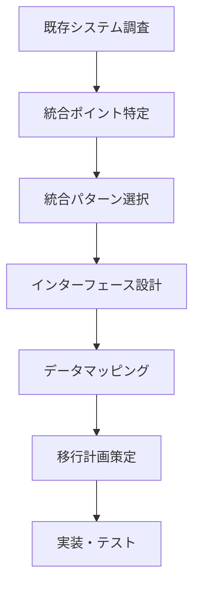

# Legacy Integration Command - レガシーシステム統合

## 概要

既存のレガシーシステムと.NET Framework 4.8 Windows Forms アプリケーションを統合するための包括的な設計・実装支援コマンドです。データベース連携、ファイル連携、API統合など、様々な統合パターンに対応します。

## 使用方法

```
/legacy-integration [オプション]
```

### オプション
- `--analyze` - 既存システム分析
- `--database` - データベース統合設計
- `--file` - ファイル連携設計
- `--api` - API統合設計
- `--migration` - データ移行計画
- `--all` - 全統合プロセス実行（デフォルト）

## 実行フロー

### 統合プロセス


## レガシーシステム分析

### システム調査テンプレート
```markdown
## レガシーシステム調査書

### システム概要
- **システム名**: 基幹業務システム
- **稼働開始**: 1995年
- **開発言語**: COBOL
- **データベース**: IBM DB2 / AS/400
- **文字コード**: EBCDIC / Shift-JIS
- **通信方式**: FTP / 固定長ファイル

### 技術仕様
- **OS**: IBM i (AS/400)
- **ミドルウェア**: CICS
- **バッチ処理**: JCL
- **画面**: 5250エミュレータ

### データ規模
- **マスタデータ**: 約100万件
- **トランザクション**: 日次10万件
- **保存期間**: 7年間
```

### 統合ポイント分析
```csharp
// レガシーシステム統合ポイントの定義
public class IntegrationPoint
{
    public string SystemName { get; set; }
    public IntegrationType Type { get; set; }
    public string Description { get; set; }
    public DataFlow DataFlow { get; set; }
    public string Frequency { get; set; }
    public List<DataEntity> DataEntities { get; set; }
    public List<TechnicalConstraint> Constraints { get; set; }
}

public enum IntegrationType
{
    DatabaseDirect,      // 直接DB接続
    FileTransfer,       // ファイル転送
    MessageQueue,       // メッセージキュー
    WebService,         // Web API
    ScreenScraping      // 画面スクレイピング
}

public enum DataFlow
{
    FromLegacy,         // レガシー → 新システム
    ToLegacy,           // 新システム → レガシー
    Bidirectional       // 双方向
}
```

## データベース統合

### マルチデータベース接続
```csharp
// レガシーDB接続管理
public class LegacyDatabaseManager
{
    private readonly Dictionary<string, IDbConnection> _connections;
    private readonly IConfiguration _configuration;
    
    public LegacyDatabaseManager(IConfiguration configuration)
    {
        _configuration = configuration;
        _connections = new Dictionary<string, IDbConnection>();
    }
    
    // AS/400 DB2接続
    public IDbConnection GetAS400Connection()
    {
        if (!_connections.ContainsKey("AS400"))
        {
            var connectionString = _configuration.GetConnectionString("AS400");
            var connection = new IBM.Data.DB2.iSeries.iDB2Connection(connectionString);
            _connections["AS400"] = connection;
        }
        return _connections["AS400"];
    }
    
    // Oracle接続（レガシー）
    public IDbConnection GetOracleLegacyConnection()
    {
        if (!_connections.ContainsKey("OracleLegacy"))
        {
            var connectionString = _configuration.GetConnectionString("OracleLegacy");
            var connection = new OracleConnection(connectionString);
            _connections["OracleLegacy"] = connection;
        }
        return _connections["OracleLegacy"];
    }
}
```

### データ同期処理
```csharp
// レガシーデータ同期サービス
public class LegacyDataSyncService
{
    private readonly ILegacyDatabaseManager _dbManager;
    private readonly IDataMapper _mapper;
    private readonly ILogger<LegacyDataSyncService> _logger;
    
    public async Task<SyncResult> SyncCustomerDataAsync()
    {
        var syncResult = new SyncResult();
        
        try
        {
            // レガシーシステムからデータ取得
            var legacyData = await GetLegacyCustomersAsync();
            
            // 文字コード変換とデータマッピング
            var mappedData = new List<Customer>();
            foreach (var legacy in legacyData)
            {
                try
                {
                    // EBCDIC → UTF-8変換
                    var converted = ConvertFromEBCDIC(legacy);
                    
                    // データマッピング
                    var customer = _mapper.MapToCustomer(converted);
                    
                    // バリデーション
                    if (ValidateCustomerData(customer))
                    {
                        mappedData.Add(customer);
                        syncResult.SuccessCount++;
                    }
                    else
                    {
                        syncResult.ValidationErrors.Add(
                            $"顧客コード {legacy.CUSTCD} のバリデーションエラー");
                    }
                }
                catch (Exception ex)
                {
                    syncResult.Errors.Add(
                        $"顧客コード {legacy.CUSTCD} の変換エラー: {ex.Message}");
                    _logger.LogError(ex, "データ変換エラー");
                }
            }
            
            // 新システムへの保存
            await SaveToNewSystemAsync(mappedData);
            
            return syncResult;
        }
        catch (Exception ex)
        {
            _logger.LogError(ex, "同期処理エラー");
            throw;
        }
    }
    
    private string ConvertFromEBCDIC(dynamic legacyRecord)
    {
        // EBCDIC変換ロジック
        var encoding = Encoding.GetEncoding("IBM930"); // EBCDIC Japanese
        // 変換処理
    }
}
```

## ファイル連携

### 固定長ファイル処理
```csharp
// 固定長ファイルレイアウト定義
public class FixedLengthLayout
{
    public string Name { get; set; }
    public List<FieldDefinition> Fields { get; set; }
    public Encoding Encoding { get; set; }
    public string RecordSeparator { get; set; }
    
    public class FieldDefinition
    {
        public string FieldName { get; set; }
        public int StartPosition { get; set; }
        public int Length { get; set; }
        public FieldType Type { get; set; }
        public string Format { get; set; }
        public object DefaultValue { get; set; }
        public bool IsMandatory { get; set; }
    }
}

// 固定長ファイルパーサー
public class FixedLengthFileParser
{
    private readonly FixedLengthLayout _layout;
    
    public async Task<IEnumerable<T>> ParseFileAsync<T>(string filePath) where T : new()
    {
        var records = new List<T>();
        
        using (var reader = new StreamReader(filePath, _layout.Encoding))
        {
            string line;
            int lineNumber = 0;
            
            while ((line = await reader.ReadLineAsync()) != null)
            {
                lineNumber++;
                
                try
                {
                    var record = ParseLine<T>(line);
                    records.Add(record);
                }
                catch (Exception ex)
                {
                    throw new ParseException(
                        $"行 {lineNumber} の解析エラー: {ex.Message}", ex)
                    {
                        LineNumber = lineNumber,
                        LineContent = line
                    };
                }
            }
        }
        
        return records;
    }
    
    private T ParseLine<T>(string line) where T : new()
    {
        var record = new T();
        var type = typeof(T);
        
        foreach (var field in _layout.Fields)
        {
            var value = ExtractFieldValue(line, field);
            var property = type.GetProperty(field.FieldName);
            
            if (property != null)
            {
                var convertedValue = ConvertValue(value, field, property.PropertyType);
                property.SetValue(record, convertedValue);
            }
        }
        
        return record;
    }
}
```

### ファイル転送処理
```csharp
// レガシーシステムとのファイル転送
public class LegacyFileTransferService
{
    private readonly IFtpClient _ftpClient;
    private readonly IFileProcessor _fileProcessor;
    private readonly IConfiguration _config;
    
    public async Task<TransferResult> DownloadAndProcessAsync(
        string remotePattern, string localPath)
    {
        var result = new TransferResult();
        
        try
        {
            // FTP接続
            await _ftpClient.ConnectAsync(
                _config["Legacy:FTP:Host"],
                _config["Legacy:FTP:Port"],
                _config["Legacy:FTP:Username"],
                _config["Legacy:FTP:Password"]);
            
            // ファイルリスト取得
            var files = await _ftpClient.ListFilesAsync(remotePattern);
            
            foreach (var file in files)
            {
                try
                {
                    // ファイルダウンロード
                    var localFile = Path.Combine(localPath, file.Name);
                    await _ftpClient.DownloadFileAsync(file.FullName, localFile);
                    
                    // 文字コード変換（EBCDIC → Shift-JIS → UTF-8）
                    await ConvertFileEncodingAsync(localFile);
                    
                    // ファイル処理
                    await _fileProcessor.ProcessFileAsync(localFile);
                    
                    result.SuccessFiles.Add(file.Name);
                }
                catch (Exception ex)
                {
                    result.FailedFiles.Add(new FailedFile
                    {
                        FileName = file.Name,
                        Error = ex.Message
                    });
                }
            }
            
            return result;
        }
        finally
        {
            await _ftpClient.DisconnectAsync();
        }
    }
}
```

## API統合

### SOAP Web Service 連携
```csharp
// レガシーSOAPサービスクライアント
public class LegacySoapClient
{
    private readonly EndpointAddress _endpoint;
    private readonly BasicHttpBinding _binding;
    
    public LegacySoapClient(string endpointUrl)
    {
        _endpoint = new EndpointAddress(endpointUrl);
        _binding = new BasicHttpBinding
        {
            MaxReceivedMessageSize = 10485760, // 10MB
            SendTimeout = TimeSpan.FromMinutes(5),
            Security = new BasicHttpSecurity
            {
                Mode = BasicHttpSecurityMode.TransportCredentialOnly,
                Transport = new HttpTransportSecurity
                {
                    ClientCredentialType = HttpClientCredentialType.Basic
                }
            }
        };
    }
    
    public async Task<CustomerInfo> GetCustomerInfoAsync(string customerId)
    {
        using (var channelFactory = new ChannelFactory<ILegacyService>(_binding, _endpoint))
        {
            // 認証情報設定
            channelFactory.Credentials.UserName.UserName = "legacy_user";
            channelFactory.Credentials.UserName.Password = "legacy_pass";
            
            var client = channelFactory.CreateChannel();
            
            try
            {
                // レガシーサービス呼び出し
                var request = new GetCustomerRequest { CustomerId = customerId };
                var response = await Task.Run(() => client.GetCustomer(request));
                
                // データ変換
                return MapToCustomerInfo(response);
            }
            finally
            {
                ((IClientChannel)client).Close();
            }
        }
    }
}
```

### REST API アダプター
```csharp
// レガシーシステムREST APIアダプター
public class LegacyRestApiAdapter
{
    private readonly HttpClient _httpClient;
    private readonly ILogger<LegacyRestApiAdapter> _logger;
    
    public LegacyRestApiAdapter(HttpClient httpClient, ILogger<LegacyRestApiAdapter> logger)
    {
        _httpClient = httpClient;
        _logger = logger;
        
        // レガシーAPIの特殊な要件に対応
        _httpClient.DefaultRequestHeaders.Add("X-Legacy-Version", "1.0");
        _httpClient.Timeout = TimeSpan.FromMinutes(10); // タイムアウト延長
    }
    
    public async Task<T> GetAsync<T>(string endpoint, Dictionary<string, string> parameters)
    {
        try
        {
            // クエリパラメータ構築
            var query = new FormUrlEncodedContent(parameters);
            var queryString = await query.ReadAsStringAsync();
            
            // API呼び出し
            var response = await _httpClient.GetAsync($"{endpoint}?{queryString}");
            
            if (!response.IsSuccessStatusCode)
            {
                var content = await response.Content.ReadAsStringAsync();
                throw new LegacyApiException(
                    $"API呼び出しエラー: {response.StatusCode}", content);
            }
            
            // レスポンス解析（XMLの場合）
            var xml = await response.Content.ReadAsStringAsync();
            return DeserializeXml<T>(xml);
        }
        catch (TaskCanceledException)
        {
            _logger.LogError("レガシーAPIタイムアウト: {Endpoint}", endpoint);
            throw new LegacyApiTimeoutException("レガシーAPIの応答がタイムアウトしました");
        }
    }
}
```

## データ移行

### 移行計画テンプレート
```markdown
## データ移行計画書

### 移行概要
- **移行元**: レガシー基幹システム（AS/400）
- **移行先**: 新統合管理システム（SQL Server）
- **移行データ量**: 約500万レコード
- **移行期間**: 3ヶ月
- **カットオーバー**: 段階的移行

### 移行フェーズ
1. **Phase 1**: マスタデータ移行（顧客、商品）
2. **Phase 2**: トランザクションデータ移行（過去2年分）
3. **Phase 3**: アーカイブデータ移行（過去7年分）
4. **Phase 4**: 並行稼働と検証
5. **Phase 5**: カットオーバー

### リスクと対策
| リスク | 影響度 | 対策 |
|--------|--------|------|
| データ不整合 | 高 | 段階的検証とロールバック計画 |
| 性能劣化 | 中 | インデックス最適化と分割処理 |
| 文字化け | 中 | 事前の文字コード変換テスト |
```

### 移行ツール実装
```csharp
// データ移行エンジン
public class DataMigrationEngine
{
    private readonly ISourceDataReader _sourceReader;
    private readonly IDataTransformer _transformer;
    private readonly ITargetDataWriter _targetWriter;
    private readonly IMigrationValidator _validator;
    
    public async Task<MigrationResult> MigrateAsync(MigrationPlan plan)
    {
        var result = new MigrationResult { StartTime = DateTime.Now };
        
        try
        {
            // 移行前検証
            await _validator.ValidatePreMigrationAsync(plan);
            
            // バッチ処理での移行
            const int batchSize = 1000;
            var totalRecords = await _sourceReader.GetRecordCountAsync(plan.SourceTable);
            var batches = (int)Math.Ceiling((double)totalRecords / batchSize);
            
            for (int i = 0; i < batches; i++)
            {
                using (var transaction = new TransactionScope(
                    TransactionScopeOption.Required,
                    new TransactionOptions { IsolationLevel = IsolationLevel.ReadCommitted },
                    TransactionScopeAsyncFlowOption.Enabled))
                {
                    try
                    {
                        // データ読み込み
                        var sourceData = await _sourceReader.ReadBatchAsync(
                            plan.SourceTable, i * batchSize, batchSize);
                        
                        // データ変換
                        var transformedData = await _transformer.TransformAsync(
                            sourceData, plan.TransformationRules);
                        
                        // データ書き込み
                        await _targetWriter.WriteBatchAsync(
                            plan.TargetTable, transformedData);
                        
                        // コミット
                        transaction.Complete();
                        
                        result.ProcessedRecords += sourceData.Count();
                        
                        // 進捗通知
                        OnProgressChanged(new ProgressInfo
                        {
                            PercentComplete = (i + 1) * 100 / batches,
                            Message = $"バッチ {i + 1}/{batches} 完了"
                        });
                    }
                    catch (Exception ex)
                    {
                        result.Errors.Add($"バッチ {i} エラー: {ex.Message}");
                        _logger.LogError(ex, "移行バッチエラー");
                        
                        if (!plan.ContinueOnError)
                            throw;
                    }
                }
            }
            
            // 移行後検証
            await _validator.ValidatePostMigrationAsync(plan, result);
            
            result.EndTime = DateTime.Now;
            result.Status = MigrationStatus.Completed;
            
            return result;
        }
        catch (Exception ex)
        {
            result.EndTime = DateTime.Now;
            result.Status = MigrationStatus.Failed;
            result.Errors.Add($"致命的エラー: {ex.Message}");
            throw;
        }
    }
}
```

## 文字コード変換

### マルチエンコーディング対応
```csharp
// 文字コード変換ユーティリティ
public class EncodingConverter
{
    private static readonly Dictionary<string, Encoding> EncodingMap = new Dictionary<string, Encoding>
    {
        { "EBCDIC-JP", Encoding.GetEncoding("IBM930") },
        { "Shift-JIS", Encoding.GetEncoding("shift_jis") },
        { "EUC-JP", Encoding.GetEncoding("euc-jp") },
        { "ISO-2022-JP", Encoding.GetEncoding("iso-2022-jp") },
        { "UTF-8", Encoding.UTF8 }
    };
    
    public static string Convert(string input, string fromEncoding, string toEncoding)
    {
        if (!EncodingMap.ContainsKey(fromEncoding) || !EncodingMap.ContainsKey(toEncoding))
        {
            throw new NotSupportedException($"エンコーディング {fromEncoding} または {toEncoding} はサポートされていません");
        }
        
        var sourceEncoding = EncodingMap[fromEncoding];
        var targetEncoding = EncodingMap[toEncoding];
        
        // バイト配列に変換
        var bytes = sourceEncoding.GetBytes(input);
        
        // 特殊文字の処理
        bytes = HandleSpecialCharacters(bytes, fromEncoding);
        
        // ターゲットエンコーディングに変換
        return targetEncoding.GetString(
            Encoding.Convert(sourceEncoding, targetEncoding, bytes));
    }
    
    private static byte[] HandleSpecialCharacters(byte[] bytes, string encoding)
    {
        // レガシーシステム特有の文字処理
        // 例: 外字、機種依存文字の変換
        return bytes;
    }
}
```

## 出力成果物

### 統合設計ドキュメント
```
legacy-integration/
├── analysis/                    # 分析結果
│   ├── system_inventory.md     # システム一覧
│   ├── integration_points.md   # 統合ポイント
│   └── risk_assessment.md      # リスク評価
├── design/                     # 設計書
│   ├── database_mapping.md     # DBマッピング
│   ├── file_layouts/          # ファイルレイアウト
│   ├── api_specifications/    # API仕様
│   └── data_flow_diagrams/    # データフロー図
├── migration/                  # 移行関連
│   ├── migration_plan.md      # 移行計画
│   ├── rollback_procedures.md # ロールバック手順
│   └── validation_rules.md    # 検証ルール
└── implementation/            # 実装ガイド
    ├── adapter_patterns.cs    # アダプターパターン
    ├── conversion_rules.cs    # 変換ルール
    └── test_scenarios.md      # テストシナリオ
```

## 実行例

```bash
/legacy-integration --all

# 実行結果
✓ レガシーシステム分析完了
  - 5システムを識別
  - 23の統合ポイントを特定
✓ データベース統合設計完了
✓ ファイル連携設計完了
✓ API統合設計完了
✓ データ移行計画策定完了

生成されたドキュメント:
- legacy-integration/analysis/
- legacy-integration/design/
- legacy-integration/migration/
- legacy-integration/implementation/
```

## ベストプラクティス

### 1. 段階的移行アプローチ
- Big Bang移行を避ける
- 並行稼働期間の設定
- ロールバック計画の準備

### 2. データ整合性の確保
- トランザクション管理
- 検証ロジックの実装
- 監査証跡の記録

### 3. パフォーマンス考慮
- バッチ処理の最適化
- インデックス戦略
- キャッシュの活用

## まとめ

このコマンドにより、レガシーシステムとの包括的な統合設計と実装を支援します。既存システムの制約を考慮しながら、段階的で安全な統合を実現し、ビジネスの継続性を確保します。