# WinForms Design Command - Windows Forms UI/UX設計

## 概要

Windows Forms を使用したエンタープライズデスクトップアプリケーションのUI/UX設計を行うコマンドです。ユーザビリティ、アクセシビリティ、パフォーマンスを考慮した実践的なUI設計を実現します。

## 使用方法

```
/winforms-design [オプション]
```

### オプション
- `--layout` - 画面レイアウト設計
- `--navigation` - 画面遷移・ナビゲーション設計
- `--controls` - カスタムコントロール設計
- `--data-binding` - データバインディング設計
- `--responsive` - レスポンシブUI設計
- `--all` - 全UI設計プロセス実行（デフォルト）

## 実行フロー

### UI設計プロセス

```mermaid
graph LR
    A[要件分析] --> B[画面一覧作成]
    B --> C[画面遷移設計]
    C --> D[レイアウト設計]
    D --> E[コントロール設計]
    E --> F[データバインディング設計]
    F --> G[プロトタイプ作成]
```


## 🚨 重要な注意事項：Windows Forms デザイナーファイル

**AIは以下のファイルを絶対に直接編集してはいけません：**
- `*.Designer.cs` - Visual Studioが自動生成するデザイナーファイル
- `*.resx` - リソースファイル

**代わりに、ユーザーへの指示形式で実装をガイドします。**

## メインフォーム設計

### Visual Studio での MDI フォーム作成手順

```markdown
## MDIフォームの設定手順

1. **新しいフォームの作成**
   - ソリューションエクスプローラーで右クリック
   - 追加 → 新しい項目 → Windows フォーム
   - 名前を `MainForm.cs` として追加

2. **MDI親フォームの設定**
   - MainFormを開く（デザインビュー）
   - プロパティウィンドウで以下を設定：
     - IsMdiContainer: True
     - WindowState: Maximized
     - Text: "エンタープライズ管理システム"

3. **メニューストリップの追加**
   - ツールボックスから `MenuStrip` をフォームにドラッグ
   - 名前を `mainMenuStrip` に変更
   - メニュー項目を追加：
     - ファイル(&F)
       - 新規作成(&N) - ショートカット: Ctrl+N
       - 開く(&O) - ショートカット: Ctrl+O
       - 終了(&X) - ショートカット: Alt+F4
     - ウィンドウ(&W)
       - 重ねて表示
       - 並べて表示

4. **ステータスバーの追加**
   - ツールボックスから `StatusStrip` をフォームにドラッグ
   - 名前を `mainStatusStrip` に変更
   - ステータスラベルを追加
```

### コードビハインドでの実装
```csharp
// MainForm.cs での実装（Designer.csではない）
public partial class MainForm : Form
{
    private readonly Dictionary<string, Form> _openForms = new Dictionary<string, Form>();
    
    public MainForm()
    {
        InitializeComponent();
        
        // フォームロードイベントで追加設定
        this.Load += MainForm_Load;
    }
    
    private void MainForm_Load(object sender, EventArgs e)
    {
        // プログラムで追加設定を行う
        SetupMenuHandlers();
        SetupStatusBar();
    }
    
    private void SetupMenuHandlers()
    {
        // メニューイベントハンドラの設定
        // Designer経由で生成されたコントロールを使用
        // fileNewMenuItem.Click += OnNewFile;
    }
}
```

### リボンUIパターン
```csharp
// リボンスタイルのUI実装
public class RibbonStyleToolStrip : ToolStrip
{
    private readonly Dictionary<string, RibbonTab> _tabs = new Dictionary<string, RibbonTab>();
    
    public void AddTab(string name, string text, RibbonGroup[] groups)
    {
        var tab = new RibbonTab(name, text);
        foreach (var group in groups)
        {
            tab.AddGroup(group);
        }
        _tabs.Add(name, tab);
    }
    
    public class RibbonTab
    {
        public string Name { get; }
        public string Text { get; }
        public List<RibbonGroup> Groups { get; } = new List<RibbonGroup>();
        
        public RibbonTab(string name, string text)
        {
            Name = name;
            Text = text;
        }
    }
}
```

## 画面レイアウトパターン

### マスター詳細パターンの実装手順

```markdown
## マスター詳細画面の作成手順

1. **新しいフォームの作成**
   - 名前: `CustomerManagementForm.cs`

2. **SplitContainerの配置**
   - ツールボックスから `SplitContainer` をドラッグ
   - プロパティ設定:
     - Name: splitContainer1
     - Dock: Fill
     - Orientation: Vertical
     - SplitterDistance: 300

3. **DataGridViewの配置（マスター）**
   - splitContainer1.Panel1 に `DataGridView` をドラッグ
   - プロパティ設定:
     - Name: masterDataGridView
     - Dock: Fill
     - AllowUserToAddRows: False
     - SelectionMode: FullRowSelect
     - MultiSelect: False

4. **詳細表示用パネルの配置**
   - splitContainer1.Panel2 に `Panel` をドラッグ
   - プロパティ設定:
     - Name: detailPanel
     - Dock: Fill
     - AutoScroll: True

5. **詳細パネル内のコントロール配置**
   - Label と TextBox を配置:
     - lblCustomerName, txtCustomerName
     - lblEmail, txtEmail
     - lblPhone, txtPhone
```

### コードビハインドでの実装
```csharp
// CustomerManagementForm.cs での実装
public partial class CustomerManagementForm : Form
{
    private BindingSource masterBindingSource;
    private BindingSource detailBindingSource;
    
    public CustomerManagementForm()
    {
        InitializeComponent();
        
        // Designer.csで生成されたコントロールを使用
        SetupDataBinding();
    }
    
    private void SetupDataBinding()
    {
        // BindingSourceの初期化
        masterBindingSource = new BindingSource();
        detailBindingSource = new BindingSource();
        
        // DataGridViewにバインド
        masterDataGridView.DataSource = masterBindingSource;
        
        // 詳細コントロールのバインディング設定
        txtCustomerName.DataBindings.Add("Text", detailBindingSource, "CustomerName");
        txtEmail.DataBindings.Add("Text", detailBindingSource, "Email");
    }
}
```

### タブベースインターフェースの実装手順

```markdown
## タブコントロールの設定手順

1. **TabControlの配置**
   - ツールボックスから `TabControl` をフォームにドラッグ
   - プロパティ設定:
     - Name: mainTabControl
     - Dock: Fill
     - SizeMode: Fixed
     - ItemSize: 200, 25

2. **タブページの追加**
   - TabPagesコレクションエディタを開く
   - 以下のタブページを追加:
     - tabPageCustomers (Text: "顧客管理")
     - tabPageOrders (Text: "注文管理")
     - tabPageReports (Text: "レポート")

3. **各タブページへのコントロール配置**
   - 各タブページに必要なコントロールを配置
   - ユーザーコントロールを使用して再利用性を高める

4. **閉じるボタン付きタブの実装（オプション）**
   - カスタムコントロールとして別途実装
   - または、サードパーティのタブコントロールを使用
```

### タブコントロールの拡張実装
```csharp
// MainForm.cs での実装
public partial class MainForm : Form
{
    private void MainForm_Load(object sender, EventArgs e)
    {
        // タブページの動的追加
        AddTabPage("顧客管理", new CustomerUserControl());
        AddTabPage("注文管理", new OrderUserControl());
    }
    
    private void AddTabPage(string title, UserControl control)
    {
        var tabPage = new TabPage(title);
        control.Dock = DockStyle.Fill;
        tabPage.Controls.Add(control);
        mainTabControl.TabPages.Add(tabPage);
    }
    
    // タブの切り替えイベント
    private void mainTabControl_SelectedIndexChanged(object sender, EventArgs e)
    {
        // 選択されたタブに応じた処理
        UpdateStatusBar($"現在のタブ: {mainTabControl.SelectedTab.Text}");
    }
}
```

## カスタムコントロール設計

### カスタムコントロール作成の指針

```markdown
## カスタムコントロール作成手順

1. **新しいユーザーコントロールの作成**
   - ソリューションエクスプローラーで右クリック
   - 追加 → 新しい項目 → ユーザーコントロール
   - 名前: EnhancedDataGridView.cs

2. **基本クラスの変更**
   - コードビューで基底クラスを UserControl から DataGridView に変更
   - Designer.cs は Visual Studio が自動的に更新

3. **プロパティとメソッドの追加**
   - カスタムプロパティはコードビューで追加
   - デザイン時のプロパティは [Browsable(true)] 属性を使用
```

### 高機能DataGridView
```csharp
// EnhancedDataGridView.cs での実装（Designer.csではない）
public partial class EnhancedDataGridView : DataGridView
{
    private TextBox filterTextBox;
    private ToolStrip filterToolStrip;
    
    public EnhancedDataGridView()
    {
        // フィルタリング機能の追加
        SetupFilteringUI();
        
        // エクスポート機能の追加
        SetupExportFeatures();
        
        // 高度な書式設定
        SetupAdvancedFormatting();
    }
    
    private void SetupFilteringUI()
    {
        filterToolStrip = new ToolStrip
        {
            GripStyle = ToolStripGripStyle.Hidden,
            Dock = DockStyle.Top
        };
        
        filterTextBox = new TextBox();
        var hostControl = new ToolStripControlHost(filterTextBox)
        {
            AutoSize = false,
            Width = 200
        };
        
        filterToolStrip.Items.AddRange(new ToolStripItem[]
        {
            new ToolStripLabel("フィルター:"),
            hostControl,
            new ToolStripButton("クリア", null, OnClearFilter)
        });
        
        filterTextBox.TextChanged += OnFilterTextChanged;
    }
    
    // カラムごとの条件付き書式
    public void AddConditionalFormatting(string columnName, 
        Func<object, bool> condition, DataGridViewCellStyle style)
    {
        this.CellFormatting += (sender, e) =>
        {
            if (this.Columns[e.ColumnIndex].Name == columnName)
            {
                var value = this.Rows[e.RowIndex].Cells[e.ColumnIndex].Value;
                if (condition(value))
                {
                    e.CellStyle = style;
                }
            }
        };
    }
}
```

### 検証機能付き入力コントロール
```csharp
// バリデーション機能を持つテキストボックス
public class ValidatedTextBox : TextBox
{
    private ErrorProvider errorProvider;
    private List<IValidationRule> validationRules = new List<IValidationRule>();
    
    public ValidatedTextBox()
    {
        errorProvider = new ErrorProvider();
        this.Validating += OnValidating;
    }
    
    public void AddValidationRule(IValidationRule rule)
    {
        validationRules.Add(rule);
    }
    
    private void OnValidating(object sender, CancelEventArgs e)
    {
        var errors = new List<string>();
        
        foreach (var rule in validationRules)
        {
            if (!rule.Validate(this.Text, out string errorMessage))
            {
                errors.Add(errorMessage);
            }
        }
        
        if (errors.Any())
        {
            errorProvider.SetError(this, string.Join("\n", errors));
            e.Cancel = true;
        }
        else
        {
            errorProvider.SetError(this, string.Empty);
        }
    }
}

// バリデーションルールの例
public class RequiredFieldRule : IValidationRule
{
    public bool Validate(string value, out string errorMessage)
    {
        if (string.IsNullOrWhiteSpace(value))
        {
            errorMessage = "この項目は必須です。";
            return false;
        }
        errorMessage = null;
        return true;
    }
}
```

## データバインディング設計

### MVVM風パターンの実装
```csharp
// ViewModelベースクラス
public abstract class ViewModelBase : INotifyPropertyChanged
{
    public event PropertyChangedEventHandler PropertyChanged;
    
    protected virtual void OnPropertyChanged([CallerMemberName] string propertyName = null)
    {
        PropertyChanged?.Invoke(this, new PropertyChangedEventArgs(propertyName));
    }
    
    protected bool SetField<T>(ref T field, T value, [CallerMemberName] string propertyName = null)
    {
        if (EqualityComparer<T>.Default.Equals(field, value)) return false;
        field = value;
        OnPropertyChanged(propertyName);
        return true;
    }
}

// CustomerViewModel
public class CustomerViewModel : ViewModelBase
{
    private Customer _model;
    private string _name;
    private string _email;
    
    public string Name
    {
        get => _name;
        set
        {
            if (SetField(ref _name, value))
            {
                ValidateName();
                SaveCommand.RaiseCanExecuteChanged();
            }
        }
    }
    
    public string Email
    {
        get => _email;
        set
        {
            if (SetField(ref _email, value))
            {
                ValidateEmail();
                SaveCommand.RaiseCanExecuteChanged();
            }
        }
    }
    
    public RelayCommand SaveCommand { get; }
    public RelayCommand CancelCommand { get; }
    
    public CustomerViewModel(Customer model)
    {
        _model = model;
        _name = model.Name;
        _email = model.Email;
        
        SaveCommand = new RelayCommand(Save, CanSave);
        CancelCommand = new RelayCommand(Cancel);
    }
}
```

### 複雑なデータバインディング
```csharp
// マスター詳細のバインディング設定
public class OrderFormBindingManager
{
    private BindingSource orderBindingSource;
    private BindingSource orderDetailBindingSource;
    
    public void SetupBindings(Form form, DataGridView masterGrid, 
        DataGridView detailGrid, Panel detailPanel)
    {
        // マスターのバインディング
        orderBindingSource = new BindingSource();
        orderBindingSource.DataSource = typeof(Order);
        masterGrid.DataSource = orderBindingSource;
        
        // 詳細のバインディング
        orderDetailBindingSource = new BindingSource();
        orderDetailBindingSource.DataSource = orderBindingSource;
        orderDetailBindingSource.DataMember = "OrderDetails";
        detailGrid.DataSource = orderDetailBindingSource;
        
        // 詳細パネルのコントロールバインディング
        var orderDatePicker = detailPanel.Controls["orderDatePicker"] as DateTimePicker;
        orderDatePicker.DataBindings.Add("Value", orderBindingSource, "OrderDate");
        
        var totalAmountLabel = detailPanel.Controls["totalAmountLabel"] as Label;
        totalAmountLabel.DataBindings.Add("Text", orderBindingSource, "TotalAmount", 
            true, DataSourceUpdateMode.OnPropertyChanged, 0, "C");
        
        // カスタムフォーマッティング
        var binding = totalAmountLabel.DataBindings["Text"];
        binding.Format += (s, e) =>
        {
            if (e.Value != null && decimal.TryParse(e.Value.ToString(), out decimal amount))
            {
                e.Value = amount.ToString("C");
            }
        };
    }
}
```

## レスポンシブUI設計

### 非同期処理とプログレス表示
```csharp
// 非同期処理with進捗表示
public class ProgressForm : Form
{
    private ProgressBar progressBar;
    private Label statusLabel;
    private Button cancelButton;
    private CancellationTokenSource cancellationTokenSource;
    
    public async Task<T> ExecuteWithProgress<T>(
        Func<IProgress<ProgressInfo>, CancellationToken, Task<T>> operation,
        string title)
    {
        this.Text = title;
        cancellationTokenSource = new CancellationTokenSource();
        
        var progress = new Progress<ProgressInfo>(info =>
        {
            progressBar.Value = info.PercentComplete;
            statusLabel.Text = info.Message;
        });
        
        try
        {
            this.Show();
            var result = await operation(progress, cancellationTokenSource.Token);
            return result;
        }
        finally
        {
            this.Close();
        }
    }
}

// 使用例
private async void ImportButton_Click(object sender, EventArgs e)
{
    using (var progressForm = new ProgressForm())
    {
        var result = await progressForm.ExecuteWithProgress(
            async (progress, cancellationToken) =>
            {
                return await ImportDataAsync(progress, cancellationToken);
            },
            "データインポート中..."
        );
        
        MessageBox.Show($"{result.ImportedCount}件のデータをインポートしました。");
    }
}
```

### アダプティブレイアウト
```csharp
// 画面サイズに応じたレイアウト調整
public class AdaptiveLayoutManager
{
    private readonly Form _form;
    private readonly Dictionary<Control, LayoutInfo> _layoutInfos;
    
    public AdaptiveLayoutManager(Form form)
    {
        _form = form;
        _layoutInfos = new Dictionary<Control, LayoutInfo>();
        _form.Resize += OnFormResize;
    }
    
    public void RegisterControl(Control control, LayoutInfo layoutInfo)
    {
        _layoutInfos[control] = layoutInfo;
    }
    
    private void OnFormResize(object sender, EventArgs e)
    {
        foreach (var kvp in _layoutInfos)
        {
            var control = kvp.Key;
            var info = kvp.Value;
            
            // 画面サイズに基づいてレイアウトを調整
            if (_form.Width < 800)
            {
                // 狭い画面用のレイアウト
                control.Dock = DockStyle.Top;
                control.Height = info.CompactHeight;
            }
            else
            {
                // 通常のレイアウト
                control.Dock = info.NormalDock;
                control.Width = info.NormalWidth;
            }
        }
    }
}
```

## アクセシビリティ対応

### キーボードナビゲーション
```csharp
// アクセシビリティを考慮したフォーム
public class AccessibleForm : Form
{
    protected override void OnLoad(EventArgs e)
    {
        base.OnLoad(e);
        
        // タブオーダーの設定
        SetTabOrder();
        
        // アクセスキーの設定
        SetAccessKeys();
        
        // ツールチップの設定
        SetTooltips();
    }
    
    private void SetTabOrder()
    {
        // 論理的な順序でタブインデックスを設定
        int tabIndex = 0;
        foreach (Control control in GetAllControls())
        {
            if (control.CanFocus)
            {
                control.TabIndex = tabIndex++;
            }
        }
    }
    
    private void SetAccessKeys()
    {
        // ボタンやメニューにアクセスキーを設定
        saveButton.Text = "保存(&S)";
        cancelButton.Text = "キャンセル(&C)";
        
        // ラベルとコントロールの関連付け
        customerNameLabel.Text = "顧客名(&N):";
        customerNameLabel.TabIndex = customerNameTextBox.TabIndex - 1;
    }
}
```

## 出力成果物

### UI設計ドキュメント
```
winforms-design/
├── screen_list.md              # 画面一覧
├── screen_flow.md              # 画面遷移図
├── mockups/                    # 画面モックアップ
│   ├── main_form.png
│   ├── customer_form.png
│   └── order_form.png
├── control_specifications/     # コントロール仕様
│   ├── custom_controls.md
│   └── standard_controls.md
├── data_binding_design.md      # データバインディング設計
├── style_guide.md              # UIスタイルガイド
└── accessibility_guide.md      # アクセシビリティガイド
```

## 実行例

```bash
/winforms-design --all

# 実行結果
✓ 画面一覧作成完了
✓ 画面遷移設計完了
✓ レイアウト設計完了
✓ カスタムコントロール設計完了
✓ データバインディング設計完了
✓ アクセシビリティ設計完了

生成されたUI設計ドキュメント:
- winforms-design/screen_list.md
- winforms-design/screen_flow.md
- winforms-design/mockups/ (10 files)
- winforms-design/control_specifications/
- winforms-design/style_guide.md
```

## ベストプラクティス

### 1. ユーザビリティ原則
- 一貫性のあるUI
- 直感的な操作性
- 適切なフィードバック
- エラー防止とリカバリー

### 2. パフォーマンス最適化
- 仮想モードの活用
- 遅延読み込み
- 非同期処理
- リソースの適切な解放

### 3. 保守性の確保
- コントロールの再利用
- スタイルの一元管理
- イベントハンドラの整理
- 適切なコメント

## まとめ

このコマンドにより、Windows Forms を使用したエンタープライズアプリケーションの包括的なUI/UX設計を実現できます。ユーザビリティとパフォーマンスを両立させた、プロフェッショナルなデスクトップアプリケーションの設計が可能です。