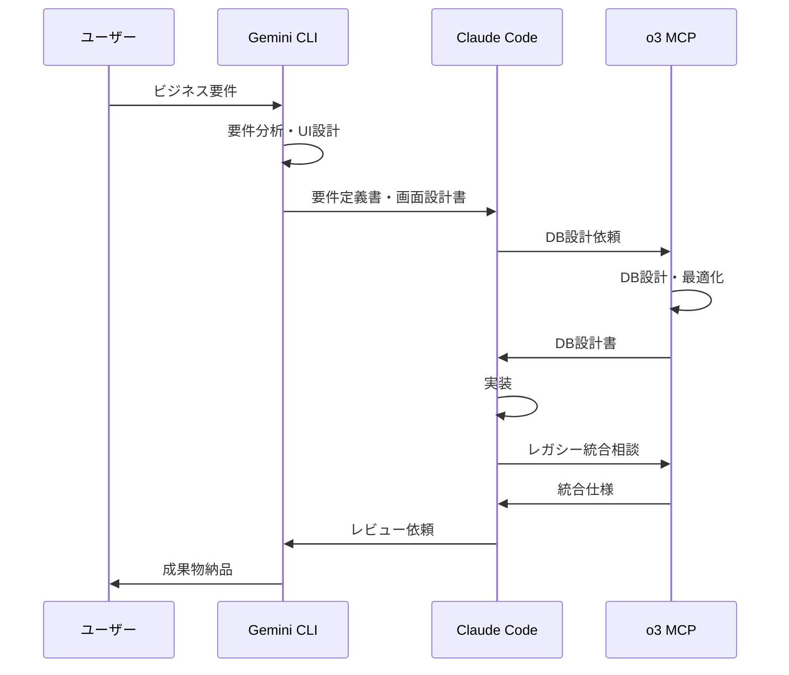

# マルチAI協調開発ガイド

## 概要

このガイドでは、Claude Code、Gemini CLI、o3 MCPの3つのAIを効果的に連携させ、.NET Framework 4.8エンタープライズシステムを開発する方法を解説します。

## 1. AI役割分担

### 1.1 各AIの専門領域

```yaml
Claude Code:
  得意分野:
    - .NET Framework実装
    - Windows Forms UI設計
    - Clean Architecture実装
    - コードレビューと品質保証
  担当フェーズ:
    - 詳細設計
    - 実装
    - 単体テスト
    - リファクタリング

Gemini CLI:
  得意分野:
    - ビジネス分析
    - 要件定義
    - UI/UXデザイン
    - プロセス最適化
  担当フェーズ:
    - 要件分析
    - 画面設計
    - ユーザビリティ評価
    - ドキュメント作成

o3 MCP:
  得意分野:
    - インフラストラクチャ
    - データベース設計
    - レガシーシステム統合
    - セキュリティ
  担当フェーズ:
    - システムアーキテクチャ
    - DB設計・最適化
    - 統合設計
    - デプロイメント
```

### 1.2 協調パターン



## 2. 共有ワークスペース構成

### 2.1 ディレクトリ構造

```
project-root/
├── .ai-workspace/              # AI共有ワークスペース
│   ├── requirements/          # Gemini作成の要件定義
│   ├── designs/              # 設計ドキュメント
│   ├── implementations/      # Claude実装コード
│   ├── infrastructure/       # o3インフラ設定
│   └── handoffs/            # AI間の引き継ぎ文書
├── .claude_dotnetFramework4.8/  # Claude専用
├── .gemini_analysis/           # Gemini専用
└── .o3_infrastructure/         # o3専用
```

### 2.2 引き継ぎドキュメントフォーマット

```markdown
# AI引き継ぎドキュメント

## メタ情報
- 作成者: [AI名]
- 作成日時: [日時]
- 引き継ぎ先: [AI名]
- ステータス: [未着手/進行中/完了]

## 成果物
- ファイルパス: [生成したファイルのリスト]
- 変更内容: [主な変更点]

## 次のアクション
- 期待するタスク: [具体的なタスク]
- 注意事項: [考慮すべき点]
- 参考情報: [関連ドキュメント]

## コンテキスト
[必要な背景情報や決定事項]
```

## 3. フェーズ別協調フロー

### 3.1 要件定義フェーズ

#### Gemini CLI主導

```bash
# Geminiでの要件分析
gemini analyze-requirements \
  --input "user-interview-notes.md" \
  --domain "enterprise-system" \
  --output ".ai-workspace/requirements/"

# 生成される成果物
requirements/
├── business-requirements.md
├── functional-requirements.md
├── non-functional-requirements.md
├── user-stories.md
└── acceptance-criteria.md
```

#### 引き継ぎ例

```markdown
# Gemini → Claude 引き継ぎ

## 要件定義完了通知

### 成果物
- business-requirements.md: ビジネス要件（売上管理、在庫管理）
- user-stories.md: 15個のユーザーストーリー
- ui-mockups/: 主要5画面のモックアップ

### Claude への依頼事項
1. user-stories.md を基に技術設計を作成
2. 特に「US-001: 在庫警告機能」の実装設計を優先
3. ui-mockups/inventory-alert.png のWindows Forms実装

### 重要な決定事項
- リアルタイム更新は不要（5分間隔でOK）
- 既存の在庫管理システム（AS/400）との連携必須
```

### 3.2 設計フェーズ

#### Claude Code + o3 MCP協調

```csharp
// Claude: ドメインモデル設計
public class InventoryAlert : Entity
{
    public ProductId ProductId { get; private set; }
    public Quantity CurrentStock { get; private set; }
    public Quantity MinimumStock { get; private set; }
    public AlertLevel Level { get; private set; }
    
    // o3に依頼: このエンティティ用のDB設計
    // 要件: AS/400の商品マスタ（ITEMMST）と連携
}
```

#### o3 MCPのレスポンス

```sql
-- o3: データベース設計

-- 新システムのテーブル
CREATE TABLE InventoryAlerts (
    AlertId INT IDENTITY(1,1) PRIMARY KEY,
    ProductId NVARCHAR(20) NOT NULL,
    CurrentStock DECIMAL(10,2) NOT NULL,
    MinimumStock DECIMAL(10,2) NOT NULL,
    AlertLevel INT NOT NULL,
    LegacyItemCode CHAR(8), -- AS/400連携用
    CreatedAt DATETIME2 NOT NULL DEFAULT GETDATE(),
    UpdatedAt DATETIME2 NOT NULL DEFAULT GETDATE(),
    
    INDEX IX_LegacyItemCode (LegacyItemCode),
    INDEX IX_ProductId_AlertLevel (ProductId, AlertLevel)
);

-- AS/400連携ビュー
CREATE VIEW vw_InventoryWithLegacy AS
SELECT 
    ia.AlertId,
    ia.ProductId,
    ia.CurrentStock,
    ISNULL(legacy.ONHAND, 0) as LegacyStock,
    ia.MinimumStock,
    ia.AlertLevel
FROM InventoryAlerts ia
LEFT JOIN OPENQUERY(AS400, 
    'SELECT ITEMCD, ONHAND FROM ITEMMST WHERE DELFLG = ''0''') legacy
ON ia.LegacyItemCode = legacy.ITEMCD;
```

### 3.3 実装フェーズ

#### マルチAI並行作業

```yaml
並行タスク:
  Claude Code:
    - Windows Formsの実装
    - ビジネスロジックの実装
    - 単体テストの作成
    
  Gemini CLI:
    - ユーザーマニュアル作成
    - 画面遷移テストケース作成
    - UIレビューチェックリスト
    
  o3 MCP:
    - データ移行スクリプト作成
    - バックアップ戦略策定
    - パフォーマンスチューニング
```

### 3.4 テストフェーズ

#### 統合テストシナリオ

```markdown
# マルチAI協調テスト

## テストシナリオ: 在庫警告機能

### 準備（o3 MCP）
1. テストデータをAS/400に投入
2. 新システムDBを初期化
3. 同期ジョブを実行

### 実行（Claude Code）
1. InventoryAlertFormを起動
2. 商品コード"TEST001"で検索
3. 最小在庫数を100に設定
4. 警告レベルを確認

### 検証（Gemini CLI）
1. UIの応答性（2秒以内）
2. 警告表示の視認性
3. エラーメッセージの適切性

### 結果記録
- 実行日時: 
- 実行者: [AI名]
- 結果: [成功/失敗]
- 次のアクション: 
```

## 4. コミュニケーションプロトコル

### 4.1 AI間メッセージング

```json
{
  "messageId": "msg-20240115-001",
  "from": "Claude Code",
  "to": ["o3 MCP"],
  "subject": "DB接続エラーの調査依頼",
  "priority": "high",
  "content": {
    "issue": "AS/400接続でタイムアウト発生",
    "errorDetails": {
      "message": "IBM.Data.DB2.iSeries.iDB2ConnectionTimeoutException",
      "occurredAt": "2024-01-15T10:30:00Z",
      "connectionString": "DataSource=AS400PROD;..."
    },
    "requestedAction": "接続パラメータの確認と最適化"
  },
  "attachments": [
    ".ai-workspace/logs/connection-error.log"
  ]
}
```

### 4.2 エスカレーションルール

```yaml
エスカレーションマトリクス:
  技術的問題:
    Level1: 担当AI内で解決試行
    Level2: 専門AIへ相談
    Level3: 全AI協議
    Level4: 人間の介入要請
    
  判断基準:
    - 30分以内に解決不可 → Level2
    - 複数システムに影響 → Level3
    - データ損失リスク → Level4
    
  通知テンプレート:
    title: "[緊急度] 問題の概要"
    body: |
      ## 問題
      [問題の詳細]
      
      ## 試行した解決策
      [実施内容と結果]
      
      ## 必要な支援
      [具体的な依頼事項]
```

## 5. 品質保証プロセス

### 5.1 クロスAIレビュー

```markdown
# レビューチェックリスト

## Gemini → Claude レビュー
- [ ] コードがビジネス要件を満たしているか
- [ ] UIがモックアップ通りか
- [ ] ユーザビリティの考慮
- [ ] エラーメッセージの適切性

## Claude → o3 レビュー
- [ ] DB設計が正規化されているか
- [ ] インデックスが適切か
- [ ] セキュリティの考慮
- [ ] バックアップ戦略

## o3 → Gemini レビュー
- [ ] 非機能要件の充足
- [ ] パフォーマンス目標の達成
- [ ] 運用手順の明確性
- [ ] 監視項目の妥当性
```

### 5.2 成果物の統合

```bash
# 最終成果物の統合スクリプト
integrate-deliverables.ps1

# 実行内容
1. 各AIの成果物を収集
2. 整合性チェック
3. ドキュメントの統合
4. 最終レビューパッケージ作成

# 出力
deliverables/
├── source-code/        # Claude
├── documentation/      # Gemini
├── infrastructure/     # o3
├── test-results/       # 全AI
└── release-notes.md    # 統合
```

## 6. トラブルシューティング

### 6.1 よくある問題と解決策

```yaml
問題パターン:
  意見の相違:
    症状: AIが異なる実装方針を提案
    解決策:
      1. 各案のメリット・デメリットを整理
      2. プロジェクト優先順位に基づき判断
      3. 決定理由を文書化
      
  情報の欠落:
    症状: 引き継ぎ時に必要情報が不足
    解決策:
      1. 標準テンプレートの使用徹底
      2. チェックリストでの確認
      3. 不明点の即時確認
      
  実装の不整合:
    症状: 各AIの実装が噛み合わない
    解決策:
      1. インターフェース定義の事前合意
      2. 統合テストの早期実施
      3. 定期的な同期ミーティング
```

### 6.2 ベストプラクティス

```markdown
## マルチAI協調のベストプラクティス

### 1. 明確な責任分担
- 各AIの得意分野を活かす
- 重複作業を避ける
- 責任範囲を文書化

### 2. 継続的なコミュニケーション
- 日次進捗共有
- 課題の早期共有
- 成功事例の展開

### 3. 標準化の推進
- コーディング規約の統一
- ドキュメントフォーマット統一
- 命名規則の統一

### 4. 相互学習
- 各AIの成果物から学習
- ナレッジベースの構築
- 改善提案の活発化

### 5. 人間のファシリテーション
- 最終判断は人間が実施
- AI間の調整役
- 品質の最終保証
```

## まとめ

マルチAI協調開発を成功させるポイント：

1. **明確な役割分担** - 各AIの強みを最大限活用
2. **標準化されたプロセス** - 一貫性のある開発フロー
3. **効果的なコミュニケーション** - 情報共有の仕組み
4. **継続的な改善** - フィードバックループの確立
5. **人間の適切な関与** - AIを活かすファシリテーション

これらの指針に従って、3つのAIを効果的に連携させることで、高品質なエンタープライズシステムを効率的に開発できます。