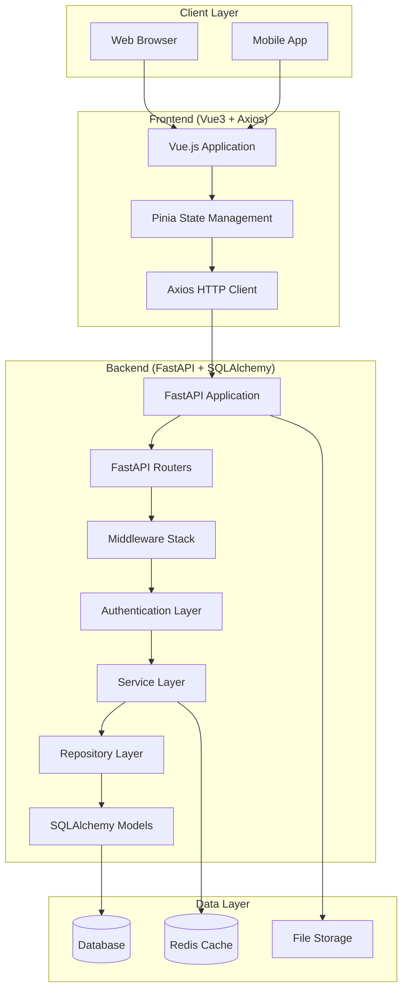

# FastAPI + SQLAlchemy バックエンド・フロントエンド完全統合ガイド

## 概要

このドキュメントでは、FastAPI + SQLAlchemy を使用したバックエンドと、Vue.js 3 + Axios フロントエンドの完全統合パターンについて説明します。

## アーキテクチャ統合概要

### システム全体構成


### 技術スタック統合マッピング
| Component | Backend (FastAPI + SQLAlchemy) | Frontend (Vue3 + Axios) | Integration Point |
|-----------|--------------------------------|--------------------------|-------------------|
| **API Layer** | FastAPI Routes | Axios Services | REST API Endpoints |
| **Authentication** | JWT + OAuth2 | Token Management | Bearer Authentication |
| **Data Validation** | Pydantic Models | Vue3 + Vuelidate | JSON Schema |
| **State Management** | SQLAlchemy Session | Pinia Stores | Data Synchronization |
| **Error Handling** | FastAPI Exception Handlers | Axios Interceptors | HTTP Status Codes |
| **Real-time** | WebSocket + FastAPI | WebSocket Client | Bi-directional Communication |
| **File Upload** | FastAPI File Handling | FormData + Axios | Multipart Upload |

## バックエンド統合設計

### 1. FastAPI アプリケーション構成

#### メインアプリケーション設定
```python
# main.py
from fastapi import FastAPI, Request
from fastapi.middleware.cors import CORSMiddleware
from fastapi.middleware.trustedhost import TrustedHostMiddleware
from fastapi.staticfiles import StaticFiles
from fastapi.exceptions import RequestValidationError
from starlette.exceptions import HTTPException as StarletteHTTPException
from contextlib import asynccontextmanager
import logging

from database import engine, Base
from routers import auth, users, items
from middleware import (
    LoggingMiddleware,
    AuthenticationMiddleware,
    ErrorHandlingMiddleware
)
from exceptions.handlers import (
    http_exception_handler,
    validation_exception_handler,
    general_exception_handler
)

# ロギング設定
logging.basicConfig(
    level=logging.INFO,
    format="%(asctime)s - %(name)s - %(levelname)s - %(message)s"
)
logger = logging.getLogger(__name__)

@asynccontextmanager
async def lifespan(app: FastAPI):
    """アプリケーションライフサイクル管理"""
    # 起動時処理
    logger.info("Starting FastAPI application...")
    
    # データベーステーブル作成
    async with engine.begin() as conn:
        await conn.run_sync(Base.metadata.create_all)
    
    # キャッシュ初期化
    # await init_cache()
    
    yield
    
    # 終了時処理
    logger.info("Shutting down FastAPI application...")
    # await cleanup_resources()

# FastAPIアプリケーション作成
app = FastAPI(
    title="Vue3 + FastAPI Integration Backend",
    description="完全統合バックエンドAPI",
    version="1.0.0",
    lifespan=lifespan,
    docs_url="/api/docs",
    redoc_url="/api/redoc",
    openapi_url="/api/openapi.json"
)

# セキュリティミドルウェア
app.add_middleware(
    TrustedHostMiddleware,
    allowed_hosts=["localhost", "127.0.0.1", "*.yourdomain.com"]
)

# CORS設定（フロントエンド統合用）
app.add_middleware(
    CORSMiddleware,
    allow_origins=[
        "http://localhost:3000",  # Vue.js dev server
        "http://localhost:5173",  # Vite dev server
        "https://yourdomain.com", # Production frontend
        "https://*.yourdomain.com" # Subdomain support
    ],
    allow_credentials=True,
    allow_methods=["GET", "POST", "PUT", "DELETE", "PATCH", "OPTIONS"],
    allow_headers=["*"],
    expose_headers=["X-Total-Count", "X-Request-ID"]
)

# カスタムミドルウェア
app.add_middleware(LoggingMiddleware)
app.add_middleware(AuthenticationMiddleware)
app.add_middleware(ErrorHandlingMiddleware)

# 例外ハンドラー登録
app.add_exception_handler(StarletteHTTPException, http_exception_handler)
app.add_exception_handler(RequestValidationError, validation_exception_handler)
app.add_exception_handler(Exception, general_exception_handler)

# 静的ファイル配信（フロントエンド統合用）
app.mount("/static", StaticFiles(directory="static"), name="static")

# APIルーター登録
api_prefix = "/api/v1"
app.include_router(auth.router, prefix=f"{api_prefix}/auth", tags=["authentication"])
app.include_router(users.router, prefix=f"{api_prefix}/users", tags=["users"])
app.include_router(items.router, prefix=f"{api_prefix}/items", tags=["items"])

# ヘルスチェックエンドポイント
@app.get("/health")
async def health_check():
    """ヘルスチェック"""
    return {
        "status": "healthy",
        "version": "1.0.0",
        "timestamp": datetime.utcnow().isoformat()
    }

# フロントエンド用ルートフォールバック
@app.get("/{full_path:path}")
async def serve_frontend(full_path: str):
    """SPA用のフォールバックルート"""
    if full_path.startswith("api/"):
        raise HTTPException(status_code=404, detail="API endpoint not found")
    
    # フロントエンドのindex.htmlを返す
    return FileResponse("static/index.html")
```

### 2. データベース統合層

#### SQLAlchemy モデル設計（フロントエンド統合対応）
```python
# models/base.py
from sqlalchemy import Column, Integer, DateTime, String
from sqlalchemy.ext.declarative import declarative_base
from sqlalchemy.orm import Session
from datetime import datetime
from typing import Dict, Any, Optional
import json

Base = declarative_base()

class BaseModel(Base):
    """基底モデルクラス（フロントエンド統合対応）"""
    __abstract__ = True
    
    id = Column(Integer, primary_key=True, index=True)
    created_at = Column(DateTime, default=datetime.utcnow, nullable=False)
    updated_at = Column(DateTime, default=datetime.utcnow, onupdate=datetime.utcnow)
    created_by = Column(Integer, nullable=True)  # ユーザーID
    updated_by = Column(Integer, nullable=True)
    
    def to_dict(self) -> Dict[str, Any]:
        """フロントエンド用辞書変換"""
        result = {}
        for column in self.__table__.columns:
            value = getattr(self, column.name)
            if isinstance(value, datetime):
                result[column.name] = value.isoformat()
            else:
                result[column.name] = value
        return result
    
    def to_json(self) -> str:
        """JSON文字列変換"""
        return json.dumps(self.to_dict(), default=str)
    
    @classmethod
    def from_dict(cls, data: Dict[str, Any]):
        """辞書からインスタンス作成"""
        return cls(**{
            key: value for key, value in data.items()
            if hasattr(cls, key)
        })

# models/user.py
from sqlalchemy import Column, String, Boolean, Text
from sqlalchemy.orm import relationship
from models.base import BaseModel

class User(BaseModel):
    """ユーザーモデル"""
    __tablename__ = "users"
    
    username = Column(String(50), unique=True, index=True, nullable=False)
    email = Column(String(100), unique=True, index=True, nullable=False)
    hashed_password = Column(String(255), nullable=False)
    full_name = Column(String(100))
    is_active = Column(Boolean, default=True)
    is_superuser = Column(Boolean, default=False)
    profile_image = Column(String(255))  # フロントエンド画像表示用
    bio = Column(Text)
    
    # リレーション
    items = relationship("Item", back_populates="owner")
    
    def to_dict_safe(self) -> Dict[str, Any]:
        """フロントエンド用安全な辞書変換（パスワード除外）"""
        data = self.to_dict()
        data.pop('hashed_password', None)
        return data

# models/item.py
from sqlalchemy import Column, String, Text, Integer, ForeignKey, Enum
from sqlalchemy.orm import relationship
from models.base import BaseModel
import enum

class ItemStatus(enum.Enum):
    """アイテムステータス（フロントエンド選択肢用）"""
    DRAFT = "draft"
    PUBLISHED = "published"
    ARCHIVED = "archived"

class Item(BaseModel):
    """アイテムモデル"""
    __tablename__ = "items"
    
    title = Column(String(200), nullable=False, index=True)
    description = Column(Text)
    status = Column(Enum(ItemStatus), default=ItemStatus.DRAFT)
    tags = Column(String(500))  # JSON文字列として保存
    owner_id = Column(Integer, ForeignKey("users.id"))
    
    # リレーション
    owner = relationship("User", back_populates="items")
    
    def to_dict(self) -> Dict[str, Any]:
        """フロントエンド統合用辞書変換"""
        data = super().to_dict()
        
        # ステータスをenum値に変換
        if self.status:
            data['status'] = self.status.value
        
        # タグをリストに変換
        if self.tags:
            try:
                data['tags'] = json.loads(self.tags)
            except:
                data['tags'] = []
        else:
            data['tags'] = []
        
        # オーナー情報を含む
        if self.owner:
            data['owner'] = self.owner.to_dict_safe()
        
        return data
```

### 3. Pydantic スキーマ（フロントエンド統合対応）

```python
# schemas/base.py
from pydantic import BaseModel, Field, validator
from typing import Optional, Dict, Any, List
from datetime import datetime
from enum import Enum

class TimestampMixin(BaseModel):
    """タイムスタンプ Mixin"""
    created_at: datetime
    updated_at: Optional[datetime] = None
    
    class Config:
        json_encoders = {
            datetime: lambda v: v.isoformat()
        }

class ResponseBase(BaseModel):
    """基本レスポンススキーマ"""
    success: bool = True
    message: Optional[str] = None
    timestamp: datetime = Field(default_factory=datetime.utcnow)
    
    class Config:
        json_encoders = {
            datetime: lambda v: v.isoformat()
        }

class PaginationMeta(BaseModel):
    """ページネーションメタデータ"""
    total: int = Field(..., description="総レコード数")
    page: int = Field(..., description="現在のページ")
    limit: int = Field(..., description="1ページあたりの件数")
    pages: int = Field(..., description="総ページ数")
    has_next: bool = Field(..., description="次ページの有無")
    has_prev: bool = Field(..., description="前ページの有無")

# schemas/user.py
from pydantic import BaseModel, EmailStr, validator
from typing import Optional, List
from schemas.base import TimestampMixin, ResponseBase

class UserBase(BaseModel):
    """ユーザー基底スキーマ"""
    username: str = Field(..., min_length=3, max_length=50)
    email: EmailStr
    full_name: Optional[str] = Field(None, max_length=100)
    bio: Optional[str] = Field(None, max_length=1000)
    is_active: bool = True

class UserCreate(UserBase):
    """ユーザー作成スキーマ"""
    password: str = Field(..., min_length=8, max_length=100)
    
    @validator('password')
    def validate_password(cls, v):
        """パスワード強度チェック"""
        if not any(c.isupper() for c in v):
            raise ValueError('Password must contain at least one uppercase letter')
        if not any(c.islower() for c in v):
            raise ValueError('Password must contain at least one lowercase letter')
        if not any(c.isdigit() for c in v):
            raise ValueError('Password must contain at least one digit')
        return v

class UserUpdate(BaseModel):
    """ユーザー更新スキーマ"""
    full_name: Optional[str] = None
    bio: Optional[str] = None
    profile_image: Optional[str] = None

class UserResponse(UserBase, TimestampMixin):
    """ユーザーレスポンススキーマ"""
    id: int
    profile_image: Optional[str] = None
    is_superuser: bool = False
    
    class Config:
        from_attributes = True

class UserListResponse(ResponseBase):
    """ユーザー一覧レスポンス"""
    data: List[UserResponse]
    meta: PaginationMeta

# schemas/item.py
from models.item import ItemStatus
from schemas.base import TimestampMixin, ResponseBase

class ItemBase(BaseModel):
    """アイテム基底スキーマ"""
    title: str = Field(..., min_length=1, max_length=200)
    description: Optional[str] = Field(None, max_length=5000)
    status: ItemStatus = ItemStatus.DRAFT
    tags: List[str] = Field(default_factory=list, max_items=10)

class ItemCreate(ItemBase):
    """アイテム作成スキーマ"""
    pass

class ItemUpdate(BaseModel):
    """アイテム更新スキーマ"""
    title: Optional[str] = Field(None, min_length=1, max_length=200)
    description: Optional[str] = Field(None, max_length=5000)
    status: Optional[ItemStatus] = None
    tags: Optional[List[str]] = Field(None, max_items=10)

class ItemResponse(ItemBase, TimestampMixin):
    """アイテムレスポンススキーマ"""
    id: int
    owner_id: int
    owner: Optional[UserResponse] = None
    
    class Config:
        from_attributes = True

class ItemListResponse(ResponseBase):
    """アイテム一覧レスポンス"""
    data: List[ItemResponse]
    meta: PaginationMeta
```

### 4. 認証・認可統合

#### JWT トークン管理（フロントエンド統合対応）
```python
# auth/security.py
from datetime import datetime, timedelta
from typing import Optional, Dict, Any
from jose import JWTError, jwt
from passlib.context import CryptContext
from fastapi import HTTPException, Depends, status
from fastapi.security import HTTPBearer, HTTPAuthorizationCredentials
from sqlalchemy.orm import Session

from database import get_db
from models.user import User
from schemas.auth import TokenData

# セキュリティ設定
SECRET_KEY = "your-secret-key-here"  # 環境変数から取得
ALGORITHM = "HS256"
ACCESS_TOKEN_EXPIRE_MINUTES = 60
REFRESH_TOKEN_EXPIRE_DAYS = 7

pwd_context = CryptContext(schemes=["bcrypt"], deprecated="auto")
security = HTTPBearer()

class AuthService:
    """認証サービス（フロントエンド統合対応）"""
    
    @staticmethod
    def verify_password(plain_password: str, hashed_password: str) -> bool:
        """パスワード検証"""
        return pwd_context.verify(plain_password, hashed_password)
    
    @staticmethod
    def get_password_hash(password: str) -> str:
        """パスワードハッシュ化"""
        return pwd_context.hash(password)
    
    @staticmethod
    def create_access_token(
        data: Dict[str, Any],
        expires_delta: Optional[timedelta] = None
    ) -> str:
        """アクセストークン生成"""
        to_encode = data.copy()
        if expires_delta:
            expire = datetime.utcnow() + expires_delta
        else:
            expire = datetime.utcnow() + timedelta(minutes=ACCESS_TOKEN_EXPIRE_MINUTES)
        
        to_encode.update({
            "exp": expire,
            "type": "access",
            "iat": datetime.utcnow()
        })
        
        encoded_jwt = jwt.encode(to_encode, SECRET_KEY, algorithm=ALGORITHM)
        return encoded_jwt
    
    @staticmethod
    def create_refresh_token(data: Dict[str, Any]) -> str:
        """リフレッシュトークン生成"""
        to_encode = data.copy()
        expire = datetime.utcnow() + timedelta(days=REFRESH_TOKEN_EXPIRE_DAYS)
        
        to_encode.update({
            "exp": expire,
            "type": "refresh",
            "iat": datetime.utcnow()
        })
        
        encoded_jwt = jwt.encode(to_encode, SECRET_KEY, algorithm=ALGORITHM)
        return encoded_jwt
    
    @staticmethod
    def verify_token(token: str) -> Dict[str, Any]:
        """トークン検証"""
        try:
            payload = jwt.decode(token, SECRET_KEY, algorithms=[ALGORITHM])
            return payload
        except JWTError as e:
            raise HTTPException(
                status_code=status.HTTP_401_UNAUTHORIZED,
                detail="Could not validate credentials",
                headers={"WWW-Authenticate": "Bearer"},
            )

# 依存性注入関数
async def get_current_user(
    credentials: HTTPAuthorizationCredentials = Depends(security),
    db: Session = Depends(get_db)
) -> User:
    """現在のユーザー取得"""
    token = credentials.credentials
    
    try:
        payload = AuthService.verify_token(token)
        username: str = payload.get("sub")
        token_type: str = payload.get("type")
        
        if username is None or token_type != "access":
            raise HTTPException(
                status_code=status.HTTP_401_UNAUTHORIZED,
                detail="Invalid authentication credentials"
            )
        
        token_data = TokenData(username=username)
    except JWTError:
        raise HTTPException(
            status_code=status.HTTP_401_UNAUTHORIZED,
            detail="Could not validate credentials"
        )
    
    user = db.query(User).filter(User.username == token_data.username).first()
    if user is None:
        raise HTTPException(
            status_code=status.HTTP_404_NOT_FOUND,
            detail="User not found"
        )
    
    return user

async def get_current_active_user(
    current_user: User = Depends(get_current_user)
) -> User:
    """アクティブユーザーのみ許可"""
    if not current_user.is_active:
        raise HTTPException(
            status_code=status.HTTP_400_BAD_REQUEST,
            detail="Inactive user"
        )
    return current_user

def require_roles(*required_roles: str):
    """ロールベース認可デコレータ"""
    async def role_checker(
        current_user: User = Depends(get_current_active_user)
    ) -> User:
        if not current_user.is_superuser and current_user.role not in required_roles:
            raise HTTPException(
                status_code=status.HTTP_403_FORBIDDEN,
                detail="Insufficient permissions"
            )
        return current_user
    
    return role_checker
```

### 5. APIルーター（フロントエンド統合対応）

```python
# routers/auth.py
from fastapi import APIRouter, Depends, HTTPException, status
from fastapi.security import OAuth2PasswordRequestForm
from sqlalchemy.orm import Session
from datetime import timedelta

from database import get_db
from auth.security import AuthService, get_current_active_user
from models.user import User
from schemas.auth import Token, UserResponse, LoginRequest
from crud.user import user_crud

router = APIRouter()

@router.post("/login", response_model=Token)
async def login(
    form_data: OAuth2PasswordRequestForm = Depends(),
    db: Session = Depends(get_db)
):
    """ユーザーログイン（フロントエンド統合用）"""
    user = user_crud.authenticate(
        db, username=form_data.username, password=form_data.password
    )
    
    if not user:
        raise HTTPException(
            status_code=status.HTTP_401_UNAUTHORIZED,
            detail="Incorrect username or password",
            headers={"WWW-Authenticate": "Bearer"},
        )
    
    if not user.is_active:
        raise HTTPException(
            status_code=status.HTTP_400_BAD_REQUEST,
            detail="Inactive user"
        )
    
    access_token_expires = timedelta(minutes=ACCESS_TOKEN_EXPIRE_MINUTES)
    access_token = AuthService.create_access_token(
        data={"sub": user.username}, expires_delta=access_token_expires
    )
    refresh_token = AuthService.create_refresh_token(
        data={"sub": user.username}
    )
    
    return {
        "access_token": access_token,
        "refresh_token": refresh_token,
        "token_type": "bearer",
        "expires_in": ACCESS_TOKEN_EXPIRE_MINUTES * 60,
        "user": UserResponse.from_orm(user)
    }

@router.post("/refresh", response_model=Token)
async def refresh_token(
    refresh_token: str,
    db: Session = Depends(get_db)
):
    """トークンリフレッシュ"""
    try:
        payload = AuthService.verify_token(refresh_token)
        username = payload.get("sub")
        token_type = payload.get("type")
        
        if username is None or token_type != "refresh":
            raise HTTPException(
                status_code=status.HTTP_401_UNAUTHORIZED,
                detail="Invalid refresh token"
            )
        
        user = db.query(User).filter(User.username == username).first()
        if not user or not user.is_active:
            raise HTTPException(
                status_code=status.HTTP_401_UNAUTHORIZED,
                detail="User not found or inactive"
            )
        
        # 新しいアクセストークン生成
        access_token_expires = timedelta(minutes=ACCESS_TOKEN_EXPIRE_MINUTES)
        new_access_token = AuthService.create_access_token(
            data={"sub": user.username}, expires_delta=access_token_expires
        )
        
        return {
            "access_token": new_access_token,
            "token_type": "bearer",
            "expires_in": ACCESS_TOKEN_EXPIRE_MINUTES * 60
        }
        
    except JWTError:
        raise HTTPException(
            status_code=status.HTTP_401_UNAUTHORIZED,
            detail="Invalid refresh token"
        )

@router.get("/me", response_model=UserResponse)
async def get_current_user_info(
    current_user: User = Depends(get_current_active_user)
):
    """現在のユーザー情報取得"""
    return UserResponse.from_orm(current_user)

@router.post("/logout")
async def logout():
    """ログアウト（フロントエンド側でトークン削除）"""
    return {"message": "Successfully logged out"}

# routers/items.py
from fastapi import APIRouter, Depends, HTTPException, Query, Path
from sqlalchemy.orm import Session
from typing import List, Optional

from database import get_db
from auth.security import get_current_active_user
from models.user import User
from models.item import Item, ItemStatus
from schemas.item import ItemCreate, ItemUpdate, ItemResponse, ItemListResponse
from crud.item import item_crud
from utils.pagination import paginate

router = APIRouter()

@router.get("", response_model=ItemListResponse)
async def get_items(
    skip: int = Query(0, ge=0, description="スキップ数"),
    limit: int = Query(50, ge=1, le=100, description="取得件数"),
    status: Optional[ItemStatus] = Query(None, description="ステータスフィルター"),
    search: Optional[str] = Query(None, min_length=1, description="検索キーワード"),
    owner_id: Optional[int] = Query(None, description="所有者フィルター"),
    db: Session = Depends(get_db),
    current_user: User = Depends(get_current_active_user)
):
    """アイテム一覧取得（フロントエンド統合対応）"""
    
    # クエリ構築
    query = db.query(Item)
    
    # フィルター適用
    if status:
        query = query.filter(Item.status == status)
    
    if search:
        query = query.filter(Item.title.contains(search))
    
    if owner_id:
        query = query.filter(Item.owner_id == owner_id)
    
    # ページネーション
    items, total = paginate(query, page=(skip // limit) + 1, limit=limit)
    
    return ItemListResponse(
        data=[ItemResponse.from_orm(item) for item in items],
        meta=PaginationMeta(
            total=total,
            page=(skip // limit) + 1,
            limit=limit,
            pages=ceil(total / limit),
            has_next=(skip + limit) < total,
            has_prev=skip > 0
        )
    )

@router.post("", response_model=ItemResponse, status_code=201)
async def create_item(
    item_data: ItemCreate,
    db: Session = Depends(get_db),
    current_user: User = Depends(get_current_active_user)
):
    """アイテム作成"""
    item = item_crud.create_with_owner(
        db=db, obj_in=item_data, owner_id=current_user.id
    )
    return ItemResponse.from_orm(item)

@router.get("/{item_id}", response_model=ItemResponse)
async def get_item(
    item_id: int = Path(..., gt=0),
    db: Session = Depends(get_db),
    current_user: User = Depends(get_current_active_user)
):
    """アイテム詳細取得"""
    item = item_crud.get(db=db, id=item_id)
    if not item:
        raise HTTPException(
            status_code=status.HTTP_404_NOT_FOUND,
            detail="Item not found"
        )
    
    # 権限チェック
    if not current_user.is_superuser and item.owner_id != current_user.id:
        raise HTTPException(
            status_code=status.HTTP_403_FORBIDDEN,
            detail="Not enough permissions"
        )
    
    return ItemResponse.from_orm(item)

@router.put("/{item_id}", response_model=ItemResponse)
async def update_item(
    item_id: int = Path(..., gt=0),
    item_data: ItemUpdate,
    db: Session = Depends(get_db),
    current_user: User = Depends(get_current_active_user)
):
    """アイテム更新"""
    item = item_crud.get(db=db, id=item_id)
    if not item:
        raise HTTPException(
            status_code=status.HTTP_404_NOT_FOUND,
            detail="Item not found"
        )
    
    # 権限チェック
    if not current_user.is_superuser and item.owner_id != current_user.id:
        raise HTTPException(
            status_code=status.HTTP_403_FORBIDDEN,
            detail="Not enough permissions"
        )
    
    item = item_crud.update(db=db, db_obj=item, obj_in=item_data)
    return ItemResponse.from_orm(item)

@router.delete("/{item_id}", status_code=204)
async def delete_item(
    item_id: int = Path(..., gt=0),
    db: Session = Depends(get_db),
    current_user: User = Depends(get_current_active_user)
):
    """アイテム削除"""
    item = item_crud.get(db=db, id=item_id)
    if not item:
        raise HTTPException(
            status_code=status.HTTP_404_NOT_FOUND,
            detail="Item not found"
        )
    
    # 権限チェック
    if not current_user.is_superuser and item.owner_id != current_user.id:
        raise HTTPException(
            status_code=status.HTTP_403_FORBIDDEN,
            detail="Not enough permissions"
        )
    
    item_crud.remove(db=db, id=item_id)
```

### 6. ファイルアップロード統合

#### バックエンド ファイルハンドリング
```python
# routers/upload.py
from fastapi import APIRouter, Depends, UploadFile, File, HTTPException, Form
from fastapi.responses import FileResponse
from sqlalchemy.orm import Session
import os
import uuid
from typing import List
import aiofiles
from PIL import Image
import io

from database import get_db
from auth.security import get_current_active_user
from models.user import User
from schemas.upload import FileUploadResponse, FileInfo

router = APIRouter()

UPLOAD_DIR = "uploads"
ALLOWED_EXTENSIONS = {".jpg", ".jpeg", ".png", ".gif", ".pdf", ".doc", ".docx"}
MAX_FILE_SIZE = 10 * 1024 * 1024  # 10MB

os.makedirs(UPLOAD_DIR, exist_ok=True)

def validate_file(file: UploadFile) -> None:
    """ファイルバリデーション"""
    # ファイル拡張子チェック
    file_ext = os.path.splitext(file.filename)[1].lower()
    if file_ext not in ALLOWED_EXTENSIONS:
        raise HTTPException(
            status_code=400,
            detail=f"File type not allowed. Allowed types: {', '.join(ALLOWED_EXTENSIONS)}"
        )
    
    # ファイルサイズチェック（ここではContent-Lengthヘッダーをチェック）
    if hasattr(file, 'size') and file.size > MAX_FILE_SIZE:
        raise HTTPException(
            status_code=400,
            detail=f"File too large. Maximum size: {MAX_FILE_SIZE / (1024*1024):.1f}MB"
        )

async def save_upload_file(file: UploadFile, destination: str) -> int:
    """ファイル保存とサイズ返却"""
    size = 0
    async with aiofiles.open(destination, 'wb') as f:
        while chunk := await file.read(1024):
            size += len(chunk)
            if size > MAX_FILE_SIZE:
                # ファイル削除
                await f.close()
                os.unlink(destination)
                raise HTTPException(
                    status_code=400,
                    detail=f"File too large. Maximum size: {MAX_FILE_SIZE / (1024*1024):.1f}MB"
                )
            await f.write(chunk)
    return size

@router.post("/files", response_model=FileUploadResponse)
async def upload_file(
    file: UploadFile = File(...),
    description: str = Form(None),
    db: Session = Depends(get_db),
    current_user: User = Depends(get_current_active_user)
):
    """ファイルアップロード"""
    
    # バリデーション
    validate_file(file)
    
    # ファイル名生成
    file_ext = os.path.splitext(file.filename)[1].lower()
    unique_filename = f"{uuid.uuid4()}{file_ext}"
    file_path = os.path.join(UPLOAD_DIR, unique_filename)
    
    try:
        # ファイル保存
        file_size = await save_upload_file(file, file_path)
        
        # 画像の場合はサムネイル生成
        thumbnail_path = None
        if file_ext in {".jpg", ".jpeg", ".png"}:
            thumbnail_path = await generate_thumbnail(file_path, unique_filename)
        
        # データベースに記録
        file_record = FileRecord(
            original_name=file.filename,
            stored_name=unique_filename,
            file_path=file_path,
            file_size=file_size,
            content_type=file.content_type,
            description=description,
            thumbnail_path=thumbnail_path,
            uploaded_by=current_user.id
        )
        
        db.add(file_record)
        db.commit()
        db.refresh(file_record)
        
        return FileUploadResponse(
            id=file_record.id,
            filename=file.filename,
            stored_name=unique_filename,
            size=file_size,
            content_type=file.content_type,
            url=f"/api/v1/upload/files/{unique_filename}",
            thumbnail_url=f"/api/v1/upload/thumbnails/{unique_filename}" if thumbnail_path else None,
            description=description
        )
        
    except Exception as e:
        # ファイル削除
        if os.path.exists(file_path):
            os.unlink(file_path)
        raise HTTPException(status_code=500, detail=str(e))

@router.post("/files/multiple", response_model=List[FileUploadResponse])
async def upload_multiple_files(
    files: List[UploadFile] = File(...),
    db: Session = Depends(get_db),
    current_user: User = Depends(get_current_active_user)
):
    """複数ファイルアップロード"""
    if len(files) > 10:
        raise HTTPException(
            status_code=400,
            detail="Too many files. Maximum 10 files allowed."
        )
    
    results = []
    for file in files:
        try:
            result = await upload_file(file, None, db, current_user)
            results.append(result)
        except HTTPException:
            # 個別ファイルのエラーは無視して続行
            continue
    
    return results

@router.get("/files/{filename}")
async def get_file(filename: str):
    """ファイル取得"""
    file_path = os.path.join(UPLOAD_DIR, filename)
    
    if not os.path.exists(file_path):
        raise HTTPException(status_code=404, detail="File not found")
    
    return FileResponse(file_path)

@router.get("/thumbnails/{filename}")
async def get_thumbnail(filename: str):
    """サムネイル取得"""
    name_without_ext = os.path.splitext(filename)[0]
    thumbnail_path = os.path.join(UPLOAD_DIR, "thumbnails", f"{name_without_ext}_thumb.jpg")
    
    if not os.path.exists(thumbnail_path):
        raise HTTPException(status_code=404, detail="Thumbnail not found")
    
    return FileResponse(thumbnail_path)

async def generate_thumbnail(file_path: str, filename: str) -> str:
    """サムネイル生成"""
    thumbnail_dir = os.path.join(UPLOAD_DIR, "thumbnails")
    os.makedirs(thumbnail_dir, exist_ok=True)
    
    name_without_ext = os.path.splitext(filename)[0]
    thumbnail_filename = f"{name_without_ext}_thumb.jpg"
    thumbnail_path = os.path.join(thumbnail_dir, thumbnail_filename)
    
    try:
        with Image.open(file_path) as img:
            # EXIF情報に基づいて回転
            img = img.rotate(0)  # 必要に応じて調整
            
            # サムネイルサイズに変換
            img.thumbnail((200, 200), Image.Resampling.LANCZOS)
            
            # JPEG形式で保存
            img.convert('RGB').save(thumbnail_path, 'JPEG', quality=85)
        
        return thumbnail_path
        
    except Exception as e:
        print(f"Thumbnail generation failed: {e}")
        return None
```

### 7. WebSocket 統合

#### リアルタイム通信実装
```python
# websocket/manager.py
from fastapi import WebSocket, WebSocketDisconnect
from typing import Dict, List, Set
import json
import asyncio
from datetime import datetime

class ConnectionManager:
    """WebSocket接続管理（フロントエンド統合対応）"""
    
    def __init__(self):
        # ルーム別接続管理
        self.active_connections: Dict[str, Set[WebSocket]] = {}
        # ユーザー別接続管理
        self.user_connections: Dict[int, Set[WebSocket]] = {}
        # 接続別メタデータ
        self.connection_meta: Dict[WebSocket, Dict] = {}

    async def connect(self, websocket: WebSocket, room: str, user_id: int = None):
        """WebSocket接続受け入れ"""
        await websocket.accept()
        
        # ルーム別接続追加
        if room not in self.active_connections:
            self.active_connections[room] = set()
        self.active_connections[room].add(websocket)
        
        # ユーザー別接続追加
        if user_id:
            if user_id not in self.user_connections:
                self.user_connections[user_id] = set()
            self.user_connections[user_id].add(websocket)
        
        # メタデータ保存
        self.connection_meta[websocket] = {
            "room": room,
            "user_id": user_id,
            "connected_at": datetime.utcnow(),
            "last_activity": datetime.utcnow()
        }
        
        # 接続通知
        await self.broadcast_to_room(json.dumps({
            "type": "user_connected",
            "user_id": user_id,
            "timestamp": datetime.utcnow().isoformat()
        }), room, exclude=websocket)

    def disconnect(self, websocket: WebSocket):
        """WebSocket接続切断"""
        meta = self.connection_meta.get(websocket, {})
        room = meta.get("room")
        user_id = meta.get("user_id")
        
        # ルーム別接続削除
        if room and room in self.active_connections:
            self.active_connections[room].discard(websocket)
            if not self.active_connections[room]:
                del self.active_connections[room]
        
        # ユーザー別接続削除
        if user_id and user_id in self.user_connections:
            self.user_connections[user_id].discard(websocket)
            if not self.user_connections[user_id]:
                del self.user_connections[user_id]
        
        # メタデータ削除
        self.connection_meta.pop(websocket, None)
        
        # 切断通知
        if room:
            asyncio.create_task(self.broadcast_to_room(json.dumps({
                "type": "user_disconnected",
                "user_id": user_id,
                "timestamp": datetime.utcnow().isoformat()
            }), room))

    async def send_personal_message(self, message: str, websocket: WebSocket):
        """個人メッセージ送信"""
        try:
            await websocket.send_text(message)
            # 最終活動時刻更新
            if websocket in self.connection_meta:
                self.connection_meta[websocket]["last_activity"] = datetime.utcnow()
        except:
            self.disconnect(websocket)

    async def send_to_user(self, message: str, user_id: int):
        """特定ユーザーの全接続にメッセージ送信"""
        if user_id in self.user_connections:
            disconnected = set()
            for websocket in self.user_connections[user_id].copy():
                try:
                    await websocket.send_text(message)
                except:
                    disconnected.add(websocket)
            
            # 切断された接続を削除
            for websocket in disconnected:
                self.disconnect(websocket)

    async def broadcast_to_room(self, message: str, room: str, exclude: WebSocket = None):
        """ルーム内ブロードキャスト"""
        if room in self.active_connections:
            disconnected = set()
            for websocket in self.active_connections[room].copy():
                if websocket != exclude:
                    try:
                        await websocket.send_text(message)
                    except:
                        disconnected.add(websocket)
            
            # 切断された接続を削除
            for websocket in disconnected:
                self.disconnect(websocket)

    def get_room_users(self, room: str) -> List[int]:
        """ルーム内ユーザー一覧取得"""
        users = set()
        if room in self.active_connections:
            for websocket in self.active_connections[room]:
                meta = self.connection_meta.get(websocket, {})
                if meta.get("user_id"):
                    users.add(meta["user_id"])
        return list(users)

    def get_connection_count(self, room: str = None) -> int:
        """接続数取得"""
        if room:
            return len(self.active_connections.get(room, set()))
        return sum(len(connections) for connections in self.active_connections.values())

manager = ConnectionManager()

# websocket/routes.py
from fastapi import APIRouter, WebSocket, WebSocketDisconnect, Depends, Query
from sqlalchemy.orm import Session
from auth.security import get_current_user_ws
from models.user import User
from database import get_db

router = APIRouter()

@router.websocket("/ws/{room}")
async def websocket_endpoint(
    websocket: WebSocket,
    room: str,
    token: str = Query(...),
    db: Session = Depends(get_db)
):
    """WebSocketエンドポイント"""
    
    # トークン認証
    try:
        user = await get_current_user_ws(token, db)
    except:
        await websocket.close(code=4001, reason="Authentication failed")
        return
    
    await manager.connect(websocket, room, user.id)
    
    try:
        while True:
            # メッセージ受信
            data = await websocket.receive_text()
            
            try:
                message_data = json.loads(data)
                message_type = message_data.get("type", "message")
                
                if message_type == "message":
                    # チャットメッセージ
                    await handle_chat_message(message_data, room, user, websocket)
                
                elif message_type == "typing":
                    # タイピング通知
                    await handle_typing_notification(message_data, room, user, websocket)
                
                elif message_type == "ping":
                    # ハートビート
                    await websocket.send_text(json.dumps({
                        "type": "pong",
                        "timestamp": datetime.utcnow().isoformat()
                    }))
                
                else:
                    # 未知のメッセージタイプ
                    await websocket.send_text(json.dumps({
                        "type": "error",
                        "message": f"Unknown message type: {message_type}"
                    }))
                    
            except json.JSONDecodeError:
                await websocket.send_text(json.dumps({
                    "type": "error",
                    "message": "Invalid JSON format"
                }))
                
    except WebSocketDisconnect:
        manager.disconnect(websocket)

async def handle_chat_message(message_data: dict, room: str, user: User, sender_ws: WebSocket):
    """チャットメッセージ処理"""
    content = message_data.get("content", "").strip()
    if not content:
        return
    
    # メッセージブロードキャスト
    broadcast_message = {
        "type": "message",
        "id": str(uuid.uuid4()),
        "content": content,
        "user": {
            "id": user.id,
            "username": user.username,
            "full_name": user.full_name
        },
        "timestamp": datetime.utcnow().isoformat(),
        "room": room
    }
    
    await manager.broadcast_to_room(
        json.dumps(broadcast_message),
        room
    )

async def handle_typing_notification(message_data: dict, room: str, user: User, sender_ws: WebSocket):
    """タイピング通知処理"""
    is_typing = message_data.get("is_typing", False)
    
    typing_message = {
        "type": "typing",
        "user": {
            "id": user.id,
            "username": user.username
        },
        "is_typing": is_typing,
        "timestamp": datetime.utcnow().isoformat()
    }
    
    await manager.broadcast_to_room(
        json.dumps(typing_message),
        room,
        exclude=sender_ws
    )

@router.get("/rooms/{room}/users")
async def get_room_users(
    room: str,
    current_user: User = Depends(get_current_active_user)
):
    """ルーム内ユーザー一覧取得"""
    users = manager.get_room_users(room)
    return {"room": room, "users": users, "count": len(users)}

@router.get("/stats")
async def get_websocket_stats(
    current_user: User = Depends(get_current_active_user)
):
    """WebSocket統計情報"""
    return {
        "total_connections": manager.get_connection_count(),
        "active_rooms": len(manager.active_connections),
        "connected_users": len(manager.user_connections)
    }
```

このガイドに従って、FastAPI + SQLAlchemy バックエンドと Vue3 + Axios フロントエンドの完全統合を実現してください。