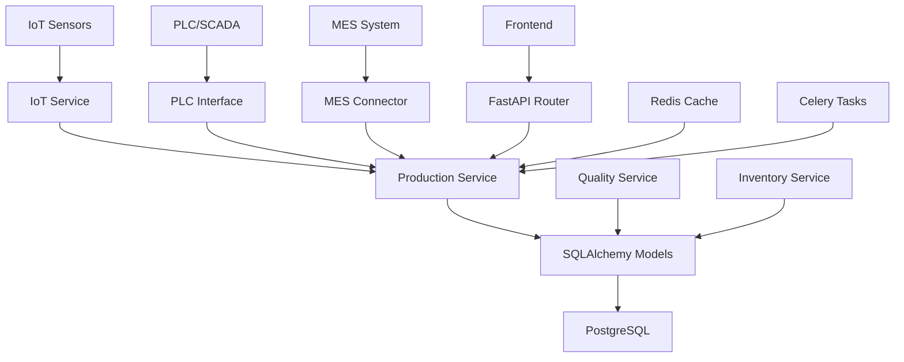

# Design Command - FastAPI + SQLAlchemy 製造業システム技術設計

## 概要
製造業要件定義からFastAPI + SQLAlchemy技術設計を生成し、製造業システムアーキテクチャに最適化された設計書を作成します。

## 使用方法
```
/design
```

## プロセス

### 1. 製造業要件確認
- manufacturing_requirements.md の内容を読み込み
- 製造業特有の不明点があれば質問
- 製造業システム設計範囲の確認

### 2. 製造業アーキテクチャ設計

#### 2.1 製造業全体構成
```
Backend (FastAPI + SQLAlchemy)
├── FastAPI Application (非同期処理)
├── SQLAlchemy 2.0 (ORM + Raw SQL)
├── Alembic (データベースマイグレーション)
├── Pydantic (データバリデーション)
├── Celery (バックグラウンドタスク)
├── Redis (キャッシュ + メッセージブローカー)
└── PostgreSQL (メインデータベース)

Manufacturing Integrations
├── IoT Sensors (MQTT/HTTP)
├── PLC Interface (Modbus/EtherNet-IP)
├── MES Integration (REST API)
├── ERP Integration (SOAP/REST)
└── SCADA Connection (OPC-UA)
```

#### 2.2 製造業ディレクトリ構造
```
manufacturing_system/
├── app/
│   ├── main.py              # FastAPI アプリケーション
│   ├── core/                # 共通設定・依存関係
│   │   ├── config.py       # 設定管理
│   │   ├── database.py     # データベース接続
│   │   ├── security.py     # 認証・認可
│   │   └── dependencies.py # 依存性注入
│   ├── models/             # SQLAlchemy モデル
│   │   ├── production.py   # 生産関連モデル
│   │   ├── quality.py      # 品質管理モデル
│   │   ├── inventory.py    # 在庫管理モデル
│   │   ├── equipment.py    # 設備管理モデル
│   │   └── users.py        # ユーザー管理モデル
│   ├── schemas/            # Pydantic スキーマ
│   │   ├── production.py   # 生産関連スキーマ
│   │   ├── quality.py      # 品質管理スキーマ
│   │   └── common.py       # 共通スキーマ
│   ├── routers/            # API エンドポイント
│   │   ├── production.py   # 生産管理API
│   │   ├── quality.py      # 品質管理API
│   │   ├── inventory.py    # 在庫管理API
│   │   ├── equipment.py    # 設備管理API
│   │   └── auth.py         # 認証API
│   ├── services/           # ビジネスロジック
│   │   ├── production_service.py
│   │   ├── quality_service.py
│   │   └── iot_service.py
│   ├── integrations/       # 外部システム統合
│   │   ├── plc_interface.py
│   │   ├── mes_connector.py
│   │   └── erp_connector.py
│   └── utils/              # ユーティリティ
│       ├── validators.py   # バリデーター
│       └── helpers.py      # ヘルパー関数
├── alembic/                # データベースマイグレーション
├── tests/                  # テストコード
├── docker/                 # Docker設定
└── requirements.txt        # 依存関係
```

### 3. 製造業技術選定理由

#### FastAPI
- 非同期処理による高性能IoTデータ処理
- 自動API仕様生成による製造業システム統合簡素化
- Pydanticによる厳密なデータバリデーション

#### SQLAlchemy 2.0
- 非同期ORM対応による大量製造データ処理
- 複雑な製造業クエリに対する柔軟性
- Alembicによる製造業データスキーマ変更管理

#### PostgreSQL
- 製造業ACID特性要求への対応
- 時系列データ・JSON データ型サポート
- 製造業大規模データへのスケーラビリティ

#### Redis
- IoTセンサーデータの高速キャッシュ
- 製造業リアルタイム通知・メッセージング
- セッション管理・認証トークン管理

### 4. 製造業設計パターン

#### 4.1 製造業SQLAlchemyモデルパターン
```python
# models/production.py
from sqlalchemy import Column, Integer, String, DateTime, Float, ForeignKey, Boolean
from sqlalchemy.orm import relationship
from sqlalchemy.ext.declarative import declarative_base
from datetime import datetime

Base = declarative_base()

class WorkOrder(Base):
    """製造指示（ワークオーダー）モデル"""
    __tablename__ = "work_orders"
    
    id = Column(Integer, primary_key=True, index=True)
    work_order_number = Column(String(50), unique=True, nullable=False, index=True)
    product_id = Column(Integer, ForeignKey("products.id"), nullable=False)
    quantity_planned = Column(Integer, nullable=False)
    quantity_completed = Column(Integer, default=0)
    status = Column(String(20), default="PLANNED")  # PLANNED, IN_PROGRESS, COMPLETED, CANCELLED
    priority = Column(Integer, default=5)  # 1(高) - 10(低)
    scheduled_start = Column(DateTime, nullable=False)
    scheduled_end = Column(DateTime, nullable=False)
    actual_start = Column(DateTime)
    actual_end = Column(DateTime)
    line_id = Column(Integer, ForeignKey("production_lines.id"))
    created_at = Column(DateTime, default=datetime.utcnow)
    updated_at = Column(DateTime, default=datetime.utcnow, onupdate=datetime.utcnow)
    
    # リレーションシップ
    product = relationship("Product", back_populates="work_orders")
    production_line = relationship("ProductionLine", back_populates="work_orders")
    quality_checks = relationship("QualityCheck", back_populates="work_order")
    
class Product(Base):
    """製品マスターモデル"""
    __tablename__ = "products"
    
    id = Column(Integer, primary_key=True, index=True)
    product_code = Column(String(50), unique=True, nullable=False, index=True)
    product_name = Column(String(200), nullable=False)
    product_type = Column(String(50), nullable=False)
    version = Column(String(20), default="1.0")
    is_active = Column(Boolean, default=True)
    standard_cycle_time = Column(Float)  # 標準サイクルタイム（分）
    target_yield_rate = Column(Float, default=95.0)  # 目標歩留まり率（%）
    created_at = Column(DateTime, default=datetime.utcnow)
    
    # リレーションシップ
    work_orders = relationship("WorkOrder", back_populates="product")
    bom_items = relationship("BOMItem", back_populates="product")

class ProductionLine(Base):
    """生産ラインモデル"""
    __tablename__ = "production_lines"
    
    id = Column(Integer, primary_key=True, index=True)
    line_code = Column(String(20), unique=True, nullable=False)
    line_name = Column(String(100), nullable=False)
    capacity_per_hour = Column(Integer)  # 時間当たり生産能力
    efficiency_rate = Column(Float, default=85.0)  # 稼働効率（%）
    status = Column(String(20), default="IDLE")  # IDLE, RUNNING, MAINTENANCE, DOWN
    created_at = Column(DateTime, default=datetime.utcnow)
    
    # リレーションシップ
    work_orders = relationship("WorkOrder", back_populates="production_line")
    equipment = relationship("Equipment", back_populates="production_line")
```

#### 4.2 製造業Pydanticスキーマパターン
```python
# schemas/production.py
from pydantic import BaseModel, Field, validator
from datetime import datetime
from typing import Optional, List
from enum import Enum

class WorkOrderStatus(str, Enum):
    """ワークオーダーステータス"""
    PLANNED = "PLANNED"
    IN_PROGRESS = "IN_PROGRESS"
    COMPLETED = "COMPLETED"
    CANCELLED = "CANCELLED"

class WorkOrderBase(BaseModel):
    """ワークオーダー基本スキーマ"""
    work_order_number: str = Field(..., min_length=1, max_length=50)
    product_id: int = Field(..., gt=0)
    quantity_planned: int = Field(..., gt=0)
    priority: int = Field(default=5, ge=1, le=10)
    scheduled_start: datetime
    scheduled_end: datetime
    line_id: Optional[int] = Field(None, gt=0)
    
    @validator('scheduled_end')
    def validate_schedule(cls, v, values):
        """スケジュール妥当性検証"""
        start = values.get('scheduled_start')
        if start and v <= start:
            raise ValueError('終了予定は開始予定より後である必要があります')
        return v
    
    @validator('work_order_number')
    def validate_work_order_number(cls, v):
        """ワークオーダー番号フォーマット検証"""
        if not v.startswith('WO'):
            raise ValueError('ワークオーダー番号はWOで始まる必要があります')
        return v

class WorkOrderCreate(WorkOrderBase):
    """ワークオーダー作成スキーマ"""
    pass

class WorkOrderUpdate(BaseModel):
    """ワークオーダー更新スキーマ"""
    quantity_completed: Optional[int] = Field(None, ge=0)
    status: Optional[WorkOrderStatus] = None
    actual_start: Optional[datetime] = None
    actual_end: Optional[datetime] = None
    
    @validator('quantity_completed')
    def validate_completed_quantity(cls, v):
        """完了数量妥当性検証"""
        if v is not None and v < 0:
            raise ValueError('完了数量は0以上である必要があります')
        return v

class WorkOrderResponse(WorkOrderBase):
    """ワークオーダーレスポンススキーマ"""
    id: int
    quantity_completed: int
    status: WorkOrderStatus
    actual_start: Optional[datetime]
    actual_end: Optional[datetime]
    created_at: datetime
    updated_at: datetime
    
    class Config:
        from_attributes = True
```

#### 4.3 製造業FastAPI ルーターパターン
```python
# routers/production.py
from fastapi import APIRouter, Depends, HTTPException, status, Query
from sqlalchemy.ext.asyncio import AsyncSession
from sqlalchemy.future import select
from sqlalchemy.orm import selectinload
from typing import List, Optional
from datetime import datetime, date

from ..core.database import get_db
from ..core.security import get_current_user
from ..models.production import WorkOrder, Product
from ..schemas.production import WorkOrderCreate, WorkOrderUpdate, WorkOrderResponse
from ..services.production_service import ProductionService

router = APIRouter(prefix="/production", tags=["production"])

@router.post("/work-orders", response_model=WorkOrderResponse, status_code=status.HTTP_201_CREATED)
async def create_work_order(
    work_order_data: WorkOrderCreate,
    db: AsyncSession = Depends(get_db),
    current_user = Depends(get_current_user)
):
    """新規ワークオーダー作成"""
    try:
        production_service = ProductionService(db)
        
        # 製品存在確認
        product = await production_service.get_product_by_id(work_order_data.product_id)
        if not product:
            raise HTTPException(
                status_code=status.HTTP_404_NOT_FOUND,
                detail="指定された製品が見つかりません"
            )
        
        # ワークオーダー番号重複確認
        existing_wo = await production_service.get_work_order_by_number(
            work_order_data.work_order_number
        )
        if existing_wo:
            raise HTTPException(
                status_code=status.HTTP_409_CONFLICT,
                detail="ワークオーダー番号が既に存在します"
            )
        
        # ワークオーダー作成
        work_order = await production_service.create_work_order(work_order_data)
        return work_order
        
    except Exception as e:
        raise HTTPException(
            status_code=status.HTTP_500_INTERNAL_SERVER_ERROR,
            detail=f"ワークオーダー作成中にエラーが発生しました: {str(e)}"
        )

@router.get("/work-orders", response_model=List[WorkOrderResponse])
async def get_work_orders(
    status_filter: Optional[str] = Query(None, description="ステータスでフィルタ"),
    line_id: Optional[int] = Query(None, description="生産ラインIDでフィルタ"),
    start_date: Optional[date] = Query(None, description="開始日でフィルタ"),
    end_date: Optional[date] = Query(None, description="終了日でフィルタ"),
    limit: int = Query(100, le=1000, description="取得件数制限"),
    offset: int = Query(0, ge=0, description="取得開始位置"),
    db: AsyncSession = Depends(get_db),
    current_user = Depends(get_current_user)
):
    """ワークオーダー一覧取得"""
    production_service = ProductionService(db)
    
    work_orders = await production_service.get_work_orders(
        status_filter=status_filter,
        line_id=line_id,
        start_date=start_date,
        end_date=end_date,
        limit=limit,
        offset=offset
    )
    
    return work_orders

@router.put("/work-orders/{work_order_id}", response_model=WorkOrderResponse)
async def update_work_order(
    work_order_id: int,
    work_order_update: WorkOrderUpdate,
    db: AsyncSession = Depends(get_db),
    current_user = Depends(get_current_user)
):
    """ワークオーダー更新"""
    production_service = ProductionService(db)
    
    # ワークオーダー存在確認
    work_order = await production_service.get_work_order_by_id(work_order_id)
    if not work_order:
        raise HTTPException(
            status_code=status.HTTP_404_NOT_FOUND,
            detail="ワークオーダーが見つかりません"
        )
    
    # ワークオーダー更新
    updated_work_order = await production_service.update_work_order(
        work_order_id, work_order_update
    )
    
    return updated_work_order
```

#### 4.4 製造業サービスレイヤーパターン
```python
# services/production_service.py
from sqlalchemy.ext.asyncio import AsyncSession
from sqlalchemy.future import select
from sqlalchemy.orm import selectinload
from typing import List, Optional
from datetime import datetime, date

from ..models.production import WorkOrder, Product, ProductionLine
from ..schemas.production import WorkOrderCreate, WorkOrderUpdate

class ProductionService:
    """生産管理サービス"""
    
    def __init__(self, db: AsyncSession):
        self.db = db
    
    async def create_work_order(self, work_order_data: WorkOrderCreate) -> WorkOrder:
        """ワークオーダー作成"""
        work_order = WorkOrder(**work_order_data.dict())
        self.db.add(work_order)
        await self.db.commit()
        await self.db.refresh(work_order)
        return work_order
    
    async def get_work_order_by_id(self, work_order_id: int) -> Optional[WorkOrder]:
        """ID によるワークオーダー取得"""
        stmt = select(WorkOrder).where(WorkOrder.id == work_order_id)
        result = await self.db.execute(stmt)
        return result.scalar_one_or_none()
    
    async def get_work_order_by_number(self, work_order_number: str) -> Optional[WorkOrder]:
        """ワークオーダー番号による取得"""
        stmt = select(WorkOrder).where(WorkOrder.work_order_number == work_order_number)
        result = await self.db.execute(stmt)
        return result.scalar_one_or_none()
    
    async def get_work_orders(
        self,
        status_filter: Optional[str] = None,
        line_id: Optional[int] = None,
        start_date: Optional[date] = None,
        end_date: Optional[date] = None,
        limit: int = 100,
        offset: int = 0
    ) -> List[WorkOrder]:
        """ワークオーダー一覧取得（フィルタ・ペジネーション対応）"""
        stmt = select(WorkOrder).options(
            selectinload(WorkOrder.product),
            selectinload(WorkOrder.production_line)
        )
        
        # フィルタ適用
        if status_filter:
            stmt = stmt.where(WorkOrder.status == status_filter)
        if line_id:
            stmt = stmt.where(WorkOrder.line_id == line_id)
        if start_date:
            stmt = stmt.where(WorkOrder.scheduled_start >= start_date)
        if end_date:
            stmt = stmt.where(WorkOrder.scheduled_end <= end_date)
        
        # ペジネーション・ソート
        stmt = stmt.order_by(WorkOrder.scheduled_start.desc()).limit(limit).offset(offset)
        
        result = await self.db.execute(stmt)
        return result.scalars().all()
    
    async def update_work_order(
        self, work_order_id: int, work_order_update: WorkOrderUpdate
    ) -> WorkOrder:
        """ワークオーダー更新"""
        work_order = await self.get_work_order_by_id(work_order_id)
        
        # 更新データ適用
        update_data = work_order_update.dict(exclude_unset=True)
        for field, value in update_data.items():
            setattr(work_order, field, value)
        
        work_order.updated_at = datetime.utcnow()
        
        await self.db.commit()
        await self.db.refresh(work_order)
        return work_order
    
    async def get_product_by_id(self, product_id: int) -> Optional[Product]:
        """製品取得"""
        stmt = select(Product).where(Product.id == product_id)
        result = await self.db.execute(stmt)
        return result.scalar_one_or_none()
```

### 5. 製造業データフロー設計



### 6. 製造業エラーハンドリング戦略

#### 6.1 製造業グローバルエラーハンドラー
```python
# core/error_handlers.py
from fastapi import Request, HTTPException
from fastapi.responses import JSONResponse
from sqlalchemy.exc import IntegrityError, DatabaseError
import logging

logger = logging.getLogger(__name__)

async def database_exception_handler(request: Request, exc: DatabaseError):
    """データベース例外ハンドラー"""
    logger.error(f"Database error: {exc}")
    
    if isinstance(exc, IntegrityError):
        return JSONResponse(
            status_code=409,
            content={
                "error": "データ整合性エラー",
                "detail": "制約違反により操作を完了できませんでした",
                "type": "integrity_error"
            }
        )
    
    return JSONResponse(
        status_code=500,
        content={
            "error": "データベースエラー",
            "detail": "データベース処理中にエラーが発生しました",
            "type": "database_error"
        }
    )

async def manufacturing_exception_handler(request: Request, exc: Exception):
    """製造業特有例外ハンドラー"""
    logger.error(f"Manufacturing system error: {exc}")
    
    return JSONResponse(
        status_code=500,
        content={
            "error": "製造システムエラー",
            "detail": f"製造業システム処理中にエラーが発生しました: {str(exc)}",
            "type": "manufacturing_error",
            "timestamp": datetime.utcnow().isoformat()
        }
    )
```

### 7. 製造業パフォーマンス最適化

#### 7.1 データベース最適化
- 複合インデックスによる製造業クエリ最適化
- パーティション分割による大量データ処理
- 接続プール設定による同時アクセス対応

#### 7.2 非同期処理最適化
- Celeryによる重い製造業計算の非同期実行
- WebSocketによるリアルタイム製造データ配信
- キャッシュ戦略による頻繁アクセスデータ高速化

### 8. 製造業セキュリティ設計

#### 8.1 認証・認可
- JWT トークンベース認証
- ロールベースアクセス制御（RBAC）
- 製造業データアクセス権限管理

#### 8.2 データ保護
- 機密製造データの暗号化保存
- API レート制限による不正アクセス防止
- 監査ログによる操作追跡

### 9. 製造業テスト戦略

#### 9.1 単体テスト
- pytest による API エンドポイントテスト
- SQLAlchemy モデルのテスト
- 製造業ビジネスロジックテスト

#### 9.2 統合テスト
- 製造業システム統合テスト
- データベーストランザクションテスト
- IoT・PLC インターフェーステスト

## 出力形式

設計完了後、以下のファイルを生成：

1. `.tmp/manufacturing_specs/[機能名]/design.md` - 製造業技術設計書
2. `.tmp/manufacturing_specs/[機能名]/architecture.md` - 製造業アーキテクチャ図
3. `.tmp/manufacturing_specs/[機能名]/data-flow.md` - 製造業データフロー設計
4. `.tmp/manufacturing_specs/[機能名]/database_schema.sql` - データベーススキーマ
5. `.tmp/manufacturing_specs/[機能名]/api_specification.yaml` - OpenAPI仕様

## TodoWrite 連携

製造業設計フェーズの主要タスクを自動的に TodoWrite に登録：
- [ ] 製造業アーキテクチャ設計
- [ ] 製造業データモデル設計
- [ ] 製造業API 設計
- [ ] 製造業セキュリティ設計
- [ ] 製造業パフォーマンス設計
- [ ] 製造業システム統合設計

## 次のステップ

製造業設計承認後、`/tasks` コマンドで詳細タスク分割へ進む。