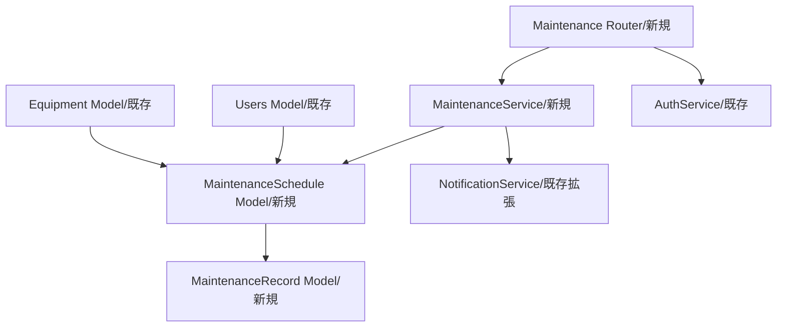

# Enhance Command - 製造業機能追加・改善

## 概要
既存のFastAPI + SQLAlchemy製造業システムに新機能を追加したり、既存機能を改善する際の設計と実装計画を立案します。既存アーキテクチャとの整合性を保ちながら、段階的な統合を実現します。

## 使用方法
```
/enhance [製造機能の説明]
```

## 前提条件
- `/analyze` コマンドの実行結果が存在すること
- または既存製造業システムの構成情報を手動で提供すること

## 実行プロセス

### 1. 既存製造業システムとの整合性確認

#### 1.1 現在の製造業アーキテクチャ分析
```python
# 既存製造業システムの構成を読み込み
async def load_existing_manufacturing_architecture():
    # 解析レポートが存在する場合
    analysis_report = await read_file('.tmp/manufacturing_analysis_report.md')
    
    if analysis_report:
        return parse_manufacturing_analysis_report(analysis_report)
    
    # 手動で既存構成を確認
    return {
        'fastapi_version': await detect_fastapi_version(),
        'sqlalchemy_setup': await detect_sqlalchemy_setup(),
        'database_type': await detect_database_type(),
        'manufacturing_models': await detect_manufacturing_models(),
        'api_patterns': await detect_api_patterns(),
        'auth_patterns': await detect_auth_patterns()
    }

# 新製造機能との互換性チェック
def check_manufacturing_compatibility(existing_arch, new_feature):
    compatibility = {
        'issues': [],
        'warnings': [],
        'recommendations': []
    }
    
    # FastAPIバージョンと製造機能の互換性
    if existing_arch['fastapi_version'] < '0.100' and new_feature.requires.async_features:
        compatibility.issues.append({
            'type': 'version-mismatch',
            'message': 'この製造機能は新しいFastAPI機能を必要とします',
            'solution': 'FastAPIをアップグレードするか、代替実装を使用してください'
        })
    
    # SQLAlchemyとの互換性
    if existing_arch['sqlalchemy_setup'] == 'sync' and new_feature.requires.async_orm:
        compatibility.warnings.append({
            'type': 'async-orm-mix',
            'message': '同期・非同期ORMの混在',
            'solution': '非同期SQLAlchemyでのラッパー実装を推奨'
        })
    
    return compatibility
```

### 2. 製造業新機能の設計

#### 2.1 フロントエンド連携要件の確認
```python
# Vue3フロントエンドからの要件を取り込み
async def import_frontend_requirements():
    frontend_spec_path = '../.claude_vue3_axios/.tmp/api_sync/backend_requirements.md'
    
    if await file_exists(frontend_spec_path):
        frontend_spec = await read_file(frontend_spec_path)
        return parse_frontend_requirements(frontend_spec)
    
    return None

# フロントエンド要件と製造業機能の統合
def integrate_frontend_manufacturing_requirements(frontend_req, manufacturing_feature):
    integrated_design = {
        'feature': manufacturing_feature,
        'frontend_integration': {
            'required_apis': [],
            'response_schemas': [],
            'vue_components': [],
            'pinia_stores': []
        }
    }
    
    # フロントエンドが必要とするAPIエンドポイント
    if frontend_req:
        for endpoint in frontend_req.get('endpoints', []):
            integrated_design['frontend_integration']['required_apis'].append({
                'path': endpoint['path'],
                'method': endpoint['method'],
                'request_schema': endpoint.get('request_schema'),
                'response_schema': endpoint.get('response_schema'),
                'description': endpoint.get('description')
            })
    
    return integrated_design
```

#### 2.2 製造業機能要件の明確化
```python
# ユーザー入力から製造業機能要件を抽出
def extract_manufacturing_feature_requirements(user_input):
    return {
        # 基本情報
        'name': extract_feature_name(user_input),
        'description': user_input,
        'type': classify_manufacturing_feature_type(user_input), # 'production', 'quality', 'maintenance', 'inventory'
        
        # 技術要件
        'requires': {
            'models': estimate_required_manufacturing_models(user_input),
            'apis': estimate_required_manufacturing_apis(user_input),
            'services': estimate_required_manufacturing_services(user_input),
            'database': estimate_manufacturing_database_changes(user_input)
        },
        
        # 影響範囲
        'impact': {
            'existing_models': [],
            'existing_apis': [],
            'existing_services': [],
            'database_schema': []
        }
    }

# 予防保全機能の例
preventive_maintenance_feature_design = {
    'name': '予防保全管理システム',
    'models': [
        {
            'name': 'MaintenanceSchedule',
            'type': 'sqlalchemy_model',
            'fields': [
                'id: UUID (Primary Key)',
                'equipment_id: UUID (Foreign Key to Equipment)',
                'maintenance_type: String',
                'scheduled_date: DateTime',
                'status: String',
                'priority: Integer',
                'estimated_duration: Integer',
                'assigned_technician_id: UUID'
            ],
            'relationships': [
                'equipment: Relationship to Equipment',
                'maintenance_records: Relationship to MaintenanceRecord'
            ]
        },
        {
            'name': 'MaintenanceRecord',
            'type': 'sqlalchemy_model',
            'fields': [
                'id: UUID (Primary Key)',
                'schedule_id: UUID (Foreign Key)',
                'actual_start: DateTime',
                'actual_end: DateTime',
                'parts_used: JSON',
                'labor_hours: Float',
                'cost: Decimal',
                'notes: Text',
                'completed_by: UUID'
            ]
        }
    ],
    'apis': [
        {
            'endpoint': '/maintenance/schedules',
            'methods': ['GET', 'POST'],
            'description': '予防保全スケジュール管理',
            'authentication': True,
            'role_required': 'maintenance_manager'
        },
        {
            'endpoint': '/maintenance/schedules/{schedule_id}/execute',
            'methods': ['POST'],
            'description': '予防保全実行記録',
            'authentication': True,
            'role_required': 'technician'
        }
    ],
    'services': [
        {
            'name': 'MaintenanceService',
            'methods': [
                'create_maintenance_schedule',
                'update_schedule_status',
                'record_maintenance_completion',
                'calculate_maintenance_kpis'
            ],
            'integration': [
                'equipment_service',
                'notification_service',
                'inventory_service'
            ]
        }
    ],
    'database': {
        'tables': [
            {
                'name': 'maintenance_schedules',
                'columns': [
                    'id UUID PRIMARY KEY DEFAULT gen_random_uuid()',
                    'equipment_id UUID REFERENCES equipment(id)',
                    'maintenance_type VARCHAR(50) NOT NULL',
                    'scheduled_date TIMESTAMP NOT NULL',
                    'status VARCHAR(20) DEFAULT "PLANNED"',
                    'priority INTEGER DEFAULT 5',
                    'estimated_duration INTEGER',
                    'assigned_technician_id UUID REFERENCES users(id)',
                    'created_at TIMESTAMP DEFAULT NOW()',
                    'updated_at TIMESTAMP DEFAULT NOW()'
                ],
                'indexes': [
                    'CREATE INDEX idx_maintenance_equipment ON maintenance_schedules(equipment_id)',
                    'CREATE INDEX idx_maintenance_scheduled_date ON maintenance_schedules(scheduled_date)',
                    'CREATE INDEX idx_maintenance_status ON maintenance_schedules(status)'
                ]
            }
        ]
    }
}
```

#### 2.2 既存製造業パターンとの統合設計
```python
# 既存の製造業コーディングパターンを踏襲
def align_with_existing_manufacturing_patterns(feature, existing_patterns):
    aligned = { ...feature }
    
    # モデル命名規則の適用
    if existing_patterns.naming.models == 'PascalCase':
        aligned.models = [{
            **model,
            'name': to_pascal_case(model['name'])
        } for model in aligned.models]
    
    # 既存のディレクトリ構造に合わせる
    aligned.file_structure = {
        'models': map_to_existing_structure(aligned.models, existing_patterns.directories.models),
        'services': map_to_existing_structure(aligned.services, existing_patterns.directories.services),
        'routers': map_to_existing_structure(aligned.apis, existing_patterns.directories.routers)
    }
    
    # APIパターンの適用
    if existing_patterns.api.style == 'service_layer':
        aligned.api = generate_service_layer_pattern(feature)
    elif existing_patterns.api.style == 'repository':
        aligned.api = generate_repository_pattern(feature)
    
    return aligned
```

### 3. 製造業データベース拡張設計

#### 3.1 製造業スキーマ変更の計画
```python
# 既存製造業スキーマとの整合性確認
async def plan_manufacturing_database_changes(feature, existing_schema):
    changes = {
        'new_tables': [],
        'alter_tables': [],
        'new_indexes': [],
        'new_constraints': [],
        'migrations': []
    }
    
    # 新しい製造業テーブルの追加
    for table in feature.database.tables:
        if not existing_schema.tables.includes(table.name):
            changes.new_tables.append(table)
            
            # Alembicマイグレーションスクリプトの生成
            changes.migrations.append({
                'version': generate_migration_version(),
                'name': f'create_{table.name}_table',
                'up': generate_create_manufacturing_table_sql(table),
                'down': f'DROP TABLE IF EXISTS {table.name};'
            })
    
    # 既存製造業テーブルへの変更
    for alteration in feature.database.alterations or []:
        changes.alter_tables.append(alteration)
        
        changes.migrations.append({
            'version': generate_migration_version(),
            'name': f'alter_{alteration.table}_add_{alteration.column}',
            'up': f'ALTER TABLE {alteration.table} ADD COLUMN {alteration.column} {alteration.type};',
            'down': f'ALTER TABLE {alteration.table} DROP COLUMN {alteration.column};'
        })
    
    return changes

# Alembic Migration の生成
def generate_manufacturing_alembic_migration(changes):
    return f'''
"""Add {changes.description}

Revision ID: {changes.version}
Revises: 
Create Date: {datetime.now().isoformat()}

"""
from alembic import op
import sqlalchemy as sa
from sqlalchemy.dialects import postgresql

# revision identifiers
revision = '{changes.version}'
down_revision = None
branch_labels = None
depends_on = None

def upgrade():
    # Create new manufacturing tables
{"\n".join([f"    {migration['up']}" for migration in changes.migrations])}
    
    # Create indexes for manufacturing performance
{"\n".join([f"    {index['sql']}" for index in changes.new_indexes])}

def downgrade():
    # Rollback manufacturing changes
{"\n".join([f"    {migration['down']}" for migration in reversed(changes.migrations)])}
    '''.strip()
```

### 4. 製造業段階的統合計画

#### 4.1 製造業実装フェーズの設計
```python
# 製造業機能の段階的な実装計画を生成
def create_manufacturing_phases_plan(feature, dependencies):
    phases = []
    
    # Phase 1: 製造業基盤準備
    phases.append({
        'phase': 1,
        'name': '製造業基盤準備',
        'duration': '3-5日',
        'tasks': [
            {
                'task': '製造業データベーススキーマの更新',
                'subtasks': [
                    'Alembicマイグレーションファイルの作成',
                    '開発環境での実行とテスト',
                    '製造業データ制約の設定'
                ],
                'risk': 'low',
                'rollback': 'マイグレーションのロールバック'
            },
            {
                'task': '製造業APIレイヤーの準備',
                'subtasks': [
                    'SQLAlchemyモデルの作成',
                    'Pydanticスキーマの定義',
                    '製造業バリデーションルールの実装'
                ],
                'risk': 'low'
            }
        ]
    })
    
    # Phase 2: 製造業コア機能実装
    phases.append({
        'phase': 2,
        'name': '製造業コア機能実装',
        'duration': '5-8日',
        'tasks': [
            {
                'task': '製造業サービスレイヤーの実装',
                'subtasks': [
                    '製造業ビジネスロジックの実装',
                    '非同期処理の実装',
                    '製造業エラーハンドリング'
                ],
                'risk': 'medium',
                'testing': 'ユニットテスト必須'
            },
            {
                'task': 'FastAPI エンドポイントの実装',
                'subtasks': [
                    '製造業API エンドポイントの作成',
                    '認証・認可の実装',
                    'OpenAPI仕様の生成'
                ],
                'risk': 'low'
            }
        ]
    })
    
    # Phase 3: 製造業統合とテスト
    phases.append({
        'phase': 3,
        'name': '製造業統合とテスト',
        'duration': '3-4日',
        'tasks': [
            {
                'task': '既存製造業機能との統合',
                'subtasks': [
                    '製造業システム間連携の実装',
                    'データ整合性の確保',
                    '製造業ワークフローの統合'
                ],
                'risk': 'high',
                'testing': '統合テスト、製造業シナリオテスト'
            },
            {
                'task': '製造業リアルタイム機能の追加',
                'subtasks': [
                    'WebSocket連携の実装',
                    '製造業データ同期処理',
                    'IoTデバイス連携対応'
                ],
                'risk': 'medium'
            }
        ]
    })
    
    # Phase 4: 製造業最適化とデプロイ
    phases.append({
        'phase': 4,
        'name': '製造業最適化とデプロイ',
        'duration': '2-3日',
        'tasks': [
            {
                'task': '製造業パフォーマンス最適化',
                'subtasks': [
                    'データベースクエリの最適化',
                    '製造業API応答速度の改善',
                    'メモリ使用量の最適化'
                ]
            },
            {
                'task': '製造業本番環境へのデプロイ',
                'subtasks': [
                    'ステージング環境でのテスト',
                    '製造業データベースマイグレーション',
                    '段階的ロールアウト'
                ]
            }
        ]
    })
    
    return phases
```

### 5. 製造業既存コンポーネントの再利用戦略

#### 5.1 再利用可能製造業コンポーネントの特定
```python
# 既存製造業コンポーネントの再利用分析
async def analyze_reusable_manufacturing_components(feature, existing_components):
    reusable = {
        'direct': [],      # そのまま使える
        'with_extension': [], # 拡張して使える
        'with_wrapper': [], # ラッパーが必要
        'reference': []    # 参考にできる
    }
    
    # 予防保全機能の例
    maintenance_feature_analysis = {
        'direct': [
            {
                'existing': 'BaseModel',
                'usage': '製造業モデルのベースクラス',
                'location': 'app/models/base.py'
            },
            {
                'existing': 'DatabaseSession',
                'usage': 'データベースセッション管理',
                'location': 'app/core/database.py'
            },
            {
                'existing': 'AuthenticationService',
                'usage': '認証・認可機能',
                'location': 'app/services/auth.py'
            }
        ],
        'with_extension': [
            {
                'existing': 'NotificationService',
                'usage': '保全通知機能',
                'extensions': ['maintenance_alerts', 'technician_assignment'],
                'location': 'app/services/notification.py'
            }
        ],
        'with_wrapper': [
            {
                'existing': 'SchedulingService',
                'usage': '保全スケジューリング',
                'wrapper': 'MaintenanceSchedulingService',
                'reason': '製造業特有のスケジューリングロジック追加'
            }
        ],
        'reference': [
            {
                'existing': 'ProductionService',
                'usage': 'ビジネスロジックパターンの参考',
                'patterns': ['バリデーション', 'エラーハンドリング', '非同期処理']
            }
        ]
    }
    
    return reusable
```

## 出力形式

### 製造業機能拡張設計書（.tmp/manufacturing_enhancement_design.md）
```markdown
# 製造業機能拡張設計書

## 概要
- **機能名**: 予防保全管理システム
- **説明**: 設備の予防保全スケジュール管理と実行記録により、設備稼働率向上と故障予防を実現
- **影響範囲**: 中（設備管理・保全業務への影響）
- **推定工期**: 13-20日

## 1. 既存製造業システムとの整合性

### 現在のアーキテクチャ
- FastAPI: 0.104（非同期処理対応）
- SQLAlchemy: 2.0（非同期ORM）
- PostgreSQL: 13+（製造業データ対応）
- 既存製造業モデル: Equipment, Product, WorkOrder

### 互換性評価
✅ 完全互換: 既存製造業アーキテクチャと完全に互換性があります
⚠️ 注意事項:
- 既存設備（equipment）テーブルとの外部キー制約
- ユーザー管理システムとの技術者認証連携が必要

## 2. 製造業技術設計

### 製造業コンポーネント構成


### 製造業データフロー
[製造業データフロー図]

## 3. 製造業データベース設計

### 新規製造業テーブル
```sql
-- maintenance_schedules テーブル
CREATE TABLE maintenance_schedules (
  id UUID PRIMARY KEY DEFAULT gen_random_uuid(),
  equipment_id UUID REFERENCES equipment(id) ON DELETE CASCADE,
  maintenance_type VARCHAR(50) NOT NULL,
  scheduled_date TIMESTAMP NOT NULL,
  status VARCHAR(20) DEFAULT 'PLANNED',
  priority INTEGER DEFAULT 5,
  estimated_duration INTEGER,
  assigned_technician_id UUID REFERENCES users(id),
  created_at TIMESTAMP DEFAULT NOW(),
  updated_at TIMESTAMP DEFAULT NOW(),
  
  -- 製造業インデックス
  INDEX idx_maintenance_equipment (equipment_id),
  INDEX idx_maintenance_scheduled_date (scheduled_date),
  INDEX idx_maintenance_status (status)
);

-- maintenance_records テーブル
CREATE TABLE maintenance_records (
  id UUID PRIMARY KEY DEFAULT gen_random_uuid(),
  schedule_id UUID REFERENCES maintenance_schedules(id) ON DELETE SET NULL,
  equipment_id UUID REFERENCES equipment(id) ON DELETE CASCADE,
  actual_start TIMESTAMP,
  actual_end TIMESTAMP,
  parts_used JSONB,
  labor_hours DECIMAL(5,2),
  cost DECIMAL(10,2),
  notes TEXT,
  completed_by UUID REFERENCES users(id),
  created_at TIMESTAMP DEFAULT NOW()
);
```

### 既存製造業テーブルへの変更
```sql
-- equipment テーブルに保全情報カラムを追加
ALTER TABLE equipment ADD COLUMN last_maintenance_date TIMESTAMP;
ALTER TABLE equipment ADD COLUMN next_maintenance_due TIMESTAMP;
ALTER TABLE equipment ADD COLUMN maintenance_interval_days INTEGER DEFAULT 90;

-- 製造業トリガーで自動更新
CREATE FUNCTION update_equipment_maintenance_info() ...
```

## 4. 製造業実装計画

### Phase 1: 製造業基盤準備（3-5日）
- [ ] 製造業データベーススキーマの作成
- [ ] Alembic マイグレーション実行
- [ ] 製造業API層の実装（maintenanceApi）
- [ ] 製造業型定義の追加
- [ ] **フロントエンド同期用OpenAPI仕様の生成**

### Phase 2: 製造業コア機能実装（5-8日）
- [ ] MaintenanceService 実装
- [ ] 基本製造業エンドポイント作成
  - [ ] 保全スケジュール管理API
  - [ ] 保全実行記録API
  - [ ] 保全KPI計算API
- [ ] 製造業バリデーション実装

### Phase 3: 製造業統合とテスト（3-4日）
- [ ] 既存設備管理システムとの統合
- [ ] 製造業リアルタイム通知機能の実装
- [ ] 製造業エラーハンドリング
- [ ] 製造業単体テスト作成
- [ ] **Vue3フロントエンド向けAPIクライアント生成**
  ```bash
  /frontend-sync api_to_frontend --target_module="maintenance" --output_format="javascript"
  ```

### Phase 4: 製造業最適化とデプロイ（2-3日）
- [ ] 製造業パフォーマンス最適化
- [ ] 製造業E2Eテスト
- [ ] 製造業本番環境デプロイ

## 5. フロントエンド連携実装

### 5.1 自動生成されるVue3コンポーネント
```javascript
// 予防保全管理コンポーネントの例
// components/maintenance/MaintenanceSchedule.vue
export default {
  name: 'MaintenanceSchedule',
  setup() {
    const maintenanceStore = useMaintenanceStore()
    const { schedules, isLoading, error } = storeToRefs(maintenanceStore)
    
    onMounted(async () => {
      await maintenanceStore.fetchSchedules()
    })
    
    return {
      schedules,
      isLoading,
      error
    }
  }
}
```

### 5.2 Piniaストアの自動生成
```javascript
// stores/maintenanceStore.js
export const useMaintenanceStore = defineStore('maintenance', () => {
  const schedules = ref([])
  const isLoading = ref(false)
  const error = ref(null)
  
  const fetchSchedules = async (params = {}) => {
    try {
      isLoading.value = true
      const response = await maintenanceAPI.getSchedules(params)
      schedules.value = response.data.items
    } catch (err) {
      error.value = err.response?.data?.error?.message || 'スケジュール取得に失敗しました'
    } finally {
      isLoading.value = false
    }
  }
  
  return {
    schedules,
    isLoading,
    error,
    fetchSchedules
  }
})
```

## 6. 製造業既存資産の活用

### 再利用可能製造業コンポーネント
1. **BaseModel**: そのまま使用可能
2. **DatabaseSession**: そのまま使用可能
3. **AuthenticationService**: そのまま使用可能
4. **NotificationService**: 拡張して使用可能
5. **SchedulingService**: ラッパー作成で使用可能

### 参考にできる製造業パターン
- ProductionService のビジネスロジックパターン
- EquipmentService のデータ管理パターン
- 既存のエラーハンドリングパターン

## 6. 製造業リスク評価と対策

### 製造業技術的リスク
| リスク | 可能性 | 影響度 | 対策 |
|--------|--------|--------|------|
| データベースパフォーマンス低下 | 中 | 中 | インデックス最適化、クエリ最適化 |
| 保全業務フロー複雑化 | 中 | 高 | 段階的機能リリース、ユーザートレーニング |
| 既存設備データとの整合性 | 低 | 高 | データマイグレーション、整合性チェック |

### 製造業ビジネスリスク
| リスク | 可能性 | 影響度 | 対策 |
|--------|--------|--------|------|
| 保全スケジュール重複 | 中 | 中 | 重複チェック機能、アラート実装 |
| 技術者のスケジュール調整 | 高 | 中 | 柔軟なスケジューリング、代替技術者機能 |

## 7. 製造業テスト計画

### 製造業単体テスト
- モデルテスト（pytest + SQLAlchemy testing）
- サービスレイヤーテスト（async testing）
- API層テスト（FastAPI TestClient）

### 製造業統合テスト
- 保全スケジュール作成フロー
- 保全実行記録フロー
- 設備との連携

### 製造業E2Eテスト
- 保全計画から実行完了までのシナリオ
- 緊急保全対応シナリオ
- 複数技術者による保全業務シナリオ

## 8. 製造業パフォーマンス考慮事項

### 製造業最適化戦略
1. **データベース最適化**: 保全履歴の適切なインデックス設定
2. **非同期処理**: 重い保全計算の非同期実行
3. **キャッシュ活用**: 頻繁にアクセスされる保全データのキャッシュ
4. **バッチ処理**: 定期保全計画の一括生成

### 製造業目標指標
- 保全スケジュール作成: < 2秒
- 保全記録登録: < 1秒
- 保全KPI計算: < 5秒

## 9. 製造業セキュリティ考慮事項

### 製造業実装必須項目
- [ ] 保全データアクセス権限制御
- [ ] 保全記録の監査ログ
- [ ] 機密保全情報の暗号化
- [ ] 技術者認証・認可の確認

## 10. 次のステップ

1. この製造業設計書のレビューと承認
2. `/tasks` コマンドで詳細タスクに分解
3. 製造業実装開始

### 推奨される追加製造業機能
- IoTセンサーとの連携による予知保全
- ARを活用した保全作業支援
- AIによる最適保全計画生成
- 保全部品の自動発注連携
```

## TodoWrite連携

製造業機能拡張の計画タスクを自動生成：

```python
manufacturing_enhancement_tasks = [
    {
        'id': 'manufacturing-enhance-001',
        'content': '既存製造業システム分析と互換性確認',
        'status': 'completed',
        'priority': 'high'
    },
    {
        'id': 'manufacturing-enhance-002',
        'content': '製造業機能要件の詳細設計',
        'status': 'in_progress',
        'priority': 'high'
    },
    {
        'id': 'manufacturing-enhance-003',
        'content': '製造業データベース設計とマイグレーション計画',
        'status': 'pending',
        'priority': 'high'
    },
    {
        'id': 'manufacturing-enhance-004',
        'content': '製造業コンポーネント設計と再利用分析',
        'status': 'pending',
        'priority': 'medium'
    },
    {
        'id': 'manufacturing-enhance-005',
        'content': '製造業実装フェーズ計画',
        'status': 'pending',
        'priority': 'medium'
    },
    {
        'id': 'manufacturing-enhance-006',
        'content': '製造業テスト計画とリスク評価',
        'status': 'pending',
        'priority': 'medium'
    }
]
```

## まとめ

このコマンドは既存製造業システムに新機能を安全に追加するための包括的な設計を提供します：

1. **製造業整合性重視**: 既存製造業アーキテクチャとの完全な互換性
2. **製造業段階的統合**: リスクを最小化した実装計画
3. **製造業資産活用**: 既存製造業コンポーネントの最大限の再利用
4. **製造業品質保証**: 包括的なテスト計画とリスク管理

設計承認後は `/tasks` コマンドで詳細なタスクに分解し、実装を開始できます。
