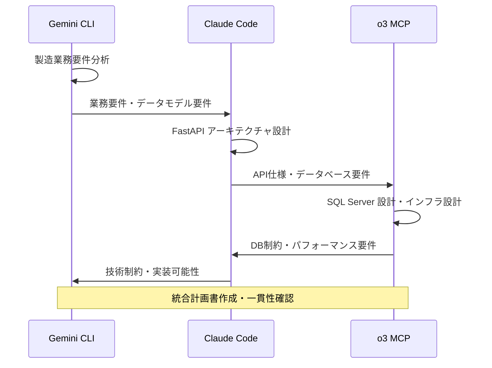
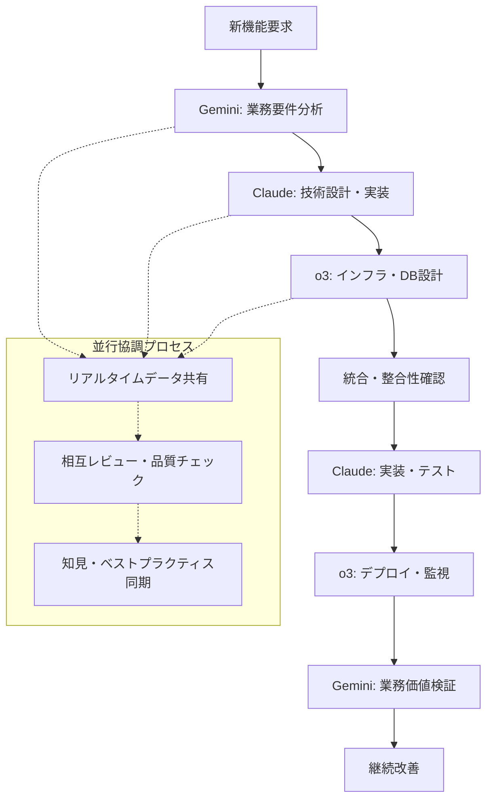
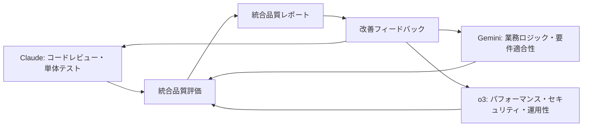

# /multiAI - マルチAI協調管理コマンド（Python/SQLAlchemy特化版）

## 目的
Claude Code、Gemini CLI、o3 MCPの3つのAIシステム間の協調作業を調整・管理し、FastAPI + SQLAlchemyプロジェクトの各AIの専門性を最大限活用した統合的な開発ワークフローを実現します。

## 対象AI
- **Claude Code**: Python実装・API設計・品質保証・テスト戦略
- **Gemini CLI**: データ分析・業務戦略・製造業ドメイン分析
- **o3 MCP**: インフラ・SQL Server運用・セキュリティ・監視

## 入力パラメータ
- **必須**: `$COLLABORATION_TYPE` - 協調タイプ（project_init, cross_analysis, integrated_design, quality_assurance, deployment_coordination）
- **任意**: `$AI_PRIORITY` - AI優先度（gemini_lead, claude_lead, o3_lead, balanced）
- **任意**: `$SCOPE` - 協調範囲（analysis, design, implementation, operation, all）
- **任意**: `$SYNC_LEVEL` - 同期レベル（async, semi_sync, full_sync）

## 出力
- **協調計画書**: `.tmp/multiAI_collaboration_plan_[timestamp].md`
- **AI役割分担**: `.tmp/ai_roles_assignments.json`
- **データ共有設定**: `.tmp/ai_shared_data/`
- **進捗統合レポート**: `.tmp/integrated_progress_report.md`
- **品質評価統合**: `.tmp/cross_ai_quality_assessment.md`

## FastAPI + SQLAlchemy 専門協調戦略

### Phase 1: 製造業ドメイン理解・AI適性評価

#### 1. 製造業ドメイン分析（Gemini CLI主導）
```yaml
責任範囲:
  - 製造業務フローの理解・整理
  - 品質管理・生産管理・在庫管理の業務要件分析
  - 既存システム・帳票・データフローの調査
  - ユーザー（現場・管理者）の課題・ニーズ分析
成果物:
  - 業務フロー図・要件定義書
  - データエンティティ関係図
  - 業務ルール・制約一覧
  - ユーザーストーリー・優先順位
```

#### 2. 技術設計・実装戦略（Claude Code主導）
```yaml
責任範囲:
  - FastAPI + SQLAlchemyアーキテクチャ設計
  - RESTful API設計・エンドポイント設計
  - データモデル・Pydanticスキーマ設計
  - 認証・セキュリティ・エラーハンドリング設計
  - テスト戦略・品質保証プロセス設計
成果物:
  - 技術アーキテクチャ図
  - API仕様書・データモデル定義
  - 実装ガイド・コーディング規約
  - テスト計画・品質基準
```

#### 3. インフラ・運用設計（o3 MCP主導）
```yaml
責任範囲:
  - SQL Server データベース設計・最適化
  - IIS・Windows Server環境の構成管理
  - CI/CD パイプライン・デプロイ戦略
  - 監視・ログ・バックアップ・セキュリティ
  - パフォーマンス・可用性・スケーラビリティ
成果物:
  - データベース設計書・インフラ構成図
  - 運用手順書・監視設定
  - セキュリティポリシー・DR計画
  - パフォーマンス要件・SLA定義
```

## Python/SQLAlchemy 協調パターン

### 1. プロジェクト初期化（project_init）


### 2. 横断分析（cross_analysis）
```yaml
並行分析実行:
  Gemini_Analysis:
    - 製造データ・KPI分析
    - 業務効率・ボトルネック分析
    - ユーザー行動・システム利用パターン分析
  Claude_Analysis:
    - コード品質・技術的負債分析
    - API パフォーマンス・エラー分析
    - テストカバレッジ・品質メトリクス分析
  o3_Analysis:
    - データベースパフォーマンス分析
    - インフラリソース・可用性分析
    - セキュリティ・コンプライアンス分析
    
相互検証:
  - 分析結果の整合性確認
  - 改善優先順位の合意形成
  - 統合改善計画の策定
```

### 3. 統合設計（integrated_design）
```yaml
設計協調フロー:
  データモデル設計:
    1. Gemini: 業務エンティティ・関係性定義
    2. Claude: SQLAlchemyモデル・Pydanticスキーマ設計
    3. o3: SQL Server テーブル・インデックス・制約設計
    4. 統合: データ整合性・パフォーマンス最適化
    
  API設計:
    1. Gemini: 業務フロー・ユースケース定義
    2. Claude: FastAPI エンドポイント・認証設計
    3. o3: 負荷・セキュリティ・監視要件
    4. 統合: API仕様統一・SLA定義
    
  品質・テスト設計:
    1. Gemini: 業務ルール・受入条件定義
    2. Claude: 単体・統合テスト戦略
    3. o3: 負荷・セキュリティテスト要件
    4. 統合: 包括的品質保証計画
```

## AI専門分野別責任範囲

### Claude Code（Python実装エキスパート）
```python
# 専門領域
primary_responsibilities = {
    "api_development": [
        "FastAPI ルーター・エンドポイント実装",
        "Pydantic スキーマ・バリデーション設計",
        "依存性注入・ミドルウェア実装",
        "非同期処理・バックグラウンドタスク"
    ],
    "data_layer": [
        "SQLAlchemy モデル・リレーション設計",
        "Repository パターン・CRUD操作実装", 
        "クエリ最適化・N+1問題対策",
        "マイグレーション・データベース操作"
    ],
    "quality_assurance": [
        "単体テスト・統合テスト実装",
        "コードレビュー・品質基準策定",
        "エラーハンドリング・ログ設計",
        "パフォーマンス測定・最適化"
    ],
    "integration": [
        "外部システム連携・API統合",
        "認証・認可システム実装",
        "セキュリティ・バリデーション実装",
        "開発環境・CI/CD 設定"
    ]
}

# 他AIとの協調インターフェース
collaboration_interfaces = {
    "to_gemini": "実装制約・技術課題のフィードバック",
    "to_o3": "DB要件・インフラ要件の提供",
    "from_gemini": "業務要件・ユーザーストーリーの受信",
    "from_o3": "DB制約・インフラ制約の受信"
}
```

### Gemini CLI（製造業ドメインエキスパート）
```yaml
専門領域:
  business_analysis:
    - 製造業務フロー・プロセス分析
    - 品質管理・生産管理・在庫管理要件分析
    - KPI・メトリクス・レポート要件定義
    - 帳票・データ出力要件の整理
    
  user_experience:
    - 現場ユーザー・管理者のニーズ分析
    - 操作性・UI/UX改善提案
    - モバイル・タブレット対応要件
    - 既存システムからの移行要件
    
  data_strategy:
    - 製造データ・IoTデータ活用戦略
    - データ分析・ダッシュボード要件
    - マスタデータ管理・データ品質要件
    - レポーティング・BI要件定義

協調インターフェース:
  to_claude: "業務ロジック・データ構造要件の提供"
  to_o3: "データ量・パフォーマンス要件の提供"
  from_claude: "技術実装可能性・制約のフィードバック"
  from_o3: "インフラ制約・運用制約のフィードバック"
```

### o3 MCP（インフラ・運用エキスパート）
```yaml
専門領域:
  database_management:
    - SQL Server データベース設計・最適化
    - インデックス戦略・クエリパフォーマンス
    - バックアップ・復旧・高可用性設計
    - セキュリティ・アクセス制御・監査
    
  infrastructure:
    - Windows Server・IIS環境構築・管理
    - ネットワーク・ファイアウォール・負荷分散
    - 監視・アラート・ログ管理システム
    - 容量計画・スケーラビリティ設計
    
  operations:
    - CI/CD パイプライン・デプロイ自動化
    - 障害対応・インシデント管理
    - パフォーマンス監視・チューニング
    - セキュリティ監査・脆弱性対応

協調インターフェース:
  to_claude: "DB制約・インフラ制約の提供"
  to_gemini: "技術的制約・運用制約の提供"  
  from_claude: "DB要件・インフラ要件の受信"
  from_gemini: "データ量・パフォーマンス要件の受信"
```

## データ共有プロトコル（Python/SQLAlchemy特化）

### 共有データ構造
```json
{
  "project_id": "fastapi_production_system",
  "timestamp": "2024-01-15T12:00:00Z",
  "source_ai": "claude_code|gemini_cli|o3_mcp",
  "data_type": "model_design|api_spec|db_schema|business_rule",
  "content": {
    "sqlalchemy_models": "dict",
    "pydantic_schemas": "dict", 
    "api_endpoints": "array",
    "business_rules": "dict",
    "db_requirements": "dict",
    "performance_metrics": "dict"
  },
  "dependencies": {
    "required_by": ["gemini_cli", "o3_mcp"],
    "depends_on": ["business_analysis", "db_schema"]
  },
  "quality_metrics": {
    "test_coverage": "float",
    "performance_score": "float",
    "security_score": "float"
  }
}
```

### AI間データ交換API
```python
# マルチAI データ交換インターフェース
class MultiAICollaborationAPI:
    """AI間協調データ交換API"""
    
    async def share_model_design(
        self, 
        models: Dict[str, Any], 
        target_ais: List[str]
    ) -> None:
        """SQLAlchemyモデル設計の共有"""
        data = {
            "source": "claude_code",
            "type": "model_design",
            "content": {
                "models": models,
                "relationships": self.extract_relationships(models),
                "constraints": self.extract_constraints(models)
            },
            "target_ai": target_ais
        }
        await self.publish_to_shared_storage(data)
    
    async def receive_business_requirements(
        self
    ) -> Dict[str, Any]:
        """Gemini CLI からの業務要件受信"""
        return await self.fetch_from_shared_storage(
            source="gemini_cli",
            type="business_requirements"
        )
    
    async def provide_db_feedback(
        self, 
        db_design: Dict[str, Any],
        feedback: Dict[str, Any]
    ) -> None:
        """o3 MCP へのDB設計フィードバック"""
        data = {
            "source": "claude_code", 
            "type": "db_feedback",
            "content": {
                "original_design": db_design,
                "implementation_feedback": feedback,
                "optimization_suggestions": self.generate_optimizations(db_design)
            },
            "target_ai": ["o3_mcp"]
        }
        await self.publish_to_shared_storage(data)
```

## 協調ワークフローテンプレート

### 新機能開発フロー


### 品質保証統合フロー


## 成功指標・KPI（Python/SQLAlchemy特化）

### 技術品質指標
```yaml
code_quality:
  - テストカバレッジ: 90% 以上
  - 循環複雑度: 平均 5 以下
  - SQLAlchemy N+1 問題: ゼロ
  - API レスポンス時間: 95%tile 200ms以下

architecture_quality:
  - FastAPI 設計パターン準拠率: 100%
  - セキュリティ脆弱性: ゼロ
  - データベース正規化レベル: 3NF適合
  - 依存性注入パターン適用率: 100%
```

### 業務価値指標
```yaml
business_value:
  - 製造業務効率向上: 30% 以上
  - データ入力時間短縮: 50% 以上
  - レポート生成時間短縮: 80% 以上
  - ユーザー満足度: 4.5/5.0 以上

operational_excellence:
  - システム稼働率: 99.9% 以上
  - 障害復旧時間: 平均 15分以内
  - デプロイ頻度: 週次以上
  - 平均故障間隔: 3ヶ月以上
```

## 製造業特化協調コマンド

### 製造業務分析協調
```bash
# 生産管理システム分析
/multiAI cross_analysis --scope="production_management" --ai_priority="gemini_lead"

# 品質管理システム設計
/multiAI integrated_design --scope="quality_management" --sync_level="full_sync"

# 在庫管理システム実装
/multiAI implementation --scope="inventory_management" --ai_priority="claude_lead"
```

### 技術基盤協調
```bash
# FastAPI アーキテクチャ設計
/multiAI integrated_design --scope="api_architecture" --ai_priority="claude_lead"

# SQL Server 最適化
/multiAI deployment_coordination --scope="database_optimization" --ai_priority="o3_lead"

# 統合品質保証
/multiAI quality_assurance --scope="all" --sync_level="full_sync"
```

## 使用例

### 新規製造業システム開発
```bash
# プロジェクト初期化（全AI協調）
/multiAI project_init --ai_priority="balanced" --scope="all" --sync_level="full_sync"

# 要件分析（Gemini主導）
/multiAI cross_analysis --ai_priority="gemini_lead" --scope="analysis"

# 技術実装（Claude主導） 
/multiAI integrated_design --ai_priority="claude_lead" --scope="implementation"

# 運用準備（o3主導）
/multiAI deployment_coordination --ai_priority="o3_lead" --scope="operation"
```

### 既存システム改善・最適化
```bash
# 現状分析・改善計画
/multiAI cross_analysis --scope="all" --sync_level="semi_sync"

# パフォーマンス改善
/multiAI deployment_coordination --ai_priority="o3_lead" --scope="operation"

# 機能拡張
/multiAI integrated_design --ai_priority="claude_lead" --scope="implementation"
```

## 注意事項・制約

### AI特性理解
- **Claude Code**: Python実装・設計に強いが、製造業ドメイン知識は限定的
- **Gemini CLI**: 大規模データ・業務分析に強いが、技術実装詳細は限定的  
- **o3 MCP**: システム運用・DB管理に強いが、UI/UX設計は限定的

### 協調オーバーヘッド管理
- データ共有・同期にかかる時間コストの考慮
- AI間の認識齟齬・コミュニケーションロスの最小化
- 意思決定の迅速性とコンセンサス形成のバランス

### ヒューマンオーバーサイト
- 最終的な技術・業務判断はヒューマンエキスパートが実施
- AI協調結果の妥当性検証・品質保証責任の明確化
- クリティカルな意思決定時の人間による最終承認プロセス