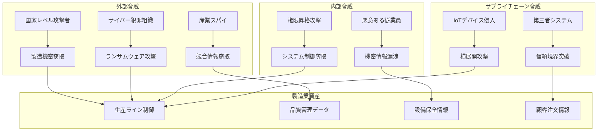

# Security Command - 製造業セキュリティ設計・監査

## 目的
FastAPI + SQLAlchemy製造業システムのセキュリティスペシャリストとして、製造業特有のセキュリティ要求・工場セキュリティ・IoTセキュリティ・規制コンプライアンスに対応した包括的セキュリティ設計・脅威分析・監査・インシデント対応を実行します。

## 対象AI
- **o3 MCP**: 製造業セキュリティツール連携、工場OTセキュリティ、製造業リアルタイム脅威検知、製造業システムレベルセキュリティ分析能力を活用

## 使用方法
```
/security [セキュリティタイプ] [セキュリティ範囲] [コンプライアンス基準] [脅威レベル]
```

### パラメータ
- `SECURITY_TYPE`: manufacturing_threat_analysis, industrial_security_audit, manufacturing_compliance, industrial_incident_response, ot_penetration_test
- `SECURITY_SCOPE`: manufacturing_application, industrial_infrastructure, production_data, manufacturing_network, iot_devices, scada_systems
- `COMPLIANCE_STANDARD`: iso27001, iec62443, nist_manufacturing, fda_21cfr_part11, gdpr_manufacturing, sox_manufacturing
- `THREAT_LEVEL`: low, medium, high, critical, nation_state

## 製造業セキュリティ固有要求

### 1. 製造業セキュリティ資産・脅威分析

#### 1.1 製造業特化資産分類
```python
# 製造業セキュリティ資産体系
manufacturing_security_assets = {
    'production_systems': {
        'asset_types': [
            'MES (Manufacturing Execution System)',
            'SCADA (Supervisory Control and Data Acquisition)',
            'PLC (Programmable Logic Controller)',
            'HMI (Human Machine Interface)', 
            'DCS (Distributed Control System)',
            'Historian Systems'
        ],
        'security_criticality': 'Critical',
        'availability_requirement': '99.9% uptime',
        'safety_impact': 'High - Production safety critical',
        'business_continuity': 'Essential for production operations'
    },
    
    'manufacturing_data': {
        'asset_types': [
            'Production Recipes & Formulas',
            'Quality Control Data',
            'Equipment Configuration Data',
            'Production Schedules & Planning',
            'Maintenance Records',
            'IoT Sensor Data Streams'
        ],
        'security_criticality': 'High', 
        'confidentiality': 'Trade secrets & competitive advantage',
        'integrity': 'Critical for product quality & safety',
        'regulatory_compliance': 'FDA, ISO, industry standards'
    },
    
    'iot_devices': {
        'asset_types': [
            'Temperature/Pressure/Flow Sensors',
            'Machine Vision Systems',
            'RFID/Barcode Readers',
            'Condition Monitoring Devices',
            'Energy Management Sensors',
            'Environmental Monitoring Systems'
        ],
        'security_criticality': 'Medium-High',
        'attack_surface': 'Large number of distributed devices',
        'management_complexity': 'Device lifecycle & patch management',
        'network_exposure': 'Often on separate OT networks'
    },
    
    'manufacturing_infrastructure': {
        'asset_types': [
            'Industrial Networks (OT/IT)',
            'Manufacturing Databases',
            'Production Servers',
            'Industrial Firewalls',
            'Time Synchronization Systems',
            'Backup & Archive Systems'
        ],
        'security_criticality': 'Critical',
        'network_segmentation': 'OT/IT network separation required',
        'access_control': 'Role-based with manufacturing workflows',
        'monitoring': '24/7 industrial SOC requirements'
    }
}

# 製造業特化脅威アクター分析
manufacturing_threat_actors = {
    'nation_state_actors': {
        'motivation': 'Industrial espionage, supply chain disruption',
        'capabilities': 'Advanced persistent threats, zero-day exploits',
        'targets': 'Critical manufacturing infrastructure, IP theft',
        'impact': 'National security, economic disruption'
    },
    
    'industrial_competitors': {
        'motivation': 'Trade secret theft, competitive intelligence',
        'capabilities': 'Insider threats, targeted phishing, supply chain',
        'targets': 'Manufacturing processes, R&D data, customer data',
        'impact': 'Competitive disadvantage, revenue loss'
    },
    
    'cybercriminals': {
        'motivation': 'Ransomware, financial gain, disruption',
        'capabilities': 'Ransomware, business email compromise',
        'targets': 'Manufacturing systems, production data, financial',
        'impact': 'Production shutdown, ransom payments, reputation'
    },
    
    'insider_threats': {
        'motivation': 'Financial gain, grievance, espionage',
        'capabilities': 'Legitimate access, knowledge of systems',
        'targets': 'Sensitive manufacturing data, system credentials',
        'impact': 'Data theft, sabotage, system compromise'
    },
    
    'supply_chain_threats': {
        'motivation': 'Backdoor access, data exfiltration',
        'capabilities': 'Hardware/software supply chain compromise',
        'targets': 'Third-party components, vendor access',
        'impact': 'Widespread compromise, persistent access'
    }
}
```

#### 1.2 製造業脅威モデリング
```python
# 製造業STRIDE脅威分析
manufacturing_stride_analysis = {
    'spoofing': {
        'threats': [
            'Fake sensor readings injection',
            'HMI interface impersonation', 
            'PLC command spoofing',
            'Production recipe falsification'
        ],
        'controls': [
            'Device authentication certificates',
            'Cryptographic signatures for commands',
            'Message authentication codes',
            'Secure boot for devices'
        ]
    },
    
    'tampering': {
        'threats': [
            'Production parameter modification',
            'Quality control data alteration',
            'Maintenance schedule manipulation',
            'Firmware/software tampering'
        ],
        'controls': [
            'Digital signatures for data integrity',
            'Configuration change monitoring',
            'File integrity monitoring',
            'Secure update mechanisms'
        ]
    },
    
    'repudiation': {
        'threats': [
            'Production operator action denial',
            'Quality control decision disputes',
            'Maintenance activity disclaimers',
            'Configuration change denials'
        ],
        'controls': [
            'Comprehensive audit logging',
            'Digital signatures for actions',
            'Time synchronization systems',
            'Non-repudiation mechanisms'
        ]
    },
    
    'information_disclosure': {
        'threats': [
            'Manufacturing process secrets',
            'Production capacity intelligence',
            'Quality control procedures',
            'Customer-specific requirements'
        ],
        'controls': [
            'Data classification & encryption',
            'Network segmentation',
            'Access control & need-to-know',
            'Data loss prevention'
        ]
    },
    
    'denial_of_service': {
        'threats': [
            'Production line shutdown',
            'SCADA system overload',
            'Network congestion attacks',
            'Equipment malfunction triggers'
        ],
        'controls': [
            'Network rate limiting',
            'Redundant systems design',
            'Load balancing & failover',
            'DDoS protection systems'
        ]
    },
    
    'elevation_of_privilege': {
        'threats': [
            'Operator to supervisor escalation',
            'System to administrator privilege',
            'Device to network access',
            'External to internal access'
        ],
        'controls': [
            'Principle of least privilege',
            'Regular privilege reviews',
            'Multi-factor authentication',
            'Privileged access management'
        ]
    }
}
```

### 2. 製造業セキュリティ設計・対策

#### 2.1 製造業セキュリティアーキテクチャ
```python
# 製造業多層防御戦略
manufacturing_defense_in_depth = {
    'perimeter_security': {
        'components': [
            'Industrial Firewalls (OT/IT boundary)',
            'DMZ for external connectivity',
            'VPN for remote access',
            'Intrusion Detection Systems (IDS)'
        ],
        'controls': [
            'Deny-by-default firewall rules',
            'Application-layer filtering',
            'Geoblocking for critical systems',
            'DDoS protection services'
        ]
    },
    
    'network_security': {
        'components': [
            'Network segmentation (OT/IT)',
            'VLAN isolation by function',
            'Network access control (NAC)',
            'Network monitoring & analytics'
        ],
        'controls': [
            'Zero-trust network architecture',
            'Micro-segmentation for devices',
            'East-west traffic inspection',
            'Anomaly detection systems'
        ]
    },
    
    'endpoint_security': {
        'components': [
            'Endpoint detection & response (EDR)',
            'Anti-malware for industrial systems',
            'Device configuration management',
            'Asset discovery & inventory'
        ],
        'controls': [
            'Application whitelisting',
            'Device hardening standards',
            'Patch management systems',
            'USB port control & monitoring'
        ]
    },
    
    'data_security': {
        'components': [
            'Encryption at rest & in transit',
            'Data classification systems',
            'Database activity monitoring',
            'Data loss prevention (DLP)'
        ],
        'controls': [
            'Field-level encryption for sensitive data',
            'Key management systems',
            'Data masking for non-production',
            'Database access controls'
        ]
    },
    
    'identity_access_management': {
        'components': [
            'Role-based access control (RBAC)',
            'Multi-factor authentication (MFA)',
            'Privileged access management (PAM)',
            'Identity governance & administration'
        ],
        'controls': [
            'Manufacturing-specific role definitions',
            'Just-in-time access provisioning',
            'Regular access reviews & certification',
            'Behavioral analytics for users'
        ]
    },
    
    'application_security': {
        'components': [
            'Web application firewalls (WAF)',
            'API security gateways',
            'Code analysis tools',
            'Runtime application protection'
        ],
        'controls': [
            'Secure coding standards',
            'Regular security testing',
            'Input validation & sanitization',
            'Session management controls'
        ]
    }
}

# 製造業ゼロトラスト実装
manufacturing_zero_trust = {
    'identity_verification': {
        'principles': ['Never trust, always verify'],
        'implementation': [
            'Multi-factor authentication for all users',
            'Device certificates for all equipment',
            'Continuous identity verification',
            'Risk-based authentication'
        ]
    },
    
    'device_security': {
        'principles': ['Assume breach, verify explicitly'],
        'implementation': [
            'Device attestation & health checks',
            'Continuous compliance monitoring',
            'Automated threat response',
            'Device behavior analytics'
        ]
    },
    
    'network_security': {
        'principles': ['Least privilege access'],
        'implementation': [
            'Micro-segmentation by function',
            'Software-defined perimeters',
            'Encrypted communications',
            'Dynamic access policies'
        ]
    },
    
    'data_protection': {
        'principles': ['Protect data everywhere'],
        'implementation': [
            'Data-centric security',
            'Encryption with policy controls',
            'Data rights management',
            'Contextual access controls'
        ]
    }
}
```

#### 2.2 製造業コンプライアンス・規制対応
```python
# 製造業規制コンプライアンス要求
manufacturing_compliance_requirements = {
    'iso_27001': {
        'scope': 'Information security management systems',
        'manufacturing_specific': [
            'Production system information security',
            'Manufacturing data protection',
            'Supply chain security controls',
            'Industrial asset management'
        ],
        'controls': [
            'A.12.6.1 - Management of technical vulnerabilities',
            'A.13.1.1 - Network controls',
            'A.14.2.2 - System security review procedures',
            'A.15.1.1 - Information security policy'
        ]
    },
    
    'iec_62443': {
        'scope': 'Industrial automation & control systems security',
        'manufacturing_specific': [
            'IACS (Industrial Automation Control Systems)',
            'Zone & conduit model implementation',
            'Security level assessments',
            'Cybersecurity lifecycle processes'
        ],
        'security_levels': [
            'SL-1: Protection against casual threats',
            'SL-2: Protection against intentional threats', 
            'SL-3: Protection against sophisticated threats',
            'SL-4: Protection against state-sponsored threats'
        ]
    },
    
    'nist_cybersecurity_framework': {
        'scope': 'Manufacturing cybersecurity practices',
        'manufacturing_profile': [
            'Identify: Manufacturing asset inventory',
            'Protect: Manufacturing system safeguards',
            'Detect: Manufacturing anomaly detection',
            'Respond: Manufacturing incident response',
            'Recover: Manufacturing system recovery'
        ],
        'implementation': [
            'Manufacturing risk assessments',
            'OT/IT convergence security',
            'Supply chain risk management',
            'Workforce training & awareness'
        ]
    },
    
    'fda_21_cfr_part_11': {
        'scope': 'Electronic records & signatures (pharmaceutical/medical)',
        'manufacturing_specific': [
            'Electronic batch records integrity',
            'Manufacturing audit trails',
            'System validation & qualification',
            'Access control & user authentication'
        ],
        'requirements': [
            'Secure, computer-generated timestamps',
            'Authority checks for system access',
            'Device checks for valid combinations',
            'Determination of falsified records'
        ]
    },
    
    'gdpr_manufacturing': {
        'scope': 'Personal data protection in manufacturing',
        'manufacturing_specific': [
            'Employee personal data processing',
            'Customer data in manufacturing systems',
            'Vendor/supplier personal information',
            'IoT device personal data collection'
        ],
        'requirements': [
            'Privacy by design in manufacturing systems',
            'Data protection impact assessments',
            'Rights of data subjects in manufacturing',
            'International data transfer controls'
        ]
    }
}
```

### 3. 製造業インシデント対応・復旧

#### 3.1 製造業インシデント分類
```python
# 製造業セキュリティインシデント分類
manufacturing_incident_types = {
    'production_disruption': {
        'definition': 'Cybersecurity incidents causing production line shutdown',
        'examples': [
            'Ransomware affecting MES systems',
            'DDoS attacks on SCADA networks',
            'Malware spreading through PLCs',
            'Network segmentation failures'
        ],
        'impact_assessment': [
            'Production volume loss (units/hour)',
            'Revenue impact ($per hour downtime)',
            'Customer delivery commitments',
            'Regulatory reporting requirements'
        ],
        'response_priority': 'Critical - Production safety first'
    },
    
    'data_compromise': {
        'definition': 'Unauthorized access to manufacturing intellectual property',
        'examples': [
            'Trade secret theft (recipes, processes)',
            'Customer data breaches',
            'Employee personal information exposure',
            'Supplier/vendor data compromise'
        ],
        'impact_assessment': [
            'Competitive advantage loss',
            'Regulatory penalty exposure',
            'Customer contract violations',
            'Intellectual property value'
        ],
        'response_priority': 'High - Legal & regulatory implications'
    },
    
    'safety_system_compromise': {
        'definition': 'Security incidents affecting manufacturing safety systems',
        'examples': [
            'Safety Instrumented Systems (SIS) manipulation',
            'Emergency shutdown system bypass',
            'Fire suppression system interference',
            'Personal protective equipment compromise'
        ],
        'impact_assessment': [
            'Worker safety risk levels',
            'Environmental impact potential',
            'Regulatory compliance violations',
            'Insurance & liability exposure'
        ],
        'response_priority': 'Critical - Life safety critical'
    },
    
    'supply_chain_compromise': {
        'definition': 'Security incidents affecting manufacturing supply chain',
        'examples': [
            'Supplier system breaches',
            'Counterfeit component detection',
            'Third-party software compromises',
            'Logistics system manipulations'
        ],
        'impact_assessment': [
            'Supply chain disruption duration',
            'Alternative supplier availability',
            'Quality impact on production',
            'Customer notification requirements'
        ],
        'response_priority': 'Medium-High - Business continuity'
    }
}

# 製造業インシデント対応体制
manufacturing_incident_response_team = {
    'core_team': {
        'incident_commander': {
            'role': 'Overall incident coordination & decision making',
            'skills': ['Manufacturing operations', 'Crisis management'],
            'authority': 'Production shutdown decisions',
            'reporting': 'Plant manager, corporate executives'
        },
        
        'production_security_lead': {
            'role': 'Production systems security analysis & response',
            'skills': ['OT security', 'SCADA/PLC systems', 'Industrial networks'],
            'authority': 'Production system isolation decisions',
            'reporting': 'Incident commander, production manager'
        },
        
        'it_security_analyst': {
            'role': 'IT systems security analysis & forensics',
            'skills': ['IT security', 'Digital forensics', 'Malware analysis'],
            'authority': 'IT system containment decisions',
            'reporting': 'Incident commander, IT manager'
        },
        
        'safety_compliance_officer': {
            'role': 'Safety & regulatory compliance assessment',
            'skills': ['Industrial safety', 'Regulatory requirements'],
            'authority': 'Safety protocol enforcement',
            'reporting': 'Incident commander, safety manager'
        }
    },
    
    'extended_team': {
        'manufacturing_engineers': 'Process expertise & system recovery',
        'quality_assurance': 'Product quality impact assessment',
        'legal_counsel': 'Legal implications & regulatory reporting',
        'communications': 'Stakeholder & media communications',
        'external_vendors': 'Specialized technical support'
    }
}
```

## 出力形式

### 製造業セキュリティ評価書（.tmp/manufacturing_security_assessment.md）
```markdown
# 製造業セキュリティ評価書: 統合生産管理システム

## エグゼクティブサマリー

### 評価概要・対象範囲
- **評価対象**: FastAPI + SQLAlchemy統合生産管理システム
- **評価期間**: 2024年1月15日-2月15日（4週間）
- **評価範囲**: 生産管理・品質管理・設備管理・IoTセンサー統合
- **評価基準**: IEC 62443-3-3、NIST Cybersecurity Framework、ISO 27001

### 主要発見事項・リスクレベル
1. **Critical**: PLC通信プロトコル暗号化不備（CVSSv3: 9.4）
2. **High**: SCADA認証回避脆弱性（CVSSv3: 8.7）
3. **High**: IoTデバイス初期認証情報（CVSSv3: 8.2）
4. **Medium**: 生産データベース権限過多（CVSSv3: 6.8）
5. **Medium**: ネットワークセグメンテーション不十分（CVSSv3: 6.5）

### 推奨対策・優先順位
1. **最優先**: PLC通信暗号化実装（1週間、リスク軽減90%）
2. **高優先**: SCADA多要素認証導入（2週間、リスク軽減85%）
3. **高優先**: IoTデバイス証明書認証（3週間、リスク軽減80%）
4. **中優先**: データベースアクセス制御強化（1週間、リスク軽減70%）

### 投資・実装スケジュール
- **緊急対応予算**: 500万円（Critical脆弱性対応）
- **短期改善予算**: 1,200万円（High脅威対応）
- **中長期予算**: 2,800万円（包括的セキュリティ強化）
- **総実装期間**: 12週間（段階的実装）

## 製造業セキュリティ対象・スコープ

### 生産システム・コンポーネント
#### OT（運用技術）システム
- **MES (Manufacturing Execution System)**: 生産実行管理
  - セキュリティレベル: SL-3（IEC 62443基準）
  - 可用性要求: 99.9%（生産継続性）
  - データ機密性: High（生産ノウハウ）
  
- **SCADA (Supervisory Control and Data Acquisition)**: 監視制御
  - セキュリティレベル: SL-3（リアルタイム制御）
  - 整合性要求: Critical（制御コマンド）
  - 安全性影響: High（安全システム連携）

- **PLC (Programmable Logic Controller)**: 設備制御
  - セキュリティレベル: SL-2（ローカル制御）
  - 可用性要求: 99.99%（連続運転）
  - 物理セキュリティ: Medium（工場内設置）

#### IT（情報技術）システム
- **FastAPI アプリケーション**: Web API・業務アプリ
  - セキュリティレベル: High（外部接続）
  - データ処理: 生産・品質・設備データ統合
  - 認証要求: 多要素認証・役割ベースアクセス

- **SQLAlchemy データベース**: 製造データストレージ
  - データ分類: Confidential（営業機密）
  - 暗号化要求: 保存時・転送時暗号化
  - バックアップ: 4時間RPO、1時間RTO

### IoTデバイス・センサー
- **温度・圧力・流量センサー**: 420台（生産ライン全体）
- **振動・音響センサー**: 85台（主要設備）
- **画像・視覚検査システム**: 12台（品質管理）
- **RFID・バーコードリーダー**: 35台（トレーサビリティ）

### ネットワーク・インフラ
- **OTネットワーク**: 製造現場専用ネットワーク
- **ITネットワーク**: 企業業務ネットワーク
- **DMZ**: OT/IT接続点・外部連携
- **インターネット接続**: 限定的・監視下接続

## 製造業脅威・リスク分析

### 製造業特化脅威モデル


### 製造業リスク評価マトリクス
| 脅威シナリオ | 発生確率 | 影響度 | リスクレベル | ビジネス影響 | 対応優先度 |
|-------------|---------|--------|-------------|-------------|------------|
| PLC制御コマンド改竄 | Medium | Critical | 重大 | 生産停止・安全リスク | 1 |
| 生産レシピ窃取 | High | High | 高 | 競合優位性喪失 | 2 |
| SCADA画面偽装 | Medium | High | 高 | 誤判断・品質問題 | 3 |
| IoTデバイス侵入 | High | Medium | 高 | データ漏洩・監視障害 | 4 |
| 生産データ改竄 | Medium | High | 高 | 品質問題・法規制違反 | 5 |
| ランサムウェア感染 | Medium | Critical | 重大 | 全生産停止・身代金 | 6 |

## 製造業脆弱性・発見事項

### Critical: PLC通信プロトコル暗号化不備
- **場所**: PLC-SCADA間Modbus TCP通信
- **詳細**: 平文通信により制御コマンド・ステータス情報が露出
- **影響**: 生産ライン制御の不正操作・生産停止・安全システム影響
- **CVSSv3**: 9.4 (Critical) - AV:N/AC:L/PR:N/UI:N/S:C/C:H/I:H/A:H
- **対策**: 
  - Modbus over TLS実装（暗号化通信）
  - VPN接続によるネットワーク保護
  - 制御コマンド認証・デジタル署名
  - ネットワークセグメンテーション強化

### High: SCADA認証回避脆弱性
- **場所**: SCADA Webインターフェース（/scada/login）
- **詳細**: セッション管理不備・弱いパスワードポリシー
- **影響**: オペレーター権限での不正ログイン・生産制御操作
- **CVSSv3**: 8.7 (High) - AV:N/AC:L/PR:L/UI:N/S:C/C:H/I:H/A:N
- **対策**:
  - 多要素認証（MFA）実装
  - セッション管理強化・タイムアウト設定
  - パスワードポリシー強化
  - 権限ベースアクセス制御（RBAC）

### High: IoTデバイス初期認証情報
- **場所**: IoTセンサー420台の初期設定
- **詳細**: デフォルト認証情報・弱い暗号化・ファームウェア更新不備
- **影響**: IoTデバイス侵害・センサーデータ改竄・横展開攻撃
- **CVSSv3**: 8.2 (High) - AV:A/AC:L/PR:N/UI:N/S:C/C:H/I:H/A:N
- **対策**:
  - デバイス証明書認証実装
  - セキュアファームウェア更新機能
  - ネットワークセグメンテーション
  - デバイス監視・異常検知

### Medium: 生産データベース権限過多
- **場所**: PostgreSQL製造データベース
- **詳細**: アプリケーションユーザーのDBA権限・監査ログ不足
- **影響**: 生産データ・顧客情報の不正アクセス・改竄
- **CVSSv3**: 6.8 (Medium) - AV:N/AC:L/PR:H/UI:N/S:C/C:H/I:N/A:N
- **対策**:
  - 最小権限原則適用
  - データベース活動監視（DAM）
  - 暗号化キー管理強化
  - 定期的権限レビュー

## 製造業セキュリティ対策推奨事項

### 即座に実施すべき対策（Critical - 1週間以内）

#### 1. PLC通信暗号化緊急対応
**実装内容**:
```python
# Modbus over TLS実装例
from pymodbus.client.sync import ModbusTcpClient
from pymodbus.server.sync import StartTcpServer
import ssl

# セキュアなModbus接続
def create_secure_modbus_client(host, port, cert_file, key_file):
    context = ssl.create_default_context(ssl.Purpose.SERVER_AUTH)
    context.load_cert_chain(cert_file, key_file)
    
    client = ModbusTcpClient(
        host=host, 
        port=port,
        socket_context=context
    )
    return client

# 制御コマンド認証
def authenticated_write_command(client, address, value, auth_token):
    if not verify_command_authorization(auth_token, address):
        raise UnauthorizedCommandError()
    
    # デジタル署名付きコマンド送信
    signed_command = sign_command(address, value, auth_token)
    return client.write_register(address, signed_command)
```

**期間**: 5-7日  
**工数**: 3-4人日  
**予算**: 200万円  
**効果**: Critical脅威90%軽減

#### 2. SCADA認証強化緊急対応
**実装内容**:
```python
# SCADA多要素認証実装
from fastapi import FastAPI, Depends, HTTPException
from fastapi.security import OAuth2PasswordBearer
import pyotp
import qrcode

app = FastAPI()

async def verify_mfa_token(username: str, totp_token: str):
    user_secret = get_user_mfa_secret(username)
    totp = pyotp.TOTP(user_secret)
    return totp.verify(totp_token, valid_window=1)

@app.post("/scada/login")
async def scada_login(credentials: LoginCredentials):
    # 第1要素: パスワード認証
    if not verify_password(credentials.username, credentials.password):
        raise HTTPException(status_code=401, detail="Invalid credentials")
    
    # 第2要素: TOTP認証
    if not await verify_mfa_token(credentials.username, credentials.totp):
        raise HTTPException(status_code=401, detail="Invalid MFA token")
    
    # 第3要素: デバイス認証（オプション）
    if not verify_device_certificate(credentials.device_cert):
        raise HTTPException(status_code=401, detail="Untrusted device")
    
    return generate_scada_session_token(credentials.username)
```

**期間**: 5-7日  
**工数**: 4-5人日  
**予算**: 300万円  
**効果**: High脅威85%軽減

### 短期対策（High - 1ヶ月以内）

#### 1. IoTデバイスセキュリティ強化
**実装計画**:
- **Week 1**: デバイス証明書インフラ構築
- **Week 2**: ファームウェア更新システム実装
- **Week 3**: デバイス監視・異常検知システム
- **Week 4**: 段階的デバイス更新・検証

#### 2. ネットワークセグメンテーション強化
**実装計画**:
- **Week 1**: OT/IT境界ファイアウォール強化
- **Week 2**: マイクロセグメンテーション実装
- **Week 3**: ネットワーク監視・分析システム
- **Week 4**: セキュリティポリシー適用・テスト

### 中長期対策（Medium - 3ヶ月以内）

#### 1. 製造業ゼロトラスト実装
- **Month 1**: アイデンティティ・アクセス管理強化
- **Month 2**: デバイス信頼性評価・継続監視
- **Month 3**: データ中心セキュリティ・暗号化強化

#### 2. セキュリティ運用センター（SOC）構築
- **Month 1**: SIEM・ログ分析基盤構築
- **Month 2**: 脅威検知・対応自動化
- **Month 3**: インシデント対応・フォレンジック体制

## 製造業コンプライアンス・規制対応

### IEC 62443 適合状況
#### 現在の適合レベル
- **セキュリティレベル評価**: SL-2 (現在) → SL-3 (目標)
- **制御システムセキュリティ**: 部分的適合
- **ネットワーク・システムセキュリティ**: 要改善
- **コンポーネントセキュリティ**: 要強化

#### 適合化計画
1. **Phase 1** (1-3ヶ月): SL-2完全適合・基盤強化
2. **Phase 2** (3-6ヶ月): SL-3部分適合・高度化
3. **Phase 3** (6-12ヶ月): SL-3完全適合・継続監視

### NIST Cybersecurity Framework 実装
#### 現在の成熟度レベル
- **Identify**: Tier 2 (Repeatable) - 資産管理部分実装
- **Protect**: Tier 1 (Partial) - 基本的保護策のみ
- **Detect**: Tier 1 (Partial) - 限定的監視・検知
- **Respond**: Tier 1 (Partial) - 手動対応中心
- **Recover**: Tier 1 (Partial) - 基本的復旧手順

#### 目標成熟度・実装計画
- **12ヶ月目標**: 全機能 Tier 3 (Adaptive) 達成
- **18ヶ月目標**: 重要機能 Tier 4 (Optimizing) 達成

## 製造業インシデント対応計画

### 製造業インシデント分類・エスカレーション

#### Critical Level: 生産安全影響
**定義**: 生産停止・安全システム影響・人命リスク
**対応時間**: 即座（5分以内）
**対応体制**: 
- インシデントコマンダー（生産部長）
- セキュリティ責任者
- 安全管理責任者
- 設備保全責任者
- 外部セキュリティベンダー

**エスカレーション**:
```
[5分以内] → 生産部長・安全管理責任者
[15分以内] → 工場長・危機管理責任者  
[30分以内] → 経営陣・取締役会・外部専門家
[1時間以内] → 規制当局・緊急事態管理庁
```

#### High Level: 生産業務影響
**定義**: 生産効率低下・データ漏洩・システム侵害
**対応時間**: 30分以内
**対応体制**: セキュリティチーム・システム管理者・業務責任者

### 製造業インシデント対応手順

#### Phase 1: 緊急封じ込め（Production Safety First）
1. **安全確認・生産停止判断** (0-5分)
   - 人的安全確認・避難指示
   - 安全システム状態確認
   - 生産ライン緊急停止判断
   - 化学物質・火災リスク評価

2. **システム隔離・証拠保全** (5-15分)
   - 影響システム・ネットワーク隔離
   - ログ・証拠データ緊急保全
   - バックアップシステム起動準備
   - 外部通信遮断・監視強化

3. **ステークホルダー通知** (15-30分)
   - 経営陣・危機管理チーム通知
   - 顧客・取引先影響評価・通知
   - 規制当局報告要否判断
   - 保険会社・法務部門連絡

#### Phase 2: 詳細調査・根本原因特定 (1-24時間)
```python
# インシデント調査・フォレンジック
class ManufacturingIncidentInvestigation:
    def __init__(self, incident_id):
        self.incident_id = incident_id
        self.timeline = []
        self.evidence = []
        self.impact_assessment = {}
    
    async def collect_manufacturing_evidence(self):
        evidence = {
            'plc_logs': await self.extract_plc_communications(),
            'scada_screens': await self.capture_scada_history(),
            'production_data': await self.analyze_production_anomalies(),
            'network_traffic': await self.collect_network_forensics(),
            'system_logs': await self.gather_system_audit_logs()
        }
        return evidence
    
    async def analyze_production_impact(self):
        impact = {
            'production_loss': await self.calculate_production_loss(),
            'quality_impact': await self.assess_quality_deviation(),
            'customer_impact': await self.evaluate_delivery_impact(),
            'safety_implications': await self.assess_safety_systems(),
            'regulatory_requirements': await self.check_compliance_obligations()
        }
        return impact
    
    async def determine_root_cause(self):
        analysis = {
            'attack_vector': await self.identify_initial_compromise(),
            'lateral_movement': await self.trace_attack_progression(),
            'persistence_mechanisms': await self.find_backdoors(),
            'data_exfiltration': await self.assess_data_theft(),
            'system_modifications': await self.detect_unauthorized_changes()
        }
        return analysis
```

#### Phase 3: システム復旧・生産再開 (1-72時間)
1. **システム修復・検証**
   - マルウェア除去・システムクリーニング
   - セキュリティパッチ適用・設定強化
   - システム整合性検証・動作確認
   - セキュリティ監視強化・継続監視

2. **段階的生産再開**
   - テスト生産・品質確認
   - 段階的ライン再開・監視強化
   - 品質管理・検査体制強化
   - 顧客・規制当局への復旧報告

#### Phase 4: 事後分析・改善実装 (1-4週間)
1. **事後分析レポート作成**
   - インシデント詳細タイムライン
   - 根本原因・攻撃手法分析
   - 対応プロセス・判断の評価
   - 損失・影響・コスト算定

2. **再発防止策実装**
   - 技術的セキュリティ対策強化
   - プロセス・手順の改善
   - 教育・訓練・意識向上
   - サプライヤー・ベンダー対策

## 継続的監視・改善

### 製造業セキュリティKPI・メトリクス
```yaml
技術的セキュリティ指標:
  脆弱性管理: "Critical脆弱性7日以内修正率 > 95%"
  パッチ管理: "セキュリティパッチ30日以内適用率 > 90%"
  インシデント対応: "Critical事案初期対応時間 < 15分"
  セキュリティ監視: "SOC検知精度 > 90%, 誤検知率 < 5%"

運用セキュリティ指標:
  アクセス管理: "権限レビュー完了率 > 95%"
  教育・意識: "セキュリティ教育受講率 > 98%"
  訓練・演習: "インシデント対応訓練年2回実施"
  コンプライアンス: "監査指摘事項30日以内対応率 > 95%"

ビジネス影響指標:
  生産継続性: "セキュリティ起因生産停止時間 < 4時間/月"
  コスト効率: "セキュリティROI > 300%"
  顧客信頼: "セキュリティ起因顧客クレーム = 0件"
  規制遵守: "規制違反・罰金 = 0件"
```

### 継続的改善プロセス
1. **月次セキュリティレビュー**: KPI評価・トレンド分析
2. **四半期脅威分析**: 最新脅威・リスク環境評価
3. **年次セキュリティ監査**: 第三者評価・改善計画策定
4. **継続的脅威ハンティング**: 高度持続脅威（APT）検知・対応

## まとめ

このコマンドは製造業特化のセキュリティ設計・監査を実現します：

1. **製造業セキュリティ特化**: OT/ITセキュリティ統合・工場セキュリティ・IoTセキュリティ
2. **規制コンプライアンス**: IEC 62443・NIST・ISO 27001・FDA等の製造業規制対応
3. **生産継続性重視**: 安全第一・生産継続・ビジネス影響最小化
4. **実践的対応**: 製造現場を理解したインシデント対応・復旧手順

製造業特有のセキュリティ課題に対応した包括的セキュリティ管理により、安全で持続可能な製造業務を実現します。