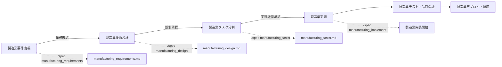

# Spec Command - 製造業統合仕様駆動開発

## 概要
製造業要件定義から実装まで、FastAPI + SQLAlchemy製造業システムプロジェクトの全工程を段階的に進行する統合コマンドです。製造業特有の複雑な業務要求・規制要求・安全要求に対応した体系的開発プロセスを実現します。

## 使用方法
```
/spec [フェーズ名]
```

### 製造業フェーズ一覧
- `init` - 製造業プロジェクト初期化（マルチAI協調）
- `manufacturing_requirements` - 製造業要件定義・業務分析
- `manufacturing_design` - 製造業技術設計・アーキテクチャ
- `manufacturing_tasks` - 製造業タスク分割・実装計画
- `manufacturing_implement` - 製造業実装開始・品質管理
- `status` - 製造業プロジェクト状態確認
- `multiAI` - 製造業マルチAI協調管理

## 製造業マルチAI連携統合フロー

各フェーズで製造業専門AIチームメンバーと連携し、製造業ドメイン知識・技術専門性を活かした開発を実現します。

### 製造業拡張フェーズ構成
```mermaid
graph TB
    subgraph "Phase 1: 製造業分析・戦略 (Gemini CLI)"
        A1[/research - 製造業データ分析・業務調査]
        A2[/content-strategy - 製造業ブランド・産業戦略]
        A3[/product-plan - 製造業プロダクト管理・要件管理]
    end
    
    subgraph "Phase 2: 製造業設計・実装 (Claude Code)"
        B1[/requirements - 製造業要件定義]
        B2[/design - 製造業技術設計]
        B3[/tasks - 製造業タスク分割]
        B4[Manufacturing Implementation - 製造業実装]
    end
    
    subgraph "Phase 3: 製造業インフラ・運用 (o3 MCP)"
        C1[/architecture - 製造業システム設計]
        C2[/devops - 製造業CI/CD・運用]
        C3[/security - 製造業セキュリティ]
    end
    
    A1 --> A2
    A2 --> A3
    A3 --> B1
    B1 --> B2
    B2 --> C1
    C1 --> B3
    B3 --> B4
    B4 --> C2
    C2 --> C3
```

## 製造業プロセス全体図



## 製造業フェーズ詳細

### 1. 製造業初期化フェーズ（/spec init）

```bash
# 製造業実行内容
1. 製造業プロジェクトディレクトリ構造の作成
2. 製造業基本設定ファイルの生成
3. Git リポジトリの初期化（製造業テンプレート）
4. manufacturing_requirements.md テンプレートの作成
5. 製造業データベース・API設計テンプレート
```

#### 製造業生成構造
```
manufacturing_project/
├── .claude/
│   ├── commands/               # 製造業カスタムコマンド
│   └── CLAUDE.md              # 製造業AI向けドキュメント
├── .manufacturing_specs/
│   ├── business_requirements/  # 製造業業務要件
│   ├── technical_specs/       # 製造業技術仕様
│   ├── compliance/            # 製造業規制・コンプライアンス
│   └── quality_assurance/     # 製造業品質保証
├── src/
│   ├── api/                   # FastAPI アプリケーション
│   ├── models/                # SQLAlchemy データモデル
│   ├── schemas/               # Pydantic スキーマ
│   ├── services/              # 製造業ビジネスロジック
│   └── utils/                 # 製造業ユーティリティ
├── tests/                     # 製造業テスト
├── docs/                      # 製造業ドキュメント
├── docker/                    # 製造業環境設定
└── manufacturing_requirements.md    # 製造業要件定義
```

### 2. 製造業要件定義フェーズ（/spec manufacturing_requirements）

#### 2.1 製造業情報収集
```yaml
製造業収集項目:
  業務要件:
    - 生産管理業務フロー
    - 品質管理要求事項
    - 設備管理・保全要求
    - 在庫管理・調達要求
  
  機能要件:
    - MES (Manufacturing Execution System) 機能
    - SCADA データ統合要求
    - IoT センサーデータ処理
    - レポート・分析機能
  
  非機能要件:
    - パフォーマンス要求（リアルタイム処理）
    - 可用性要求（24/7稼働）
    - セキュリティ要求（産業セキュリティ）
    - 規制要求（ISO/FDA/安全基準）
  
  制約事項:
    - 既存システム統合制約
    - ハードウェア・ネットワーク制約
    - 予算・期間制約
    - 人的リソース制約
```

#### 2.2 製造業要件整理
```markdown
## 製造業機能要件

### 生産管理機能
- [ ] 作業指示書管理（Work Order Management）
- [ ] 生産スケジューリング・計画
- [ ] リアルタイム生産監視・制御
- [ ] バッチ/ロット管理・トレーサビリティ
- [ ] 設備稼働状況監視
- [ ] 生産実績・KPI分析

### 品質管理機能
- [ ] 品質管理計画・手順管理
- [ ] 検査・試験結果記録・管理
- [ ] 不適合管理・是正措置
- [ ] 統計的工程管理（SPC）
- [ ] 分析証明書（COA）生成
- [ ] 監査証跡・文書管理

### 設備管理機能
- [ ] 予防保全スケジューリング
- [ ] 保全作業指示・実績管理
- [ ] 設備履歴・ドキュメント管理
- [ ] 備品・スペアパーツ在庫管理
- [ ] 保全コスト管理・分析
- [ ] 安全ロックアウト・タグアウト

## 製造業非機能要件

### パフォーマンス要件
- API応答時間: 製造データアクセス < 200ms
- データ処理: IoTセンサーデータ 1000 points/秒
- 同時ユーザー: 製造現場 500+ 同時アクセス
- レポート生成: 日次生産レポート < 30秒

### 可用性・信頼性要件
- システム稼働率: 生産時間中 99.9%
- データ整合性: 製造データ 100% 整合性保証
- バックアップ: 15分間隔自動バックアップ
- 災害復旧: RTO 15分以内、RPO 5分以内

### セキュリティ要件
- アクセス制御: 製造業務RBAC・職務分離
- データ暗号化: 製造機密データ AES-256暗号化
- 監査ログ: 全製造業務操作完全ログ記録
- ネットワークセキュリティ: OT/IT境界セキュリティ

### 規制・コンプライアンス要件
- ISO 9001:2015: 品質管理システム準拠
- FDA 21 CFR Part 11: 電子記録・電子署名対応
- データ保持: 製造記録7年間保存義務
- 変更管理: 全システム変更文書化・承認
```

#### 2.3 製造業成果物
- `.manufacturing_specs/business_requirements/manufacturing_requirements.md`
- `.manufacturing_specs/business_requirements/user_stories.md`
- `.manufacturing_specs/business_requirements/business_process_flows.md`
- `.manufacturing_specs/compliance/regulatory_requirements.md`

### 3. 製造業技術設計フェーズ（/spec manufacturing_design）

#### 3.1 製造業アーキテクチャ決定
```python
# 製造業技術スタック定義
manufacturing_tech_stack = {
    "backend": {
        "framework": "FastAPI 0.104+",
        "orm": "SQLAlchemy 2.0+ (async)",
        "database": "PostgreSQL 15+",
        "validation": "Pydantic v2",
        "authentication": "JWT + OAuth2",
        "task_queue": "Celery + Redis",
        "caching": "Redis",
        "monitoring": "Prometheus + Grafana"
    },
    "manufacturing_integrations": {
        "mes_integration": "RESTful API + message queues",
        "scada_integration": "OPC-UA client/server",
        "plc_communication": "Modbus TCP/RTU",
        "iot_protocols": "MQTT + CoAP",
        "database_integration": "SQL Server + Oracle connectors",
        "erp_integration": "SAP RFC + web services"
    },
    "data_processing": {
        "time_series": "TimescaleDB extension",
        "analytics": "Pandas + NumPy",
        "machine_learning": "scikit-learn + TensorFlow",
        "real_time": "Apache Kafka + websockets",
        "batch_processing": "Apache Airflow"
    },
    "infrastructure": {
        "containerization": "Docker + Docker Compose",
        "orchestration": "Kubernetes (optional)",
        "ci_cd": "GitHub Actions + Jenkins",
        "deployment": "AWS/Azure + on-premises hybrid",
        "monitoring": "ELK Stack + Prometheus"
    }
}
```

#### 3.2 製造業設計パターン定義
```python
# 製造業SQLAlchemyモデルパターン
from sqlalchemy import Column, Integer, String, DateTime, ForeignKey, Text, Numeric
from sqlalchemy.ext.declarative import declarative_base
from sqlalchemy.orm import relationship

Base = declarative_base()

class WorkOrder(Base):
    """作業指示書モデル"""
    __tablename__ = "work_orders"
    
    id = Column(Integer, primary_key=True)
    work_order_number = Column(String(50), unique=True, nullable=False)
    product_id = Column(Integer, ForeignKey("products.id"))
    production_line_id = Column(Integer, ForeignKey("production_lines.id"))
    planned_quantity = Column(Numeric(10, 2))
    actual_quantity = Column(Numeric(10, 2))
    status = Column(String(20))  # planned, in_progress, completed, cancelled
    scheduled_start = Column(DateTime)
    scheduled_end = Column(DateTime)
    actual_start = Column(DateTime)
    actual_end = Column(DateTime)
    
    # 関係定義
    product = relationship("Product", back_populates="work_orders")
    production_line = relationship("ProductionLine", back_populates="work_orders")
    quality_checks = relationship("QualityCheck", back_populates="work_order")

class Product(Base):
    """製品マスターモデル"""
    __tablename__ = "products"
    
    id = Column(Integer, primary_key=True)
    product_code = Column(String(50), unique=True, nullable=False)
    product_name = Column(String(200), nullable=False)
    product_type = Column(String(50))
    version = Column(String(20))
    specifications = Column(Text)  # JSON形式の仕様情報
    created_at = Column(DateTime)
    updated_at = Column(DateTime)
    
    # 関係定義
    work_orders = relationship("WorkOrder", back_populates="product")
    bom_items = relationship("BOMItem", back_populates="product")

# 製造業FastAPIルーターパターン
from fastapi import APIRouter, Depends, HTTPException
from sqlalchemy.orm import Session
from typing import List

router = APIRouter(prefix="/api/v1/manufacturing", tags=["manufacturing"])

@router.post("/work-orders", response_model=WorkOrderResponse)
async def create_work_order(
    work_order: WorkOrderCreate,
    db: Session = Depends(get_db),
    current_user: User = Depends(get_current_user)
):
    """作業指示書作成"""
    # 権限チェック
    if not has_permission(current_user, "work_order:create"):
        raise HTTPException(status_code=403, detail="Permission denied")
    
    # 業務ロジック
    db_work_order = WorkOrder(**work_order.dict())
    db.add(db_work_order)
    db.commit()
    db.refresh(db_work_order)
    
    # 監査ログ記録
    await log_audit_event("work_order_created", db_work_order.id, current_user.id)
    
    return db_work_order

@router.get("/work-orders/{work_order_id}/status")
async def get_work_order_status(
    work_order_id: int,
    db: Session = Depends(get_db)
):
    """作業指示書ステータス取得（リアルタイム）"""
    work_order = db.query(WorkOrder).filter(WorkOrder.id == work_order_id).first()
    if not work_order:
        raise HTTPException(status_code=404, detail="Work order not found")
    
    # リアルタイムデータ取得
    real_time_data = await get_production_line_data(work_order.production_line_id)
    
    return {
        "work_order": work_order,
        "real_time_status": real_time_data,
        "progress_percentage": calculate_progress(work_order, real_time_data)
    }
```

#### 3.3 製造業成果物
- `.manufacturing_specs/technical_specs/architecture.md`
- `.manufacturing_specs/technical_specs/database_design.md`
- `.manufacturing_specs/technical_specs/api_specifications.md`
- `.manufacturing_specs/technical_specs/integration_design.md`

### 4. 製造業タスク分割フェーズ（/spec manufacturing_tasks）

#### 4.1 製造業自動タスク生成
```python
# 製造業タスク生成ロジック
def generate_manufacturing_tasks(requirements, design):
    tasks = []
    
    # 製造業環境構築タスク
    tasks.extend([
        {
            "id": "setup-001",
            "title": "FastAPI + SQLAlchemy開発環境構築",
            "description": "Python 3.11、FastAPI、SQLAlchemy、PostgreSQL環境設定",
            "priority": "Critical",
            "estimated_hours": 8,
            "dependencies": []
        },
        {
            "id": "setup-002", 
            "title": "製造業データベース初期設計・構築",
            "description": "製造業マスターデータ、トランザクションテーブル設計・作成",
            "priority": "Critical",
            "estimated_hours": 16,
            "dependencies": ["setup-001"]
        }
    ])
    
    # 製造業機能別タスク生成
    for feature in requirements.manufacturing_features:
        tasks.extend(generate_manufacturing_feature_tasks(feature))
    
    # 製造業統合テストタスク
    tasks.extend(generate_manufacturing_test_tasks())
    
    # 製造業コンプライアンス・監査タスク
    tasks.extend(generate_compliance_tasks())
    
    return tasks

def generate_manufacturing_feature_tasks(feature):
    """製造業機能別タスク生成"""
    base_tasks = []
    
    if feature.name == "work_order_management":
        base_tasks = [
            {
                "id": f"wom-001",
                "title": "作業指示書データモデル実装",
                "description": "WorkOrder, Product, ProductionLineモデル実装",
                "priority": "High",
                "estimated_hours": 12
            },
            {
                "id": f"wom-002",
                "title": "作業指示書CRUD API実装",
                "description": "作業指示書作成・更新・削除・検索API実装",
                "priority": "High", 
                "estimated_hours": 16
            },
            {
                "id": f"wom-003",
                "title": "作業指示書承認ワークフロー実装",
                "description": "承認プロセス・権限管理・監査ログ実装",
                "priority": "Medium",
                "estimated_hours": 20
            }
        ]
    
    return base_tasks
```

#### 4.2 製造業タスク優先順位付け
```yaml
製造業優先度基準:
  Critical: 
    - データベース基盤構築
    - 認証・セキュリティ基盤
    - 基本的な製造業務API
    - 規制・コンプライアンス必須機能
  
  High: 
    - 主要製造業務機能（生産管理・品質管理）
    - データ統合・ETL処理
    - リアルタイムデータ処理
    - レポート・分析機能
  
  Medium: 
    - 高度な分析・予測機能
    - ダッシュボード・UI/UX
    - パフォーマンス最適化
    - 運用・監視機能強化
  
  Low: 
    - 追加レポート機能
    - システム最適化・リファクタリング
    - ドキュメント整備
    - ユーザビリティ向上
```

#### 4.3 製造業成果物
- `.manufacturing_specs/project_management/manufacturing_tasks.json`
- `.manufacturing_specs/project_management/gantt_chart.md`
- `.manufacturing_specs/project_management/resource_allocation.md`
- TodoWrite への製造業タスク自動登録

### 5. 製造業実装フェーズ（/spec manufacturing_implement）

#### 5.1 製造業実装開始チェック
```bash
# 製造業チェック項目
✓ 全ての製造業設計ドキュメントが承認済み
✓ 製造業タスクリストがTodoWriteに登録済み
✓ FastAPI + SQLAlchemy開発環境が構築済み
✓ 製造業データベースが初期化済み
✓ 製造業Git リポジトリが初期化済み
✓ 製造業規制・コンプライアンス要件が確認済み
```

#### 5.2 製造業実装ガイドライン
```python
"""
製造業システム実装ガイドライン

## コーディング規約
- FastAPI async/await パターンを使用
- SQLAlchemy 2.0 async syntax を使用  
- Pydantic v2 スキーマ定義必須
- 型ヒント・docstring完全記載
- 製造業ドメイン用語・命名規則準拠

## 製造業セキュリティ要件
- 全API認証・認可必須実装
- 製造業務権限ベースアクセス制御
- 監査ログ全操作記録必須
- 入力検証・SQLインジェクション対策

## 製造業データ整合性
- データベーストランザクション適切使用
- 製造業務ロジック境界でのコミット・ロールバック
- 楽観的ロック・競合状態対策
- データ検証・業務ルール実装

## 製造業コンプライアンス
- 全変更履歴・監査証跡記録
- 電子署名・承認プロセス実装
- データ保持期間・アーカイブ管理
- バリデーション・検証記録保持
"""

# 製造業実装テンプレート例
from fastapi import FastAPI, Depends, HTTPException, status
from sqlalchemy.ext.asyncio import AsyncSession
from typing import List, Optional
import logging

# 製造業監査ログ設定
manufacturing_logger = logging.getLogger("manufacturing_audit")

class ManufacturingWorkOrderService:
    """製造業作業指示書サービス"""
    
    def __init__(self, db: AsyncSession):
        self.db = db
    
    async def create_work_order(
        self, 
        work_order_data: WorkOrderCreate,
        created_by: User
    ) -> WorkOrder:
        """作業指示書作成（監査ログ付き）"""
        
        # 業務検証
        await self._validate_work_order_business_rules(work_order_data)
        
        # データ作成
        db_work_order = WorkOrder(
            **work_order_data.dict(),
            created_by=created_by.id,
            created_at=datetime.utcnow()
        )
        
        try:
            self.db.add(db_work_order)
            await self.db.commit()
            await self.db.refresh(db_work_order)
            
            # 監査ログ記録
            await self._log_audit_event(
                event_type="work_order_created",
                entity_id=db_work_order.id,
                user_id=created_by.id,
                details=work_order_data.dict()
            )
            
            return db_work_order
            
        except Exception as e:
            await self.db.rollback()
            manufacturing_logger.error(f"Work order creation failed: {e}")
            raise HTTPException(
                status_code=status.HTTP_500_INTERNAL_SERVER_ERROR,
                detail="Work order creation failed"
            )
    
    async def _validate_work_order_business_rules(
        self, 
        work_order_data: WorkOrderCreate
    ):
        """製造業務ルール検証"""
        
        # 製品存在確認
        product = await self.db.get(Product, work_order_data.product_id)
        if not product:
            raise HTTPException(
                status_code=status.HTTP_400_BAD_REQUEST,
                detail="Invalid product specified"
            )
        
        # 生産ライン稼働状況確認
        if not await self._is_production_line_available(
            work_order_data.production_line_id,
            work_order_data.scheduled_start,
            work_order_data.scheduled_end
        ):
            raise HTTPException(
                status_code=status.HTTP_409_CONFLICT,
                detail="Production line not available for scheduled time"
            )
        
        # 在庫・材料確認
        if not await self._check_material_availability(work_order_data):
            raise HTTPException(
                status_code=status.HTTP_400_BAD_REQUEST,
                detail="Insufficient materials for production"
            )
```

#### 5.3 製造業進捗管理
```python
# 製造業自動進捗レポート
async def generate_manufacturing_progress_report():
    """製造業プロジェクト進捗レポート生成"""
    
    todos = await get_manufacturing_todos()
    
    # カテゴリ別進捗
    categories = {
        "database_setup": filter_todos_by_category(todos, "database"),
        "api_development": filter_todos_by_category(todos, "api"),
        "business_logic": filter_todos_by_category(todos, "business"),
        "integration": filter_todos_by_category(todos, "integration"),
        "testing": filter_todos_by_category(todos, "testing"),
        "compliance": filter_todos_by_category(todos, "compliance")
    }
    
    report = {
        "overall_progress": calculate_overall_progress(todos),
        "category_progress": {
            cat: calculate_category_progress(tasks) 
            for cat, tasks in categories.items()
        },
        "manufacturing_milestones": calculate_milestone_progress(),
        "quality_metrics": {
            "code_coverage": await get_test_coverage(),
            "api_documentation": await check_api_documentation(),
            "compliance_readiness": await assess_compliance_readiness()
        },
        "risk_assessment": {
            "schedule_risk": assess_schedule_risk(todos),
            "technical_risk": assess_technical_risk(),
            "compliance_risk": assess_compliance_risk()
        }
    }
    
    return report
```

### 6. 製造業ステータス確認（/spec status）

#### 6.1 製造業プロジェクト状態
```yaml
製造業現在のフェーズ: 実装
製造業完了フェーズ:
  - ✓ 製造業要件定義
  - ✓ 製造業技術設計
  - ✓ 製造業アーキテクチャ設計
  - ✓ 製造業タスク分割
製造業進行中:
  - 製造業実装（62% 完了）
    - 完了: 31/50 製造業タスク
    - 進行中: 4 製造業タスク
    - 残り: 15 製造業タスク
    
製造業マイルストーン進捗:
  - Phase 1 基盤構築: 100% 完了
  - Phase 2 コア機能: 75% 完了
  - Phase 3 統合・テスト: 30% 完了
  - Phase 4 コンプライアンス: 15% 完了
```

#### 6.2 製造業健全性チェック
```python
# 製造業プロジェクト健全性チェック
manufacturing_health_check = {
    "documentation": {
        "business_requirements": check_business_documentation_completeness(),
        "technical_specs": check_technical_documentation(),
        "api_documentation": check_api_documentation_coverage(),
        "compliance_docs": check_compliance_documentation()
    },
    "code_quality": {
        "type_coverage": await run_mypy_check(),
        "lint_score": await run_flake8_check(), 
        "security_scan": await run_bandit_security_scan(),
        "complexity_score": await calculate_cyclomatic_complexity()
    },
    "testing": {
        "unit_test_coverage": await get_unit_test_coverage(),
        "integration_test_coverage": await get_integration_test_coverage(),
        "api_test_coverage": await get_api_test_coverage(),
        "manufacturing_scenario_tests": await check_scenario_test_coverage()
    },
    "manufacturing_specific": {
        "database_performance": await check_db_query_performance(),
        "api_response_times": await measure_api_performance(),
        "integration_status": await check_external_system_integration(),
        "compliance_readiness": await assess_regulatory_compliance()
    },
    "security": {
        "vulnerability_scan": await run_safety_check(),
        "authentication_implementation": await verify_auth_implementation(),
        "authorization_coverage": await check_rbac_implementation(),
        "audit_logging": await verify_audit_log_implementation()
    }
}
```

## 製造業統合機能

### 1. 製造業CLAUDE.md 自動更新
```python
def update_manufacturing_claude_md():
    """製造業CLAUDE.mdを自動的に最新状態に保つ"""
    
    sections = [
        generate_manufacturing_project_overview(),
        generate_current_manufacturing_tasks(),
        generate_manufacturing_tech_stack(),
        generate_manufacturing_business_rules(),
        generate_manufacturing_api_patterns(),
        generate_manufacturing_database_schema(),
        generate_manufacturing_compliance_requirements(),
        generate_manufacturing_integration_patterns()
    ]
    
    claude_content = "\n\n".join(sections)
    
    with open('.claude/CLAUDE.md', 'w', encoding='utf-8') as f:
        f.write(claude_content)
```

### 2. 製造業文書間整合性チェック
```python
def validate_manufacturing_consistency():
    """製造業要件・設計・実装の整合性を検証"""
    
    # 文書解析
    requirements = parse_manufacturing_requirements()
    design = parse_manufacturing_design()
    implementation = analyze_manufacturing_code()
    compliance = parse_compliance_requirements()
    
    consistency_report = {
        "unimplemented_requirements": find_unimplemented_manufacturing_features(
            requirements, implementation
        ),
        "design_deviations": find_manufacturing_design_deviations(
            design, implementation  
        ),
        "compliance_gaps": find_compliance_implementation_gaps(
            compliance, implementation
        ),
        "api_spec_mismatches": find_api_specification_mismatches(
            design.api_specs, implementation.api_routes
        ),
        "database_schema_deviations": find_schema_deviations(
            design.database_schema, implementation.models
        ),
        "manufacturing_business_rule_violations": find_business_rule_violations(
            requirements.business_rules, implementation.business_logic
        )
    }
    
    return consistency_report
```

### 3. 製造業AI エージェント制御
```yaml
製造業AI 行動ルール:
  - 各製造業フェーズ完了時に必ず業務確認・承認を求める
  - 製造業要件から逸脱した設計・実装を行わない
  - 規制・コンプライアンス要件を常に考慮する
  - 製造業務の安全性・品質を最優先する
  - 製造業ドメイン知識が不足する場合は必ず質問する
  - 過剰な技術的複雑化を避け、製造現場での実用性を重視する
  - セキュリティ・監査要件を実装の各段階で確認する
```

## 製造業ベストプラクティス

### 1. 段階的詳細化（製造業版）
```
製造業概要 → 業務要件 → 技術設計 → 詳細設計 → 実装 → 検証
各段階で製造業務の実用性・規制適合性を確認
```

### 2. ドキュメント駆動（製造業版）
```
製造業務を理解してから技術設計
実装は設計・コンプライアンス要件に従う
変更は業務影響評価・承認から反映
```

### 3. 継続的検証（製造業版）
```
日次: コード品質・セキュリティチェック
週次: 製造業務適合性・進捗確認
フェーズ終了時: 総合レビュー・業務確認・規制チェック
```

## 製造業出力サマリー

`/spec` コマンド実行により生成される製造業成果物：

```
.manufacturing_specs/[プロジェクト名]/
├── business_requirements/
│   ├── manufacturing_requirements.md    # 製造業要件定義
│   ├── user_stories.md                 # 製造業ユーザーストーリー
│   ├── business_process_flows.md       # 製造業務フロー
│   └── stakeholder_analysis.md         # 製造業ステークホルダー分析
├── technical_specs/
│   ├── architecture.md                 # 製造業アーキテクチャ
│   ├── database_design.md             # 製造業データベース設計
│   ├── api_specifications.md          # 製造業API仕様
│   ├── integration_design.md          # 製造業統合設計
│   └── security_design.md             # 製造業セキュリティ設計
├── compliance/
│   ├── regulatory_requirements.md      # 規制要求事項
│   ├── quality_assurance_plan.md      # 品質保証計画
│   ├── audit_trail_design.md          # 監査証跡設計
│   └── validation_protocols.md        # バリデーションプロトコル
├── project_management/
│   ├── manufacturing_tasks.json        # 製造業タスクリスト
│   ├── gantt_chart.md                  # ガントチャート
│   ├── resource_allocation.md          # リソース配分
│   └── risk_management.md              # リスク管理
├── progress/
│   └── daily_reports/                  # 日次進捗レポート
└── reviews/
    └── phase_reviews/                  # フェーズレビュー記録
```

## 製造業次のアクション

1. `/spec init` で製造業プロジェクトを初期化
2. 製造業要件を整理して `/spec manufacturing_requirements` を実行
3. 各製造業フェーズを順次進行
4. `/spec status` で定期的に製造業プロジェクト状態確認
5. 製造業コンプライアンス・品質要件の継続的確認

## まとめ

この製造業統合仕様駆動開発コマンドは：

1. **製造業特化プロセス**: 製造業務・規制・品質要求に対応した開発プロセス
2. **マルチAI協調**: Gemini・Claude・o3の製造業専門性を活用した統合開発
3. **コンプライアンス重視**: 規制要求・品質基準・監査要件の全工程統合
4. **実用性確保**: 製造現場での実用性・運用性を重視した段階的開発

製造業特有の複雑な要求に対応した体系的・段階的開発により、高品質で実用的な製造業システムを実現します。