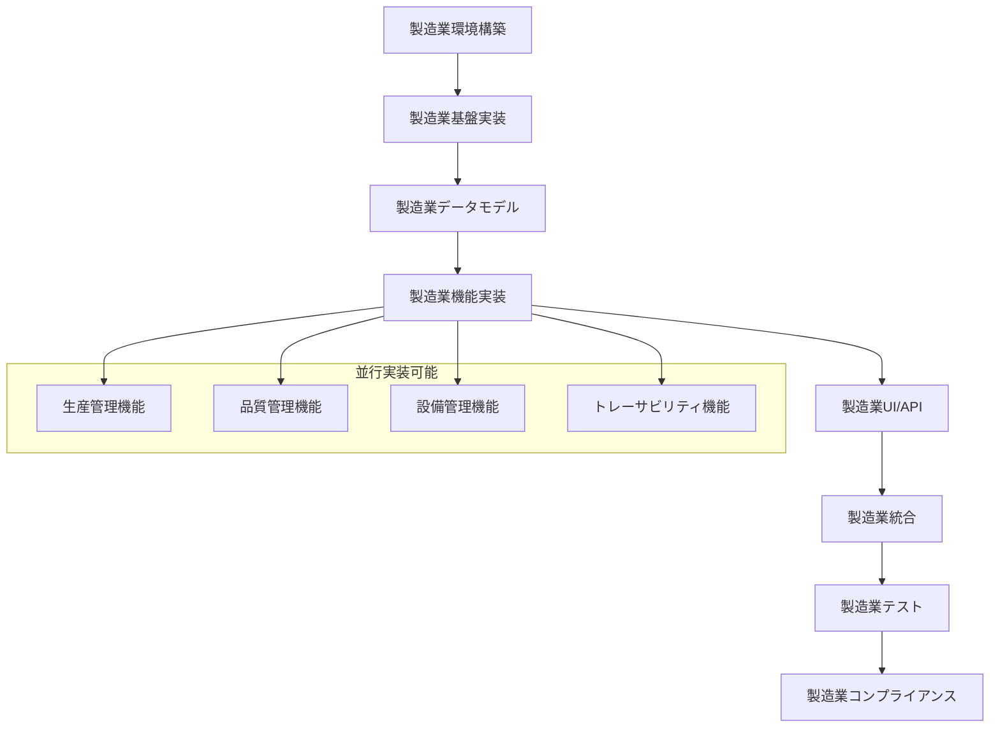

# Tasks Command - 製造業詳細タスク分割

## 概要
製造業技術設計を基に、製造業特有の要求・規制・品質基準に対応した実装可能な粒度まで詳細にタスクを分割します。各タスクは30分〜2時間で完了できる単位に分解し、製造業特有の監査・コンプライアンス・品質要求を考慮した実装計画を提供します。

## 使用方法
```
/tasks [manufacturing_scope] [options]
```

### パラメータ
- `manufacturing_scope`: 製造業スコープ (`production`, `quality`, `maintenance`, `compliance`, `full`)
- `--compliance-level`: 規制準拠レベル (`iso9001`, `fda21cfr`, `gmp`)
- `--priority-based`: 製造業務優先度ベース分割
- `--validation-included`: バリデーション・テストタスク含む

## 前提条件
- `/design` コマンドの実行が完了していること
- 製造業技術設計書が承認されていること
- 製造業規制要求が明確化されていること

## 製造業タスク分割基準

### 1. 製造業タスクサイズ
- **最小**: 30分（設定変更、軽微な修正）
- **標準**: 1時間（単一製造業機能実装）
- **最大**: 2時間（複雑な製造業務ロジック実装）
- **特殊**: 4時間（規制対応・バリデーション作業）

### 2. 製造業タスク粒度の例

#### 2.1 Work Order管理実装（1時間）
```
Task: WorkOrder作成API実装
- Pydanticスキーマ定義・バリデーション（15分）
- SQLAlchemyモデル実装（20分）
- FastAPI エンドポイント実装（15分）
- 監査ログ実装（10分）
```

#### 2.2 製造業データベーステーブル作成（45分）
```
Task: work_orders テーブルの作成
- SQLAlchemyモデル定義（15分）
- Alembicマイグレーション作成（10分）
- 監査カラム・トリガー設定（10分）
- インデックス・制約設定（5分）
- マイグレーション実行・検証（5分）
```

#### 2.3 製造業品質管理機能（1.5時間）
```
Task: SPC（統計的工程管理）計算機能
- 統計計算ロジック実装（30分）
- 管理図データ生成（25分）
- 異常検知アルゴリズム（20分）
- アラート機能（15分）
```

## 製造業タスク分類

### 1. 製造業環境構築タスク
```yaml
製造業環境構築:
  - Python環境構築:
      - Python 3.11 + FastAPI セットアップ（30分）
      - SQLAlchemy 2.0 (async) 設定（30分）
      - Pydantic 2.0 設定（30分）
      - 製造業開発ツール設定（pytest, black, mypy）（45分）
  - PostgreSQL設定:
      - PostgreSQL 15+ インストール（30分）
      - 製造業データベース作成（15分）
      - TimescaleDB拡張（IoTデータ用）（30分）
      - 接続プール設定（15分）
  - 製造業セキュリティ基盤:
      - JWT認証基盤（45分）
      - RBAC（役割ベースアクセス制御）（1時間）
      - 監査ログ基盤（45分）
      - データ暗号化設定（30分）
```

### 2. 製造業基盤実装タスク
```yaml
製造業基盤実装:
  - API基盤:
      - FastAPI アプリケーション構造（45分）
      - ミドルウェア設定（認証・CORS・ログ）（1時間）
      - エラーハンドリング統一（45分）
      - API バージョニング（30分）
  - データベース基盤:
      - SQLAlchemy Base・セッション管理（45分）
      - 製造業Mixin（監査・バージョニング）（1時間）
      - 非同期データベース接続（30分）
      - トランザクション管理（45分）
  - 製造業認証・認可:
      - JWT実装（30分）
      - 製造業権限体系（1.5時間）
      - セッション管理（45分）
      - 電子署名基盤（1時間）
```

### 3. 製造業データモデルタスク
```yaml
製造業データモデル:
  - 生産管理モデル:
      - Product（製品）モデル（45分）
      - WorkOrder（作業指示書）モデル（1時間）
      - ProductionLine（生産ライン）モデル（45分）
      - Batch（バッチ）モデル（1時間）
  - 品質管理モデル:
      - QualityCheck（品質検査）モデル（1時間）
      - TestResult（試験結果）モデル（45分）
      - NonConformance（不適合）モデル（1時間）
      - CAPA（是正予防措置）モデル（1.5時間）
  - 設備管理モデル:
      - Equipment（設備）モデル（45分）
      - MaintenanceSchedule（保全計画）モデル（1時間）
      - WorkRequest（作業依頼）モデル（45分）
      - SensorData（センサーデータ）モデル（1時間）
  - 監査・コンプライアンスモデル:
      - AuditLog（監査ログ）モデル（1時間）
      - ChangeControl（変更管理）モデル（1.5時間）
      - ElectronicSignature（電子署名）モデル（1時間）
      - DocumentControl（文書管理）モデル（1時間）
```

### 4. 製造業機能実装タスク
```yaml
製造業機能実装:
  - 生産管理機能:
      - 作業指示書作成API（1.5時間）
      - 作業指示書承認ワークフロー（2時間）
      - 生産実績記録API（1時間）
      - 生産スケジューリング（2時間）
      - OEE計算機能（1.5時間）
  - 品質管理機能:
      - 品質検査記録API（1時間）
      - SPC（統計的工程管理）（1.5時間）
      - 不適合管理機能（1.5時間）
      - CAPA管理機能（2時間）
      - 品質レポート生成（1時間）
  - 設備管理機能:
      - 設備マスタ管理（1時間）
      - 予防保全スケジューリング（1.5時間）
      - 作業指示書管理（1時間）
      - IoTデータ収集・処理（2時間）
      - 予知保全アルゴリズム（2時間）
  - トレーサビリティ機能:
      - バッチ追跡機能（1.5時間）
      - 原材料トレース（1時間）
      - 系譜管理（2時間）
      - 製品回収シミュレーション（1.5時間）
```

### 5. 製造業UI/API タスク
```yaml
製造業UI/API:
  - 生産管理API:
      - Work Order CRUD API（各1時間）
      - Production Schedule API（1時間）
      - Production KPI API（1時間）
      - Real-time Production Status API（1.5時間）
  - 品質管理API:
      - Quality Check API（1時間）
      - SPC Data API（1時間）
      - Quality Report API（1.5時間）
      - Deviation Management API（1時間）
  - 設備管理API:
      - Equipment Master API（45分）
      - Maintenance Schedule API（1時間）
      - IoT Data Ingestion API（1.5時間）
      - Equipment Performance API（1時間）
  - 監査・レポートAPI:
      - Audit Trail API（1時間）
      - Compliance Report API（1.5時間）
      - Electronic Signature API（2時間）
      - Document Control API（1時間）
```

### 6. 製造業統合・外部連携タスク
```yaml
製造業統合:
  - MES/ERP統合:
      - SAP連携インターフェース（2時間）
      - MESデータ同期（1.5時間）
      - ERPマスタ連携（1時間）
      - データ変換・マッピング（1時間）
  - IoT・SCADA連携:
      - PLC通信（Modbus/TCP）（2時間）
      - MQTT ブローカー連携（1.5時間）
      - OPC-UA クライアント（2時間）
      - センサーデータ正規化（1時間）
  - 外部システム連携:
      - LIMS（検査情報システム）連携（1.5時間）
      - WMS（倉庫管理システム）連携（1時間）
      - 顧客システム連携（1時間）
      - サプライヤー連携（1時間）
```

### 7. 製造業テスト・品質保証タスク
```yaml
製造業テスト:
  - 単体テスト:
      - APIエンドポイント（各30分）
      - ビジネスロジック（各45分）
      - データモデル（各30分）
      - 計算機能（各1時間）
  - 統合テスト:
      - API統合テスト（各1時間）
      - データベーストランザクション（各45分）
      - 外部システム連携（各1.5時間）
      - 製造業ワークフローテスト（各2時間）
  - 製造業特化テスト:
      - 製造業務シナリオテスト（各2時間）
      - 規制コンプライアンステスト（各1.5時間）
      - データ整合性テスト（各1時間）
      - 監査ログテスト（各45分）
  - パフォーマンステスト:
      - API負荷テスト（各1時間）
      - データベースパフォーマンス（1.5時間）
      - リアルタイムデータ処理（1時間）
      - 同時接続テスト（1時間）
```

### 8. 製造業コンプライアンス・バリデーションタスク
```yaml
製造業コンプライアンス:
  - ISO 9001:2015対応:
      - 文書管理システム実装（2時間）
      - プロセス管理機能（2時間）
      - 内部監査機能（1.5時間）
      - 継続的改善機能（1時間）
  - FDA 21 CFR Part 11対応:
      - 電子記録システム（2時間）
      - 電子署名実装（2時間）
      - 監査証跡強化（1.5時間）
      - システムバリデーション（4時間）
  - データ整合性（ALCOA+）:
      - データ完全性チェック（1時間）
      - 変更履歴管理（1.5時間）
      - アクセス制御強化（1時間）
      - バックアップ・リストア検証（1.5時間）
  - GMP対応:
      - バッチレコード電子化（2時間）
      - 逸脱管理システム（1.5時間）
      - 変更管理システム（2時間）
      - バリデーションプロトコル（4時間）
```

## 製造業タスク依存関係



## 製造業見積もり計算

### 製造業計算式
```
総工数 = Σ(タスク時間 × 製造業難易度係数 × 規制対応バッファ)

製造業難易度係数:
- 標準製造業務: 1.2
- 規制対応: 1.5
- 複雑な計算処理: 1.8
- 外部システム連携: 2.0

規制対応バッファ: 1.4（40%のバッファ）
```

### 製造業見積もり例
```
基本的な製造業MESシステム:
- 環境構築: 6時間
- 基盤実装: 12時間
- データモデル: 15時間
- 機能実装: 45時間
- UI/API: 20時間
- 統合: 18時間
- テスト: 25時間
- コンプライアンス: 15時間

合計: 156時間 × 1.4 = 218.4時間（約27人日）

製造業特化追加工数:
- 規制対応: +20%
- 監査機能: +15%
- 外部連携: +25%

実際の見積もり: 約35人日
```

## 製造業TodoWrite 自動生成

製造業タスク分割完了後、以下の形式で TodoWrite に自動登録：

```python
manufacturing_todos = [
    {
        "id": "mfg-env-001",
        "content": "FastAPI + SQLAlchemy製造業プロジェクト初期化",
        "status": "pending",
        "priority": "high",
        "estimated": "45m",
        "category": "製造業環境構築",
        "compliance_required": True
    },
    {
        "id": "mfg-model-001", 
        "content": "WorkOrder（作業指示書）SQLAlchemyモデル実装",
        "status": "pending",
        "priority": "high",
        "estimated": "1h",
        "category": "製造業データモデル",
        "dependencies": ["mfg-env-001"],
        "audit_required": True
    },
    {
        "id": "mfg-api-001",
        "content": "作業指示書作成API実装（認証・監査ログ含む）",
        "status": "pending", 
        "priority": "high",
        "estimated": "1.5h",
        "category": "製造業機能実装",
        "dependencies": ["mfg-model-001"],
        "compliance_validation": "iso9001"
    },
    {
        "id": "mfg-quality-001",
        "content": "SPC（統計的工程管理）計算機能実装",
        "status": "pending",
        "priority": "medium",
        "estimated": "1.5h", 
        "category": "品質管理機能",
        "manufacturing_critical": True
    },
    {
        "id": "mfg-compliance-001",
        "content": "FDA 21 CFR Part 11電子署名機能実装",
        "status": "pending",
        "priority": "critical",
        "estimated": "2h",
        "category": "製造業コンプライアンス",
        "regulatory_requirement": "fda_21_cfr_part_11"
    }
]
```

## 製造業出力形式

1. `.manufacturing_specs/[機能名]/manufacturing_tasks.md` - 製造業タスク一覧
2. `.manufacturing_specs/[機能名]/manufacturing_timeline.md` - 製造業タイムライン
3. `.manufacturing_specs/[機能名]/manufacturing_dependencies.md` - 製造業依存関係図
4. `.manufacturing_specs/[機能名]/compliance_validation_plan.md` - 規制検証計画
5. `.manufacturing_specs/[機能名]/manufacturing_test_plan.md` - 製造業テスト計画

## 製造業進捗追跡

### 製造業日次レポート
```markdown
## 2025-01-29 製造業システム開発進捗

### 完了タスク（8/156）
- [x] FastAPI + SQLAlchemy製造業プロジェクト初期化
- [x] PostgreSQL + TimescaleDB環境構築
- [x] 製造業認証基盤実装
- [x] WorkOrder SQLAlchemyモデル実装
- [x] 製造業監査ログ基盤実装
- [x] 作業指示書作成API実装
- [x] 品質検査記録API実装
- [x] 製造業単体テスト（APIエンドポイント）

### 進行中タスク（3）
- [ ] SPC（統計的工程管理）実装（70%）
- [ ] バッチトレーサビリティ機能（40%）
- [ ] IoTデータ収集・処理機能（開始）

### 明日の予定
- SPC機能完了・単体テスト
- バッチトレーサビリティ機能完了
- IoTデータ処理基盤実装
- FDA 21 CFR Part 11電子署名機能開始

### 製造業特有課題・リスク
- **規制対応**: FDA電子署名要求の詳細仕様確認が必要
- **外部連携**: PLC通信プロトコルの詳細仕様待ち
- **パフォーマンス**: IoTデータ高頻度更新の負荷テスト必要

### 製造業コンプライアンス状況
- ISO 9001:2015 対応: 60% 完了
- FDA 21 CFR Part 11 対応: 30% 完了
- データ整合性（ALCOA+）: 70% 完了

### 製造業品質メトリクス
- コードカバレッジ: 85%
- 製造業API応答時間: 平均 120ms
- 監査ログ完全性: 100%
- データベースクエリ最適化: 90%
```

### 製造業週次レポート
```markdown
## Week 4 製造業システム開発週次サマリー

### 今週の成果
- **完了機能**: 作業指示書管理、基本品質管理、監査ログ
- **実装進捗**: 全体の 35% 完了（計画: 30%）
- **品質指標**: 目標値をすべて達成
- **規制対応**: ISO 9001基本要件 80% 実装完了

### 来週の重点項目
1. **高優先度**: FDA 21 CFR Part 11 電子署名完全実装
2. **中優先度**: IoTデータリアルタイム処理基盤
3. **技術課題**: 外部システム（MES/ERP）連携設計
4. **品質保証**: 統合テスト・パフォーマンステスト開始

### 製造業特有の学習・改善点
- 製造業務理解の深化により設計変更が効率化
- 規制要求の早期実装により後戻りリスク削減
- 製造現場のフィードバック反映でユーザビリティ向上

### リソース・スケジュール調整
- 規制専門家コンサルティング追加（FDA対応）
- 製造現場ヒアリング追加（UI/UX改善）
- 外部システム連携専門エンジニア追加検討
```

## 製造業次のステップ

製造業タスク分割承認後、以下のステップで実行：

1. **実装準備**: 製造業開発環境・ツール最終確認
2. **段階的実装**: 生産管理 → 品質管理 → 設備管理の順序
3. **継続的検証**: 各実装完了時の製造業務適合性確認
4. **規制対応**: 並行してコンプライアンス要求実装
5. **統合テスト**: 製造業シナリオベースの統合検証

## まとめ

この製造業tasksコマンドは：

1. **製造業特化タスク分割**: 製造業務・規制・品質要求に対応した詳細分割
2. **実装可能粒度**: 30分〜2時間の実装可能単位での作業分解
3. **規制コンプライアンス統合**: ISO・FDA等の規制要求をタスクレベルで組み込み
4. **製造業品質保証**: 監査・トレーサビリティ・データ整合性の全タスク統合
5. **リアルな見積もり**: 製造業特有の複雑性を考慮した実践的工数見積もり
6. **進捗可視化**: 製造業特有の進捗・品質・コンプライアンス状況の統合追跡

製造業システム開発の複雑性・規制要求・品質基準に対応した実践的なタスク管理により、効率的で確実な製造業システム開発を実現します。