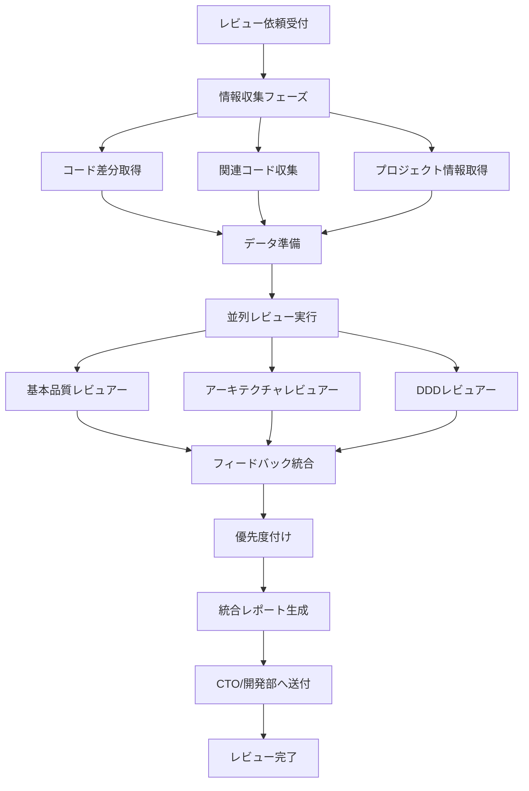

# 🔄 コードレビュープロセスフロー

## 📊 全体フロー図



## 🎯 Phase 1: 情報収集

### 1.1 コード差分の取得
```python
def collect_code_diff():
    """変更されたコードの差分を取得"""
    return {
        "added_lines": [],      # 追加された行
        "modified_lines": [],   # 修正された行
        "deleted_lines": [],    # 削除された行
        "affected_files": []    # 影響を受けたファイル
    }
```

### 1.2 関連コードの収集
```python
def collect_related_code(diff):
    """差分に関連するコードを収集"""
    return {
        "calling_functions": [],     # 呼び出し元関数
        "called_functions": [],      # 呼び出し先関数
        "related_classes": [],       # 関連クラス
        "test_files": []            # テストファイル
    }
```

### 1.3 プロジェクト情報の取得
```python
def get_project_info():
    """プロジェクトのメタ情報を取得"""
    return {
        "architecture": "Clean Architecture",
        "language": "Python",
        "framework": "FastAPI",
        "models": ["User", "Order", "Product"],
        "features": ["認証", "決済", "在庫管理"],
        "target_audience": "ECサイト運営者"
    }
```

## 🚀 Phase 2: 並列レビュー実行

### 2.1 レビュー依頼の配布
```python
class ReviewCoordinator:
    def distribute_review_tasks(self, data):
        """3人のレビュアーに並列でタスクを配布"""
        tasks = []
        
        # 基本品質レビュー
        tasks.append(
            self.create_task(
                reviewer="basic_quality",
                data=data,
                focus=["naming", "style", "readability"]
            )
        )
        
        # アーキテクチャレビュー
        tasks.append(
            self.create_task(
                reviewer="architecture",
                data=data,
                focus=["layers", "solid", "patterns"]
            )
        )
        
        # DDDレビュー
        tasks.append(
            self.create_task(
                reviewer="ddd",
                data=data,
                focus=["domain", "boundaries", "ubiquitous"]
            )
        )
        
        return self.execute_parallel(tasks)
```

### 2.2 各レビュアーの実行
```python
class ReviewerExecution:
    def execute_review(self, reviewer_type, data):
        """各専門レビュアーの実行"""
        reviewer = self.get_reviewer(reviewer_type)
        
        # レビュー実行
        result = reviewer.analyze(data)
        
        # 結果の構造化
        return {
            "reviewer": reviewer_type,
            "critical": result.critical_issues,
            "warnings": result.warnings,
            "suggestions": result.suggestions,
            "metrics": result.metrics
        }
```

## 🔄 Phase 3: フィードバック統合

### 3.1 結果の集約
```python
class FeedbackIntegrator:
    def integrate_results(self, results):
        """3つのレビュー結果を統合"""
        integrated = {
            "critical": [],
            "warnings": [],
            "suggestions": [],
            "metrics": {}
        }
        
        for result in results:
            # 重複除去しながら統合
            integrated["critical"].extend(
                self.deduplicate(result["critical"])
            )
            integrated["warnings"].extend(
                self.deduplicate(result["warnings"])
            )
            integrated["suggestions"].extend(
                self.deduplicate(result["suggestions"])
            )
            
            # メトリクスの統合
            integrated["metrics"][result["reviewer"]] = result["metrics"]
        
        return integrated
```

### 3.2 優先度付け
```python
def prioritize_issues(integrated):
    """問題の優先度付け"""
    priority_map = {
        "security": 1,      # セキュリティ問題
        "logic_error": 2,   # ロジックエラー
        "architecture": 3,  # アーキテクチャ違反
        "performance": 4,   # パフォーマンス
        "maintainability": 5,  # 保守性
        "style": 6         # スタイル
    }
    
    # 優先度順にソート
    integrated["critical"].sort(
        key=lambda x: priority_map.get(x["type"], 999)
    )
    
    return integrated
```

## 📋 Phase 4: レポート生成

### 4.1 統合レポートの作成
```markdown
# 📊 コードレビュー統合レポート

## 📅 レビュー情報
- **日時**: 2025-08-17 15:30
- **対象**: feature/user-authentication
- **レビュアー**: 品質保証部（3名の専門家による）

## 🔴 Critical Issues (即座対応必須) - 3件

### 1. SQLインジェクション脆弱性
- **検出者**: 基本品質レビュアー
- **ファイル**: user_repository.py:45
- **修正期限**: 即座
- **修正案**: パラメータバインディングの使用

### 2. SOLID原則違反（単一責任）
- **検出者**: アーキテクチャレビュアー
- **ファイル**: user_service.py:120
- **影響度**: 高
- **修正案**: 責任の分離とサービスクラスの分割

### 3. ドメインロジックの漏洩
- **検出者**: DDDレビュアー
- **ファイル**: user_controller.py:88
- **問題**: ビジネスロジックがコントローラーに記述
- **修正案**: ドメインサービスへの移動

## 🟡 Warnings (修正推奨) - 8件
[詳細リスト...]

## 🟢 Suggestions (改善提案) - 12件
[詳細リスト...]

## 📈 品質メトリクス

### 総合スコア: 72/100

| カテゴリ | スコア | 評価 |
|---------|--------|------|
| 基本品質 | 85/100 | 良好 |
| アーキテクチャ | 65/100 | 要改善 |
| DDD適合性 | 60/100 | 要改善 |

## 🎯 推奨アクション

### 即座対応（本日中）
1. SQLインジェクション脆弱性の修正
2. 認証ロジックのバグ修正

### 短期対応（3日以内）
1. SOLID原則違反の修正
2. レイヤー境界の明確化

### 中期対応（次スプリント）
1. ドメインモデルの再設計
2. リポジトリパターンの導入

## 📝 レビュアーコメント

### 基本品質レビュアー
「全体的なコード品質は良好ですが、セキュリティ面で重大な問題があります。」

### アーキテクチャレビュアー
「レイヤー分離が不十分です。特にプレゼンテーション層とビジネスロジック層の境界を明確にしてください。」

### DDDレビュアー
「ドメインモデルが貧血症です。振る舞いをエンティティに移動することを推奨します。」
```

### 4.2 配信先の決定
```python
def determine_recipients(report):
    """レポートの配信先を決定"""
    recipients = ["CTO"]  # デフォルトはCTO
    
    if report.has_critical_issues():
        recipients.append("システム開発部リーダー")
    
    if report.affects_architecture():
        recipients.append("経営企画部")
    
    if report.requires_team_adjustment():
        recipients.append("人事部")
    
    return recipients
```

## 📏 品質基準と合格条件

### レビュー合格基準
```python
class ReviewPassCriteria:
    def check_pass_criteria(self, report):
        """レビュー合格基準のチェック"""
        criteria = {
            "no_critical_issues": len(report["critical"]) == 0,
            "warnings_under_limit": len(report["warnings"]) <= 10,
            "quality_score": report["metrics"]["total_score"] >= 70,
            "test_coverage": report["metrics"]["coverage"] >= 80
        }
        
        return all(criteria.values()), criteria
```

## 🔄 フィードバックループ

### 修正後の再レビュー
```python
def handle_fix_and_review(original_report, fixed_code):
    """修正後の再レビュープロセス"""
    # 修正箇所の特定
    fixed_issues = identify_fixed_issues(original_report, fixed_code)
    
    # 部分的な再レビュー
    if all_critical_fixed(fixed_issues):
        # 修正箇所のみ再レビュー
        return quick_review(fixed_code, fixed_issues)
    else:
        # フルレビューの再実行
        return full_review(fixed_code)
```

## 📊 メトリクス収集

### レビュー効果の測定
```python
class ReviewMetrics:
    def collect_metrics(self):
        """レビューメトリクスの収集"""
        return {
            "review_time": "15分",
            "issues_found": 23,
            "critical_issues": 3,
            "false_positives": 2,
            "developer_satisfaction": 4.2,  # 5段階評価
            "fix_rate": 0.85  # 85%の指摘が修正された
        }
```

---

*このプロセスにより、包括的で効率的なコードレビューを実現し、コード品質の継続的な向上を支援します。*