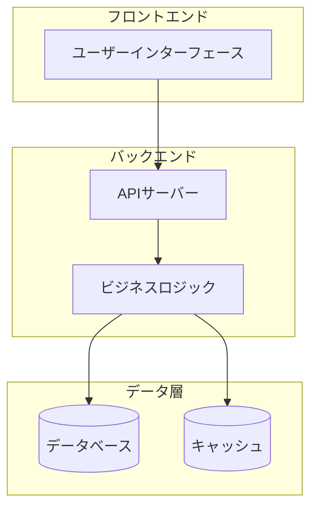
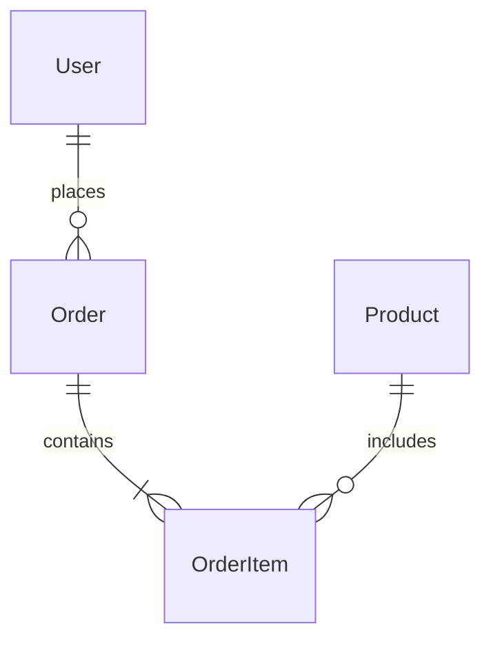

# /design - 技術設計書作成コマンド

## 概要
要件定義書を基に技術設計書を作成するコマンドです。システム開発部が主導し、品質保証部のレビューを受けながら詳細な技術設計を行います。

## 使用方法
```
/design [設計対象]
```

### 設計対象オプション
- `architecture` - システムアーキテクチャ設計
- `database` - データベース設計
- `api` - API設計
- `security` - セキュリティ設計
- `all` - 全体設計（デフォルト）

## 実行プロセス

### 1. 要件確認フェーズ
要件定義書から技術仕様を抽出します。

#### 確認項目
- 機能要件の技術的解釈
- 非機能要件の具体化
- 制約条件の影響評価
- 技術選定の妥当性

### 2. 設計フェーズ
システム開発部の各専門チームが設計を行います。

#### 設計チーム構成
- **アーキテクトチーム**: 全体構造設計
- **バックエンドチーム**: サーバーサイド設計
- **フロントエンドチーム**: クライアントサイド設計
- **インフラチーム**: インフラストラクチャ設計
- **データチーム**: データベース設計

### 3. レビューフェーズ
品質保証部の3人のレビュアーが並列でレビューを実施します。

#### レビュー観点
- 基本品質（命名規則、一貫性）
- アーキテクチャ原則（SOLID、DRY、KISS）
- ドメイン駆動設計（DDD）の適用

## 技術設計書テンプレート

```markdown
# 技術設計書 - [プロジェクト名]

## 1. システム概要
### 1.1 システム構成図


### 1.2 技術スタック
| レイヤー | 技術 | バージョン | 選定理由 |
|---------|------|------------|---------|
| フロントエンド | | | |
| バックエンド | | | |
| データベース | | | |
| インフラ | | | |

## 2. アーキテクチャ設計
### 2.1 アーキテクチャパターン
- パターン名：
- 選定理由：
- レイヤー構成：

### 2.2 ディレクトリ構造
```
project/
├── src/
│   ├── api/          # APIエンドポイント
│   ├── domain/       # ドメインモデル
│   ├── application/  # アプリケーションサービス
│   ├── infrastructure/ # インフラストラクチャ
│   └── presentation/ # プレゼンテーション層
├── tests/            # テストコード
└── docs/             # ドキュメント
```

### 2.3 コンポーネント設計
| コンポーネント | 責務 | 依存関係 |
|---------------|------|----------|
| | | |

## 3. データベース設計
### 3.1 ER図


### 3.2 テーブル定義
#### users テーブル
| カラム名 | 型 | 制約 | 説明 |
|---------|-----|------|------|
| id | BIGINT | PK, AUTO_INCREMENT | ユーザーID |
| email | VARCHAR(255) | UNIQUE, NOT NULL | メールアドレス |
| created_at | TIMESTAMP | NOT NULL | 作成日時 |

### 3.3 インデックス設計
| テーブル | インデックス名 | カラム | 種別 |
|---------|---------------|--------|------|
| | | | |

## 4. API設計
### 4.1 エンドポイント一覧
| メソッド | パス | 説明 | 認証 |
|---------|------|------|------|
| GET | /api/v1/users | ユーザー一覧取得 | 要 |
| POST | /api/v1/users | ユーザー作成 | 要 |

### 4.2 リクエスト/レスポンス仕様
#### POST /api/v1/users
**リクエスト**
```json
{
  "email": "user@example.com",
  "name": "John Doe",
  "password": "encrypted_password"
}
```

**レスポンス**
```json
{
  "id": 1,
  "email": "user@example.com",
  "name": "John Doe",
  "created_at": "2025-01-01T00:00:00Z"
}
```

### 4.3 エラーハンドリング
| エラーコード | 説明 | レスポンス例 |
|-------------|------|-------------|
| 400 | Bad Request | {"error": "Invalid input"} |
| 401 | Unauthorized | {"error": "Authentication required"} |

## 5. セキュリティ設計
### 5.1 認証・認可
- 認証方式：JWT
- 認可モデル：RBAC（ロールベースアクセス制御）
- トークン有効期限：24時間

### 5.2 データ保護
- 暗号化：AES-256
- ハッシュ化：bcrypt
- 通信：HTTPS必須

### 5.3 セキュリティ対策
| 脅威 | 対策 |
|------|------|
| SQLインジェクション | パラメータバインディング |
| XSS | 出力エスケープ |
| CSRF | CSRFトークン |

## 6. パフォーマンス設計
### 6.1 キャッシュ戦略
- キャッシュレイヤー：Redis
- キャッシュ対象：頻繁にアクセスされるマスタデータ
- TTL：データ種別により1時間〜24時間

### 6.2 最適化方針
- データベースクエリの最適化
- N+1問題の回避
- 非同期処理の活用

## 7. 開発・テスト設計
### 7.1 開発環境
- 言語/フレームワーク：
- 開発ツール：
- バージョン管理：Git

### 7.2 テスト戦略
| テスト種別 | カバレッジ目標 | ツール |
|-----------|---------------|--------|
| 単体テスト | 80% | |
| 統合テスト | 60% | |
| E2Eテスト | 主要フロー | |

## 8. デプロイ・運用設計
### 8.1 デプロイ構成
- 環境：開発/ステージング/本番
- CI/CD：GitHub Actions / GitLab CI
- コンテナ：Docker

### 8.2 監視・ログ
- APM：Application Performance Monitoring
- ログ収集：構造化ログ
- アラート：閾値ベース

## 9. 移行計画
### 9.1 データ移行
- 移行対象：
- 移行方法：
- ロールバック計画：

## 10. リスクと対策
| リスク | 影響度 | 対策 |
|--------|--------|------|
| | | |

## 承認
| 役割 | 氏名 | 承認日 | 署名 |
|------|------|--------|------|
| システム開発部長 | | | |
| 品質保証部長 | | | |
| CTO | | | |

---
作成日: YYYY-MM-DD
作成者: システム開発部
レビュー: 品質保証部
バージョン: 1.0
```

## 出力先
- `.claude_sub_agent/docs/design/DES_YYYYMMDD_プロジェクト名.md`
- レビュー中は `.ActivityReport/tasks/` で共同編集

## 品質チェックリスト

### 設計の品質基準
- [ ] 要件との整合性
- [ ] アーキテクチャ原則の遵守
- [ ] セキュリティ考慮
- [ ] パフォーマンス考慮
- [ ] 保守性・拡張性
- [ ] テスタビリティ

## エージェント役割分担

| エージェント | 責任範囲 |
|-------------|---------|
| システム開発部 | 設計主導、技術選定 |
| 品質保証部 | 設計レビュー、品質チェック |
| CTO | 設計承認、技術方針決定 |
| 経営企画部 | ビジネス整合性確認 |

## 実行例

### 全体設計
```bash
/design
# または
/design all
```

### 特定領域の設計
```bash
/design architecture
/design database
/design api
/design security
```

## 関連コマンド
- `/spec` - 統合開発フロー
- `/requirements` - 要件定義書の参照
- `/tasks` - 設計を基にしたタスク分割
- `/implement` - 設計を基にした実装

## 注意事項
- 設計変更は影響範囲を必ず確認してください
- 大規模な変更は設計レビューを必須とします
- 設計書は常に最新の状態を保つようにしてください

---

*このコマンドはシステム開発部が主導し、品質保証部のレビューを受けながら技術設計を行います。*