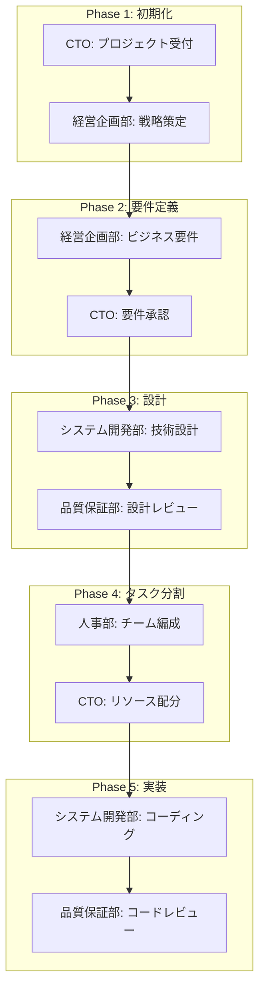

# /spec - 統合開発フロー管理コマンド

## 概要
プロジェクトの要件定義から実装まで、全工程を階層型エージェントシステムで段階的に進行する統合コマンドです。

## 使用方法
```
/spec [フェーズ名]
```

### フェーズ一覧
- `init` - プロジェクト初期化
- `requirements` - 要件定義
- `design` - 技術設計
- `tasks` - タスク分割
- `implement` - 実装開始
- `status` - プロジェクト状態確認

## 実行フロー

### Phase 1: プロジェクト初期化（/spec init）
CTOが経営企画部と連携してプロジェクトをセットアップします。

#### 実行内容
1. プロジェクトディレクトリ構造の作成
2. 基本設定ファイルの生成
3. Git リポジトリの初期化
4. requirements.md テンプレートの作成
5. .ActivityReport構造の初期化

#### 生成構造
```
project/
├── .claude_sub_agent/
│   ├── .ActivityReport/
│   │   ├── tasks/
│   │   │   └── shared_tasks.md
│   │   └── daily_report/
│   └── docs/
│       ├── requirements/
│       ├── design/
│       └── tasks/
├── src/
│   ├── api/
│   ├── models/
│   ├── services/
│   └── tests/
└── README.md
```

### Phase 2: 要件定義（/spec requirements）
経営企画部が主導し、ビジネス要件を明確化します。

#### 実行内容
1. ビジネス要件の収集
2. ユーザーストーリーの作成
3. 機能要件・非機能要件の定義
4. 受入条件の明確化
5. requirements.md の生成

#### 成果物
- `.claude_sub_agent/docs/requirements/REQ_YYYYMMDD_プロジェクト名.md`

### Phase 3: 技術設計（/spec design）
システム開発部が技術的な設計を行います。

#### 実行内容
1. システムアーキテクチャの設計
2. データベース設計
3. API設計
4. セキュリティ設計
5. design.md の生成

#### 成果物
- `.claude_sub_agent/docs/design/DES_YYYYMMDD_プロジェクト名.md`

### Phase 4: タスク分割（/spec tasks）
人事部と協力してタスクを分割し、チーム編成を行います。

#### 実行内容
1. WBS（作業分解構成）の作成
2. タスクの優先順位付け
3. 工数見積もり
4. チーム割り当て
5. tasks.md の生成

#### 成果物
- `.claude_sub_agent/docs/tasks/TASK_YYYYMMDD_プロジェクト名.md`
- `.ActivityReport/tasks/shared_tasks.md` の更新

### Phase 5: 実装開始（/spec implement）
品質保証部のレビューを受けながら実装を進めます。

#### 実行内容
1. 開発環境のセットアップ
2. コードテンプレートの生成
3. TDD（テスト駆動開発）の開始
4. 継続的インテグレーションの設定
5. 初期実装の開始

#### 品質保証プロセス
- 3人のレビュアーによる並列コードレビュー
- Critical/Warning/Suggestionの3段階評価
- 品質スコア（100点満点）での評価

### Phase 6: 状態確認（/spec status）
CTOが全体の進捗を確認し、報告します。

#### 確認内容
1. 各フェーズの完了状況
2. 生成されたドキュメント一覧
3. タスクの進捗状況
4. 品質メトリクス
5. 次のアクション

## エージェント連携フロー



## コマンド例

### 新規プロジェクトの開始
```bash
/spec init
# プロジェクト初期化

/spec requirements
# 要件定義の開始

/spec design
# 技術設計の開始

/spec tasks
# タスク分割とチーム編成

/spec implement
# 実装開始
```

### 既存プロジェクトの確認
```bash
/spec status
# 現在の状態確認
```

## 成果物の管理

### ドキュメント配置
```
.claude_sub_agent/
├── docs/
│   ├── requirements/    # 承認済み要件定義書
│   ├── design/         # 承認済み技術設計書
│   └── tasks/          # 承認済みタスク計画
└── .ActivityReport/
    ├── tasks/          # 進行中のタスク
    └── daily_report/   # 日次進捗レポート
```

### バージョン管理
- メジャー変更: v1.0 → v2.0（大幅な仕様変更）
- マイナー変更: v1.0 → v1.1（機能追加）
- パッチ: v1.0 → v1.0.1（誤字修正等）

## 品質基準

### フェーズ完了条件
| フェーズ | 完了条件 |
|---------|---------|
| 要件定義 | ステークホルダー承認済み |
| 技術設計 | レビュー指摘事項0件 |
| タスク分割 | 全タスクに担当者割当済み |
| 実装 | テストカバレッジ80%以上 |

## エラー処理

### よくあるエラーと対処法
1. **要件不明確**: 経営企画部が追加ヒアリング実施
2. **技術的制約**: システム開発部が代替案提示
3. **リソース不足**: 人事部が追加メンバー配属
4. **品質基準未達**: 品質保証部が改善指導

## 関連コマンド
- `/requirements` - 要件定義のみ実行
- `/design` - 技術設計のみ実行
- `/tasks` - タスク分割のみ実行
- `/analyze` - プロジェクト分析
- `/enhance` - 機能追加
- `/fix` - バグ修正

---

*このコマンドは階層型エージェントシステムの中核機能です。CTOの指示に従って各部門が連携して作業を進めます。*