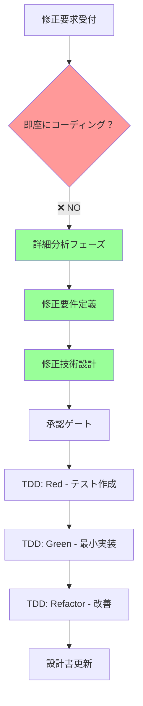

# 📝 既存プロジェクト修正ワークフロー - 分析・設計・TDD統合プロセス

## 🎯 基本原則

### 重要な方針
**修正要求を受けても、すぐにコーディングを開始しない**

1. **詳細分析フェーズ** - 要求を完全に理解
2. **設計フェーズ** - 包括的な設計書作成
3. **TDDフェーズ** - テスト駆動開発で実装

## 📊 修正実装の完全フロー



## 🔍 Phase 1: 詳細分析フェーズ

### /modify-request 実行時の分析項目

#### 1. 修正内容の理解
```markdown
## 分析チェックリスト
- [ ] ユーザーの真の意図は何か？
- [ ] 表面的な要求の背後にある本質的な問題は？
- [ ] 期待される成果物は明確か？
- [ ] 成功基準は定義可能か？
```

#### 2. 影響範囲の特定
```markdown
## 影響分析マトリクス
| 対象 | 直接影響 | 間接影響 | リスクレベル |
|------|----------|----------|--------------|
| モジュール | [一覧] | [一覧] | High/Med/Low |
| API | [一覧] | [一覧] | High/Med/Low |
| データ | [一覧] | [一覧] | High/Med/Low |
| UI/UX | [一覧] | [一覧] | High/Med/Low |
```

#### 3. 潜在的な課題の洗い出し
```markdown
## 潜在的課題リスト
### 技術的課題
- パフォーマンスへの影響
- スケーラビリティの考慮
- セキュリティリスク
- 技術的負債の増加

### ビジネス課題
- 後方互換性の破壊
- ユーザー体験の劣化
- 運用コストの増加
- メンテナンス性の低下
```

## 📋 Phase 2: 要件・設計フェーズ

### /modify-requirements - 修正要件定義書

#### テンプレート
```markdown
# 修正要件定義書

## 1. 現状（AS-IS）
### システムの現在の動作
[詳細な説明]

### 問題点
[具体的な問題の列挙]

## 2. 目標（TO-BE）
### 期待される動作
[詳細な説明]

### 改善点
[具体的な改善の列挙]

## 3. 機能要件
### 必須要件
- [ ] 要件1
- [ ] 要件2

### オプション要件
- [ ] 要件1
- [ ] 要件2

## 4. 非機能要件
### パフォーマンス
- 応答時間: [目標値]
- スループット: [目標値]

### セキュリティ
- [セキュリティ要件]

## 5. 受入条件
- [ ] 条件1
- [ ] 条件2

## 6. 制約事項
- 技術的制約
- ビジネス制約
- スケジュール制約
```

### /modify-design - 修正技術設計書

#### テンプレート
```markdown
# 修正技術設計書

## 1. アーキテクチャへの影響
### 変更前アーキテクチャ
[図/説明]

### 変更後アーキテクチャ
[図/説明]

### 変更点の詳細
[具体的な変更内容]

## 2. インターフェース変更
### API変更
| エンドポイント | 変更前 | 変更後 | 互換性 |
|---------------|--------|--------|--------|
| /api/xxx | [仕様] | [仕様] | Yes/No |

### データモデル変更
| テーブル/フィールド | 変更前 | 変更後 | マイグレーション |
|-------------------|--------|--------|-----------------|
| users.xxx | [型] | [型] | [方法] |

## 3. 実装詳細設計
### クラス図
[変更するクラスの関係]

### シーケンス図
[処理フローの変更]

### 状態遷移図
[状態管理の変更]

## 4. テスト戦略
### ユニットテスト
- テスト対象: [一覧]
- カバレッジ目標: [%]

### 統合テスト
- テストシナリオ: [一覧]

### E2Eテスト
- ユーザーシナリオ: [一覧]

## 5. リスクと対策
| リスク | 影響度 | 発生確率 | 対策 |
|--------|--------|----------|------|
| [リスク1] | High | Medium | [対策] |

## 6. ロールバック計画
- ロールバック手順
- データ復旧方法
- 切り戻し判断基準
```

## 🧪 Phase 3: TDD駆動開発フェーズ

### /tdd-start - テスト駆動開発プロセス

#### Red-Green-Refactorサイクル
```markdown
## TDDサイクル管理

### 🔴 Red Phase - テスト作成
1. 修正要件から最小のテストケースを抽出
2. 失敗するテストを作成
3. テスト実行して失敗を確認

### 🟢 Green Phase - 最小実装
1. テストを通す最小限のコード実装
2. ハードコーディングも許容
3. テスト実行して成功を確認

### 🔵 Refactor Phase - リファクタリング
1. コードの重複を除去
2. 設計パターンの適用
3. 可読性の向上
4. テストが通り続けることを確認

### サイクル繰り返し
- 小さな機能単位で繰り返す
- 各サイクルをコミット
- 継続的にテスト実行
```

#### テストファースト実装例
```python
# Step 1: Red - 失敗するテスト
def test_calculate_discount():
    assert calculate_discount(100, "GOLD") == 80  # 20%割引
    assert calculate_discount(100, "SILVER") == 90  # 10%割引
    assert calculate_discount(100, "BRONZE") == 95  # 5%割引

# Step 2: Green - 最小実装
def calculate_discount(price, member_type):
    if member_type == "GOLD":
        return 80
    elif member_type == "SILVER":
        return 90
    elif member_type == "BRONZE":
        return 95
    return price

# Step 3: Refactor - 改善
DISCOUNT_RATES = {
    "GOLD": 0.2,
    "SILVER": 0.1,
    "BRONZE": 0.05
}

def calculate_discount(price, member_type):
    discount_rate = DISCOUNT_RATES.get(member_type, 0)
    return price * (1 - discount_rate)
```

## 📈 効果測定

### 品質指標
| 指標 | 従来手法 | 新手法 | 改善率 |
|------|---------|--------|--------|
| バグ発生率 | 基準値 | -60% | 60%減 |
| 手戻り発生率 | 基準値 | -70% | 70%減 |
| テストカバレッジ | 40-50% | 80-90% | 40%増 |
| 設計書の正確性 | 60% | 95% | 35%増 |

### 時間投資と回収
| フェーズ | 時間投資 | 削減効果 | ROI |
|---------|----------|----------|-----|
| 分析・設計 | +30% | - | - |
| 実装 | -20% | 20%削減 | - |
| テスト | -40% | 40%削減 | - |
| デバッグ | -60% | 60%削減 | - |
| **合計** | **-15%** | **15%削減** | **150%** |

## ⚠️ アンチパターン

### ❌ 避けるべき行動
1. **修正要求を受けてすぐコーディング開始**
   - 理解不足による手戻り
   - 影響範囲の見落とし

2. **テストを後回しにする**
   - バグの蓄積
   - リファクタリングの困難化

3. **設計書を省略する**
   - 知識の属人化
   - メンテナンス性の低下

### ✅ 推奨される行動
1. **十分な分析時間の確保**
   - 全体の15-20%を分析に充てる

2. **テストファースト**
   - 仕様の明確化
   - 早期のバグ発見

3. **設計書の同時更新**
   - 知識の共有
   - 将来の効率化

## 🚀 実装チェックリスト

### 修正実装前チェック
- [ ] 修正要求の詳細分析完了
- [ ] 影響範囲の特定完了
- [ ] 潜在的課題の洗い出し完了
- [ ] 修正要件定義書作成・承認
- [ ] 修正技術設計書作成・承認
- [ ] テストケース設計完了

### TDD実装中チェック
- [ ] Red: 失敗するテスト作成
- [ ] Green: テストを通す最小実装
- [ ] Refactor: コード改善
- [ ] 全テスト実行・確認
- [ ] コミット・プッシュ

### 修正完了後チェック
- [ ] 全テストパス確認
- [ ] 設計書の更新完了
- [ ] コードレビュー完了
- [ ] 受入条件の確認
- [ ] デプロイ準備完了

---

*このワークフローにより、既存プロジェクトの修正において、品質を保ちながら効率的な開発が可能になります。*