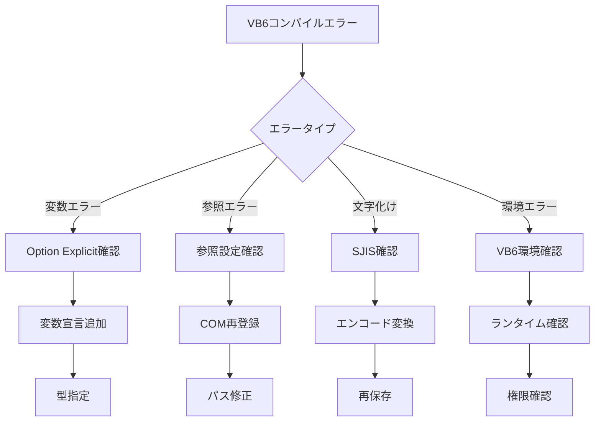

# 🔧 VB6 コンパイルトラブルシューティングガイド

**SJIS文字コード対応・レガシー環境特化・マルチAI協調支援**

## 📋 目次

1. [VB6特有のコンパイル要件](#vb6特有のコンパイル要件)
2. [コンパイル前の必須確認事項](#コンパイル前の必須確認事項)
3. [コンパイル方法と手順](#コンパイル方法と手順)
4. [よくあるコンパイルエラーと解決方法](#よくあるコンパイルエラーと解決方法)
5. [SJIS文字コード関連の問題](#sjis文字コード関連の問題)
6. [マルチAI協調サポート](#マルチai協調サポート)

## VB6特有のコンパイル要件

### ⚠️ 絶対的な制約事項

```vb
' 必須設定
' 1. Option Explicit の使用（変数宣言強制）
Option Explicit

' 2. プロジェクトプロパティ設定
' - コンパイル → 詳細な最適化 → 配列の境界チェックを削除: オフ
' - コンパイル → ネイティブコードにコンパイル: 選択
' - Make → バージョン番号の自動インクリメント: オン
```

### 📝 文字コード要件

```
✅ 必須: Shift-JIS (SJIS) エンコーディング
❌ 禁止: UTF-8, UTF-16, その他のエンコーディング

対象ファイル:
- .bas (標準モジュール)
- .cls (クラスモジュール)
- .frm (フォームファイル)
- .vbp (プロジェクトファイル)
- .vbg (プロジェクトグループ)
```

## コンパイル前の必須確認事項

### 🔍 VB6環境チェックリスト

```markdown
□ Visual Basic 6.0 (SP6) がインストールされている
□ 必要なランタイムがインストールされている
  └ VB6 SP6 ランタイム
  └ Microsoft Visual Basic 6.0 Common Controls
□ すべてのソースファイルがSJISで保存されている
□ 参照設定がすべて有効である
□ COMコンポーネントが正しく登録されている
□ ActiveXコントロール（.ocx）が登録されている
□ 出力先フォルダへの書き込み権限がある
□ 既存のEXEファイルが実行中でない
```

### SJIS確認コマンド

```powershell
# PowerShellでファイルエンコーディング確認
function Get-FileEncoding($Path) {
    $bytes = [byte[]](Get-Content $Path -Encoding Byte -TotalCount 4)
    if ($bytes[0] -eq 0xef -and $bytes[1] -eq 0xbb -and $bytes[2] -eq 0xbf) { 'UTF8' }
    elseif ($bytes[0] -eq 0xff -and $bytes[1] -eq 0xfe) { 'UTF16LE' }
    elseif ($bytes[0] -eq 0xfe -and $bytes[1] -eq 0xff) { 'UTF16BE' }
    else { 'SJIS or ASCII' }
}

# VB6ファイルのエンコーディング確認
Get-ChildItem -Path "*.bas","*.cls","*.frm" | ForEach-Object {
    "$($_.Name): $(Get-FileEncoding $_.FullName)"
}
```

## コンパイル方法と手順

### 1. VB6 IDE でのコンパイル

```
1. プロジェクトを開く（.vbp）
2. プロジェクト → プロジェクトのプロパティ
   - 全般: プロジェクト名、説明を確認
   - Make: バージョン情報を設定
   - コンパイル: ネイティブコードを選択
3. ファイル → EXEファイルの作成 (Ctrl+F5)
4. 出力先を指定
5. コンパイル実行
```

### 2. コマンドラインコンパイル

```cmd
# 基本的なコンパイル
"C:\Program Files (x86)\Microsoft Visual Studio\VB98\VB6.EXE" /make "MyProject.vbp" /out "compile.log"

# 出力先指定
"C:\Program Files (x86)\Microsoft Visual Studio\VB98\VB6.EXE" /make "MyProject.vbp" /outdir "C:\Output" /out "compile.log"

# サイレントコンパイル
"C:\Program Files (x86)\Microsoft Visual Studio\VB98\VB6.EXE" /make "MyProject.vbp" /out "compile.log" /d

# 条件付きコンパイル定数の指定
"C:\Program Files (x86)\Microsoft Visual Studio\VB98\VB6.EXE" /make "MyProject.vbp" /d DEBUG=1 /out "compile.log"
```

## よくあるコンパイルエラーと解決方法

### 🚨 エラーパターン1: 変数が定義されていません

#### エラーメッセージ
```
コンパイル エラー:
変数が定義されていません
```

#### 原因と解決方法

```vb
' ❌ エラーの原因（Option Explicit使用時）
Sub TestProcedure()
    myVariable = 10  ' 宣言されていない変数
End Sub

' ✅ 解決方法
Sub TestProcedure()
    Dim myVariable As Integer  ' 変数を宣言
    myVariable = 10
End Sub
```

### 🚨 エラーパターン2: 参照設定の問題

#### エラーメッセージ
```
コンパイル エラー:
プロジェクトまたはライブラリが見つかりません
```

#### 解決方法

1. **参照設定の確認**
```
プロジェクト → 参照設定
- 「参照不可」となっている項目を確認
- チェックを外すか、正しいパスを指定
```

2. **COMコンポーネントの再登録**
```cmd
# 管理者権限で実行
regsvr32 /u "C:\Windows\System32\MSCOMCTL.OCX"
regsvr32 "C:\Windows\System32\MSCOMCTL.OCX"
```

### 🚨 エラーパターン3: ファイルアクセスエラー

#### エラーメッセージ
```
ファイル 'MyProject.exe' を作成できません
```

#### 解決方法

1. **実行中のプロセス終了**
```cmd
# プロセスの確認と終了
tasklist | findstr "MyProject.exe"
taskkill /F /IM MyProject.exe
```

2. **ファイル属性の確認**
```cmd
# 読み取り専用属性を解除
attrib -R "C:\Output\MyProject.exe"
```

3. **出力先フォルダの権限**
```cmd
# フルコントロール権限を付与
icacls "C:\Output" /grant %USERNAME%:F
```

### 🚨 エラーパターン4: メモリ不足

#### エラーメッセージ
```
コンパイル エラー:
メモリが不足しています
```

#### 解決方法

```vb
' 1. 大きな配列の分割
' ❌ 問題のあるコード
Dim HugeArray(1000000) As Long

' ✅ 改善されたコード
Dim SmallArray() As Long
ReDim SmallArray(10000)  ' 必要に応じて拡張

' 2. 未使用の参照を削除
' プロジェクト → 参照設定で不要な参照のチェックを外す

' 3. モジュールの分割
' 大きなモジュールを複数の小さなモジュールに分割
```

### 🚨 エラーパターン5: バージョン互換性

#### エラーメッセージ
```
このプロジェクトのバージョンは新しすぎます
```

#### 解決方法

```ini
' .vbpファイルのバージョン情報を編集
' 変更前
VersionCompatible32="1"
MajorVer=2
MinorVer=0

' 変更後（下位互換性確保）
VersionCompatible32="0"
MajorVer=1
MinorVer=0
```

## SJIS文字コード関連の問題

### 🚨 文字化けエラー

#### 症状
```
' IDEで開いたときに日本語コメントが文字化け
' ｿｽｿｽｿｽ�ｽ
```

#### 解決方法

1. **文字コード変換ツール使用**
```cmd
# nkfを使用したSJIS変換
nkf -s --overwrite Module1.bas

# PowerShellでの変換
Get-Content "Module1.bas" -Encoding UTF8 | Set-Content "Module1.bas" -Encoding Default
```

2. **エディタ設定**
```
' Visual Studio Code
{
  "[vb]": {
    "files.encoding": "shiftjis"
  }
}

' サクラエディタ
文字コードセット: SJIS
改行: CR+LF
```

### 🚨 定数文字列の文字化け

```vb
' ❌ 問題のあるコード（特殊文字）
Const MSG As String = "～①②③"  ' 波ダッシュ、丸数字

' ✅ 安全なコード
Const MSG As String = "~123"  ' ASCII文字のみ
' または
Const MSG As String = "－１２３"  ' 全角数字
```

## マルチAI協調サポート

### 🤖 VB6特化AI支援

#### Claude Code（コード修正）
```bash
# 変数宣言の自動追加
/vb6-add-declarations --option-explicit

# SJIS文字コード修正
/vb6-fix-encoding --to-sjis --verify

# 参照設定の修復
/vb6-fix-references --auto-resolve
```

#### Gemini CLI（問題分析）
```bash
# コンパイルログ分析
/analyze-vb6-compile-log --file="compile.log"

# 依存関係分析
/vb6-dependency-check --deep-scan

# メモリ使用量分析
/vb6-memory-analysis --suggest-optimization
```

#### o3 MCP（環境設定）
```bash
# VB6環境診断
/diagnose-vb6-environment --full

# COM登録確認
/verify-com-registration --vb6-components

# レガシー環境設定
/configure-legacy-env --vb6-optimal
```

### 🔧 統合コンパイルサポート

```bash
# VB6コンパイル総合診断
/vb6-compile-diagnose --project="MyProject.vbp" --ai=all

# 自動エラー修復
/fix-vb6-compile-errors --auto --verify-sjis

# コンパイル前準備
/prepare-vb6-compile --check-encoding --register-com
```

## 📊 VB6コンパイルエラー解決フロー



## 🆘 緊急対応手順

### レベル1: 基本対応
```cmd
# プロジェクトクリーン
del *.obj
del *.exe

# 参照再設定
"VB6.exe" /regserver

# SJIS強制保存
nkf -s --overwrite *.bas *.cls *.frm
```

### レベル2: AI支援
```bash
# 総合診断
/vb6-emergency-compile --collect-all

# 自動修復
/vb6-auto-fix --compile-issues
```

### レベル3: 手動対応
1. VB6 SP6の再インストール
2. プロジェクトの新規作成
3. モジュール単位での移行

## 📝 コンパイル成功のベストプラクティス

### 開発時の注意点
```vb
' 1. 常にOption Explicitを使用
Option Explicit

' 2. エラーハンドリングの実装
On Error GoTo ErrorHandler

' 3. リソースの解放
Set objDatabase = Nothing

' 4. 条件付きコンパイル
#If DEBUG Then
    Debug.Print "デバッグモード"
#End If
```

### プロジェクト設定
```
1. バイナリ互換性の設定
2. バージョン番号の管理
3. 最適化オプションの選択
4. エラートラップの設定
```

---

**💡 重要**: VB6のコンパイルエラーの多くは、文字コード（SJIS）、参照設定、変数宣言に起因します。まず `/vb6-compile-diagnose` でマルチAI診断を実行してください。