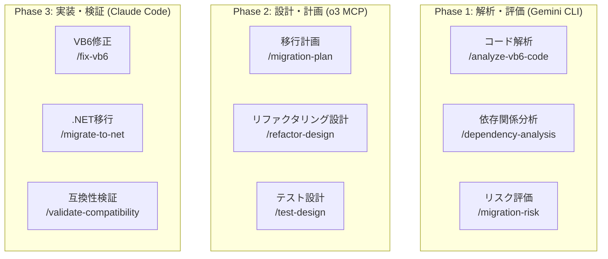

# 🔍 Visual Basic 6.0 レガシーシステム解析・移行支援システム

**既存VB6資産の解析・保守・.NET Framework 4.8への段階的移行**

## 🎯 プロジェクト概要

このプロジェクトは、既存のVisual Basic 6.0レガシーシステムの解析、保守、修正、および.NET Framework 4.8への段階的移行を支援するマルチAI統合システムです。新規開発ではなく、既存資産の最大活用と安全な移行に焦点を当てています。

### 🔑 主要機能

- **レガシーコード解析**: 依存関係、複雑度、技術的負債の可視化
- **安全な修正支援**: 影響範囲分析、リグレッションテスト設計
- **.NET移行評価**: 移行難易度評価、段階的移行計画
- **マルチAI協調**: 解析・設計・実装の3層AI専門分化
- **リスク最小化**: 既存機能の完全性保持、段階的アプローチ

## 🏗️ レガシー解析・移行技術スタック

### 解析・移行ツール構成
```
解析ツール: カスタムVB6パーサー、依存関係分析
移行支援: Microsoft Upgrade Wizard拡張
コード品質: 複雑度メトリクス、技術的負債測定
テスト: 回帰テスト自動生成、互換性検証
ドキュメント: 自動ドキュメント生成、移行マッピング
バージョン管理: Git統合、並行開発サポート
```

### ⚠️ 重要: 文字コードの取り扱い
```
VB6ソースコードの文字コード: Shift-JIS (SJIS)
- VB6のソースコード（.bas, .cls, .frm等）は必ずSJISで保存されています
- SJIS以外の文字コードで保存すると、VB6 IDEで文字化けが発生します
- ファイルの読み込み・書き込み時は必ずSJISエンコーディングを使用してください
- Git等でのバージョン管理時も文字コード設定に注意が必要です
```

### VB6 → .NET Framework 4.8 移行マトリクス
```
✅ 単純な変換可能項目
- 基本的なデータ型 → .NET型
- 標準コントロール → Windows Forms
- ADO → ADO.NET
- ファイルI/O → System.IO

⚠️ 要注意項目
- On Error → Try-Catch (セマンティクス差異)
- Variant型 → object型 (パフォーマンス影響)
- デフォルトプロパティ → 明示的指定必要
- COM相互運用 → Primary Interop Assemblies

❌ 手動変換必須項目
- GoSub/Return → メソッド分割
- コントロール配列 → コレクション実装
- Line/Shape → GDI+描画
- DDE通信 → 代替技術選定
```

## 🤖 レガシー解析・移行特化マルチAI協調システム

### 3階層AI専門分化（レガシー特化）


## 📋 レガシー解析・移行カスタムコマンド一覧 (24コマンド)

### 🔍 解析系コマンド (8コマンド)
1. `/analyze-vb6-code` - VB6コード静的解析（複雑度、品質メトリクス）
2. `/dependency-analysis` - プロジェクト間依存関係の可視化
3. `/find-obsolete-code` - 廃止予定/未使用コードの検出
4. `/api-usage-scan` - Win32 API使用箇所の一覧化
5. `/com-inventory` - COM/ActiveXコンポーネント依存関係調査
6. `/database-schema-extract` - データベーススキーマ抽出（ADO/DAO/RDO）
7. `/ui-controls-map` - 使用コントロールとプロパティのマッピング
8. `/code-metrics` - 循環的複雑度、結合度、凝集度の測定

### 🔧 修正・保守系コマンド (8コマンド)
9. `/fix-vb6` - VB6コードの安全な修正支援
10. `/add-error-handling` - エラーハンドリングの追加・改善
11. `/refactor-vb6` - VB6コード内でのリファクタリング
12. `/add-logging` - ログ機能の追加（デバッグ・監査用）
13. `/optimize-performance` - パフォーマンスボトルネックの改善
14. `/fix-memory-leaks` - メモリリーク箇所の特定と修正
15. `/update-db-connection` - データベース接続の更新・最適化
16. `/modernize-ui` - UI の部分的なモダナイゼーション

### 🚀 移行系コマンド (8コマンド)
17. `/migration-assessment` - .NET移行の実現可能性評価
18. `/migration-plan` - 段階的移行計画の策定
19. `/migrate-to-net` - VB6から.NET Framework 4.8への変換実行
20. `/validate-compatibility` - 移行後の互換性検証
21. `/parallel-run-test` - VB6/.NET並行実行テスト
22. `/data-migration` - データ移行スクリプト生成
23. `/com-wrapper-gen` - COM相互運用ラッパー生成
24. `/rollback-plan` - 移行失敗時のロールバック計画

## 📁 プロジェクト構造

```
.claude_vb6/
├── CLAUDE.md                          # このファイル
├── commands/                          # カスタムコマンド定義
├── 00_project/                        # プロジェクト概要
├── 01_analysis_docs/                  # 解析ドキュメント
│   ├── code_analysis_guide.md         # コード解析ガイド
│   ├── dependency_mapping.md          # 依存関係マッピング
│   └── risk_assessment_template.md    # リスク評価テンプレート
├── 02_maintenance_docs/               # 保守ドキュメント
│   ├── safe_modification_guide.md     # 安全な修正ガイド
│   ├── testing_strategy.md            # テスト戦略
│   └── troubleshooting_guide.md      # トラブルシューティング
├── 03_migration_docs/                 # 移行ドキュメント
│   ├── migration_patterns.md          # 移行パターン集
│   ├── dotnet48_mapping.md           # .NET 4.8マッピング
│   └── compatibility_matrix.md       # 互換性マトリクス
├── analysis_tools/                    # 解析ツール
│   ├── vb6_parser/                   # VB6パーサー
│   ├── dependency_analyzer/          # 依存関係分析ツール
│   └── metrics_calculator/           # メトリクス計算ツール
├── migration_tools/                   # 移行ツール
│   ├── code_converter/               # コード変換ツール
│   ├── test_generator/               # テスト生成ツール
│   └── validation_suite/             # 検証スイート
└── .tmp/                             # マルチAI協調作業領域
```

## 🚀 クイックスタート

### ⚠️ 重要: コンパイル必須ルール
**ソースコードを修正した際は、必ず以下の手順を実行してください：**

1. **即座にコンパイルを実行**
   ```bash
   # VB6 IDEの場合
   Ctrl+F5 または ファイル → EXEファイルの作成
   
   # コマンドラインの場合
   VB6.exe /make "MyProject.vbp" /out "build.log"
   ```

2. **エラーチェック**
   - 構文エラー
   - 変数定義の誤り（Option Explicit推奨）
   - 型の不一致
   - 参照エラー（COM参照、プロジェクト参照）
   - API宣言の誤り

3. **エラーが発生した場合は即座に修正**
   - エラー一覧で全エラーを確認
   - エラーをダブルクリックして該当箇所へジャンプ
   - 修正後、再度コンパイルを実行

4. **VB6特有の注意点**
   - SJIS文字コードでの保存確認
   - Option Explicitによる変数宣言強制
   - On Errorによるエラー処理
   - COMコンポーネントの登録状態確認

### 1. 既存VB6プロジェクトの解析
```bash
# プロジェクトディレクトリへ移動
cd C:\path\to\.claude_vb6

# Claude Codeで開始
claude .

# VB6プロジェクトの包括的解析
/analyze-vb6-code "C:\Legacy\MyVB6Project"
/dependency-analysis "C:\Legacy\MyVB6Project"
/code-metrics "C:\Legacy\MyVB6Project"
```

### 2. 移行評価と計画
```bash
# 移行可能性の評価
/migration-assessment "C:\Legacy\MyVB6Project"

# AIによる移行計画策定
/migration-plan incremental

# リスク分析
/migration-risk detailed
```

### 3. 段階的移行の実行
```bash
# フェーズ1: データアクセス層の移行
/migrate-to-net --phase data_access --project "C:\Legacy\MyVB6Project"

# フェーズ2: ビジネスロジックの移行
/migrate-to-net --phase business_logic --validate

# フェーズ3: UIレイヤーの移行
/migrate-to-net --phase ui --compatibility-mode
```

## 💡 レガシー解析パターン

### コード品質評価
```bash
# 循環的複雑度の高いメソッド検出
/code-metrics --threshold complexity:10

# 未使用コードの検出
/find-obsolete-code --include-private

# グローバル変数の使用状況
/analyze-vb6-code --focus globals
```

### 依存関係の可視化
```bash
# プロジェクト間依存関係
/dependency-analysis --output-format graphviz

# COM依存関係の詳細
/com-inventory --include-versions

# データベース依存関係
/database-schema-extract --connection-strings
```

## 🔧 安全な修正アプローチ

### 影響範囲限定修正
```bash
# 修正前の影響分析
/fix-vb6 --analyze-impact "CustomerID型変更"

# テストケース自動生成
/fix-vb6 --generate-tests "CalculateTax関数"

# 段階的リファクタリング
/refactor-vb6 --extract-method "ProcessOrder:200-300"
```

### エラーハンドリング改善
```bash
# 包括的エラーハンドリング追加
/add-error-handling --pattern comprehensive

# ログ機能統合
/add-logging --level debug --output eventlog
```

## 📊 移行戦略パターン

### 1. ビッグバン移行（小規模プロジェクト）
- 全体を一度に移行
- ダウンタイム許容可能な場合
- 依存関係が単純な場合

### 2. 段階的移行（推奨）
- レイヤー単位で移行
- 並行稼働期間設定
- リスク分散

### 3. ハイブリッド運用
- コア機能はVB6維持
- 新機能は.NETで開発
- COM相互運用で統合

## 🛡️ リスク管理

### 移行リスクの種類
1. **機能リスク**: 動作の非互換性
2. **性能リスク**: パフォーマンス劣化
3. **データリスク**: データ整合性
4. **運用リスク**: 運用手順の変更

### リスク軽減策
- 完全なテストカバレッジ
- 段階的ロールアウト
- ロールバック計画
- 並行運用期間

## 📈 成功指標

### 解析フェーズ
- コードカバレッジ: 100%解析完了
- 依存関係: 完全マッピング
- リスク特定: 全リスク文書化

### 移行フェーズ
- 機能互換性: 100%維持
- 性能: 同等以上
- バグ密度: 既存以下

### 運用フェーズ
- 安定性: MTBF向上
- 保守性: 工数削減
- 拡張性: 新機能追加容易

---

**🚀 Next Step**: `/analyze-vb6-code` で既存VB6プロジェクトの解析を開始し、安全で確実な移行への第一歩を踏み出してください。