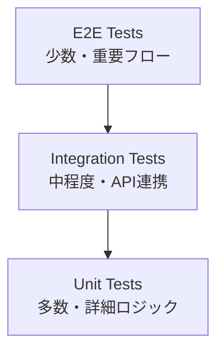

# テスト戦略

## 1. テスト戦略概要

### テストピラミッド


### テスト分類と責任範囲
| テストレベル | 範囲 | ツール | 割合 | 実行頻度 |
|-------------|------|--------|------|----------|
| **Unit** | 関数、コンポーザブル、コンポーネント | Vitest + Vue Test Utils | 70% | 各コミット |
| **Integration** | API連携、ストア統合 | Vitest + MSW | 20% | 各PR |
| **E2E** | ユーザーフロー | Playwright | 10% | リリース前 |

## 2. 単体テスト（Unit Tests）

### 2.1 テスト環境設定
```javascript
// vitest.config.js
import { defineConfig } from 'vitest/config'
import vue from '@vitejs/plugin-vue'
import { resolve } from 'path'

export default defineConfig({
  plugins: [vue()],
  test: {
    globals: true,
    environment: 'jsdom',
    setupFiles: ['./tests/setup.js'],
    coverage: {
      provider: 'v8',
      reporter: ['text', 'json', 'html'],
      exclude: [
        'node_modules/',
        'tests/',
        '**/*.config.js',
        '**/*.d.ts'
      ],
      thresholds: {
        global: {
          branches: 80,
          functions: 80,
          lines: 80,
          statements: 80
        }
      }
    }
  },
  resolve: {
    alias: {
      '@': resolve(__dirname, './src')
    }
  }
})
```

```javascript
// tests/setup.js
import { config } from '@vue/test-utils'
import { vi } from 'vitest'

// Vue Test Utils のグローバル設定
config.global.mocks = {
  $t: (key) => key, // i18n モック
  $router: {
    push: vi.fn(),
    replace: vi.fn(),
    go: vi.fn(),
    back: vi.fn(),
    forward: vi.fn()
  },
  $route: {
    path: '/',
    query: {},
    params: {}
  }
}

// グローバルコンポーネントの登録
config.global.components = {
  'router-link': {
    template: '<a><slot /></a>',
    props: ['to']
  },
  'router-view': {
    template: '<div><slot /></div>'
  }
}

// Supabase モック
vi.mock('@/lib/supabase', () => ({
  supabase: {
    auth: {
      getUser: vi.fn(),
      signInWithPassword: vi.fn(),
      signOut: vi.fn(),
      onAuthStateChange: vi.fn()
    },
    from: vi.fn(() => ({
      select: vi.fn(() => ({
        eq: vi.fn(() => ({
          single: vi.fn()
        }))
      })),
      insert: vi.fn(),
      update: vi.fn(),
      delete: vi.fn()
    }))
  }
}))
```

### 2.2 コンポーネントテスト
```javascript
// tests/components/UserCard.test.js
import { describe, it, expect, vi } from 'vitest'
import { mount } from '@vue/test-utils'
import { createPinia, setActivePinia } from 'pinia'
import UserCard from '@/components/UserCard.vue'

describe('UserCard', () => {
  const mockUser = {
    id: '123',
    name: 'テストユーザー',
    email: 'test@example.com',
    avatar_url: 'https://example.com/avatar.jpg'
  }

  beforeEach(() => {
    setActivePinia(createPinia())
  })

  it('ユーザー情報を正しく表示する', async () => {
    const wrapper = mount(UserCard, {
      props: {
        user: mockUser,
        showActions: true
      }
    })

    // ユーザー名の表示確認
    expect(wrapper.find('[data-testid="user-name"]').text()).toBe(mockUser.name)
    
    // メールアドレスの表示確認
    expect(wrapper.find('[data-testid="user-email"]').text()).toBe(mockUser.email)
    
    // アバター画像の確認
    const avatar = wrapper.find('[data-testid="user-avatar"]')
    expect(avatar.attributes('src')).toBe(mockUser.avatar_url)
    expect(avatar.attributes('alt')).toBe(`${mockUser.name}のアバター`)
  })

  it('アクションボタンが表示される', () => {
    const wrapper = mount(UserCard, {
      props: {
        user: mockUser,
        showActions: true
      }
    })

    expect(wrapper.find('[data-testid="edit-button"]').exists()).toBe(true)
    expect(wrapper.find('[data-testid="delete-button"]').exists()).toBe(true)
  })

  it('showActions=falseの場合、アクションボタンが非表示', () => {
    const wrapper = mount(UserCard, {
      props: {
        user: mockUser,
        showActions: false
      }
    })

    expect(wrapper.find('[data-testid="edit-button"]').exists()).toBe(false)
    expect(wrapper.find('[data-testid="delete-button"]').exists()).toBe(false)
  })

  it('編集ボタンクリック時にemitが発火する', async () => {
    const wrapper = mount(UserCard, {
      props: {
        user: mockUser,
        showActions: true
      }
    })

    await wrapper.find('[data-testid="edit-button"]').trigger('click')
    
    expect(wrapper.emitted('edit')).toBeTruthy()
    expect(wrapper.emitted('edit')[0]).toEqual([mockUser])
  })

  it('削除ボタンクリック時に確認ダイアログが表示される', async () => {
    const confirmSpy = vi.spyOn(window, 'confirm').mockReturnValue(true)
    
    const wrapper = mount(UserCard, {
      props: {
        user: mockUser,
        showActions: true
      }
    })

    await wrapper.find('[data-testid="delete-button"]').trigger('click')
    
    expect(confirmSpy).toHaveBeenCalledWith('本当に削除しますか？')
    expect(wrapper.emitted('delete')).toBeTruthy()
    
    confirmSpy.mockRestore()
  })

  it('アバター画像がない場合はデフォルト画像を表示', () => {
    const userWithoutAvatar = { ...mockUser, avatar_url: null }
    
    const wrapper = mount(UserCard, {
      props: {
        user: userWithoutAvatar
      }
    })

    const avatar = wrapper.find('[data-testid="user-avatar"]')
    expect(avatar.attributes('src')).toBe('/default-avatar.png')
  })
})
```

### 2.3 コンポーザブルテスト
```javascript
// tests/composables/useAuth.test.js
import { describe, it, expect, vi, beforeEach } from 'vitest'
import { useAuth } from '@/composables/useAuth'
import { createPinia, setActivePinia } from 'pinia'

// Supabase モック
const mockSupabase = {
  auth: {
    getUser: vi.fn(),
    signInWithPassword: vi.fn(),
    signOut: vi.fn(),
    onAuthStateChange: vi.fn()
  }
}

vi.mock('@/lib/supabase', () => ({
  supabase: mockSupabase
}))

describe('useAuth', () => {
  beforeEach(() => {
    setActivePinia(createPinia())
    vi.clearAllMocks()
  })

  it('初期状態では未ログイン', () => {
    const { user, isLoggedIn, loading } = useAuth()
    
    expect(user.value).toBeNull()
    expect(isLoggedIn.value).toBe(false)
    expect(loading.value).toBe(false)
  })

  it('ログイン成功時にユーザー状態が更新される', async () => {
    const mockUser = {
      id: '123',
      email: 'test@example.com'
    }

    mockSupabase.auth.signInWithPassword.mockResolvedValue({
      data: { user: mockUser },
      error: null
    })

    const { login, user, isLoggedIn } = useAuth()
    
    const result = await login({
      email: 'test@example.com',
      password: 'password123'
    })

    expect(result.success).toBe(true)
    expect(user.value).toEqual(mockUser)
    expect(isLoggedIn.value).toBe(true)
  })

  it('ログイン失敗時にエラーが返される', async () => {
    const mockError = { message: 'Invalid credentials' }

    mockSupabase.auth.signInWithPassword.mockResolvedValue({
      data: { user: null },
      error: mockError
    })

    const { login, user, isLoggedIn } = useAuth()
    
    const result = await login({
      email: 'test@example.com',
      password: 'wrongpassword'
    })

    expect(result.success).toBe(false)
    expect(result.error).toBe(mockError.message)
    expect(user.value).toBeNull()
    expect(isLoggedIn.value).toBe(false)
  })

  it('ログアウト時にユーザー状態がクリアされる', async () => {
    const { logout, user, isLoggedIn } = useAuth()
    
    // 初期ログイン状態を設定
    const mockUser = { id: '123', email: 'test@example.com' }
    user.value = mockUser

    mockSupabase.auth.signOut.mockResolvedValue({ error: null })

    await logout()

    expect(user.value).toBeNull()
    expect(isLoggedIn.value).toBe(false)
  })
})
```

### 2.4 ストアテスト
```javascript
// tests/stores/posts.test.js
import { describe, it, expect, vi, beforeEach } from 'vitest'
import { setActivePinia, createPinia } from 'pinia'
import { usePostsStore } from '@/stores/posts'

// API モック
const mockPostsApi = {
  getAll: vi.fn(),
  getById: vi.fn(),
  create: vi.fn(),
  update: vi.fn(),
  delete: vi.fn()
}

vi.mock('@/lib/supabase/posts', () => ({
  postsApi: mockPostsApi
}))

describe('Posts Store', () => {
  let postsStore

  beforeEach(() => {
    setActivePinia(createPinia())
    postsStore = usePostsStore()
    vi.clearAllMocks()
  })

  it('初期状態が正しく設定されている', () => {
    expect(postsStore.posts).toEqual([])
    expect(postsStore.currentPost).toBeNull()
    expect(postsStore.loading).toBe(false)
    expect(postsStore.error).toBeNull()
  })

  it('fetchPosts成功時に投稿一覧が更新される', async () => {
    const mockPosts = [
      { id: '1', title: 'Post 1' },
      { id: '2', title: 'Post 2' }
    ]

    mockPostsApi.getAll.mockResolvedValue({
      success: true,
      data: mockPosts,
      error: null
    })

    await postsStore.fetchPosts()

    expect(postsStore.posts).toEqual(mockPosts)
    expect(postsStore.loading).toBe(false)
    expect(postsStore.error).toBeNull()
  })

  it('fetchPosts失敗時にエラーが設定される', async () => {
    const errorMessage = 'Failed to fetch posts'

    mockPostsApi.getAll.mockResolvedValue({
      success: false,
      data: null,
      error: errorMessage
    })

    await postsStore.fetchPosts()

    expect(postsStore.posts).toEqual([])
    expect(postsStore.error).toBe(errorMessage)
    expect(postsStore.loading).toBe(false)
  })

  it('createPost成功時に投稿が追加される', async () => {
    const newPost = { id: '3', title: 'New Post' }

    mockPostsApi.create.mockResolvedValue({
      success: true,
      data: newPost,
      error: null
    })

    const result = await postsStore.createPost({
      title: 'New Post',
      content: 'Content'
    })

    expect(result.success).toBe(true)
    expect(postsStore.posts).toContain(newPost)
  })

  it('ゲッターが正しく動作する', () => {
    postsStore.posts = [
      { id: '1', title: 'Post 1', status: 'published' },
      { id: '2', title: 'Post 2', status: 'draft' },
      { id: '3', title: 'Post 3', status: 'published' }
    ]

    expect(postsStore.publishedPosts).toHaveLength(2)
    expect(postsStore.draftPosts).toHaveLength(1)
    expect(postsStore.totalPosts).toBe(3)
  })
})
```

## 3. 統合テスト（Integration Tests）

### 3.1 API統合テスト
```javascript
// tests/integration/api.test.js
import { describe, it, expect, beforeAll, afterAll, beforeEach } from 'vitest'
import { setupServer } from 'msw/node'
import { rest } from 'msw'
import { postsApi } from '@/lib/supabase/posts'

// MSW サーバーセットアップ
const server = setupServer(
  rest.get('*/rest/v1/posts', (req, res, ctx) => {
    return res(
      ctx.json([
        { id: '1', title: 'Test Post 1', status: 'published' },
        { id: '2', title: 'Test Post 2', status: 'published' }
      ])
    )
  }),

  rest.post('*/rest/v1/posts', (req, res, ctx) => {
    const body = req.body
    return res(
      ctx.json({
        id: '3',
        ...body,
        created_at: new Date().toISOString()
      })
    )
  }),

  rest.patch('*/rest/v1/posts', (req, res, ctx) => {
    return res(
      ctx.json({
        id: '1',
        title: 'Updated Post',
        updated_at: new Date().toISOString()
      })
    )
  })
)

describe('Posts API Integration', () => {
  beforeAll(() => server.listen())
  afterEach(() => server.resetHandlers())
  afterAll(() => server.close())

  it('投稿一覧を取得できる', async () => {
    const response = await postsApi.getAll()

    expect(response.success).toBe(true)
    expect(response.data).toHaveLength(2)
    expect(response.data[0]).toHaveProperty('title', 'Test Post 1')
  })

  it('新しい投稿を作成できる', async () => {
    const postData = {
      title: 'New Test Post',
      content: 'Test content',
      status: 'draft'
    }

    const response = await postsApi.create(postData)

    expect(response.success).toBe(true)
    expect(response.data).toHaveProperty('title', postData.title)
    expect(response.data).toHaveProperty('id')
  })

  it('投稿を更新できる', async () => {
    const updates = {
      title: 'Updated Post'
    }

    const response = await postsApi.update('1', updates)

    expect(response.success).toBe(true)
    expect(response.data).toHaveProperty('title', 'Updated Post')
  })

  it('APIエラー時に適切なエラーレスポンスを返す', async () => {
    server.use(
      rest.get('*/rest/v1/posts', (req, res, ctx) => {
        return res(ctx.status(500), ctx.json({ message: 'Server error' }))
      })
    )

    const response = await postsApi.getAll()

    expect(response.success).toBe(false)
    expect(response.error).toBeDefined()
  })
})
```

### 3.2 ストア統合テスト
```javascript
// tests/integration/store-api.test.js
import { describe, it, expect, beforeEach } from 'vitest'
import { setActivePinia, createPinia } from 'pinia'
import { usePostsStore } from '@/stores/posts'
import { useAuthStore } from '@/stores/auth'

describe('Store API Integration', () => {
  let postsStore, authStore

  beforeEach(() => {
    setActivePinia(createPinia())
    postsStore = usePostsStore()
    authStore = useAuthStore()
  })

  it('認証後に投稿を作成できる', async () => {
    // 認証
    await authStore.login({
      email: 'test@example.com',
      password: 'password123'
    })

    expect(authStore.isLoggedIn).toBe(true)

    // 投稿作成
    const result = await postsStore.createPost({
      title: 'Test Post',
      content: 'Test content'
    })

    expect(result.success).toBe(true)
    expect(postsStore.posts).toContainEqual(
      expect.objectContaining({ title: 'Test Post' })
    )
  })

  it('未認証時は投稿作成が失敗する', async () => {
    expect(authStore.isLoggedIn).toBe(false)

    const result = await postsStore.createPost({
      title: 'Test Post',
      content: 'Test content'
    })

    expect(result.success).toBe(false)
    expect(result.error).toContain('認証が必要')
  })
})
```

## 4. E2Eテスト（End-to-End Tests）

### 4.1 Playwright設定
```javascript
// playwright.config.js
import { defineConfig, devices } from '@playwright/test'

export default defineConfig({
  testDir: './tests/e2e',
  fullyParallel: true,
  forbidOnly: !!process.env.CI,
  retries: process.env.CI ? 2 : 0,
  workers: process.env.CI ? 1 : undefined,
  reporter: 'html',
  use: {
    baseURL: 'http://localhost:3000',
    trace: 'on-first-retry',
    screenshot: 'only-on-failure'
  },
  projects: [
    {
      name: 'chromium',
      use: { ...devices['Desktop Chrome'] }
    },
    {
      name: 'firefox',
      use: { ...devices['Desktop Firefox'] }
    },
    {
      name: 'webkit',
      use: { ...devices['Desktop Safari'] }
    },
    {
      name: 'Mobile Chrome',
      use: { ...devices['Pixel 5'] }
    }
  ],
  webServer: {
    command: 'npm run dev',
    url: 'http://localhost:3000',
    reuseExistingServer: !process.env.CI
  }
})
```

### 4.2 認証フローテスト
```javascript
// tests/e2e/auth.spec.js
import { test, expect } from '@playwright/test'

test.describe('認証フロー', () => {
  test('ログイン -> ダッシュボード -> ログアウト', async ({ page }) => {
    // ログインページへ移動
    await page.goto('/auth/login')
    
    // ログインフォーム入力
    await page.fill('[data-testid="email-input"]', 'test@example.com')
    await page.fill('[data-testid="password-input"]', 'password123')
    await page.click('[data-testid="login-button"]')

    // ダッシュボードに遷移することを確認
    await expect(page).toHaveURL('/dashboard')
    await expect(page.locator('h1')).toContainText('ダッシュボード')

    // ユーザーメニューを開く
    await page.click('[data-testid="user-menu"]')
    
    // ログアウトボタンをクリック
    await page.click('[data-testid="logout-button"]')

    // ホームページに遷移することを確認
    await expect(page).toHaveURL('/')
  })

  test('無効な認証情報でログインが失敗する', async ({ page }) => {
    await page.goto('/auth/login')
    
    await page.fill('[data-testid="email-input"]', 'invalid@example.com')
    await page.fill('[data-testid="password-input"]', 'wrongpassword')
    await page.click('[data-testid="login-button"]')

    // エラーメッセージが表示されることを確認
    await expect(page.locator('[data-testid="error-message"]'))
      .toContainText('ログイン情報が正しくありません')
  })

  test('パスワードリセットフロー', async ({ page }) => {
    await page.goto('/auth/forgot-password')
    
    await page.fill('[data-testid="email-input"]', 'test@example.com')
    await page.click('[data-testid="reset-button"]')

    // 成功メッセージが表示されることを確認
    await expect(page.locator('[data-testid="success-message"]'))
      .toContainText('パスワードリセットメールを送信しました')
  })
})
```

### 4.3 投稿作成フローテスト
```javascript
// tests/e2e/posts.spec.js
import { test, expect } from '@playwright/test'

// 認証済みユーザーでテストを実行
test.use({ storageState: 'tests/auth-storage.json' })

test.describe('投稿管理', () => {
  test('新規投稿作成フロー', async ({ page }) => {
    // 投稿作成ページへ移動
    await page.goto('/dashboard/posts/create')

    // 投稿フォーム入力
    await page.fill('[data-testid="title-input"]', 'テスト投稿')
    await page.fill('[data-testid="content-editor"]', 'これはテスト投稿の内容です。')
    
    // タグを追加
    await page.fill('[data-testid="tags-input"]', 'テスト,JavaScript')
    await page.press('[data-testid="tags-input"]', 'Enter')

    // 下書き保存
    await page.click('[data-testid="save-draft-button"]')

    // 成功通知を確認
    await expect(page.locator('.notification.success'))
      .toContainText('下書きを保存しました')

    // 投稿一覧ページで確認
    await page.goto('/dashboard/posts')
    await expect(page.locator('[data-testid="posts-list"]'))
      .toContainText('テスト投稿')
  })

  test('投稿公開フロー', async ({ page }) => {
    // 下書き投稿を公開状態に変更
    await page.goto('/dashboard/posts')
    
    // 投稿を選択
    await page.click('[data-testid="post-item"]:first-child')
    
    // 編集ページで公開設定
    await page.selectOption('[data-testid="status-select"]', 'published')
    await page.click('[data-testid="save-button"]')

    // 公開投稿ページで確認
    await page.goto('/posts')
    await expect(page.locator('[data-testid="published-posts"]'))
      .toContainText('テスト投稿')
  })

  test('投稿検索機能', async ({ page }) => {
    await page.goto('/posts')
    
    // 検索フォームに入力
    await page.fill('[data-testid="search-input"]', 'JavaScript')
    await page.press('[data-testid="search-input"]', 'Enter')

    // 検索結果を確認
    await expect(page.locator('[data-testid="search-results"]'))
      .toContainText('JavaScript')
  })

  test('レスポンシブデザイン確認', async ({ page }) => {
    // モバイルビューポートに変更
    await page.setViewportSize({ width: 375, height: 667 })
    
    await page.goto('/posts')
    
    // モバイルメニューが表示されることを確認
    await expect(page.locator('[data-testid="mobile-menu-button"]'))
      .toBeVisible()
    
    // デスクトップメニューが非表示であることを確認
    await expect(page.locator('[data-testid="desktop-menu"]'))
      .toBeHidden()
  })
})
```

## 5. テストユーティリティ

### 5.1 テストヘルパー関数
```javascript
// tests/helpers/index.js

/**
 * テスト用ユーザーデータを生成
 * @param {Partial<User>} overrides - 上書きプロパティ
 * @returns {User}
 */
export function createMockUser(overrides = {}) {
  return {
    id: crypto.randomUUID(),
    email: 'test@example.com',
    name: 'テストユーザー',
    avatar_url: 'https://example.com/avatar.jpg',
    created_at: new Date().toISOString(),
    updated_at: new Date().toISOString(),
    ...overrides
  }
}

/**
 * テスト用投稿データを生成
 * @param {Partial<Post>} overrides - 上書きプロパティ
 * @returns {Post}
 */
export function createMockPost(overrides = {}) {
  return {
    id: crypto.randomUUID(),
    user_id: crypto.randomUUID(),
    title: 'テスト投稿',
    content: 'テスト投稿の内容です。',
    excerpt: 'テスト投稿の抜粋',
    status: 'published',
    tags: ['テスト'],
    view_count: 0,
    like_count: 0,
    published_at: new Date().toISOString(),
    created_at: new Date().toISOString(),
    updated_at: new Date().toISOString(),
    ...overrides
  }
}

/**
 * Vue コンポーネントのマウントヘルパー
 * @param {Component} component - コンポーネント
 * @param {Object} options - マウントオプション
 * @returns {VueWrapper}
 */
export function mountComponent(component, options = {}) {
  return mount(component, {
    global: {
      plugins: [createPinia()],
      mocks: {
        $t: (key) => key,
        $router: { push: vi.fn() },
        $route: { path: '/', query: {}, params: {} }
      },
      ...options.global
    },
    ...options
  })
}

/**
 * 非同期処理の完了を待つ
 * @param {number} ms - 待機時間（ミリ秒）
 */
export function sleep(ms = 0) {
  return new Promise(resolve => setTimeout(resolve, ms))
}

/**
 * DOM の更新を待つ
 * @param {VueWrapper} wrapper - Vue ラッパー
 */
export async function waitForUpdate(wrapper) {
  await wrapper.vm.$nextTick()
  await sleep(10)
}
```

### 5.2 カスタムマッチャー
```javascript
// tests/matchers/index.js
import { expect } from 'vitest'

// カスタムマッチャーを追加
expect.extend({
  toBeValidEmail(received) {
    const emailRegex = /^[^\s@]+@[^\s@]+\.[^\s@]+$/
    const pass = emailRegex.test(received)
    
    return {
      pass,
      message: () => 
        pass
          ? `Expected ${received} not to be a valid email`
          : `Expected ${received} to be a valid email`
    }
  },

  toHaveValidUser(received) {
    const requiredFields = ['id', 'email', 'created_at']
    const missingFields = requiredFields.filter(field => !received[field])
    const pass = missingFields.length === 0

    return {
      pass,
      message: () =>
        pass
          ? `Expected user object not to be valid`
          : `Expected user object to be valid, missing fields: ${missingFields.join(', ')}`
    }
  },

  toBeWithinTimeRange(received, expected, tolerance = 1000) {
    const receivedTime = new Date(received).getTime()
    const expectedTime = new Date(expected).getTime()
    const diff = Math.abs(receivedTime - expectedTime)
    const pass = diff <= tolerance

    return {
      pass,
      message: () =>
        pass
          ? `Expected ${received} not to be within ${tolerance}ms of ${expected}`
          : `Expected ${received} to be within ${tolerance}ms of ${expected}, but was ${diff}ms apart`
    }
  }
})
```

## 6. CI/CD でのテスト実行

### 6.1 GitHub Actions 設定
```yaml
# .github/workflows/test.yml
name: Test

on:
  push:
    branches: [main, develop]
  pull_request:
    branches: [main]

jobs:
  unit-tests:
    runs-on: ubuntu-latest
    steps:
      - uses: actions/checkout@v3
      
      - name: Setup Node.js
        uses: actions/setup-node@v3
        with:
          node-version: '18'
          cache: 'npm'
      
      - name: Install dependencies
        run: npm ci
      
      - name: Run unit tests
        run: npm run test:unit -- --coverage
      
      - name: Upload coverage reports
        uses: codecov/codecov-action@v3
        with:
          file: ./coverage/coverage-final.json

  e2e-tests:
    runs-on: ubuntu-latest
    steps:
      - uses: actions/checkout@v3
      
      - name: Setup Node.js
        uses: actions/setup-node@v3
        with:
          node-version: '18'
          cache: 'npm'
      
      - name: Install dependencies
        run: npm ci
      
      - name: Install Playwright
        run: npx playwright install --with-deps
      
      - name: Start Supabase
        run: npx supabase start
      
      - name: Run E2E tests
        run: npm run test:e2e
      
      - name: Upload test results
        uses: actions/upload-artifact@v3
        if: always()
        with:
          name: playwright-report
          path: playwright-report/
```

### 6.2 テストコマンド
```json
{
  "scripts": {
    "test": "vitest",
    "test:unit": "vitest run --reporter=verbose",
    "test:watch": "vitest --watch",
    "test:coverage": "vitest run --coverage",
    "test:e2e": "playwright test",
    "test:e2e:ui": "playwright test --ui",
    "test:e2e:debug": "playwright test --debug",
    "test:all": "npm run test:unit && npm run test:e2e"
  }
}
```

## 7. テスト品質管理

### 7.1 カバレッジ目標
- **行カバレッジ**: 80%以上
- **分岐カバレッジ**: 80%以上
- **関数カバレッジ**: 80%以上
- **クリティカルパス**: 100%

### 7.2 テストレビューチェックリスト
- [ ] テストケース名が明確で理解しやすい
- [ ] AAA（Arrange, Act, Assert）パターンに従っている
- [ ] エッジケースとエラーケースをカバーしている
- [ ] テストが独立して実行可能
- [ ] モックやスタブが適切に使用されている
- [ ] 非同期処理が正しくテストされている
- [ ] UIテストではユーザーの操作を適切にシミュレート

## 8. まとめ

このテスト戦略の特徴：

1. **包括的カバレッジ**: Unit → Integration → E2E の3層テスト
2. **実用的ツール**: Vitest、Vue Test Utils、Playwright の組み合わせ
3. **CI/CD統合**: 自動化されたテスト実行とカバレッジ測定
4. **品質保証**: 明確な品質基準とレビュープロセス
5. **保守性**: 再利用可能なヘルパーとモック管理

### 関連ドキュメント
- [アーキテクチャ設計](./01_architecture_design.md)
- [コンポーネント設計](./04_component_design.md)
- [状態管理設計](./05_state_management_design.md)
- [エラーハンドリング設計](./07_error_handling_design.md)