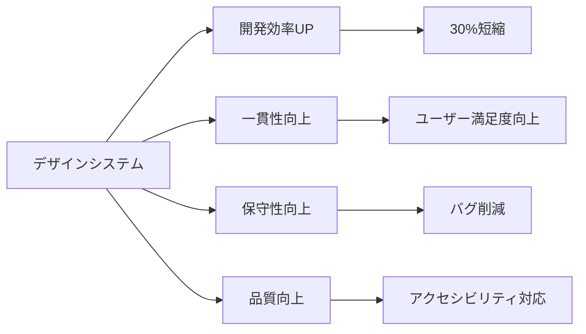

# デザインシステム概要

## 📚 関連ドキュメント

このデザインシステムの詳細な実装方法については、以下のドキュメントを参照してください：

- **[⚙️ Tailwind CSS設定ガイド](./01_tailwind_config.md)** - CSS設定とカスタマイズ方法
- **[🧩 DaisyUIコンポーネント活用ガイド](./02_daisyui_components.md)** - コンポーネント実装パターン  
- **[🔧 Vueコンポーネント設計パターン](./03_vue_component_patterns.md)** - 高度な実装パターンとベストプラクティス
- **[🎨 デザイントークンリファレンス](./04_design_tokens.md)** - トークンの詳細仕様

### 実装順序の推奨

1. **基盤設定**: [Tailwind設定](./01_tailwind_config.md)でカスタムテーマを構築
2. **コンポーネント実装**: [DaisyUIガイド](./02_daisyui_components.md)で基本コンポーネントを作成
3. **高度なパターン**: [Vueパターン](./03_vue_component_patterns.md)で複雑な機能を実装
4. **品質向上**: このデザインシステムガイドでブランド統一性を確保

## 1. デザインシステムの目的と価値

### 目的
1. **一貫性の確保**: 全体を通じた統一されたユーザー体験
2. **効率性の向上**: 再利用可能なコンポーネントによる開発速度向上
3. **品質の維持**: デザイン原則に基づいた高品質なUI実装
4. **スケーラビリティ**: チーム拡大に対応する設計システム

### 価値提案


## 2. ブランドアイデンティティ

### 2.1 ブランドコンセプト
```yaml
ブランドキーワード:
  - モダン: 最新技術に基づいた洗練されたデザイン
  - 親しみやすい: 誰でも使いやすいインターフェース
  - 信頼できる: 安心して使えるサービス品質
  - 効率的: 素早く目的を達成できる操作性

ブランドパーソナリティ:
  - プロフェッショナル: 85%
  - フレンドリー: 75%
  - イノベーティブ: 80%
  - 信頼性: 90%
```

### 2.2 ロゴとアイデンティティ
```css
/* ロゴ仕様 */
.logo {
  /* プライマリロゴ */
  --logo-primary: url('/assets/logo-primary.svg');
  --logo-width: 180px;
  --logo-height: 40px;
  
  /* セカンダリロゴ（アイコンのみ） */
  --logo-icon: url('/assets/logo-icon.svg');
  --logo-icon-size: 32px;
  
  /* 最小使用サイズ */
  --logo-min-width: 120px;
  --logo-min-height: 26px;
}

/* ロゴの使用例 */
.header-logo {
  width: var(--logo-width);
  height: var(--logo-height);
  background-image: var(--logo-primary);
  background-size: contain;
  background-repeat: no-repeat;
}

/* アイコンロゴ */
.favicon {
  width: var(--logo-icon-size);
  height: var(--logo-icon-size);
  background-image: var(--logo-icon);
}
```

## 3. カラーシステム

### 3.1 プライマリカラー
```css
:root {
  /* ブランドカラー */
  --color-primary-50: #eff6ff;
  --color-primary-100: #dbeafe;
  --color-primary-200: #bfdbfe;
  --color-primary-300: #93c5fd;
  --color-primary-400: #60a5fa;
  --color-primary-500: #3b82f6;  /* メインブランドカラー */
  --color-primary-600: #2563eb;
  --color-primary-700: #1d4ed8;
  --color-primary-800: #1e40af;
  --color-primary-900: #1e3a8a;
  --color-primary-950: #172554;
}
```

### 3.2 セマンティックカラー
```css
:root {
  /* 成功 */
  --color-success-50: #f0fdf4;
  --color-success-500: #22c55e;
  --color-success-600: #16a34a;
  --color-success-700: #15803d;

  /* 警告 */
  --color-warning-50: #fffbeb;
  --color-warning-500: #f59e0b;
  --color-warning-600: #d97706;
  --color-warning-700: #b45309;

  /* エラー */
  --color-error-50: #fef2f2;
  --color-error-500: #ef4444;
  --color-error-600: #dc2626;
  --color-error-700: #b91c1c;

  /* 情報 */
  --color-info-50: #eff6ff;
  --color-info-500: #3b82f6;
  --color-info-600: #2563eb;
  --color-info-700: #1d4ed8;
}
```

### 3.3 ニュートラルカラー
```css
:root {
  /* グレースケール */
  --color-gray-50: #f9fafb;
  --color-gray-100: #f3f4f6;
  --color-gray-200: #e5e7eb;
  --color-gray-300: #d1d5db;
  --color-gray-400: #9ca3af;
  --color-gray-500: #6b7280;
  --color-gray-600: #4b5563;
  --color-gray-700: #374151;
  --color-gray-800: #1f2937;
  --color-gray-900: #111827;
  --color-gray-950: #030712;

  /* テキストカラー */
  --color-text-primary: var(--color-gray-900);
  --color-text-secondary: var(--color-gray-600);
  --color-text-tertiary: var(--color-gray-400);
  --color-text-inverse: #ffffff;

  /* 背景カラー */
  --color-bg-primary: #ffffff;
  --color-bg-secondary: var(--color-gray-50);
  --color-bg-tertiary: var(--color-gray-100);
}
```

### 3.4 ダークモード対応
```css
[data-theme="dark"] {
  /* ダークモード時のカラー調整 */
  --color-text-primary: var(--color-gray-100);
  --color-text-secondary: var(--color-gray-300);
  --color-text-tertiary: var(--color-gray-500);
  --color-text-inverse: var(--color-gray-900);

  --color-bg-primary: var(--color-gray-900);
  --color-bg-secondary: var(--color-gray-800);
  --color-bg-tertiary: var(--color-gray-700);

  /* プライマリカラーの調整 */
  --color-primary-500: #60a5fa;
  --color-primary-600: #3b82f6;
}
```

## 4. タイポグラフィ

### 4.1 フォントファミリー
```css
:root {
  /* 日本語フォント */
  --font-family-sans: 
    "Noto Sans JP", 
    "Hiragino Kaku Gothic ProN", 
    "Hiragino Sans", 
    "Meiryo", 
    sans-serif;

  /* 英語フォント */
  --font-family-sans-en: 
    "Inter", 
    "Helvetica Neue", 
    "Arial", 
    sans-serif;

  /* モノスペースフォント */
  --font-family-mono: 
    "JetBrains Mono", 
    "Fira Code", 
    "Consolas", 
    "Monaco", 
    monospace;

  /* システムフォント */
  --font-family-system: 
    -apple-system, 
    BlinkMacSystemFont, 
    "Segoe UI", 
    Roboto, 
    sans-serif;
}
```

### 4.2 フォントサイズスケール
```css
:root {
  /* Type Scale (1.125 - Major Second) */
  --text-xs: 0.75rem;     /* 12px */
  --text-sm: 0.875rem;    /* 14px */
  --text-base: 1rem;      /* 16px */
  --text-lg: 1.125rem;    /* 18px */
  --text-xl: 1.25rem;     /* 20px */
  --text-2xl: 1.5rem;     /* 24px */
  --text-3xl: 1.875rem;   /* 30px */
  --text-4xl: 2.25rem;    /* 36px */
  --text-5xl: 3rem;       /* 48px */
  --text-6xl: 3.75rem;    /* 60px */
  --text-7xl: 4.5rem;     /* 72px */
  --text-8xl: 6rem;       /* 96px */
  --text-9xl: 8rem;       /* 128px */
}
```

### 4.3 行間とレターススペーシング
```css
:root {
  /* Line Heights */
  --leading-none: 1;
  --leading-tight: 1.25;
  --leading-snug: 1.375;
  --leading-normal: 1.5;
  --leading-relaxed: 1.625;
  --leading-loose: 2;

  /* Letter Spacing */
  --tracking-tighter: -0.05em;
  --tracking-tight: -0.025em;
  --tracking-normal: 0em;
  --tracking-wide: 0.025em;
  --tracking-wider: 0.05em;
  --tracking-widest: 0.1em;
}
```

### 4.4 テキストスタイル定義
```css
/* 見出し */
.text-display-large {
  font-size: var(--text-6xl);
  font-weight: 700;
  line-height: var(--leading-tight);
  letter-spacing: var(--tracking-tight);
}

.text-display-medium {
  font-size: var(--text-4xl);
  font-weight: 600;
  line-height: var(--leading-tight);
  letter-spacing: var(--tracking-tight);
}

.text-display-small {
  font-size: var(--text-3xl);
  font-weight: 600;
  line-height: var(--leading-snug);
}

/* 見出し */
.text-heading-large {
  font-size: var(--text-2xl);
  font-weight: 600;
  line-height: var(--leading-snug);
}

.text-heading-medium {
  font-size: var(--text-xl);
  font-weight: 600;
  line-height: var(--leading-snug);
}

.text-heading-small {
  font-size: var(--text-lg);
  font-weight: 600;
  line-height: var(--leading-snug);
}

/* 本文 */
.text-body-large {
  font-size: var(--text-lg);
  font-weight: 400;
  line-height: var(--leading-relaxed);
}

.text-body-medium {
  font-size: var(--text-base);
  font-weight: 400;
  line-height: var(--leading-normal);
}

.text-body-small {
  font-size: var(--text-sm);
  font-weight: 400;
  line-height: var(--leading-normal);
}

/* ラベル */
.text-label-large {
  font-size: var(--text-base);
  font-weight: 500;
  line-height: var(--leading-normal);
}

.text-label-medium {
  font-size: var(--text-sm);
  font-weight: 500;
  line-height: var(--leading-normal);
}

.text-label-small {
  font-size: var(--text-xs);
  font-weight: 500;
  line-height: var(--leading-normal);
  letter-spacing: var(--tracking-wide);
}
```

## 5. スペーシングシステム

### 5.1 スペーシングスケール
```css
:root {
  /* Spacing Scale (0.25rem = 4px base) */
  --space-0: 0;
  --space-px: 1px;
  --space-0-5: 0.125rem;  /* 2px */
  --space-1: 0.25rem;     /* 4px */
  --space-1-5: 0.375rem;  /* 6px */
  --space-2: 0.5rem;      /* 8px */
  --space-2-5: 0.625rem;  /* 10px */
  --space-3: 0.75rem;     /* 12px */
  --space-3-5: 0.875rem;  /* 14px */
  --space-4: 1rem;        /* 16px */
  --space-5: 1.25rem;     /* 20px */
  --space-6: 1.5rem;      /* 24px */
  --space-7: 1.75rem;     /* 28px */
  --space-8: 2rem;        /* 32px */
  --space-9: 2.25rem;     /* 36px */
  --space-10: 2.5rem;     /* 40px */
  --space-11: 2.75rem;    /* 44px */
  --space-12: 3rem;       /* 48px */
  --space-14: 3.5rem;     /* 56px */
  --space-16: 4rem;       /* 64px */
  --space-20: 5rem;       /* 80px */
  --space-24: 6rem;       /* 96px */
  --space-28: 7rem;       /* 112px */
  --space-32: 8rem;       /* 128px */
}
```

### 5.2 コンポーネント内スペーシング
```css
:root {
  /* Component Spacing */
  --space-component-xs: var(--space-1);   /* 4px */
  --space-component-sm: var(--space-2);   /* 8px */
  --space-component-md: var(--space-4);   /* 16px */
  --space-component-lg: var(--space-6);   /* 24px */
  --space-component-xl: var(--space-8);   /* 32px */

  /* Layout Spacing */
  --space-layout-xs: var(--space-4);      /* 16px */
  --space-layout-sm: var(--space-6);      /* 24px */
  --space-layout-md: var(--space-8);      /* 32px */
  --space-layout-lg: var(--space-12);     /* 48px */
  --space-layout-xl: var(--space-16);     /* 64px */
  --space-layout-2xl: var(--space-24);    /* 96px */
}
```

## 6. アイコンシステム

### 6.1 アイコンライブラリ
```javascript
// lib/icons/index.js
import {
  HomeIcon,
  UserIcon,
  CogIcon,
  PlusIcon,
  PencilIcon,
  TrashIcon,
  HeartIcon,
  ChatBubbleLeftIcon,
  EyeIcon,
  ShareIcon,
  BookmarkIcon,
  BellIcon,
  SearchIcon,
  Bars3Icon as MenuIcon,
  XMarkIcon,
  CheckIcon,
  ExclamationTriangleIcon,
  InformationCircleIcon
} from '@heroicons/vue/24/outline'

import {
  HomeIcon as HomeIconSolid,
  UserIcon as UserIconSolid,
  HeartIcon as HeartIconSolid,
  BellIcon as BellIconSolid,
  CheckIcon as CheckIconSolid
} from '@heroicons/vue/24/solid'

export const icons = {
  // ナビゲーション
  home: HomeIcon,
  user: UserIcon,
  settings: CogIcon,
  menu: MenuIcon,
  search: SearchIcon,
  
  // アクション
  plus: PlusIcon,
  edit: PencilIcon,
  delete: TrashIcon,
  close: XMarkIcon,
  check: CheckIcon,
  
  // インタラクション
  heart: HeartIcon,
  comment: ChatBubbleLeftIcon,
  view: EyeIcon,
  share: ShareIcon,
  bookmark: BookmarkIcon,
  bell: BellIcon,
  
  // ステータス
  success: CheckIcon,
  warning: ExclamationTriangleIcon,
  info: InformationCircleIcon,
  error: XMarkIcon,

  // Solid バリアント
  'home-solid': HomeIconSolid,
  'user-solid': UserIconSolid,
  'heart-solid': HeartIconSolid,
  'bell-solid': BellIconSolid,
  'success-solid': CheckIconSolid
}

// アイコンカテゴリー定義
export const iconCategories = {
  navigation: ['home', 'user', 'settings', 'menu', 'search'],
  actions: ['plus', 'edit', 'delete', 'close', 'check'],
  interactions: ['heart', 'comment', 'view', 'share', 'bookmark', 'bell'],
  status: ['success', 'warning', 'info', 'error']
}

// アイコンサイズ定義
export const iconSizes = {
  xs: 'w-3 h-3',      // 12px
  sm: 'w-4 h-4',      // 16px
  md: 'w-5 h-5',      // 20px
  lg: 'w-6 h-6',      // 24px
  xl: 'w-8 h-8',      // 32px
  '2xl': 'w-10 h-10'  // 40px
}
```

### 6.2 アイコンコンポーネント
```vue
<!-- components/common/Icon.vue -->
<template>
  <component
    :is="iconComponent"
    :class="iconClasses"
    :aria-label="ariaLabel"
    :aria-hidden="ariaHidden"
  />
</template>

<script setup>
import { computed } from 'vue'
import { icons, iconSizes } from '@/lib/icons'

const props = defineProps({
  /** アイコン名 */
  name: {
    type: String,
    required: true,
    validator: (value) => Object.keys(icons).includes(value)
  },
  /** アイコンサイズ */
  size: {
    type: String,
    default: 'md',
    validator: (value) => Object.keys(iconSizes).includes(value)
  },
  /** カスタムクラス */
  class: {
    type: String,
    default: ''
  },
  /** アリアラベル */
  ariaLabel: {
    type: String,
    default: null
  },
  /** カラーバリアント */
  color: {
    type: String,
    default: 'current',
    validator: (value) => ['current', 'primary', 'secondary', 'success', 'warning', 'error'].includes(value)
  }
})

const iconComponent = computed(() => {
  const icon = icons[props.name]
  if (!icon) {
    console.warn(`アイコン "${props.name}" が見つかりません`)
    return icons.info // フォールバックアイコン
  }
  return icon
})

const iconClasses = computed(() => {
  const classes = ['inline-block', 'flex-shrink-0']
  
  // サイズクラス
  classes.push(iconSizes[props.size])
  
  // カラークラス
  if (props.color !== 'current') {
    const colorMap = {
      primary: 'text-primary',
      secondary: 'text-secondary',
      success: 'text-success',
      warning: 'text-warning',
      error: 'text-error'
    }
    classes.push(colorMap[props.color])
  }
  
  // カスタムクラス
  if (props.class) {
    classes.push(props.class)
  }
  
  return classes.join(' ')
})

const ariaHidden = computed(() => {
  return props.ariaLabel ? 'false' : 'true'
})
</script>
```

### 6.3 アイコン使用例
```vue
<!-- 基本的な使用例 -->
<template>
  <div class="icon-examples">
    <!-- 基本使用 -->
    <Icon name="home" size="md" />
    
    <!-- カラーバリアント -->
    <Icon name="success" color="success" size="lg" />
    <Icon name="warning" color="warning" size="lg" />
    <Icon name="error" color="error" size="lg" />
    
    <!-- ボタン内での使用 -->
    <button class="btn btn-primary">
      <Icon name="plus" size="sm" class="mr-2" />
      新規追加
    </button>
    
    <!-- アラート内での使用 -->
    <div class="alert alert-success">
      <Icon name="success-solid" color="success" />
      <span>操作が完了しました</span>
    </div>
    
    <!-- ナビゲーション内での使用 -->
    <nav class="menu">
      <li>
        <a href="/dashboard">
          <Icon name="home" size="sm" />
          ダッシュボード
        </a>
      </li>
      <li>
        <a href="/users">
          <Icon name="user" size="sm" />
          ユーザー管理
        </a>
      </li>
    </nav>
  </div>
</template>
```

### 6.4 アイコンライブラリユーティリティ
```javascript
// composables/useIcon.js
import { computed } from 'vue'
import { icons, iconCategories } from '@/lib/icons'

export function useIcon() {
  // アイコンの存在チェック
  const hasIcon = (name) => {
    return Object.keys(icons).includes(name)
  }
  
  // カテゴリー別アイコン取得
  const getIconsByCategory = (category) => {
    return iconCategories[category] || []
  }
  
  // アイコン検索
  const searchIcons = (query) => {
    const lowerQuery = query.toLowerCase()
    return Object.keys(icons).filter(name => 
      name.toLowerCase().includes(lowerQuery)
    )
  }
  
  // 全アイコンリスト
  const allIcons = computed(() => Object.keys(icons))
  
  // カテゴリーリスト
  const categories = computed(() => Object.keys(iconCategories))
  
  return {
    hasIcon,
    getIconsByCategory,
    searchIcons,
    allIcons,
    categories
  }
}
```

## 7. エレベーション（影）システム

### 7.1 影の定義
```css
:root {
  /* Shadow System */
  --shadow-xs: 0 1px 2px 0 rgb(0 0 0 / 0.05);
  --shadow-sm: 0 1px 3px 0 rgb(0 0 0 / 0.1), 0 1px 2px -1px rgb(0 0 0 / 0.1);
  --shadow-md: 0 4px 6px -1px rgb(0 0 0 / 0.1), 0 2px 4px -2px rgb(0 0 0 / 0.1);
  --shadow-lg: 0 10px 15px -3px rgb(0 0 0 / 0.1), 0 4px 6px -4px rgb(0 0 0 / 0.1);
  --shadow-xl: 0 20px 25px -5px rgb(0 0 0 / 0.1), 0 8px 10px -6px rgb(0 0 0 / 0.1);
  --shadow-2xl: 0 25px 50px -12px rgb(0 0 0 / 0.25);
  --shadow-inner: inset 0 2px 4px 0 rgb(0 0 0 / 0.05);

  /* Colored Shadows */
  --shadow-primary: 0 4px 6px -1px rgb(59 130 246 / 0.1), 
                    0 2px 4px -2px rgb(59 130 246 / 0.1);
  --shadow-success: 0 4px 6px -1px rgb(34 197 94 / 0.1), 
                    0 2px 4px -2px rgb(34 197 94 / 0.1);
  --shadow-warning: 0 4px 6px -1px rgb(245 158 11 / 0.1), 
                    0 2px 4px -2px rgb(245 158 11 / 0.1);
  --shadow-error: 0 4px 6px -1px rgb(239 68 68 / 0.1), 
                  0 2px 4px -2px rgb(239 68 68 / 0.1);
}

/* Elevation Classes */
.elevation-0 { box-shadow: none; }
.elevation-1 { box-shadow: var(--shadow-xs); }
.elevation-2 { box-shadow: var(--shadow-sm); }
.elevation-3 { box-shadow: var(--shadow-md); }
.elevation-4 { box-shadow: var(--shadow-lg); }
.elevation-5 { box-shadow: var(--shadow-xl); }
.elevation-6 { box-shadow: var(--shadow-2xl); }
```

## 8. ボーダーラディウス

### 8.1 角丸システム
```css
:root {
  /* Border Radius Scale */
  --radius-none: 0px;
  --radius-xs: 0.125rem;     /* 2px */
  --radius-sm: 0.25rem;      /* 4px */
  --radius-md: 0.375rem;     /* 6px */
  --radius-lg: 0.5rem;       /* 8px */
  --radius-xl: 0.75rem;      /* 12px */
  --radius-2xl: 1rem;        /* 16px */
  --radius-3xl: 1.5rem;      /* 24px */
  --radius-full: 9999px;     /* Full rounded */

  /* Component Specific Radius */
  --radius-button: var(--radius-md);
  --radius-card: var(--radius-lg);
  --radius-modal: var(--radius-xl);
  --radius-input: var(--radius-md);
  --radius-badge: var(--radius-full);
}
```

## 9. アニメーションシステム

### 9.1 イージング関数
```css
:root {
  /* Easing Functions */
  --ease-linear: linear;
  --ease-in: cubic-bezier(0.4, 0, 1, 1);
  --ease-out: cubic-bezier(0, 0, 0.2, 1);
  --ease-in-out: cubic-bezier(0.4, 0, 0.2, 1);
  --ease-back: cubic-bezier(0.34, 1.56, 0.64, 1);
  --ease-bounce: cubic-bezier(0.68, -0.55, 0.265, 1.55);

  /* Duration */
  --duration-fastest: 150ms;
  --duration-fast: 200ms;
  --duration-normal: 300ms;
  --duration-slow: 500ms;
  --duration-slowest: 800ms;
}
```

### 9.2 トランジション定義
```css
/* Transition Utilities */
.transition-base {
  transition-property: color, background-color, border-color, 
                       text-decoration-color, fill, stroke, 
                       opacity, box-shadow, transform, filter, 
                       backdrop-filter;
  transition-timing-function: var(--ease-in-out);
  transition-duration: var(--duration-fast);
}

.transition-colors {
  transition-property: color, background-color, border-color, fill, stroke;
  transition-timing-function: var(--ease-in-out);
  transition-duration: var(--duration-fast);
}

.transition-transform {
  transition-property: transform;
  transition-timing-function: var(--ease-in-out);
  transition-duration: var(--duration-fast);
}

.transition-opacity {
  transition-property: opacity;
  transition-timing-function: var(--ease-in-out);
  transition-duration: var(--duration-fast);
}
```

## 10. レスポンシブデザイン

### 10.1 ブレークポイント
```css
:root {
  /* Breakpoints */
  --screen-xs: 480px;
  --screen-sm: 640px;
  --screen-md: 768px;
  --screen-lg: 1024px;
  --screen-xl: 1280px;
  --screen-2xl: 1536px;
}

/* Media Query Mixins */
@media (min-width: 640px) { /* sm */ }
@media (min-width: 768px) { /* md */ }
@media (min-width: 1024px) { /* lg */ }
@media (min-width: 1280px) { /* xl */ }
@media (min-width: 1536px) { /* 2xl */ }
```

### 10.2 コンテナサイズ
```css
:root {
  /* Container Max Widths */
  --container-xs: 100%;
  --container-sm: 640px;
  --container-md: 768px;
  --container-lg: 1024px;
  --container-xl: 1280px;
  --container-2xl: 1536px;
}

.container {
  width: 100%;
  margin-left: auto;
  margin-right: auto;
  padding-left: var(--space-4);
  padding-right: var(--space-4);
}

@media (min-width: 640px) {
  .container { max-width: var(--container-sm); }
}

@media (min-width: 768px) {
  .container { max-width: var(--container-md); }
}

@media (min-width: 1024px) {
  .container { max-width: var(--container-lg); }
}

@media (min-width: 1280px) {
  .container { max-width: var(--container-xl); }
}

@media (min-width: 1536px) {
  .container { max-width: var(--container-2xl); }
}
```

## 11. アクセシビリティガイドライン

### 11.1 色のコントラスト
```css
/* WCAG AA準拠のコントラスト比 */
:root {
  /* Text Contrast Ratios */
  --contrast-aa-normal: 4.5;    /* 通常テキスト */
  --contrast-aa-large: 3;       /* 大きなテキスト */
  --contrast-aaa-normal: 7;     /* 高コントラスト通常 */
  --contrast-aaa-large: 4.5;    /* 高コントラスト大 */
}

/* High Contrast Mode */
@media (prefers-contrast: high) {
  :root {
    --color-text-primary: #000000;
    --color-text-secondary: #333333;
    --color-bg-primary: #ffffff;
    --color-primary-500: #0066cc;
  }
}
```

### 11.2 フォーカス管理
```css
/* Focus Styles */
.focus-ring {
  outline: 2px solid var(--color-primary-500);
  outline-offset: 2px;
}

.focus-ring-inset {
  outline: 2px solid var(--color-primary-500);
  outline-offset: -2px;
}

/* Skip Links */
.skip-link {
  position: absolute;
  top: -40px;
  left: 6px;
  background: var(--color-primary-600);
  color: white;
  padding: 8px;
  text-decoration: none;
  z-index: 9999;
  border-radius: var(--radius-md);
}

.skip-link:focus {
  top: 6px;
}
```

### 11.3 モーション設定
```css
/* Reduced Motion */
@media (prefers-reduced-motion: reduce) {
  *,
  *::before,
  *::after {
    animation-duration: 0.01ms !important;
    animation-iteration-count: 1 !important;
    transition-duration: 0.01ms !important;
    scroll-behavior: auto !important;
  }
}
```

## 12. ダークモード対応

### 12.1 テーマ切り替え
```javascript
// composables/useTheme.js
import { ref, onMounted } from 'vue'

export function useTheme() {
  const theme = ref('light')

  const setTheme = (newTheme) => {
    theme.value = newTheme
    document.documentElement.setAttribute('data-theme', newTheme)
    localStorage.setItem('theme', newTheme)
  }

  const toggleTheme = () => {
    const newTheme = theme.value === 'light' ? 'dark' : 'light'
    setTheme(newTheme)
  }

  const initTheme = () => {
    const savedTheme = localStorage.getItem('theme')
    const systemTheme = window.matchMedia('(prefers-color-scheme: dark)').matches 
      ? 'dark' 
      : 'light'
    
    setTheme(savedTheme || systemTheme)
  }

  onMounted(() => {
    initTheme()
    
    // システムテーマ変更の監視
    window.matchMedia('(prefers-color-scheme: dark)')
      .addEventListener('change', (e) => {
        if (!localStorage.getItem('theme')) {
          setTheme(e.matches ? 'dark' : 'light')
        }
      })
  })

  return {
    theme,
    setTheme,
    toggleTheme
  }
}
```

## 🎯 実用例: ユーザー管理画面

このデザインシステムを活用した実際の画面例：

```vue
<template>
  <div class="container mx-auto p-6">
    <!-- ヘッダー: デザイントークン適用 -->
    <header class="mb-8">
      <h1 class="text-display-large" :style="{ color: 'var(--color-text-primary)' }">
        ユーザー管理
      </h1>
      <p class="text-body-medium mt-2" :style="{ color: 'var(--color-text-secondary)' }">
        システムユーザーの管理と設定
      </p>
    </header>
    
    <!-- アクションバー -->
    <div class="flex justify-between items-center mb-6">
      <div class="flex gap-2">
        <button class="btn btn-primary">
          <Icon name="plus" size="sm" class="mr-2" />
          新規ユーザー
        </button>
        <button class="btn btn-outline">
          <Icon name="download" size="sm" class="mr-2" />
          エクスポート
        </button>
      </div>
      
      <div class="form-control">
        <div class="input-group">
          <input type="text" placeholder="ユーザー検索..." class="input input-bordered" />
          <button class="btn btn-square">
            <Icon name="search" size="sm" />
          </button>
        </div>
      </div>
    </div>
    
    <!-- データテーブル: DaisyUIコンポーネント -->
    <div class="card bg-base-100 shadow-xl">
      <div class="card-body">
        <DataTable
          :data="users"
          :columns="columns"
          :loading="loading"
          @edit="handleEdit"
          @delete="handleDelete"
        />
      </div>
    </div>
    
    <!-- 統計カード -->
    <div class="grid grid-cols-1 md:grid-cols-4 gap-6 mt-8">
      <div class="stat bg-base-100 shadow rounded-lg">
        <div class="stat-figure text-primary">
          <Icon name="user-solid" size="xl" />
        </div>
        <div class="stat-title">総ユーザー数</div>
        <div class="stat-value text-primary">1,234</div>
        <div class="stat-desc">今月 +12%</div>
      </div>
      
      <div class="stat bg-base-100 shadow rounded-lg">
        <div class="stat-figure text-success">
          <Icon name="check-solid" size="xl" />
        </div>
        <div class="stat-title">アクティブ</div>
        <div class="stat-value text-success">1,089</div>
        <div class="stat-desc">88% オンライン率</div>
      </div>
    </div>
  </div>
</template>

<script setup>
// このファイルはVueパターンガイドの内容を使用
import { useUserManagement } from '@/composables/useUserManagement'
import DataTable from '@/components/DataTable.vue'
import Icon from '@/components/Icon.vue'

const { users, loading, handleEdit, handleDelete } = useUserManagement()

const columns = [
  { key: 'name', title: 'ユーザー名', sortable: true },
  { key: 'email', title: 'メールアドレス', sortable: true },
  { key: 'role', title: '権限', sortable: false },
  { key: 'status', title: 'ステータス', sortable: true },
  { key: 'lastLogin', title: '最終ログイン', sortable: true, type: 'date' }
]
</script>

<style scoped>
/* カスタムスタイルが必要な場合はCSS変数を使用 */
.custom-header {
  background: linear-gradient(
    135deg, 
    var(--color-primary-500), 
    var(--color-primary-600)
  );
  border-radius: var(--radius-lg);
  box-shadow: var(--shadow-lg);
}
</style>
```

## ✅ 品質チェックリスト

デザインシステムの実装品質を確保するためのチェックリスト：

### デザイン基準
- [ ] **カラーコントラスト**: WCAG AA準拠（4.5:1以上）
- [ ] **フォントサイズ**: 最小16px（モバイル）
- [ ] **タッチターゲット**: 最小44px×44px
- [ ] **スペーシング**: 一貫したグリッドシステム使用

### 実装基準
- [ ] **CSS変数**: デザイントークンを使用
- [ ] **レスポンシブ**: モバイルファースト設計
- [ ] **アクセシビリティ**: ARIAラベル適切に設定
- [ ] **パフォーマンス**: 不要なCSSを削除

### ブランド統一
- [ ] **カラーパレット**: 承認されたカラーのみ使用
- [ ] **タイポグラフィ**: 定義されたスケール使用
- [ ] **アイコン**: 統一されたライブラリから選択
- [ ] **トーン**: ブランドボイスに一致

### ドキュメント
- [ ] **使用例**: 実装可能なコード例
- [ ] **ガイドライン**: 使用方法の明確な説明
- [ ] **更新履歴**: 変更内容の記録
- [ ] **フィードバック**: 改善点の収集メカニズム

## 13. まとめ

このデザインシステムの特徴：

1. **統一性**: 一貫したビジュアル言語とユーザー体験
2. **拡張性**: 新しいコンポーネントやパターンの追加が容易
3. **アクセシビリティ**: WCAG準拠のアクセシブルな設計
4. **レスポンシブ**: モバイルファーストの対応
5. **メンテナンス性**: CSS変数による一元管理