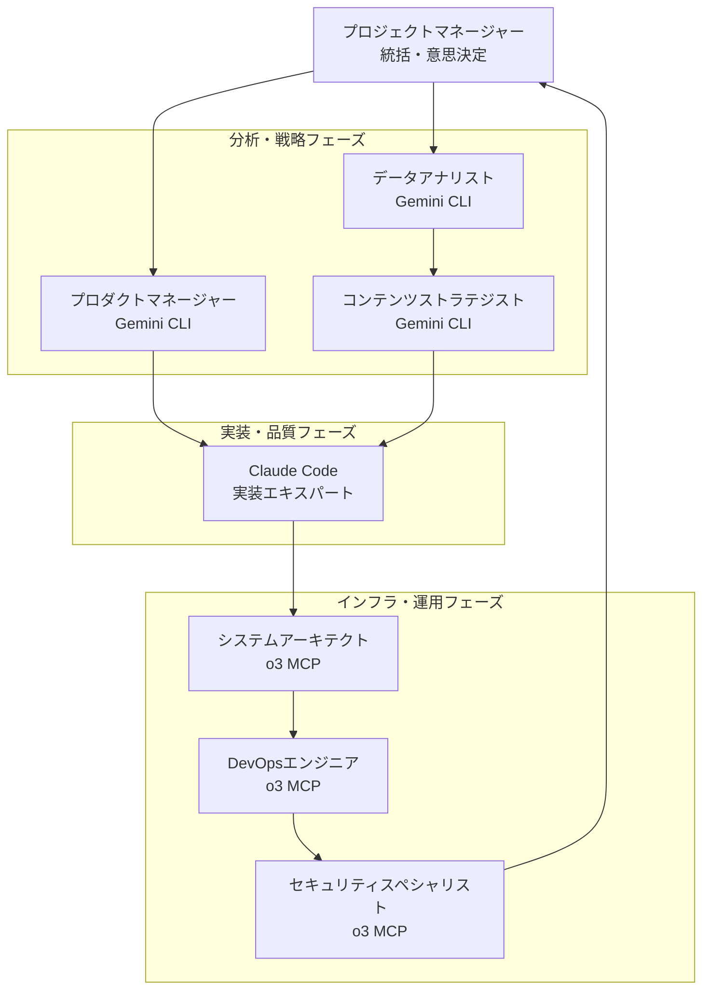

# CLAUDE.md - Vue.js + REST API 仕様書駆動開発

このファイルは、Claude Code がこのリポジトリで作業する際のガイダンスを提供します。

## プロジェクト概要

Vue.js (Composition API) + REST API を使用した現代的なWebアプリケーション開発プロジェクトです。
仕様書駆動開発により、品質と保守性を重視した開発を行います。

## 技術スタック

### フロントエンド
- **フレームワーク**: Vue.js 3.x (Composition API)
- **状態管理**: Pinia
- **ルーティング**: Vue Router
- **スタイリング**: Tailwind CSS + DaisyUI
- **ビルドツール**: Vite
- **言語**: JavaScript (ES2015+)

### バックエンド・インフラ
- **HTTP クライアント**: Axios
- **API 連携**: REST API / GraphQL
- **認証**: JWT トークン / OAuth 2.0
- **ホスティング**: Vercel / Netlify
- **バックエンド統合**: FastAPI + SQLAlchemy (完全統合対応)
- **フルスタック**: Docker Compose + Nginx (統合デプロイ)

## アーキテクチャ原則

### プロジェクト構造
```
src/
├── components/           # Vueコンポーネント
│   ├── ui/              # 基本UIコンポーネント (DaisyUI ベース)
│   ├── features/        # 機能別コンポーネント
│   └── layouts/         # レイアウトコンポーネント
├── composables/         # Vue Composition API カスタムコンポーザブル
├── stores/              # Pinia ストア
├── router/              # Vue Router 設定
├── services/            # REST API・HTTP クライアント
├── utils/               # ユーティリティ関数
├── types/               # TypeScript型定義 (JSDocで型安全性を確保)
└── assets/              # 静的ファイル
```

### 設計パターン
1. **コンポーザブルパターン**: ロジックの再利用性を重視
2. **ストアパターン**: Piniaによる状態管理の統一
3. **サービス層**: REST API操作の抽象化
4. **コンテナ・プレゼンテーション分離**: ロジックとUIの分離

## 開発ワークフロー - 仕様書駆動開発

### 4段階ワークフロー
1. **要件定義** (`/requirements`) - 機能要件の明確化
2. **設計** (`/design`) - 技術設計とアーキテクチャ
3. **タスク分割** (`/tasks`) - 実装可能な単位への分解
4. **実装** - 設計に基づく実装

### ワークフローコマンド
- `/spec` - 完全な仕様書駆動開発ワークフローを開始
- `/requirements` - 要件定義のみ実行
- `/design` - 設計フェーズのみ実行
- `/tasks` - タスク分割のみ実行

## 開発ルール

### Vue.js 開発ルール
- **Composition API必須**: `<script setup>` 構文を標準使用
- **Single File Component**: .vue ファイルによるコンポーネント開発
- **Props定義**: `defineProps()` による型安全なProps
- **Emit定義**: `defineEmits()` によるイベント定義
- **Reactive変数**: `ref()` / `reactive()` の適切な使い分け

### Pinia ストアルール
- **ストア分割**: 機能別にストアを分割
- **アクション中心**: 状態変更はアクションを通して実行
- **コンポーザブル活用**: `use{StoreName}Store()` パターン
- **永続化**: 必要に応じて `pinia-plugin-persistedstate` を使用

### REST API 連携ルール
- **サービス層の使用**: 直接的なAxios呼び出しを避け、サービス層経由で実行
- **エラーハンドリング**: HTTPエラーレスポンスの適切な処理とユーザーフレンドリーなメッセージ
- **認証管理**: JWT トークンの自動付与・リフレッシュ・失効処理
- **型安全性**: APIレスポンスの型定義を活用
- **リクエスト管理**: インターセプター活用による共通処理統一

### スタイリング・UI ルール
- **DaisyUI優先**: 基本コンポーネントはDaisyUIを活用
- **Tailwind CSS**: カスタムスタイルはTailwindユーティリティクラス
- **レスポンシブ**: モバイルファーストの設計
- **ダークモード**: DaisyUIのテーマ切り替え機能を活用

## 品質保証

### テスト戦略
- **コンポーネントテスト**: Vue Test Utils + Vitest
- **ユニットテスト**: ユーティリティ関数・コンポーザブル
- **E2Eテスト**: Playwright (重要フローのみ)

### コード品質
- **ESLint**: Vue.js推奨設定 + Prettier
- **型安全性**: JSDocによる型注釈（必要に応じてTypeScript移行）
- **コミット規約**: Conventional Commits

## 重要な設計上の決定

1. **JavaScript優先**: TypeScriptは将来の選択肢として残し、まずはJSDocで型安全性を確保
2. **コンポーザブル活用**: Vue 3 の Composition API の利点を最大化
3. **DaisyUI中心**: 統一されたデザインシステムの構築
4. **API最適化**: Axiosインターセプターとキャッシュ戦略の積極活用
5. **パフォーマンス重視**: Vue 3 の新機能（Suspense、Teleport等）の活用

## よくある落とし穴

1. **リアクティビティの破壊**: オブジェクトの分割代入に注意
2. **Pinia ストアの初期化**: SSRモードでの注意点
3. **JWT トークン管理**: ブラウザリフレッシュ時の認証状態復元
4. **DaisyUI テーマ**: 動的テーマ切り替え時のちらつき対策
5. **Vue Router**: 動的ルートでのコンポーネント再利用問題

## ドキュメント参照ガイド

### プロジェクト概要・要件
- **`.claude/00_project/01_project_concept.md`** - プロジェクトのビジョンと目標
- **`.claude/00_project/02_tech_stack_guidelines.md`** - 技術選定の根拠と指針

### 技術設計ドキュメント
- **`.claude/01_development_docs/01_architecture_design.md`** - 全体アーキテクチャ
- **`.claude/01_development_docs/02_api_design.md`** - REST API 設計・仕様
- **`.claude/01_development_docs/03_authentication_design.md`** - 認証・認可設計
- **`.claude/01_development_docs/04_component_design.md`** - Vue コンポーネント設計
- **`.claude/01_development_docs/05_state_management_design.md`** - Pinia ストア設計
- **`.claude/01_development_docs/06_routing_design.md`** - Vue Router 設計
- **`.claude/01_development_docs/07_error_handling_design.md`** - エラーハンドリング戦略
- **`.claude/01_development_docs/08_type_definitions.md`** - 型定義と JSDoc 規約

### デザインシステム
- **`.claude/02_design_system/00_design_overview.md`** - デザインシステム概要
- **`.claude/02_design_system/01_tailwind_config.md`** - Tailwind CSS 設定
- **`.claude/02_design_system/02_daisyui_components.md`** - DaisyUI コンポーネント使用指針
- **`.claude/02_design_system/03_vue_component_patterns.md`** - Vue コンポーネントパターン

### ライブラリ固有情報
- **`.claude/03_library_docs/01_vue_composition_patterns.md`** - Vue Composition API パターン集
- **`.claude/03_library_docs/02_pinia_store_patterns.md`** - Pinia ストアパターン集
- **`.claude/03_library_docs/03_axios_integration.md`** - Axios 統合ガイド
- **`.claude/03_library_docs/04_vite_configuration.md`** - Vite 設定とプラグイン
- **`.claude/03_library_docs/05_frontend_backend_integration.md`** - フルスタック統合ガイド

### タスク別クイックリファレンス

| タスク | 主要参照ドキュメント |
|-------|-------------------|
| 新機能追加 | アーキテクチャ → API設計 → コンポーネント設計 |
| 新しいページ作成 | ルーティング → コンポーネント → 状態管理 |
| API連携機能 | API設計 → 認証設計 → エラーハンドリング |
| UI実装 | コンポーネント設計 → DaisyUI → Tailwind設定 |
| 状態管理 | Pinia パターン → 状態管理設計 |
| 認証機能 | 認証設計 → Axios統合 → エラーハンドリング |
| API統合 | Axios統合 → API設計 → 型定義 |
| フルスタック統合 | フルスタック統合ガイド → 認証設計 → エラーハンドリング |
| テスト作成 | テスト戦略 → Vue Composition パターン |

## マルチAIチーム構成

このプロジェクトでは、複数のAIシステムを専門分野別に活用し、効率的なチーム開発を実現します。

### チームメンバー構成

#### 統括管理層
- **プロジェクトマネージャー（ユーザー）**: 全体戦略・意思決定・品質管理の最終責任者

#### Claude Code チーム（実装・品質保証）
- **技術実装エキスパート**: Vue.js + REST API開発の中核を担当
  - システムエンジニア（設計）
  - デザイナー（UI/UX）
  - フロントエンド・バックエンド開発者
  - テスター（品質保証）

#### Gemini CLI チーム（分析・戦略）
- **データアナリスト / リサーチャー**: 
  - 専門領域: データ分析・市場調査・ユーザー行動分析
  - 強み: 大規模コンテキスト処理、マルチモーダル対応、パターン認識
  - 主要活用: ユーザー行動データ分析、競合調査、A/Bテスト解析、パフォーマンス洞察

- **コンテンツストラテジスト**:
  - 専門領域: コンテンツ企画・ブランディング・UI/UXデザイン戦略
  - 強み: マルチモーダル統合、クリエイティブ発想、戦略的思考
  - 主要活用: ペルソナ設計、マーケティング戦略、ブランドアイデンティティ、ユーザージャーニーマップ

- **プロダクトマネージャー**:
  - 専門領域: 要件管理・ロードマップ策定・機能優先順位付け
  - 強み: 長文コンテキスト保持、総合判断、ステークホルダー調整
  - 主要活用: 複雑要件整理、依存関係管理、ユーザーストーリー詳細化、ロードマップ策定

#### o3 MCP チーム（インフラ・運用・データベース）
- **データベーススペシャリスト**:
  - 専門領域: REST API向けDB設計・SQL最適化・外部API連携・データ統合
  - 強み: MCPによる実DB連携、REST APIパフォーマンス最適化、複雑クエリ最適化、API設計
  - 主要活用: REST API用DB設計、外部API統合設計、クエリ最適化、パフォーマンスチューニング、データキャッシュ戦略

- **システムアーキテクト**:
  - 専門領域: システム設計・インフラ構成・技術選定
  - 強み: MCPによる実システム連携、リアルタイム構成変更、複雑統合設計
  - 主要活用: 大規模アーキテクチャ設計、マイクロサービス構成、外部システム連携

- **DevOpsエンジニア**:
  - 専門領域: CI/CD・インフラ自動化・運用監視
  - 強み: ツールとの直接統合、実環境操作、継続的改善プロセス
  - 主要活用: デプロイパイプライン、インフラコード管理、監視システム、自動復旧

- **セキュリティスペシャリスト**:
  - 専門領域: セキュリティ設計・脅威分析・コンプライアンス
  - 強み: セキュリティツール連携、リアルタイム脅威検知、システムレベル分析
  - 主要活用: セキュリティ監査、脅威モデリング、ポリシー策定、インシデント対応

### o3モデル階層別ロール分担

#### o3-high（チーフアーキテクト / テクニカルリード）
- **担当**: 重要な技術的意思決定、アーキテクチャ大幅変更、クリティカル問題解決
- **責任**: 長期技術戦略策定、技術的リスク評価、チーム技術方針決定

#### o3-standard（シニアエンジニア / 実装スペシャリスト）
- **担当**: 日常開発タスク、コードレビュー、API・ミドルウェア設計、技術メンタリング
- **責任**: 機能開発・バグ修正、技術ドキュメント作成、チーム内技術指導

#### o3-low（オペレーションエンジニア / 自動化スペシャリスト）
- **担当**: 定型タスク自動化、監視・アラート管理、ログ解析、簡易トラブルシューティング
- **責任**: 運用効率化、定期メンテナンス、簡易スクリプト作成

### チーム連携ワークフロー



### AIチーム活用指針

#### 新規プロジェクト開始時
1. **Gemini CLI**: 市場調査・要件分析・戦略策定
2. **Claude Code**: 設計・実装・テスト
3. **o3 MCP**: インフラ設計・運用準備

#### 既存プロジェクト改善時
1. **Gemini CLI**: 現状分析・改善戦略立案
2. **Claude Code**: リファクタリング・機能追加
3. **o3 MCP**: パフォーマンス改善・セキュリティ強化

#### 運用フェーズ
1. **Gemini CLI**: ユーザー分析・コンテンツ最適化
2. **Claude Code**: バグ修正・機能拡張
3. **o3 MCP**: 監視・自動化・セキュリティ運用

## マルチAI協調開発指針

### Claude Code 作業指針（実装・品質保証責任者）

#### 他AIとの連携指針
1. **Gemini CLI成果物の活用**
   - `/research` 結果を設計・実装の優先順位決定に活用
   - `/content-strategy` 成果をUIデザイン・UX設計に反映
   - `/product-plan` 要件を技術仕様に落とし込み

2. **o3 MCP成果物の活用**
   - `/architecture` 設計をフロントエンド・バックエンド実装に反映
   - `/devops` 要件を開発環境・CI/CD設定に適用
   - `/security` 要件をコード実装・認証機能に統合

3. **成果物共有責任**
   - 設計書を `.tmp/ai_shared_data/claude_designs/` に出力
   - 実装進捗を JSON 形式で他AIと共有
   - テスト結果・品質評価を他AIの改善に活用

#### マルチAI品質保証プロセス
1. **設計段階**: Gemini CLI 分析結果 + o3 MCP アーキテクチャ要件の整合性確認
2. **実装段階**: o3 MCP セキュリティ要件 + Gemini CLI UX要件の実装品質確認
3. **テスト段階**: 全AI成果物との整合性テスト・統合品質評価

### データ共有プロトコル（Claude Code視点）

#### 受信データフォーマット
```javascript
// Gemini CLI からの分析結果
{
  "source": "gemini_cli",
  "type": "research_analysis",
  "insights": {
    "user_behavior": "object",
    "market_trends": "array",
    "content_strategy": "object"
  },
  "implementation_suggestions": "array",
  "priority_ranking": "array"
}

// o3 MCP からのアーキテクチャ要件
{
  "source": "o3_mcp", 
  "type": "architecture_requirements",
  "technical_constraints": "object",
  "security_requirements": "array",
  "infrastructure_specs": "object",
  "performance_targets": "object"
}
```

#### 送信データフォーマット
```javascript
// Claude Code からの実装結果
{
  "source": "claude_code",
  "type": "implementation_result", 
  "implementation_status": "object",
  "design_decisions": "array",
  "technical_debt": "array",
  "performance_metrics": "object",
  "feedback_to_gemini": "array", // UX改善提案
  "feedback_to_o3": "array" // インフラ・セキュリティ改善提案
}
```

### エスカレーション・調整プロセス

#### AI間の意見対立解決
1. **技術vs戦略の対立**: Gemini CLI戦略 vs Claude Code実装可能性
   - データ駆動による客観的評価
   - プロトタイプ・PoC実装による検証
   - 段階的実装による リスク軽減

2. **実装vsインフラの対立**: Claude Code設計 vs o3 MCPインフラ制約  
   - アーキテクチャ代替案の検討
   - パフォーマンス・コスト トレードオフ分析
   - 段階的移行計画による調整

3. **優先順位の調整**: 機能要件 vs 非機能要件 vs 運用要件
   - ビジネス価値・技術的リスク・運用コストの定量評価
   - ステークホルダー・ユーザーフィードバックの活用
   - MVP・段階的デリバリによる調整

### 継続的学習・改善プロセス

#### AI協調効果の測定
- **品質指標**: バグ数削減、レビュー指摘事項削減、テストカバレッジ向上
- **効率指標**: 実装時間短縮、手戻り工数削減、リリース頻度向上
- **顧客価値**: ユーザー満足度向上、パフォーマンス改善、機能充実度

#### 知見共有・蓄積
- AI協調成功事例・失敗事例の体系的蓄積
- ベストプラクティス・アンチパターンの整理
- チームメンバー・ステークホルダーへの知見共有

このCLAUDE.mdを基盤として、マルチAI協調による高品質な開発を進めてください。