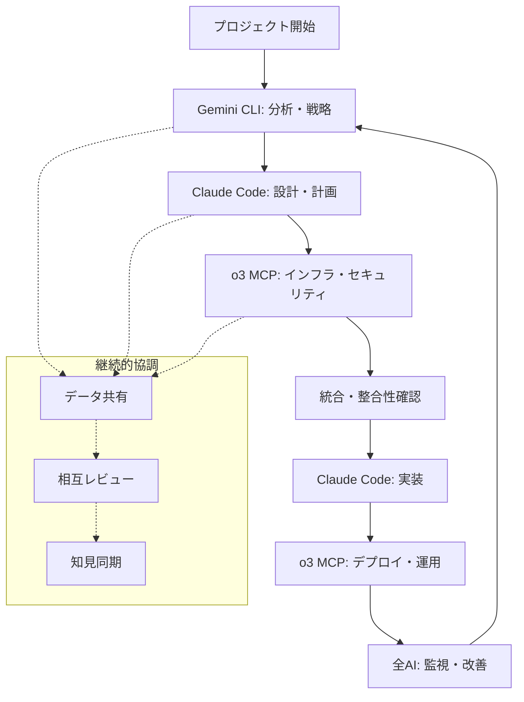

# /multiAI - マルチAI協調管理コマンド

## 目的
Claude Code、Gemini CLI、o3 MCPの3つのAIシステム間の協調作業を調整・管理し、各AIの専門性を最大限活用した統合的な開発ワークフローを実現します。

## 対象AI
- **Claude Code**: プロジェクト統括・実装・品質保証
- **Gemini CLI**: データ分析・戦略・コンテンツ
- **o3 MCP**: インフラ・運用・セキュリティ

## 入力パラメータ
- **必須**: `$COLLABORATION_TYPE` - 協調タイプ（project_init, cross_analysis, integrated_design, quality_assurance, deployment_coordination）
- **任意**: `$AI_PRIORITY` - AI優先度（gemini_lead, claude_lead, o3_lead, balanced）
- **任意**: `$SCOPE` - 協調範囲（analysis, design, implementation, operation, all）
- **任意**: `$SYNC_LEVEL` - 同期レベル（async, semi_sync, full_sync）

## 出力
- **協調計画書**: `.tmp/multiAI_collaboration_plan_[timestamp].md`
- **AI役割分担**: `.tmp/ai_roles_assignments.json`
- **データ共有設定**: `.tmp/ai_shared_data/`
- **進捗統合レポート**: `.tmp/integrated_progress_report.md`
- **品質評価統合**: `.tmp/cross_ai_quality_assessment.md`

## ワークフロー

### Phase 1: AI協調戦略策定
```markdown
## AI協調戦略フェーズ

### 1. プロジェクト要件分析・AI適性評価
- プロジェクト複雑度・規模の評価
- 各AI の専門領域との適合性分析
- 協調が必要な作業領域の特定
- AI間の依存関係・シーケンス分析

### 2. 役割分担・責任範囲設計
- **Gemini CLI**: 分析・戦略・コンテンツ領域の責任範囲
- **Claude Code**: 設計・実装・品質保証領域の責任範囲  
- **o3 MCP**: インフラ・運用・セキュリティ領域の責任範囲
- 協調が必要な境界領域の調整方法

### 3. データ共有・連携プロトコル設計
- AI間のデータフォーマット統一
- 共有データストレージ設計
- バージョン管理・競合解決ルール
- 通信プロトコル・APIインターフェース

### 4. 品質保証・統合テスト計画
- 各AIの作業成果物の品質基準
- AI間の成果物整合性チェック
- 統合品質評価プロセス
- フィードバック・改善サイクル
```

### Phase 2: 協調実行・監視
```markdown
## 協調実行フェーズ

### 1. 並行作業調整
- タスクの並行実行・依存関係管理
- リソース競合の回避・調整
- 進捗同期・ブロッカー解決
- コミュニケーション・エスカレーション

### 2. データ統合・知見共有
- 各AIの分析結果・洞察の統合
- 知見の相互活用・強化
- データ不整合の検出・解決
- 統合的な意思決定支援

### 3. 品質相互チェック
- Gemini CLI: Claude Code設計の戦略適合性チェック
- Claude Code: Gemini CLI分析のの技術実装可能性チェック
- o3 MCP: 全体設計の運用・セキュリティ適合性チェック
- 相互レビュー・改善提案

### 4. 統合成果物生成
- 各AIの成果物を統合した包括的ドキュメント
- 一貫性・整合性を保証した設計書
- 実装可能性・運用可能性を検証済みの計画書
- 継続改善のための知見・ノウハウ蓄積
```

### Phase 3: 継続改善・最適化
```markdown
## 継続改善フェーズ

### 1. 協調効果測定・評価
- AI協調による品質向上効果の測定
- 作業効率・スピード向上の評価
- 知見共有・相互学習効果の分析
- ROI・コストパフォーマンス評価

### 2. 協調プロセス改善
- 役割分担の最適化
- データ共有プロセスの効率化
- コミュニケーション・調整方法の改善
- ツール・プラットフォーム改善

### 3. 知見・ベストプラクティス蓄積
- 成功パターン・失敗パターンの整理
- AIごとの得意分野・苦手分野の明確化
- 協調が効果的な場面・そうでない場面の特定
- ベストプラクティス・ガイドライン更新

### 4. スケーリング・展開
- 成功した協調パターンの他プロジェクトへの展開
- チームメンバー・ステークホルダーへの知見共有
- ツール・プロセスの標準化・自動化
- 組織レベルでのマルチAI活用能力向上
```

## 協調タイプ別仕様

### 1. プロジェクト初期化（project_init）
```yaml
目的: 新規プロジェクトのマルチAI協調体制構築
協調パターン:
  Phase1_Gemini: 市場分析・要件整理・戦略策定
  Phase2_Claude: 技術設計・アーキテクチャ設計
  Phase3_o3: インフラ要件・運用計画策定
  Integration: 統合計画書・ロードマップ作成
期待効果:
  - 包括的な要件分析・戦略策定
  - 実装可能性・運用可能性を検証済みの設計
  - 一貫性のあるプロジェクト計画
```

### 2. 横断分析（cross_analysis）
```yaml
目的: 複数AI による多角的な分析・評価
協調パターン:
  Gemini_Analysis: ユーザー・市場・コンテンツ分析
  Claude_Analysis: 技術・設計・品質分析
  o3_Analysis: システム・運用・セキュリティ分析
  Cross_Validation: 分析結果の相互検証・統合
期待効果:
  - 単一AIでは見つけられない洞察の発見
  - 多角的視点による分析精度向上
  - バイアスの軽減・客観性の向上
```

### 3. 統合設計（integrated_design）
```yaml
目的: 各AI の専門性を統合した包括設計
協調パターン:
  Parallel_Design: 各AIによる並行設計作業
  Integration_Review: 設計統合・整合性確認
  Optimization: 全体最適化・トレードオフ調整
  Validation: 実装・運用可能性検証
期待効果:
  - 戦略・技術・運用の整合性保証
  - 最適化されたトレードオフ・意思決定
  - 高品質・高実現性の統合設計
```

### 4. 品質保証（quality_assurance）
```yaml
目的: マルチAI による包括的品質保証
協調パターン:
  Multi_Perspective_Review: 各AIによる多角的レビュー
  Cross_Validation: 評価結果の相互検証
  Integrated_Testing: 統合テスト・品質確認
  Continuous_Improvement: 継続的品質改善
期待効果:
  - 見落とし・盲点の最小化
  - 品質基準の向上・標準化
  - 継続的改善サイクルの確立
```

### 5. デプロイ調整（deployment_coordination）
```yaml
目的: リリース・運用開始の協調管理
協調パターン:
  Pre_Deployment: 各AIによるリリース前チェック
  Deployment_Monitoring: リアルタイム監視・問題対応
  Post_Deployment: 運用開始後の効果測定・改善
  Feedback_Loop: 運用データの分析・次期改善計画
期待効果:
  - リスクの最小化・安全なリリース
  - 迅速な問題発見・対応
  - データ駆動による継続改善
```

## AI協調ワークフローテンプレート

### 標準協調フロー


### 緊急対応フロー


## データ共有プロトコル

### 共有データ構造
```json
{
  "project_id": "string",
  "timestamp": "ISO8601",
  "source_ai": "gemini|claude|o3",
  "data_type": "analysis|design|implementation|operation",
  "content": {
    "summary": "string",
    "details": "object",
    "recommendations": "array",
    "dependencies": "array",
    "quality_metrics": "object"
  },
  "target_ai": ["gemini", "claude", "o3"],
  "priority": "low|medium|high|critical",
  "action_required": "boolean"
}
```

### API連携インターフェース
```javascript
// AI間データ交換API
const multiAIAPI = {
  // データ共有
  shareData: async (data) => {
    await saveToSharedStorage(data)
    await notifyTargetAIs(data.target_ai, data)
  },
  
  // 協調タスク実行
  executeCollaborativeTask: async (taskType, participants) => {
    const plan = await generateCollaborationPlan(taskType, participants)
    const results = await Promise.all(
      participants.map(ai => ai.executeTask(plan))
    )
    return integrateResults(results)
  },
  
  // 品質相互チェック
  crossValidation: async (artifact, reviewers) => {
    const reviews = await Promise.all(
      reviewers.map(ai => ai.review(artifact))
    )
    return consolidateReviews(reviews)
  }
}
```

## 成功指標・KPI

### 協調効果指標
- **品質向上**: 欠陥密度 50% 削減、レビュー指摘事項 70% 削減
- **効率向上**: 設計・実装時間 30% 短縮、手戻り工数 60% 削減
- **知見共有**: AI間知見活用率 80% 以上、ベストプラクティス蓄積数

### プロジェクト成果指標
- **顧客満足度**: 機能・性能・品質に対する満足度向上
- **ビジネス価値**: ROI向上、市場投入時間短縮、競合優位性確保
- **技術的負債**: 技術的負債削減、保守性・拡張性向上

## 連携コマンド
- **→ /research**: Gemini CLI主導のデータ分析協調
- **→ /content-strategy**: Gemini CLI主導のコンテンツ戦略協調
- **→ /product-plan**: Gemini CLI主導のプロダクト計画協調
- **→ /design**: Claude Code主導の設計協調
- **→ /implement**: Claude Code主導の実装協調
- **→ /architecture**: o3 MCP主導のアーキテクチャ設計協調
- **→ /devops**: o3 MCP主導のDevOps協調
- **→ /security**: o3 MCP主導のセキュリティ協調

## 品質チェックリスト
- [ ] AI役割分担の明確性・適切性確認
- [ ] データ共有・連携プロトコルの有効性検証
- [ ] 協調効果・品質向上の測定・評価
- [ ] 継続改善プロセスの実効性確認
- [ ] スケーラビリティ・拡張性の確保

## 使用例

### 新規プロジェクト立ち上げ
```bash
/multiAI project_init --ai_priority="balanced" --scope="all" --sync_level="full_sync"
```

### 既存システム改善
```bash
/multiAI cross_analysis --ai_priority="gemini_lead" --scope="analysis" --sync_level="semi_sync"
```

### 緊急対応・トラブルシューティング
```bash
/multiAI deployment_coordination --ai_priority="o3_lead" --scope="operation" --sync_level="full_sync"
```

## 注意事項・制約
- 各AIの専門性・得意分野を理解した適切な役割分担が重要
- データ共有・連携にかかるオーバーヘッドを考慮した計画策定
- AI間の意見対立・競合が発生した場合の解決プロセス整備
- ヒューマンオーバーサイト・最終意思決定権の明確化