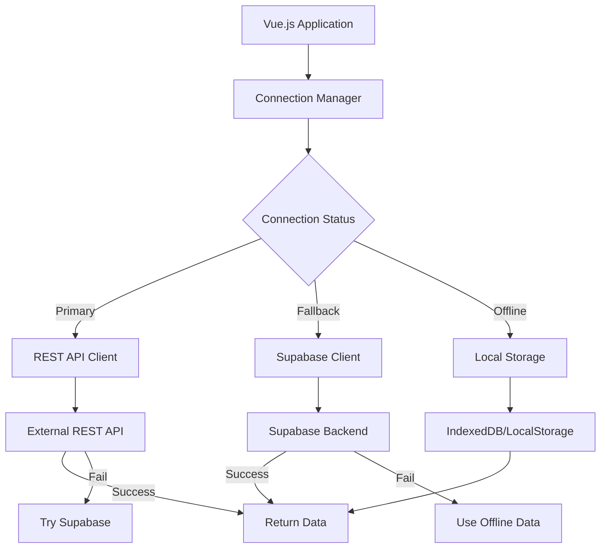

# ハイブリッド接続戦略ガイド

## 概要

このドキュメントでは、REST API → Supabase → Offline の3段階フォールバック戦略を実装するハイブリッド接続システムについて説明します。

## アーキテクチャ概要



## 接続優先順位

### 1. プライマリ接続: REST API
- **対象**: カスタム REST API サーバー
- **利点**: 高いカスタマイズ性、独自ビジネスロジック
- **使用条件**: ネットワーク接続可能 + API サーバー稼働中

### 2. フォールバック接続: Supabase
- **対象**: Supabase Backend-as-a-Service
- **利点**: 高可用性、リアルタイム機能、認証サービス
- **使用条件**: ネットワーク接続可能 + Supabase サービス利用可能

### 3. オフライン接続: Local Storage
- **対象**: ブラウザローカルストレージ（IndexedDB + LocalStorage）
- **利点**: 完全オフライン動作、即座のレスポンス
- **使用条件**: 常に利用可能（フォールバック最終手段）

## 実装パターン

### Connection Manager

```javascript
// services/connectionManager.js
import { ref, computed } from 'vue'
import { restApiClient } from './restApiClient'
import { supabaseClient } from './supabaseClient' 
import { offlineClient } from './offlineClient'

export class ConnectionManager {
  constructor() {
    this.connectionStatus = ref('checking')
    this.primaryAvailable = ref(false)
    this.fallbackAvailable = ref(false)
    this.offlineMode = ref(false)
    
    this.currentClient = computed(() => {
      if (this.primaryAvailable.value) return restApiClient
      if (this.fallbackAvailable.value) return supabaseClient
      return offlineClient
    })
    
    this.startHealthCheck()
  }
  
  async startHealthCheck() {
    setInterval(async () => {
      await this.checkConnections()
    }, 30000) // 30秒間隔でチェック
    
    await this.checkConnections()
  }
  
  async checkConnections() {
    try {
      // REST API の健全性チェック
      await restApiClient.healthCheck()
      this.primaryAvailable.value = true
      this.fallbackAvailable.value = true // プライマリが使える場合フォールバックも有効とする
      this.offlineMode.value = false
      this.connectionStatus.value = 'primary'
    } catch (primaryError) {
      this.primaryAvailable.value = false
      
      try {
        // Supabase の健全性チェック
        await supabaseClient.healthCheck()
        this.fallbackAvailable.value = true
        this.offlineMode.value = false
        this.connectionStatus.value = 'fallback'
      } catch (fallbackError) {
        this.fallbackAvailable.value = false
        this.offlineMode.value = true
        this.connectionStatus.value = 'offline'
      }
    }
  }
  
  async executeOperation(operation, ...args) {
    const client = this.currentClient.value
    
    try {
      const result = await client[operation](...args)
      
      // 成功時にオフラインデータを更新
      if (this.connectionStatus.value !== 'offline') {
        await offlineClient.syncData(operation, args, result)
      }
      
      return result
    } catch (error) {
      // エラー時のフォールバック処理
      return await this.handleOperationError(operation, args, error)
    }
  }
  
  async handleOperationError(operation, args, error) {
    const currentStatus = this.connectionStatus.value
    
    if (currentStatus === 'primary') {
      // プライマリが失敗した場合、フォールバックを試行
      try {
        await this.checkConnections() // 接続状態を再確認
        if (this.connectionStatus.value === 'fallback') {
          return await supabaseClient[operation](...args)
        }
      } catch (fallbackError) {
        // フォールバックも失敗した場合オフラインへ
        this.connectionStatus.value = 'offline'
      }
    }
    
    if (currentStatus === 'fallback') {
      // フォールバックが失敗した場合オフラインへ
      this.connectionStatus.value = 'offline'
    }
    
    // 最終的にオフラインデータを使用
    return await offlineClient[operation](...args)
  }
}

export const connectionManager = new ConnectionManager()
```

### 統一データサービス

```javascript
// services/dataService.js
import { connectionManager } from './connectionManager'

export class DataService {
  async getUsers(filters = {}) {
    return await connectionManager.executeOperation('getUsers', filters)
  }
  
  async getUserById(id) {
    return await connectionManager.executeOperation('getUserById', id)
  }
  
  async createUser(userData) {
    return await connectionManager.executeOperation('createUser', userData)
  }
  
  async updateUser(id, updates) {
    return await connectionManager.executeOperation('updateUser', id, updates)
  }
  
  async deleteUser(id) {
    return await connectionManager.executeOperation('deleteUser', id)
  }
}

export const dataService = new DataService()
```

### REST API クライアント

```javascript
// services/restApiClient.js
import axios from 'axios'

class RestApiClient {
  constructor() {
    this.client = axios.create({
      baseURL: import.meta.env.VITE_REST_API_URL,
      timeout: 5000,
      headers: {
        'Content-Type': 'application/json'
      }
    })
    
    this.setupInterceptors()
  }
  
  setupInterceptors() {
    // Request interceptor
    this.client.interceptors.request.use(
      (config) => {
        const token = localStorage.getItem('jwt_token')
        if (token) {
          config.headers.Authorization = `Bearer ${token}`
        }
        return config
      },
      (error) => Promise.reject(error)
    )
    
    // Response interceptor
    this.client.interceptors.response.use(
      (response) => response.data,
      (error) => {
        if (error.response?.status === 401) {
          // JWT token expired, try to refresh
          return this.handleTokenRefresh(error)
        }
        return Promise.reject(error)
      }
    )
  }
  
  async healthCheck() {
    const response = await this.client.get('/health')
    return response.status === 'ok'
  }
  
  async getUsers(filters) {
    return await this.client.get('/users', { params: filters })
  }
  
  async getUserById(id) {
    return await this.client.get(`/users/${id}`)
  }
  
  async createUser(userData) {
    return await this.client.post('/users', userData)
  }
  
  async updateUser(id, updates) {
    return await this.client.put(`/users/${id}`, updates)
  }
  
  async deleteUser(id) {
    return await this.client.delete(`/users/${id}`)
  }
  
  async handleTokenRefresh(originalError) {
    // JWT refresh logic
    try {
      const refreshToken = localStorage.getItem('refresh_token')
      const response = await this.client.post('/auth/refresh', {
        refresh_token: refreshToken
      })
      
      localStorage.setItem('jwt_token', response.access_token)
      
      // Retry original request
      const originalRequest = originalError.config
      originalRequest.headers.Authorization = `Bearer ${response.access_token}`
      return await this.client(originalRequest)
    } catch (refreshError) {
      // Refresh failed, redirect to login
      localStorage.removeItem('jwt_token')
      localStorage.removeItem('refresh_token')
      throw refreshError
    }
  }
}

export const restApiClient = new RestApiClient()
```

### Supabase クライアント

```javascript
// services/supabaseClient.js
import { createClient } from '@supabase/supabase-js'

class SupabaseClient {
  constructor() {
    this.client = createClient(
      import.meta.env.VITE_SUPABASE_URL,
      import.meta.env.VITE_SUPABASE_ANON_KEY
    )
  }
  
  async healthCheck() {
    const { data, error } = await this.client
      .from('users')
      .select('count')
      .limit(1)
    
    if (error) throw error
    return true
  }
  
  async getUsers(filters) {
    let query = this.client.from('users').select('*')
    
    // Apply filters
    Object.entries(filters).forEach(([key, value]) => {
      if (value !== undefined && value !== null) {
        query = query.eq(key, value)
      }
    })
    
    const { data, error } = await query
    if (error) throw error
    
    return { data, success: true }
  }
  
  async getUserById(id) {
    const { data, error } = await this.client
      .from('users')
      .select('*')
      .eq('id', id)
      .single()
    
    if (error) throw error
    
    return { data, success: true }
  }
  
  async createUser(userData) {
    const { data, error } = await this.client
      .from('users')
      .insert(userData)
      .select()
      .single()
    
    if (error) throw error
    
    return { data, success: true }
  }
  
  async updateUser(id, updates) {
    const { data, error } = await this.client
      .from('users')
      .update(updates)
      .eq('id', id)
      .select()
      .single()
    
    if (error) throw error
    
    return { data, success: true }
  }
  
  async deleteUser(id) {
    const { error } = await this.client
      .from('users')
      .delete()
      .eq('id', id)
    
    if (error) throw error
    
    return { success: true }
  }
}

export const supabaseClient = new SupabaseClient()
```

### オフラインクライアント

```javascript
// services/offlineClient.js
class OfflineClient {
  constructor() {
    this.dbName = 'hybridApp'
    this.version = 1
    this.stores = ['users', 'posts', 'sync_queue']
    this.db = null
    this.initDB()
  }
  
  async initDB() {
    return new Promise((resolve, reject) => {
      const request = indexedDB.open(this.dbName, this.version)
      
      request.onerror = () => reject(request.error)
      request.onsuccess = () => {
        this.db = request.result
        resolve(this.db)
      }
      
      request.onupgradeneeded = (event) => {
        const db = event.target.result
        
        // Create object stores
        this.stores.forEach(storeName => {
          if (!db.objectStoreNames.contains(storeName)) {
            const store = db.createObjectStore(storeName, { keyPath: 'id' })
            store.createIndex('created_at', 'created_at', { unique: false })
          }
        })
      }
    })
  }
  
  async getUsers(filters) {
    await this.ensureDB()
    
    const transaction = this.db.transaction(['users'], 'readonly')
    const store = transaction.objectStore('users')
    const request = store.getAll()
    
    return new Promise((resolve, reject) => {
      request.onsuccess = () => {
        let users = request.result
        
        // Apply filters
        if (filters && Object.keys(filters).length > 0) {
          users = users.filter(user => {
            return Object.entries(filters).every(([key, value]) => {
              return user[key] === value
            })
          })
        }
        
        resolve({ data: users, success: true, source: 'offline' })
      }
      request.onerror = () => reject(request.error)
    })
  }
  
  async getUserById(id) {
    await this.ensureDB()
    
    const transaction = this.db.transaction(['users'], 'readonly')
    const store = transaction.objectStore('users')
    const request = store.get(id)
    
    return new Promise((resolve, reject) => {
      request.onsuccess = () => {
        const user = request.result
        if (user) {
          resolve({ data: user, success: true, source: 'offline' })
        } else {
          reject(new Error('User not found in offline storage'))
        }
      }
      request.onerror = () => reject(request.error)
    })
  }
  
  async createUser(userData) {
    await this.ensureDB()
    
    const user = {
      ...userData,
      id: userData.id || crypto.randomUUID(),
      created_at: new Date().toISOString(),
      _offline_created: true
    }
    
    const transaction = this.db.transaction(['users', 'sync_queue'], 'readwrite')
    const userStore = transaction.objectStore('users')
    const syncStore = transaction.objectStore('sync_queue')
    
    // Store user data
    userStore.add(user)
    
    // Add to sync queue
    syncStore.add({
      id: crypto.randomUUID(),
      type: 'create',
      table: 'users',
      data: user,
      created_at: new Date().toISOString()
    })
    
    return new Promise((resolve, reject) => {
      transaction.oncomplete = () => {
        resolve({ data: user, success: true, source: 'offline' })
      }
      transaction.onerror = () => reject(transaction.error)
    })
  }
  
  async updateUser(id, updates) {
    await this.ensureDB()
    
    const transaction = this.db.transaction(['users', 'sync_queue'], 'readwrite')
    const userStore = transaction.objectStore('users')
    const syncStore = transaction.objectStore('sync_queue')
    
    // Get existing user
    const getRequest = userStore.get(id)
    
    return new Promise((resolve, reject) => {
      getRequest.onsuccess = () => {
        const existingUser = getRequest.result
        if (!existingUser) {
          reject(new Error('User not found'))
          return
        }
        
        const updatedUser = {
          ...existingUser,
          ...updates,
          updated_at: new Date().toISOString(),
          _offline_modified: true
        }
        
        // Update user
        userStore.put(updatedUser)
        
        // Add to sync queue
        syncStore.add({
          id: crypto.randomUUID(),
          type: 'update',
          table: 'users',
          record_id: id,
          data: updates,
          created_at: new Date().toISOString()
        })
        
        resolve({ data: updatedUser, success: true, source: 'offline' })
      }
      
      getRequest.onerror = () => reject(getRequest.error)
    })
  }
  
  async deleteUser(id) {
    await this.ensureDB()
    
    const transaction = this.db.transaction(['users', 'sync_queue'], 'readwrite')
    const userStore = transaction.objectStore('users')
    const syncStore = transaction.objectStore('sync_queue')
    
    // Delete user
    userStore.delete(id)
    
    // Add to sync queue
    syncStore.add({
      id: crypto.randomUUID(),
      type: 'delete',
      table: 'users',
      record_id: id,
      created_at: new Date().toISOString()
    })
    
    return new Promise((resolve, reject) => {
      transaction.oncomplete = () => {
        resolve({ success: true, source: 'offline' })
      }
      transaction.onerror = () => reject(transaction.error)
    })
  }
  
  async syncData(operation, args, result) {
    // オンライン操作が成功した時にローカルキャッシュを更新
    if (result.success && result.data) {
      await this.updateLocalCache(operation, args, result.data)
    }
  }
  
  async updateLocalCache(operation, args, data) {
    await this.ensureDB()
    
    const transaction = this.db.transaction(['users'], 'readwrite')
    const store = transaction.objectStore('users')
    
    switch (operation) {
      case 'getUsers':
        // Bulk update cache
        if (Array.isArray(data)) {
          data.forEach(user => {
            user._cached_at = new Date().toISOString()
            store.put(user)
          })
        }
        break
        
      case 'getUserById':
      case 'createUser':
      case 'updateUser':
        data._cached_at = new Date().toISOString()
        store.put(data)
        break
        
      case 'deleteUser':
        store.delete(args[0]) // args[0] is the id
        break
    }
  }
  
  async ensureDB() {
    if (!this.db) {
      await this.initDB()
    }
  }
}

export const offlineClient = new OfflineClient()
```

## 同期戦略

### オンライン復帰時の自動同期

```javascript
// services/syncManager.js
class SyncManager {
  constructor(connectionManager, offlineClient) {
    this.connectionManager = connectionManager
    this.offlineClient = offlineClient
    this.syncInProgress = false
    
    // 接続状態の変化を監視
    watch(
      () => connectionManager.connectionStatus.value,
      (newStatus, oldStatus) => {
        if (oldStatus === 'offline' && newStatus !== 'offline') {
          this.performSync()
        }
      }
    )
  }
  
  async performSync() {
    if (this.syncInProgress) return
    
    this.syncInProgress = true
    
    try {
      // 同期キューからペンディング操作を取得
      const pendingOperations = await this.offlineClient.getPendingSync()
      
      for (const operation of pendingOperations) {
        try {
          await this.syncOperation(operation)
          await this.offlineClient.markSyncComplete(operation.id)
        } catch (error) {
          console.error('Sync failed for operation:', operation, error)
          // 失敗した操作はキューに残す
        }
      }
    } finally {
      this.syncInProgress = false
    }
  }
  
  async syncOperation(operation) {
    const client = this.connectionManager.currentClient.value
    
    switch (operation.type) {
      case 'create':
        return await client.createUser(operation.data)
      case 'update':
        return await client.updateUser(operation.record_id, operation.data)
      case 'delete':
        return await client.deleteUser(operation.record_id)
    }
  }
}
```

## 使用例

### Composable での利用

```javascript
// composables/useUsers.js
import { ref, onMounted } from 'vue'
import { dataService } from '@/services/dataService'
import { connectionManager } from '@/services/connectionManager'

export function useUsers() {
  const users = ref([])
  const loading = ref(false)
  const error = ref(null)
  const connectionStatus = computed(() => connectionManager.connectionStatus.value)
  
  const fetchUsers = async (filters = {}) => {
    loading.value = true
    error.value = null
    
    try {
      const result = await dataService.getUsers(filters)
      users.value = result.data
    } catch (err) {
      error.value = err.message
    } finally {
      loading.value = false
    }
  }
  
  const createUser = async (userData) => {
    try {
      const result = await dataService.createUser(userData)
      users.value.push(result.data)
      return result
    } catch (err) {
      error.value = err.message
      throw err
    }
  }
  
  onMounted(() => {
    fetchUsers()
  })
  
  return {
    users,
    loading,
    error,
    connectionStatus,
    fetchUsers,
    createUser
  }
}
```

## 環境変数設定

```env
# REST API設定
VITE_REST_API_URL=https://your-api.example.com/api/v1
VITE_REST_API_TIMEOUT=5000

# Supabase設定
VITE_SUPABASE_URL=https://your-project.supabase.co
VITE_SUPABASE_ANON_KEY=your-anon-key

# 接続設定
VITE_CONNECTION_CHECK_INTERVAL=30000
VITE_OFFLINE_SYNC_ENABLED=true
```

## ベストプラクティス

### 1. データ整合性
- オフライン操作には一意ID（UUID）を生成
- タイムスタンプによる競合解決
- 楽観的同期での競合検出

### 2. パフォーマンス
- ローカルキャッシュの適切な管理
- 不要なデータの定期クリーンアップ
- バックグラウンドでの接続チェック

### 3. ユーザー体験
- 接続状態の視覚的フィードバック
- オフライン操作の明確な表示
- 同期進捗の透明性

### 4. エラーハンドリング
- グレースフルなフォールバック
- 適切なエラーメッセージ
- 復旧可能なエラーの自動リトライ