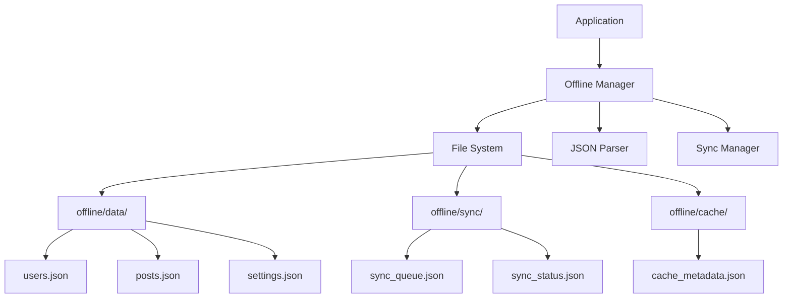

# オフラインストレージ統合ガイド

## 概要

ネットワーク接続が利用できない場合の最終フォールバックとして、ローカルファイルシステムのJSONファイルを活用したオフライン対応の実装ガイドです。

## オフライン対応のアーキテクチャ



## ストレージ戦略

### ファイルベースストレージ構造
```
offline/
├── data/               # メインデータストレージ
│   ├── users.json      # ユーザーデータ
│   ├── posts.json      # 投稿データ
│   ├── comments.json   # コメントデータ
│   └── settings.json   # アプリケーション設定
├── sync/               # 同期管理
│   ├── sync_queue.json # 同期待ちキュー
│   ├── sync_status.json # 同期状態
│   └── conflicts.json  # 競合データ
├── cache/              # キャッシュ管理
│   ├── cache_metadata.json # キャッシュメタデータ
│   └── temp/          # 一時ファイル
└── backup/            # バックアップ
    └── [timestamp]/   # タイムスタンプ別バックアップ
```

### JSONファイル管理の利点
- **可視性**: ファイルを直接確認・編集可能
- **バックアップ**: 簡単なファイルコピーでバックアップ
- **デバッグ**: データ構造を直接確認可能
- **移植性**: 他システムへのデータ移行が容易
- **バージョン管理**: Gitでのデータ管理も可能

## 実装詳細

### オフラインマネージャー

```javascript
// services/offline/offlineManager.js
import fs from 'fs/promises'
import path from 'path'

export class OfflineManager {
  constructor() {
    this.basePath = path.join(process.cwd(), 'offline')
    this.dataPath = path.join(this.basePath, 'data')
    this.syncPath = path.join(this.basePath, 'sync')
    this.cachePath = path.join(this.basePath, 'cache')
    this.backupPath = path.join(this.basePath, 'backup')
    
    this.initialize()
  }
  
  async initialize() {
    // ディレクトリ構造の作成
    await this.ensureDirectoryStructure()
    
    // 初期データファイルの作成
    await this.ensureDataFiles()
  }
  
  async ensureDirectoryStructure() {
    const directories = [
      this.basePath,
      this.dataPath,
      this.syncPath,
      this.cachePath,
      this.backupPath,
      path.join(this.cachePath, 'temp')
    ]
    
    for (const dir of directories) {
      await fs.mkdir(dir, { recursive: true })
    }
  }
  
  async ensureDataFiles() {
    const dataFiles = {
      'data/users.json': [],
      'data/posts.json': [],
      'data/comments.json': [],
      'data/settings.json': {
        version: '1.0.0',
        lastSync: null,
        preferences: {}
      },
      'sync/sync_queue.json': [],
      'sync/sync_status.json': {
        lastSync: null,
        pendingChanges: 0,
        syncInProgress: false
      },
      'sync/conflicts.json': [],
      'cache/cache_metadata.json': {}
    }
    
    for (const [relativePath, defaultContent] of Object.entries(dataFiles)) {
      const filePath = path.join(this.basePath, relativePath)
      
      try {
        await fs.access(filePath)
      } catch {
        // ファイルが存在しない場合は作成
        await fs.writeFile(
          filePath, 
          JSON.stringify(defaultContent, null, 2),
          'utf8'
        )
      }
    }
  }
  
  // JSONファイルの読み込み
  async readJSON(relativePath) {
    const filePath = path.join(this.basePath, relativePath)
    try {
      const content = await fs.readFile(filePath, 'utf8')
      return JSON.parse(content)
    } catch (error) {
      console.error(`Failed to read ${relativePath}:`, error)
      return null
    }
  }
  
  // JSONファイルの書き込み
  async writeJSON(relativePath, data) {
    const filePath = path.join(this.basePath, relativePath)
    try {
      // バックアップの作成
      await this.createBackup(relativePath)
      
      // 整形されたJSONとして保存
      await fs.writeFile(
        filePath, 
        JSON.stringify(data, null, 2),
        'utf8'
      )
      return true
    } catch (error) {
      console.error(`Failed to write ${relativePath}:`, error)
      return false
    }
  }
  
  // バックアップの作成
  async createBackup(relativePath) {
    const timestamp = new Date().toISOString().replace(/[:.]/g, '-')
    const backupDir = path.join(this.backupPath, timestamp)
    await fs.mkdir(backupDir, { recursive: true })
    
    const sourcePath = path.join(this.basePath, relativePath)
    const backupPath = path.join(backupDir, path.basename(relativePath))
    
    try {
      await fs.copyFile(sourcePath, backupPath)
    } catch (error) {
      console.error(`Failed to backup ${relativePath}:`, error)
    }
  }
  
  // 古いバックアップの削除
  async cleanupBackups(maxAge = 7 * 24 * 60 * 60 * 1000) { // 7日
    const now = Date.now()
    const backups = await fs.readdir(this.backupPath)
    
    for (const backup of backups) {
      const backupPath = path.join(this.backupPath, backup)
      const stats = await fs.stat(backupPath)
      
      if (now - stats.mtime.getTime() > maxAge) {
        await fs.rm(backupPath, { recursive: true, force: true })
      }
    }
  }
}
```

### データ永続化レイヤー

```javascript
// services/offline/persistenceLayer.js
export class PersistenceLayer {
  constructor(offlineManager) {
    this.manager = offlineManager
    this.syncStatus = {
      PENDING: 'pending',
      SYNCING: 'syncing',
      SYNCED: 'synced',
      FAILED: 'failed'
    }
  }
  
  async saveEntity(entityType, data, operation = 'create') {
    try {
      // 現在のデータを読み込み
      const entities = await this.manager.readJSON(`data/${entityType}.json`) || []
      
      // エンティティデータの準備
      const entity = {
        ...data,
        id: data.id || this.generateOfflineId(),
        _sync_status: this.syncStatus.PENDING,
        _last_modified: new Date().toISOString(),
        _operation: operation
      }
      
      // 既存エンティティの更新または新規追加
      const existingIndex = entities.findIndex(e => e.id === entity.id)
      if (existingIndex >= 0) {
        entities[existingIndex] = entity
      } else {
        entities.push(entity)
      }
      
      // ファイルに保存
      await this.manager.writeJSON(`data/${entityType}.json`, entities)
      
      // 同期キューへの追加
      if (operation !== 'read') {
        await this.addToSyncQueue({
          entity_type: entityType,
          entity_id: entity.id,
          operation: operation,
          data: data
        })
      }
      
      return entity
    } catch (error) {
      console.error('Failed to save entity:', error)
      throw error
    }
  }
  
  async getEntity(entityType, id) {
    const entities = await this.manager.readJSON(`data/${entityType}.json`) || []
    const entity = entities.find(e => e.id === id)
    
    if (!entity) {
      throw new Error(`${entityType} with id ${id} not found`)
    }
    
    return this.cleanOfflineMetadata(entity)
  }
  
  async queryEntities(entityType, query = {}) {
    let entities = await this.manager.readJSON(`data/${entityType}.json`) || []
    
    // フィルタリング
    if (query.filter) {
      entities = entities.filter(query.filter)
    }
    
    // 特定フィールドでのフィルタ
    if (query.where) {
      entities = entities.filter(entity => {
        return Object.entries(query.where).every(([key, value]) => {
          return entity[key] === value
        })
      })
    }
    
    // ソート
    if (query.sort) {
      entities.sort((a, b) => {
        const aVal = a[query.sort.field]
        const bVal = b[query.sort.field]
        
        if (query.sort.order === 'asc') {
          return aVal > bVal ? 1 : -1
        } else {
          return bVal > aVal ? 1 : -1
        }
      })
    }
    
    // ページング
    if (query.limit) {
      const offset = query.offset || 0
      entities = entities.slice(offset, offset + query.limit)
    }
    
    return entities.map(e => this.cleanOfflineMetadata(e))
  }
  
  async updateEntity(entityType, id, updates) {
    const entities = await this.manager.readJSON(`data/${entityType}.json`) || []
    const existingIndex = entities.findIndex(e => e.id === id)
    
    if (existingIndex < 0) {
      throw new Error(`${entityType} with id ${id} not found`)
    }
    
    // 更新
    const updated = {
      ...entities[existingIndex],
      ...updates,
      _sync_status: this.syncStatus.PENDING,
      _last_modified: new Date().toISOString(),
      _operation: 'update'
    }
    
    entities[existingIndex] = updated
    
    // ファイルに保存
    await this.manager.writeJSON(`data/${entityType}.json`, entities)
    
    // 同期キューに追加
    await this.addToSyncQueue({
      entity_type: entityType,
      entity_id: id,
      operation: 'update',
      data: updates
    })
    
    return this.cleanOfflineMetadata(updated)
  }
  
  async deleteEntity(entityType, id) {
    const entities = await this.manager.readJSON(`data/${entityType}.json`) || []
    const filteredEntities = entities.filter(e => e.id !== id)
    
    if (entities.length === filteredEntities.length) {
      throw new Error(`${entityType} with id ${id} not found`)
    }
    
    // ファイルに保存
    await this.manager.writeJSON(`data/${entityType}.json`, filteredEntities)
    
    // 同期キューに削除操作を追加
    await this.addToSyncQueue({
      entity_type: entityType,
      entity_id: id,
      operation: 'delete'
    })
  }
  
  async addToSyncQueue(item) {
    const syncQueue = await this.manager.readJSON('sync/sync_queue.json') || []
    
    const syncItem = {
      id: crypto.randomUUID(),
      ...item,
      created_at: new Date().toISOString(),
      status: this.syncStatus.PENDING,
      retry_count: 0
    }
    
    syncQueue.push(syncItem)
    
    await this.manager.writeJSON('sync/sync_queue.json', syncQueue)
    
    // 同期ステータスの更新
    const syncStatus = await this.manager.readJSON('sync/sync_status.json')
    syncStatus.pendingChanges = syncQueue.filter(item => 
      item.status === this.syncStatus.PENDING
    ).length
    await this.manager.writeJSON('sync/sync_status.json', syncStatus)
  }
  
  generateOfflineId() {
    return `offline_${Date.now()}_${Math.random().toString(36).substr(2, 9)}`
  }
  
  cleanOfflineMetadata(entity) {
    const cleaned = { ...entity }
    delete cleaned._sync_status
    delete cleaned._last_modified
    delete cleaned._operation
    return cleaned
  }
}
```

### 同期エンジン

```javascript
// services/offline/syncEngine.js
import fs from 'fs/promises'
import path from 'path'

export class SyncEngine {
  constructor(persistenceLayer, connectionManager) {
    this.persistence = persistenceLayer
    this.connectionManager = connectionManager
    this.isSyncing = false
    this.syncInterval = null
    this.conflictResolution = 'client_wins' // または 'server_wins', 'manual'
  }
  
  startAutoSync(intervalMs = 30000) {
    this.syncInterval = setInterval(() => {
      if (this.connectionManager.connectionStatus.value !== 'offline') {
        this.sync()
      }
    }, intervalMs)
  }
  
  stopAutoSync() {
    if (this.syncInterval) {
      clearInterval(this.syncInterval)
      this.syncInterval = null
    }
  }
  
  async sync() {
    if (this.isSyncing) return
    
    this.isSyncing = true
    
    try {
      // JSONファイルから同期キューを読み込み
      const syncQueue = await this.persistence.manager.readJSON('sync/sync_queue.json') || []
      const pendingItems = syncQueue.filter(item => 
        item.status === this.persistence.syncStatus.PENDING ||
        (item.status === this.persistence.syncStatus.FAILED && item.retry_count < 3)
      )
      
      for (const syncItem of pendingItems) {
        try {
          await this.syncSingleItem(syncItem)
          
          // 成功した項目を同期完了にマーク
          await this.markSyncComplete(syncItem.id)
        } catch (error) {
          await this.handleSyncError(syncItem, error)
        }
      }
      
      // 双方向同期: サーバーからの変更を取得
      await this.pullRemoteChanges()
      
    } finally {
      this.isSyncing = false
    }
  }
  
  async syncSingleItem(syncItem) {
    const client = this.connectionManager.currentClient.value
    
    switch (syncItem.operation) {
      case 'create':
        return await this.syncCreate(client, syncItem)
      case 'update':
        return await this.syncUpdate(client, syncItem)
      case 'delete':
        return await this.syncDelete(client, syncItem)
    }
  }
  
  async syncCreate(client, syncItem) {
    // オフラインIDを実際のIDにマッピング
    const response = await client[`create${this.capitalize(syncItem.entity_type)}`](
      syncItem.data
    )
    
    if (response.success) {
      // ローカルエンティティのIDを更新
      await this.updateLocalEntityId(
        syncItem.entity_type,
        syncItem.entity_id,
        response.data.id
      )
    }
    
    return response
  }
  
  async syncUpdate(client, syncItem) {
    // 競合検出
    const serverData = await this.getServerVersion(
      client,
      syncItem.entity_type,
      syncItem.entity_id
    )
    
    if (serverData && this.hasConflict(syncItem, serverData)) {
      return await this.resolveConflict(syncItem, serverData)
    }
    
    return await client[`update${this.capitalize(syncItem.entity_type)}`](
      syncItem.entity_id,
      syncItem.data
    )
  }
  
  async syncDelete(client, syncItem) {
    return await client[`delete${this.capitalize(syncItem.entity_type)}`](
      syncItem.entity_id
    )
  }
  
  async pullRemoteChanges() {
    const client = this.connectionManager.currentClient.value
    const lastSync = this.getLastSyncTimestamp()
    
    // 各エンティティタイプの変更を取得
    const entityTypes = ['users', 'posts']
    
    for (const entityType of entityTypes) {
      try {
        const changes = await client[`get${this.capitalize(entityType)}`]({
          modified_after: lastSync
        })
        
        if (changes.data && changes.data.length > 0) {
          await this.applyRemoteChanges(entityType, changes.data)
        }
      } catch (error) {
        console.error(`Failed to pull ${entityType} changes:`, error)
      }
    }
    
    this.updateLastSyncTimestamp()
  }
  
  async applyRemoteChanges(entityType, remoteData) {
    // JSONファイルから現在のデータを読み込み
    const localData = await this.persistence.manager.readJSON(`data/${entityType}.json`) || []
    
    for (const remoteItem of remoteData) {
      const localIndex = localData.findIndex(item => item.id === remoteItem.id)
      
      if (localIndex === -1 || this.isRemoteNewer(localData[localIndex], remoteItem)) {
        const syncedItem = {
          ...remoteItem,
          _sync_status: this.persistence.syncStatus.SYNCED,
          _last_modified: new Date().toISOString()
        }
        
        if (localIndex >= 0) {
          localData[localIndex] = syncedItem
        } else {
          localData.push(syncedItem)
        }
      }
    }
    
    // 更新されたデータをJSONファイルに保存
    await this.persistence.manager.writeJSON(`data/${entityType}.json`, localData)
  }
  
  hasConflict(syncItem, serverData) {
    // タイムスタンプベースの競合検出
    const localModified = new Date(syncItem.data._last_modified || 0)
    const serverModified = new Date(serverData.updated_at || serverData.updatedAt || 0)
    
    return serverModified > localModified
  }
  
  async resolveConflict(syncItem, serverData) {
    switch (this.conflictResolution) {
      case 'client_wins':
        // クライアントの変更を優先
        return await this.forceUpdate(syncItem)
        
      case 'server_wins':
        // サーバーの変更を優先
        await this.applyServerChanges(syncItem.entity_type, serverData)
        return { success: true, conflict_resolved: 'server_wins' }
        
      case 'manual':
        // 手動解決のためにマーク
        await this.markForManualResolution(syncItem, serverData)
        throw new Error('Conflict requires manual resolution')
    }
  }
  
  capitalize(str) {
    return str.charAt(0).toUpperCase() + str.slice(1).toLowerCase()
  }
  
  async getLastSyncTimestamp() {
    const syncStatus = await this.persistence.manager.readJSON('sync/sync_status.json') || {}
    return syncStatus.lastSync || new Date(Date.now() - 24 * 60 * 60 * 1000).toISOString() // デフォルト: 24時間前
  }
  
  async updateLastSyncTimestamp() {
    const syncStatus = await this.persistence.manager.readJSON('sync/sync_status.json') || {}
    syncStatus.lastSync = new Date().toISOString()
    await this.persistence.manager.writeJSON('sync/sync_status.json', syncStatus)
  }
  
  async markSyncComplete(syncItemId) {
    const syncQueue = await this.persistence.manager.readJSON('sync/sync_queue.json') || []
    const updatedQueue = syncQueue.filter(item => item.id !== syncItemId)
    await this.persistence.manager.writeJSON('sync/sync_queue.json', updatedQueue)
  }
  
  async handleSyncError(syncItem, error) {
    const syncQueue = await this.persistence.manager.readJSON('sync/sync_queue.json') || []
    const itemIndex = syncQueue.findIndex(item => item.id === syncItem.id)
    
    if (itemIndex >= 0) {
      syncQueue[itemIndex].status = this.persistence.syncStatus.FAILED
      syncQueue[itemIndex].retry_count = (syncQueue[itemIndex].retry_count || 0) + 1
      syncQueue[itemIndex].last_error = error.message
      
      await this.persistence.manager.writeJSON('sync/sync_queue.json', syncQueue)
    }
  }
}
```

### キャッシュ戦略

```javascript
// services/offline/cacheStrategy.js
export class CacheStrategy {
  constructor(offlineManager) {
    this.manager = offlineManager
    this.defaultTTL = 60 * 60 * 1000 // 1時間
    this.strategies = {
      networkFirst: this.networkFirst.bind(this),
      cacheFirst: this.cacheFirst.bind(this),
      networkOnly: this.networkOnly.bind(this),
      cacheOnly: this.cacheOnly.bind(this),
      staleWhileRevalidate: this.staleWhileRevalidate.bind(this)
    }
  }
  
  async networkFirst(key, fetcher, options = {}) {
    try {
      const data = await fetcher()
      await this.setCache(key, data, options.ttl)
      return data
    } catch (error) {
      const cached = await this.getCache(key)
      if (cached) return cached.data
      throw error
    }
  }
  
  async cacheFirst(key, fetcher, options = {}) {
    const cached = await this.getCache(key)
    if (cached && !this.isExpired(cached)) {
      return cached.data
    }
    
    const data = await fetcher()
    await this.setCache(key, data, options.ttl)
    return data
  }
  
  async staleWhileRevalidate(key, fetcher, options = {}) {
    const cached = await this.getCache(key)
    
    // キャッシュがあれば即座に返す
    if (cached) {
      // バックグラウンドで更新
      fetcher().then(data => {
        this.setCache(key, data, options.ttl)
      }).catch(console.error)
      
      return cached.data
    }
    
    // キャッシュがなければフェッチ
    const data = await fetcher()
    await this.setCache(key, data, options.ttl)
    return data
  }
  
  async setCache(key, data, ttl = this.defaultTTL) {
    const cacheMetadata = await this.manager.readJSON('cache/cache_metadata.json') || {}
    
    const cacheItem = {
      key,
      data,
      created_at: new Date().toISOString(),
      expires_at: new Date(Date.now() + ttl).toISOString(),
      entity_type: this.extractEntityType(key)
    }
    
    cacheMetadata[key] = cacheItem
    await this.manager.writeJSON('cache/cache_metadata.json', cacheMetadata)
  }
  
  async getCache(key) {
    const cacheMetadata = await this.manager.readJSON('cache/cache_metadata.json') || {}
    const cached = cacheMetadata[key]
    
    if (!cached) return null
    if (this.isExpired(cached)) {
      delete cacheMetadata[key]
      await this.manager.writeJSON('cache/cache_metadata.json', cacheMetadata)
      return null
    }
    
    return cached
  }
  
  isExpired(cacheItem) {
    return new Date(cacheItem.expires_at) < new Date()
  }
  
  extractEntityType(key) {
    // キーからエンティティタイプを抽出
    const parts = key.split(':')
    return parts[0] || 'unknown'
  }
  
  async clearExpiredCache() {
    const cacheMetadata = await this.manager.readJSON('cache/cache_metadata.json') || {}
    const now = new Date()
    const validCache = {}
    
    for (const [key, item] of Object.entries(cacheMetadata)) {
      if (new Date(item.expires_at) > now) {
        validCache[key] = item
      }
    }
    
    await this.manager.writeJSON('cache/cache_metadata.json', validCache)
  }
}
```

### Service Worker実装

```javascript
// public/sw.js
const CACHE_NAME = 'hybrid-app-v1'
const urlsToCache = [
  '/',
  '/index.html',
  '/offline.html',
  '/assets/css/app.css',
  '/assets/js/app.js'
]

// インストール
self.addEventListener('install', event => {
  event.waitUntil(
    caches.open(CACHE_NAME)
      .then(cache => cache.addAll(urlsToCache))
      .then(() => self.skipWaiting())
  )
})

// アクティベーション
self.addEventListener('activate', event => {
  event.waitUntil(
    caches.keys()
      .then(cacheNames => {
        return Promise.all(
          cacheNames
            .filter(cacheName => cacheName !== CACHE_NAME)
            .map(cacheName => caches.delete(cacheName))
        )
      })
      .then(() => self.clients.claim())
  )
})

// フェッチ
self.addEventListener('fetch', event => {
  // API リクエストの処理
  if (event.request.url.includes('/api/')) {
    event.respondWith(
      fetch(event.request)
        .then(response => {
          // 成功したレスポンスをキャッシュ
          const responseToCache = response.clone()
          caches.open(CACHE_NAME)
            .then(cache => {
              cache.put(event.request, responseToCache)
            })
          return response
        })
        .catch(() => {
          // オフライン時はキャッシュから返す
          return caches.match(event.request)
        })
    )
  } else {
    // 静的アセットの処理
    event.respondWith(
      caches.match(event.request)
        .then(response => response || fetch(event.request))
        .catch(() => caches.match('/offline.html'))
    )
  }
})

// バックグラウンド同期
self.addEventListener('sync', event => {
  if (event.tag === 'sync-offline-data') {
    event.waitUntil(syncOfflineData())
  }
})

async function syncOfflineData() {
  // ファイルシステムから同期待ちデータを取得して送信
  const syncData = await getSyncQueueData()
  
  for (const item of syncData) {
    try {
      await fetch(item.url, {
        method: item.method,
        headers: item.headers,
        body: JSON.stringify(item.data)
      })
      
      await markSyncComplete(item.id)
    } catch (error) {
      console.error('Sync failed:', error)
    }
  }
}

async function getSyncQueueData() {
  try {
    // Node.js環境での実装（Service Worker内でファイルアクセスは制限される）
    // 実際の実装では、メインスレッドとの通信を通じてデータを取得
    const message = await self.registration.sync.postMessage({
      type: 'GET_SYNC_QUEUE'
    })
    return message.data
  } catch (error) {
    console.error('Failed to get sync queue:', error)
    return []
  }
}

async function markSyncComplete(itemId) {
  await self.registration.sync.postMessage({
    type: 'MARK_SYNC_COMPLETE',
    itemId: itemId
  })
}
```

## 使用例

### Composableでの実装

```javascript
// composables/useOfflineData.js
import { ref, computed, watch } from 'vue'
import { connectionManager } from '@/services/connectionManager'
import { offlineManager } from '@/services/offline/offlineManager'
import { persistenceLayer } from '@/services/offline/persistenceLayer'
import { syncEngine } from '@/services/offline/syncEngine'

export function useOfflineData(entityType) {
  const data = ref([])
  const loading = ref(false)
  const error = ref(null)
  const syncStatus = ref('idle')
  const pendingSyncCount = ref(0)
  
  const isOffline = computed(() => 
    connectionManager.connectionStatus.value === 'offline'
  )
  
  // オフライン状態の監視
  watch(isOffline, (newOffline, oldOffline) => {
    if (!newOffline && oldOffline) {
      // オンライン復帰時に自動同期
      syncData()
    }
  })
  
  const fetchData = async (query = {}) => {
    loading.value = true
    error.value = null
    
    try {
      if (isOffline.value) {
        // オフラインデータから取得
        const result = await persistenceLayer.queryEntities(entityType, query)
        data.value = result
      } else {
        // オンラインデータを取得してキャッシュ
        const result = await connectionManager.executeOperation(
          `get${capitalize(entityType)}`,
          query
        )
        data.value = result.data
        
        // オフラインストレージに保存
        for (const item of result.data) {
          await persistenceLayer.saveEntity(entityType, item, 'cache')
        }
      }
    } catch (err) {
      error.value = err.message
    } finally {
      loading.value = false
    }
  }
  
  const createItem = async (itemData) => {
    try {
      if (isOffline.value) {
        // オフラインで作成
        const result = await persistenceLayer.saveEntity(entityType, itemData, 'create')
        data.value.push(result)
        pendingSyncCount.value++
        
        return result
      } else {
        // オンラインで作成
        const result = await connectionManager.executeOperation(
          `create${capitalize(entityType.slice(0, -1))}`,
          itemData
        )
        data.value.push(result.data)
        
        return result.data
      }
    } catch (err) {
      error.value = err.message
      throw err
    }
  }
  
  const syncData = async () => {
    syncStatus.value = 'syncing'
    
    try {
      await syncEngine.sync()
      syncStatus.value = 'completed'
      pendingSyncCount.value = 0
      
      // 同期後にデータを再取得
      await fetchData()
    } catch (err) {
      syncStatus.value = 'failed'
      error.value = `同期エラー: ${err.message}`
    }
  }
  
  const getPendingSyncCount = async () => {
    const syncQueue = await offlineManager.readJSON('sync/sync_queue.json') || []
    pendingSyncCount.value = syncQueue.filter(
      item => item.status === 'pending'
    ).length
  }
  
  function capitalize(str) {
    return str.charAt(0).toUpperCase() + str.slice(1)
  }
  
  return {
    data,
    loading,
    error,
    isOffline,
    syncStatus,
    pendingSyncCount,
    fetchData,
    createItem,
    syncData
  }
}
```

## PWA設定

```javascript
// vite.config.js
import { VitePWA } from 'vite-plugin-pwa'

export default {
  plugins: [
    VitePWA({
      registerType: 'autoUpdate',
      includeAssets: ['favicon.ico', 'apple-touch-icon.png', 'masked-icon.svg'],
      manifest: {
        name: 'Hybrid Vue App',
        short_name: 'HybridApp',
        description: 'ハイブリッド接続対応アプリケーション',
        theme_color: '#ffffff',
        icons: [
          {
            src: 'pwa-192x192.png',
            sizes: '192x192',
            type: 'image/png'
          },
          {
            src: 'pwa-512x512.png',
            sizes: '512x512',
            type: 'image/png'
          }
        ]
      },
      workbox: {
        globPatterns: ['**/*.{js,css,html,ico,png,svg}'],
        runtimeCaching: [
          {
            urlPattern: /^https:\/\/api\.example\.com\//,
            handler: 'NetworkFirst',
            options: {
              cacheName: 'api-cache',
              expiration: {
                maxEntries: 50,
                maxAgeSeconds: 60 * 60 * 24 // 24時間
              }
            }
          }
        ]
      }
    })
  ]
}
```

## ベストプラクティス

### データ整合性の維持
- 楽観的UIアップデート
- 競合解決戦略の明確化
- トランザクション処理の活用

### パフォーマンス最適化
- インデックスの適切な使用
- バッチ処理による効率化
- 不要データの定期削除

### ユーザー体験
- オフライン状態の明確な表示
- 同期進捗のフィードバック
- エラー時の適切なメッセージ