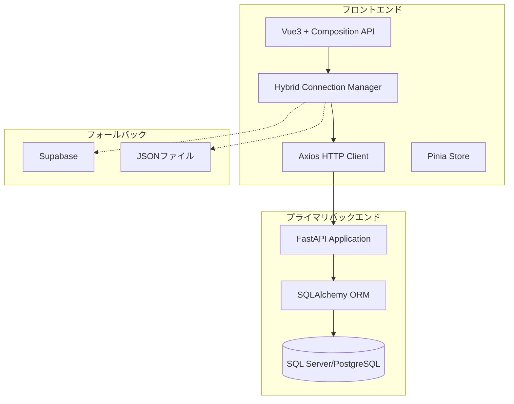

# FastAPI + SQLAlchemy バックエンド統合ガイド

## 概要

Vue3 + Axiosフロントエンドと、FastAPI + SQLAlchemyバックエンドの完全統合を実現するガイドです。ハイブリッド接続システムにおけるプライマリバックエンドとしてのFastAPI統合を詳細に説明します。

## アーキテクチャ構成



## FastAPIバックエンド統合設定

### 1.環境設定

```javascript
// .env
VUE_APP_API_BASE_URL=http://localhost:8000
VUE_APP_API_TIMEOUT=10000
VUE_APP_ENABLE_CORS=true

// バックエンド接続優先順位
VUE_APP_CONNECTION_PRIORITY=fastapi,supabase,offline
```

### 2. Axios FastAPI統合設定

```javascript
// src/services/fastApiClient.js
import axios from 'axios'
import { useAuthStore } from '@/stores/authStore'

// FastAPI専用クライアント設定
export const fastApiClient = axios.create({
  baseURL: import.meta.env.VUE_APP_API_BASE_URL || 'http://localhost:8000',
  timeout: parseInt(import.meta.env.VUE_APP_API_TIMEOUT) || 10000,
  headers: {
    'Content-Type': 'application/json',
    'Accept': 'application/json'
  },
  withCredentials: false // FastAPIのCORS設定に合わせて調整
})

// FastAPI認証インターセプター
fastApiClient.interceptors.request.use(
  (config) => {
    const authStore = useAuthStore()
    
    // JWT Bearer Token認証
    if (authStore.token) {
      config.headers.Authorization = `Bearer ${authStore.token}`
    }
    
    // FastAPI用のリクエストヘッダー追加
    config.headers['X-API-Version'] = 'v1'
    config.headers['X-Client-Type'] = 'vue3-hybrid'
    
    return config
  },
  (error) => Promise.reject(error)
)

// FastAPI専用レスポンスインターセプター
fastApiClient.interceptors.response.use(
  (response) => {
    // FastAPIのレスポンス形式に合わせた処理
    if (response.data?.detail && response.data?.status_code) {
      // FastAPIエラーレスポンス形式の統一
      return {
        ...response,
        data: {
          success: response.status >= 200 && response.status < 300,
          data: response.data.detail ? null : response.data,
          message: response.data.detail || 'Success',
          status_code: response.data.status_code || response.status
        }
      }
    }
    
    return response
  },
  async (error) => {
    const authStore = useAuthStore()
    
    // FastAPI認証エラー処理
    if (error.response?.status === 401) {
      // トークンリフレッシュ試行
      try {
        await authStore.refreshToken()
        // 元のリクエストを再実行
        return fastApiClient.request(error.config)
      } catch (refreshError) {
        // リフレッシュ失敗時はログアウト
        await authStore.logout()
        throw new Error('認証に失敗しました。再度ログインしてください。')
      }
    }
    
    // FastAPIバリデーションエラー処理
    if (error.response?.status === 422) {
      const validationErrors = error.response.data?.detail || []
      const errorMessages = validationErrors.map(err => 
        `${err.loc?.join(' → ') || 'Unknown'}: ${err.msg}`
      )
      throw new Error(`入力エラー: ${errorMessages.join(', ')}`)
    }
    
    // 一般的なFastAPIエラー処理
    const errorMessage = error.response?.data?.detail || 
                        error.response?.data?.message || 
                        error.message || 
                        'サーバーエラーが発生しました'
    
    throw new Error(errorMessage)
  }
)

export default fastApiClient
```

### 3. FastAPI統合サービス層

```javascript
// src/services/fastApiService.js
import fastApiClient from './fastApiClient'

export class FastAPIService {
  constructor() {
    this.client = fastApiClient
  }
  
  // 認証関連
  async login(credentials) {
    try {
      const response = await this.client.post('/auth/login', {
        username: credentials.username,
        password: credentials.password
      })
      
      return {
        success: true,
        data: {
          access_token: response.data.access_token,
          token_type: response.data.token_type,
          expires_in: response.data.expires_in,
          user: response.data.user
        }
      }
    } catch (error) {
      return {
        success: false,
        error: error.message
      }
    }
  }
  
  async refreshToken() {
    const response = await this.client.post('/auth/refresh')
    return response.data
  }
  
  async getCurrentUser() {
    const response = await this.client.get('/auth/me')
    return response.data
  }
  
  // CRUD操作（FastAPI + SQLAlchemy対応）
  async getItems(params = {}) {
    const response = await this.client.get('/items/', { params })
    return {
      items: response.data.items || response.data,
      total: response.data.total || response.data.length,
      page: response.data.page || 1,
      size: response.data.size || params.size || 50
    }
  }
  
  async getItem(id) {
    const response = await this.client.get(`/items/${id}`)
    return response.data
  }
  
  async createItem(itemData) {
    // FastAPI Pydanticモデルに対応した形式で送信
    const response = await this.client.post('/items/', itemData)
    return response.data
  }
  
  async updateItem(id, itemData) {
    const response = await this.client.put(`/items/${id}`, itemData)
    return response.data
  }
  
  async deleteItem(id) {
    await this.client.delete(`/items/${id}`)
    return { success: true }
  }
  
  // SQLAlchemy関係対応
  async bulkCreate(items) {
    const response = await this.client.post('/items/bulk', { items })
    return response.data
  }
  
  async complexQuery(queryParams) {
    const response = await this.client.post('/items/query', queryParams)
    return response.data
  }
  
  // ファイルアップロード（FastAPI対応）
  async uploadFile(file, metadata = {}) {
    const formData = new FormData()
    formData.append('file', file)
    
    // メタデータの追加
    Object.keys(metadata).forEach(key => {
      formData.append(key, metadata[key])
    })
    
    const response = await this.client.post('/upload/', formData, {
      headers: {
        'Content-Type': 'multipart/form-data'
      },
      // アップロード進捗対応
      onUploadProgress: (progressEvent) => {
        const percentCompleted = Math.round(
          (progressEvent.loaded * 100) / progressEvent.total
        )
        console.log(`Upload progress: ${percentCompleted}%`)
      }
    })
    
    return response.data
  }
  
  // WebSocket接続（FastAPI WebSocket対応）
  createWebSocketConnection(endpoint) {
    const wsUrl = import.meta.env.VUE_APP_API_BASE_URL
      .replace('http://', 'ws://')
      .replace('https://', 'wss://') + endpoint
    
    return new WebSocket(wsUrl)
  }
}

// シングルトンインスタンス
export const fastApiService = new FastAPIService()
```

## Pinia Store FastAPI統合パターン

### 1. FastAPI統合認証ストア

```javascript
// src/stores/fastApiAuthStore.js
import { defineStore } from 'pinia'
import { ref, computed } from 'vue'
import { fastApiService } from '@/services/fastApiService'

export const useFastApiAuthStore = defineStore('fastApiAuth', () => {
  // State
  const user = ref(null)
  const token = ref(localStorage.getItem('fastapi_token'))
  const refreshToken = ref(localStorage.getItem('fastapi_refresh_token'))
  const isLoading = ref(false)
  const error = ref(null)
  
  // Getters
  const isAuthenticated = computed(() => !!token.value && !!user.value)
  const userPermissions = computed(() => user.value?.permissions || [])
  
  // Actions
  const login = async (credentials) => {
    try {
      isLoading.value = true
      error.value = null
      
      const result = await fastApiService.login(credentials)
      
      if (result.success) {
        token.value = result.data.access_token
        user.value = result.data.user
        
        // ローカルストレージに保存
        localStorage.setItem('fastapi_token', result.data.access_token)
        if (result.data.refresh_token) {
          refreshToken.value = result.data.refresh_token
          localStorage.setItem('fastapi_refresh_token', result.data.refresh_token)
        }
        
        return result.data
      } else {
        throw new Error(result.error)
      }
    } catch (err) {
      error.value = err.message
      throw err
    } finally {
      isLoading.value = false
    }
  }
  
  const logout = async () => {
    try {
      // FastAPI logout endpoint呼び出し（オプション）
      if (token.value) {
        await fastApiService.client.post('/auth/logout')
      }
    } catch (err) {
      console.warn('Logout request failed:', err)
    } finally {
      // ローカルステート・ストレージのクリア
      token.value = null
      refreshToken.value = null
      user.value = null
      
      localStorage.removeItem('fastapi_token')
      localStorage.removeItem('fastapi_refresh_token')
    }
  }
  
  const refreshTokenAction = async () => {
    try {
      const result = await fastApiService.refreshToken()
      
      token.value = result.access_token
      localStorage.setItem('fastapi_token', result.access_token)
      
      if (result.refresh_token) {
        refreshToken.value = result.refresh_token
        localStorage.setItem('fastapi_refresh_token', result.refresh_token)
      }
      
      return result
    } catch (err) {
      await logout() // リフレッシュ失敗時はログアウト
      throw err
    }
  }
  
  const fetchCurrentUser = async () => {
    try {
      const userData = await fastApiService.getCurrentUser()
      user.value = userData
      return userData
    } catch (err) {
      await logout()
      throw err
    }
  }
  
  // 初期化
  const initialize = async () => {
    if (token.value) {
      try {
        await fetchCurrentUser()
      } catch (err) {
        console.error('Auth initialization failed:', err)
        await logout()
      }
    }
  }
  
  return {
    // State
    user,
    token,
    refreshToken,
    isLoading,
    error,
    
    // Getters
    isAuthenticated,
    userPermissions,
    
    // Actions
    login,
    logout,
    refreshTokenAction,
    fetchCurrentUser,
    initialize
  }
})
```

### 2. FastAPI統合データストア

```javascript
// src/stores/fastApiDataStore.js
import { defineStore } from 'pinia' 
import { ref, computed } from 'vue'
import { fastApiService } from '@/services/fastApiService'

export const useFastApiDataStore = defineStore('fastApiData', () => {
  // State
  const items = ref([])
  const currentItem = ref(null)
  const isLoading = ref(false)
  const error = ref(null)
  const pagination = ref({
    total: 0,
    page: 1,
    size: 50
  })
  
  // Getters
  const totalPages = computed(() => 
    Math.ceil(pagination.value.total / pagination.value.size)
  )
  
  const hasNextPage = computed(() => 
    pagination.value.page < totalPages.value
  )
  
  const hasPrevPage = computed(() => 
    pagination.value.page > 1
  )
  
  // Actions
  const fetchItems = async (params = {}) => {
    try {
      isLoading.value = true
      error.value = null
      
      const queryParams = {
        page: pagination.value.page,
        size: pagination.value.size,
        ...params
      }
      
      const result = await fastApiService.getItems(queryParams)
      
      items.value = result.items
      pagination.value = {
        total: result.total,
        page: result.page,
        size: result.size
      }
      
      return result
    } catch (err) {
      error.value = err.message
      throw err
    } finally {
      isLoading.value = false
    }
  }
  
  const fetchItem = async (id) => {
    try {
      isLoading.value = true
      error.value = null
      
      const item = await fastApiService.getItem(id)
      currentItem.value = item
      
      return item
    } catch (err) {
      error.value = err.message
      throw err
    } finally {
      isLoading.value = false
    }
  }
  
  const createItem = async (itemData) => {
    try {
      isLoading.value = true
      error.value = null
      
      const newItem = await fastApiService.createItem(itemData)
      
      // ローカルステートを更新
      items.value.unshift(newItem)
      pagination.value.total += 1
      
      return newItem
    } catch (err) {
      error.value = err.message
      throw err
    } finally {
      isLoading.value = false
    }
  }
  
  const updateItem = async (id, itemData) => {
    try {
      isLoading.value = true
      error.value = null
      
      const updatedItem = await fastApiService.updateItem(id, itemData)
      
      // ローカルステートを更新
      const index = items.value.findIndex(item => item.id === id)
      if (index !== -1) {
        items.value[index] = updatedItem
      }
      
      if (currentItem.value?.id === id) {
        currentItem.value = updatedItem
      }
      
      return updatedItem
    } catch (err) {
      error.value = err.message
      throw err
    } finally {
      isLoading.value = false
    }
  }
  
  const deleteItem = async (id) => {
    try {
      isLoading.value = true
      error.value = null
      
      await fastApiService.deleteItem(id)
      
      // ローカルステートから削除
      items.value = items.value.filter(item => item.id !== id)
      pagination.value.total -= 1
      
      if (currentItem.value?.id === id) {
        currentItem.value = null
      }
    } catch (err) {
      error.value = err.message
      throw err
    } finally {
      isLoading.value = false
    }
  }
  
  // ページネーション
  const setPage = (page) => {
    pagination.value.page = page
  }
  
  const setPageSize = (size) => {
    pagination.value.size = size
    pagination.value.page = 1 // ページサイズ変更時は最初のページに戻る
  }
  
  const nextPage = async () => {
    if (hasNextPage.value) {
      pagination.value.page += 1
      await fetchItems()
    }
  }
  
  const prevPage = async () => {
    if (hasPrevPage.value) {
      pagination.value.page -= 1
      await fetchItems()
    }
  }
  
  return {
    // State
    items,
    currentItem,
    isLoading,
    error,
    pagination,
    
    // Getters
    totalPages,
    hasNextPage,
    hasPrevPage,
    
    // Actions
    fetchItems,
    fetchItem,
    createItem,
    updateItem,
    deleteItem,
    setPage,
    setPageSize,
    nextPage,
    prevPage
  }
})
```

## Vue3コンポーネント統合パターン

### 1. FastAPI統合フォームコンポーネント

```vue
<!-- src/components/FastApiForm.vue -->
<template>
  <form @submit.prevent="handleSubmit" class="space-y-4">
    <div class="form-control">
      <label class="label">
        <span class="label-text">名前</span>
      </label>
      <input 
        v-model="formData.name"
        type="text" 
        class="input input-bordered"
        :class="{ 'input-error': errors.name }"
        required
      />
      <div v-if="errors.name" class="label">
        <span class="label-text-alt text-error">{{ errors.name }}</span>
      </div>
    </div>
    
    <div class="form-control">
      <label class="label">
        <span class="label-text">説明</span>
      </label>
      <textarea 
        v-model="formData.description"
        class="textarea textarea-bordered"
        :class="{ 'textarea-error': errors.description }"
      ></textarea>
      <div v-if="errors.description" class="label">
        <span class="label-text-alt text-error">{{ errors.description }}</span>
      </div>
    </div>
    
    <div class="form-control">
      <button 
        type="submit" 
        class="btn btn-primary"
        :class="{ 'loading': isLoading }"
        :disabled="isLoading"
      >
        {{ isLoading ? '送信中...' : '送信' }}
      </button>
    </div>
    
    <div v-if="error" class="alert alert-error">
      <span>{{ error }}</span>
    </div>
    
    <div v-if="success" class="alert alert-success">
      <span>{{ success }}</span>
    </div>
  </form>
</template>

<script setup>
import { ref, reactive } from 'vue'
import { useFastApiDataStore } from '@/stores/fastApiDataStore'

const props = defineProps({
  itemId: {
    type: [String, Number],
    default: null
  }
})

const emit = defineEmits(['success', 'error'])

const dataStore = useFastApiDataStore()

// フォームデータ
const formData = reactive({
  name: '',
  description: ''
})

// バリデーションエラー
const errors = ref({})
const error = ref('')
const success = ref('')
const isLoading = ref(false)

// FastAPI Pydanticバリデーションに対応
const validateForm = () => {
  errors.value = {}
  
  if (!formData.name.trim()) {
    errors.value.name = '名前は必須です'
  } else if (formData.name.length < 2) {
    errors.value.name = '名前は2文字以上で入力してください'
  } else if (formData.name.length > 100) {
    errors.value.name = '名前は100文字以内で入力してください'
  }
  
  if (formData.description && formData.description.length > 500) {
    errors.value.description = '説明は500文字以内で入力してください'
  }
  
  return Object.keys(errors.value).length === 0
}

const handleSubmit = async () => {
  if (!validateForm()) {
    return
  }
  
  try {
    isLoading.value = true
    error.value = ''
    success.value = ''
    
    let result
    if (props.itemId) {
      // 更新
      result = await dataStore.updateItem(props.itemId, formData)
      success.value = '更新が完了しました'
    } else {
      // 作成
      result = await dataStore.createItem(formData)
      success.value = '作成が完了しました'
      
      // フォームリセット
      formData.name = ''
      formData.description = ''
    }
    
    emit('success', result)
    
  } catch (err) {
    error.value = err.message
    emit('error', err)
  } finally {
    isLoading.value = false
  }
}

// 編集モードの場合、既存データをロード
if (props.itemId) {
  dataStore.fetchItem(props.itemId).then(item => {
    formData.name = item.name
    formData.description = item.description || ''
  }).catch(err => {
    error.value = `データの読み込みに失敗しました: ${err.message}`
  })
}
</script>
```

### 2. FastAPI統合リストコンポーネント

```vue
<!-- src/components/FastApiList.vue -->
<template>
  <div class="space-y-4">
    <!-- 検索・フィルター -->
    <div class="flex gap-4 items-center">
      <div class="form-control flex-1">
        <input 
          v-model="searchQuery"
          type="text" 
          placeholder="検索..."
          class="input input-bordered"
          @input="debouncedSearch"
        />
      </div>
      <div class="form-control">
        <select v-model="pageSize" @change="handlePageSizeChange" class="select select-bordered">
          <option value="10">10件</option>
          <option value="25">25件</option>
          <option value="50">50件</option>
          <option value="100">100件</option>
        </select>
      </div>
    </div>
    
    <!-- ローディング状態 -->
    <div v-if="dataStore.isLoading" class="flex justify-center py-8">
      <span class="loading loading-spinner loading-lg"></span>
    </div>
    
    <!-- エラー表示 -->
    <div v-else-if="dataStore.error" class="alert alert-error">
      <span>{{ dataStore.error }}</span>
      <button @click="refresh" class="btn btn-sm btn-outline">再試行</button>
    </div>
    
    <!-- データ表示 -->
    <div v-else-if="dataStore.items.length > 0" class="space-y-4">
      <!-- アイテムリスト -->
      <div class="grid gap-4">
        <div 
          v-for="item in dataStore.items" 
          :key="item.id"
          class="card bg-base-100 shadow-md"
        >
          <div class="card-body">
            <h3 class="card-title">{{ item.name }}</h3>
            <p v-if="item.description">{{ item.description }}</p>
            <div class="card-actions justify-end">
              <button 
                @click="$emit('edit', item)" 
                class="btn btn-sm btn-primary"
              >
                編集
              </button>
              <button 
                @click="handleDelete(item)" 
                class="btn btn-sm btn-error"
                :disabled="deletingItems.has(item.id)"
              >
                {{ deletingItems.has(item.id) ? '削除中...' : '削除' }}
              </button>
            </div>
          </div>
        </div>
      </div>
      
      <!-- ページネーション -->
      <div class="flex justify-center">
        <div class="btn-group">
          <button 
            @click="dataStore.prevPage()"
            class="btn"
            :disabled="!dataStore.hasPrevPage"
          >
            «
          </button>
          <button class="btn btn-active">
            {{ dataStore.pagination.page }}
          </button>
          <button 
            @click="dataStore.nextPage()"
            class="btn"
            :disabled="!dataStore.hasNextPage"
          >
            »
          </button>
        </div>
      </div>
      
      <!-- 統計情報 -->
      <div class="stats shadow w-full">
        <div class="stat">
          <div class="stat-title">総件数</div>
          <div class="stat-value">{{ dataStore.pagination.total }}</div>
        </div>
        <div class="stat">
          <div class="stat-title">現在のページ</div>
          <div class="stat-value">{{ dataStore.pagination.page }}</div>
        </div>
        <div class="stat">
          <div class="stat-title">総ページ数</div>
          <div class="stat-value">{{ dataStore.totalPages }}</div>
        </div>
      </div>
    </div>
    
    <!-- データなし -->
    <div v-else class="text-center py-8">
      <p class="text-base-content/60">データがありません</p>
      <button @click="refresh" class="btn btn-primary mt-4">再読み込み</button>
    </div>
  </div>
</template>

<script setup>
import { ref, onMounted } from 'vue'
import { useFastApiDataStore } from '@/stores/fastApiDataStore'
import { debounce } from 'lodash-es'

const emit = defineEmits(['edit'])

const dataStore = useFastApiDataStore()

// 検索・フィルター
const searchQuery = ref('')
const pageSize = ref(50)
const deletingItems = ref(new Set())

// デバウンス検索
const debouncedSearch = debounce(async () => {
  await dataStore.fetchItems({ 
    search: searchQuery.value,
    page: 1 // 検索時は最初のページに戻る
  })
}, 500)

// ページサイズ変更
const handlePageSizeChange = async () => {
  dataStore.setPageSize(pageSize.value)
  await dataStore.fetchItems({ search: searchQuery.value })
}

// 削除処理
const handleDelete = async (item) => {
  if (!confirm(`「${item.name}」を削除しますか？`)) {
    return
  }
  
  try {
    deletingItems.value.add(item.id)
    await dataStore.deleteItem(item.id)
  } catch (err) {
    alert(`削除に失敗しました: ${err.message}`)
  } finally {
    deletingItems.value.delete(item.id)
  }
}

// データ再読み込み
const refresh = async () => {
  await dataStore.fetchItems({ search: searchQuery.value })
}

// 初期データ読み込み
onMounted(async () => {
  await refresh()
})
</script>
```

## ハイブリッド接続統合

### FastAPIをプライマリ接続として使用

```javascript
// src/services/hybridConnectionManager.js
import { fastApiService } from './fastApiService'
import { supabaseService } from './supabaseService'
import { jsonFileStorage } from './jsonFileStorage'

export class HybridConnectionManager {
  constructor() {
    this.connectionPriority = ['fastapi', 'supabase', 'offline']
    this.connectionStates = {
      fastapi: { available: true, responseTime: 0, errorCount: 0 },
      supabase: { available: true, responseTime: 0, errorCount: 0 },
      offline: { available: true, responseTime: 0, errorCount: 0 }
    }
  }
  
  async executeRequest(operation, params = {}) {
    for (const connectionType of this.connectionPriority) {
      if (!this.connectionStates[connectionType].available) {
        continue
      }
      
      try {
        const startTime = Date.now()
        let result
        
        switch (connectionType) {
          case 'fastapi':
            result = await this.executeFastAPIRequest(operation, params)
            break
          case 'supabase':
            result = await this.executeSupabaseRequest(operation, params)
            break
          case 'offline':
            result = await this.executeOfflineRequest(operation, params)
            break
        }
        
        // 成功時の接続状態更新
        this.connectionStates[connectionType].responseTime = Date.now() - startTime
        this.connectionStates[connectionType].errorCount = 0
        
        // オフラインストレージに成功結果をキャッシュ
        if (connectionType !== 'offline' && result) {
          await this.cacheToOffline(operation, params, result)
        }
        
        return { result, connectionType }
        
      } catch (error) {
        // 接続エラー時の状態更新
        this.connectionStates[connectionType].errorCount += 1
        
        if (this.connectionStates[connectionType].errorCount >= 3) {
          this.connectionStates[connectionType].available = false
          // 5分後に再試行可能にする
          setTimeout(() => {
            this.connectionStates[connectionType].available = true
            this.connectionStates[connectionType].errorCount = 0
          }, 5 * 60 * 1000)
        }
        
        console.warn(`Connection ${connectionType} failed:`, error)
        
        // 最後の接続方式でも失敗した場合はエラーを投げる
        if (connectionType === this.connectionPriority[this.connectionPriority.length - 1]) {
          throw error
        }
      }
    }
  }
  
  async executeFastAPIRequest(operation, params) {
    switch (operation) {
      case 'getItems':
        return await fastApiService.getItems(params)
      case 'getItem':
        return await fastApiService.getItem(params.id)
      case 'createItem':
        return await fastApiService.createItem(params.data)
      case 'updateItem':
        return await fastApiService.updateItem(params.id, params.data)
      case 'deleteItem':
        return await fastApiService.deleteItem(params.id)
      case 'login':
        return await fastApiService.login(params)
      default:
        throw new Error(`Unsupported operation: ${operation}`)
    }
  }
  
  async cacheToOffline(operation, params, result) {
    try {
      const cacheKey = `${operation}_${JSON.stringify(params)}`
      await jsonFileStorage.saveData(cacheKey, {
        result,
        timestamp: Date.now(),
        operation,
        params
      })
    } catch (error) {
      console.warn('Failed to cache to offline storage:', error)
    }
  }
}

export const hybridConnectionManager = new HybridConnectionManager()
```

このドキュメントにより、Vue3 + AxiosフロントエンドとFastAPI + SQLAlchemyバックエンドの完全統合が実現されます。ハイブリッド接続システムの一部として、高可用性と優れたユーザー体験を提供します。